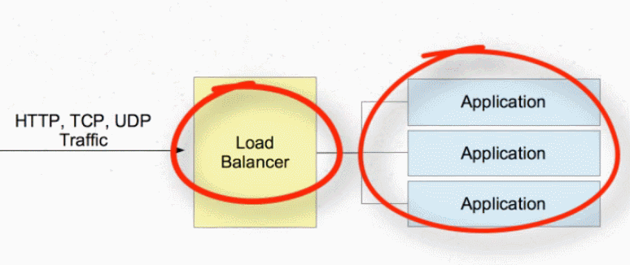
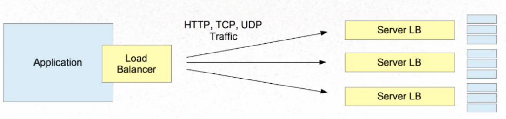
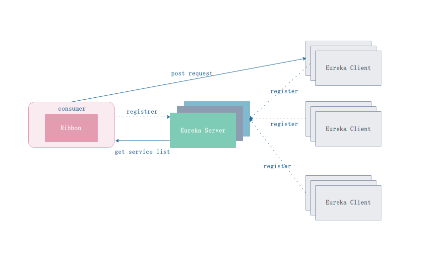
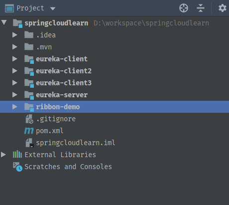

# SpringCloudRibbon负载均衡

前面分析了Eureka的使用，作为服务注册中心，Eureka 分为 Server 端和 Client 端，Client 端作为服务的提供者，将自己注册到 Server 端，Client端高可用的方式是使用多机部署然后注册到Server，Server端为了保证服务的高可用，也可以使用多机部署的方式。前面简单搭建了Eureka Client 和 Server，然后将Client成功注册到 Server，本节我们将来看看如何调用Eureka服务，在多机部署情况下如何保证负载均衡。Spring Cloud 提供了一个组件：Ribbon。

Ribbon是客户端负载均衡器，可以对HTTP和TCP客户端的行为进行大量控制。Ribbon中的中心概念是指定客户端的概念。

关于服务的负载均衡，硬要是分的话可以分两种：

1. 服务端负载均衡。将多个服务注册到一个公共的注册中心，服务调用者访问注册中心，由注册中心提供服务的负载均衡。
2. 客户端负载均衡。将多个服务注册到一个注册中心，注册中心维护一个注册表，如果有另一个服务想要调用这个服务，那么访问注册中心即可，注册中心返回注册表信息给服务端，服务端通过特定的平衡算法来决定要调用注册表中的哪个提供者。

服务端负载均衡：



客户端负载均衡：



服务端负载均衡的代表性例子就是nginx，LVS。那么客户端的负载均衡就是我们要说的Ribbon。Ribbon主要提供客户端负载平衡算法，除此之外，Ribbon还提供：

- **服务发现集成** :功能区负载平衡器在动态环境（如云）中提供服务发现。功能区库中包含与Eureka和Netflix服务发现组件的集成；
- **容错** : Ribbon API可以动态确定服务器是否已在实时环境中启动并运行，并且可以检测到那些已关闭的服务器；
- **可配置的负载平衡规则** : Ribbon支持*开箱即用的RoundRobinRule*，*AvailabilityFilteringRule*，*WeightedResponseTimeRule*，还支持定义自定义规则。

Ribbon API提供以下组件供我们使用：

- *Rule* ：定义负载均衡策略；
- *Ping* ： 定义如何ping目标服务实例来判断是否存活, ribbon使用单独的线程每隔一段时间(默认10s)对本地缓存的ServerList做一次检查;
- *ServerList* ：定义如何获取服务实例列表. 两种实现基于配置的`ConfigurationBasedServerList`和基于Eureka服务发现的`DiscoveryEnabledNIWSServerList`；
- *ServerListFilter*： 用来使用期望的特征过滤静态配置动态获得的候选服务实例列表. 若未提供, 默认使用`ZoneAffinityServerListFilter`；
- *ILoadBalancer*： 定义了软负载均衡器的操作的接口. 一个典型的负载均衡器至少需要一组用来做负载均衡的服务实例, 一个标记某个服务实例不在旋转中的方法, 和对应的方法调用从实例列表中选出某一个服务实例；
- *ServerListUpdater*： DynamicServerListLoadBalancer用来更新实例列表的策略(推`EurekaNotificationServerListUpdater`/拉`PollingServerListUpdater`, 默认是拉)

#### 配置服务策略[#](https://www.cnblogs.com/rickiyang/p/11802465.html#3045699019)

##### 全局策略设置

使用以下方式配置的策略表示对该项目中调用的所有服务生效。

```java
Copy@Configuration
public class MyConfiguration{
    @Bean
    public IRule ribbonRule(){
        return new RandomRule();
    }
    
    //定义一个负载均衡的RestTemplate
    @Bean
    @LoadBalanced
    public RestTemplate restTemplate(){
        return new RestTemplate();
    }

}
```

上面的配置表示：

1. 定义了一个随机方式的服务调用方式，即随即调用某个服务的提供者；
2. 定义一个负载均衡的 RestTemplate，使用了 @LoadBalanced注解，该注解配合覆盖均衡策略一起使用 RestTemplate 发出的请求才能生效。

RestTemplate是 Spring 提供的用于访问Rest服务的客户端模板工具集，Ribbon并没有创建新轮子，基于此通过负载均衡配置发出HTTP请求。

ribbon的负载均衡策略主要包括以下几种：

| 策略类                    | 命名             | 描述                                                         |
| ------------------------- | ---------------- | ------------------------------------------------------------ |
| RandomRule                | 随机策略         | 随机选择server                                               |
| RoundRobinRule            | 轮询策略         | 按顺序选择server                                             |
| RetryRule                 | 重试策略         | 在一个配置时间段内当选择的server不成功，则继续轮训，一直尝试选择一个可用的server |
| BestAvailableRule         | 最低并发策略     | 先过滤掉由于多次访问故障而处于断路器跳闸状态的服务，然后选择一个并发量最小的服务。 |
| AvailabilityFilteringRule | 可用过滤策略     | 先过滤掉由于多次访问故障而处于断路器跳闸状态的服务，以及并发连接数超过阈值的服务，剩下的服务，使用轮询策略 |
| ResponseTimeWeightedRule  | 响应时间加权策略 | 根据server的响应时间分配权重。响应时间越长，权重越低，被选择到的概略就越低，权重越高，被选择到的概率就越高 |
| ZoneAvoidanceRule         | 区域权衡策略     | 综合判断server所在的区域的性能和server的可用性轮询选择server，并且判定一个AWS Zobe的运行性能是否可用，提出不可用的Zone中所有server |

##### 局部策略设置

如果在项目中你想对某些服务使用指定的负载均衡策略，那么可以如下配置：

```java
Copy@Configuration
@RibbonClients({
        @RibbonClient(name = "user-service",configuration = UserServiceConfig.class),
    	@RibbonClient(name = "order-service",configuration = OrderServiceConfig.class)
})
public class RibbonConfig {
}
```

@RibbonClients 中可以包含多个@RibbonClient。每个@RibbonClient表示一个服务名，后面对应的类表示该服务配套的策略规则。

如果你只想对一个服务应用某种规则，那么可以省略：@RibbonClients：

```java
Copy@Configuration
@RibbonClient(name = "order-service",configuration = OrderServiceConfig.class)
public class RibbonConfig {
}
```

#### 超时重试[#](https://www.cnblogs.com/rickiyang/p/11802465.html#1240783943)

HTTP请求不免的会有网络不好的情况出现超时，Ribbon提供了超时重试机制，提供如下参数可以设置：

```yml
Copyribbon-client:
  ribbon:
    ConnectTimeout: 3000
    ReadTimeout: 60000
    MaxAutoRetries: 1 #对第一次请求的服务的重试次数
    MaxAutoRetriesNextServer: 1 #要重试的下一个服务的最大数量（不包括第一个服务）
    OkToRetryOnAllOperations: true
    NFLoadBalancerRuleClassName: com.netflix.loadbalancer.RandomRule
```

#### 饥饿加载[#](https://www.cnblogs.com/rickiyang/p/11802465.html#2119974973)

Ribbon在进行客户端负载均衡的时候并不是在启动的时候就加载上下文的，实在实际请求的时候才加载，有点像servlet的第一次请求的时候才去生成实例，这回导致第一次请求会比较的缓慢，甚至可能会出现超时的情况。所以我们可以指定具体的客户端名称来开启饥饿加载，即在启动的时候便加载素养的配置项的应用上下文。

```yml
Copyribbon:
  eager-load:
    enabled: true
    clients: ribbon-client-1, ribbon-client-2, ribbon-client-3
```

#### Ribbon负载均衡示例[#](https://www.cnblogs.com/rickiyang/p/11802465.html#1876843037)

下面看一下整合Eureka 和 Ribbon如何实现服务调用 和 负载均衡。有了Eureka之后，服务调用就无需关注服务提供者的IP。



服务的整体流程如上图，一个集成了Ribbon的Eureka Client 从Eureka Server中获取服务，首先拉取服务list，然后Ribbon服务会根据配置的负载均衡策略选取合适的服务提供者，向该提供者发送请求获取结果。

工程结构如下：



一个 Eureka Server，3个Eureka Client，一个集成了Ribbon 的Consumer。整体代码我就不贴了，已经上传至GitHub自行下载。Demo 工程见这里：

简单说一下关于 Ribbon consumer的配置：

pom文件中需要引入关于Ribbon的包，同时consumer也是一个Eureka Client要去拉 Eureka Server的配置，所以需要Eureka client的包。

```xml
Copy<dependency>
    <groupId>org.springframework.cloud</groupId>
    <artifactId>spring-cloud-starter-netflix-ribbon</artifactId>
</dependency>
<dependency>
    <groupId>org.springframework.cloud</groupId>
    <artifactId>spring-cloud-starter-netflix-eureka-client</artifactId>
</dependency>
```

在启动类中初始化了两个bean：

```java
Copyimport com.netflix.loadbalancer.IRule;
import com.netflix.loadbalancer.RandomRule;
import org.springframework.boot.SpringApplication;
import org.springframework.boot.autoconfigure.SpringBootApplication;
import org.springframework.cloud.client.discovery.EnableDiscoveryClient;
import org.springframework.cloud.client.loadbalancer.LoadBalanced;
import org.springframework.context.annotation.Bean;
import org.springframework.web.client.RestTemplate;

@EnableDiscoveryClient
@SpringBootApplication
public class RibbonDemoApplication {

    public static void main(String[] args) {
        SpringApplication.run(RibbonDemoApplication.class, args);
    }

    @Bean
    @LoadBalanced
    RestTemplate restTemplate() {
        return new RestTemplate();
    }

    @Bean
    public IRule ribbonRule() {
        return new RandomRule();//这里配置策略，和配置文件对应
    }
}
```

RestTemplate 和 IRule负载均衡策略。

然后就可以使用已经配置了负载均衡的 RestTemplate 发起请求了：

```java
Copy@Service
public class DemoService {

    @Autowired
    RestTemplate restTemplate;

    public String hello(String name) {

        return restTemplate.getForEntity("http://eureka-client/hello/" + name, String.class).getBody();
    }
}
```

> 本文摘自： https://www.cnblogs.com/rickiyang/p/11802465.html
