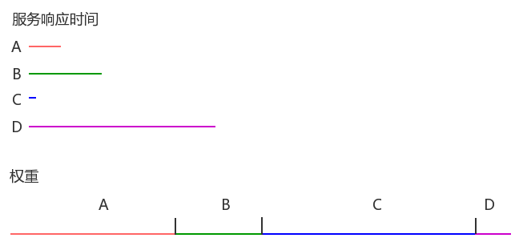

# SpringCloudRibbon负载均衡算法实现

上一篇分析了Ribbon如何发送出去一个自带负载均衡效果的HTTP请求，本节就重点分析各个算法都是如何实现。

负载均衡整体是从IRule进去的：

```java
Copypublic interface IRule{
    /*
     * choose one alive server from lb.allServers or
     * lb.upServers according to key
     * 
     * @return choosen Server object. NULL is returned if none
     *  server is available 
     */

    public Server choose(Object key);

    public void setLoadBalancer(ILoadBalancer lb);

    public ILoadBalancer getLoadBalancer();    
}
```

通过 choose方法选择指定的算法。

完整的算法包含如下：

1. **RandomRule**：随机算法实现；
2. **RoundRobinRule**：轮询负载均衡策略，依次轮询所有可用服务器列表，遇到第一个可用的即返回；
3. **RetryRule** ：先按照RoundRobinRule策略获取服务，如果获取服务失败会在指定时间内重试；
4. **AvaliabilityFilteringRule**： 过滤掉那些因为一直连接失败的被标记为circuit tripped的后端server，并过滤掉那些高并发的的后端server（active connections 超过配置的阈值） ；
5. **BestAvailableRule** ：会先过滤掉由于多次访问故障二处于断路器跳闸状态的服务，然后选择一个并发量最小的服务；
6. **WeightedResponseTimeRule**： 根据响应时间分配一个weight，响应时间越长，weight越小，被选中的可能性越低；
7. **ZoneAvoidanceRule**： 复合判断server所在区域的性能和server的可用性选择server

下面我们一起分析每一个算法的实现。

#### RandomRule[#](https://www.cnblogs.com/rickiyang/p/11802484.html#3134997598)

```java
Copypublic class RandomRule extends AbstractLoadBalancerRule {
    Random rand;

    public RandomRule() {
        rand = new Random();
    }

    /**
     * Randomly choose from all living servers
     */
    @edu.umd.cs.findbugs.annotations.SuppressWarnings(value = "RCN_REDUNDANT_NULLCHECK_OF_NULL_VALUE")
    public Server choose(ILoadBalancer lb, Object key) {
        if (lb == null) {
            return null;
        }
        Server server = null;

        while (server == null) {
            if (Thread.interrupted()) {
                return null;
            }
            //获取所有 可用的节点
            List<Server> upList = lb.getReachableServers();
            //获取所有节点，不区分是否可用
            List<Server> allList = lb.getAllServers();

            int serverCount = allList.size();
            if (serverCount == 0) {
                /*
                 * No servers. End regardless of pass, because subsequent passes
                 * only get more restrictive.
                 */
                return null;
            }
			   //使用 随机数算法，将 总结点数作为种子
            int index = rand.nextInt(serverCount);
            //在所有可用的节点中随机算则一个节点
            server = upList.get(index);

            if (server == null) {
                /*
                 * The only time this should happen is if the server list were
                 * somehow trimmed. This is a transient condition. Retry after
                 * yielding.
                 */
                Thread.yield();
                continue;
            }

            if (server.isAlive()) {
                return (server);
            }

            // Shouldn't actually happen.. but must be transient or a bug.
            server = null;
            Thread.yield();
        }

        return server;

    }

	@Override
	public Server choose(Object key) {
		return choose(getLoadBalancer(), key);
	}

	@Override
	public void initWithNiwsConfig(IClientConfig clientConfig) {
		// TODO Auto-generated method stub
		
	}
}
```

随机算法的实现原理很简单，将当前总节点数作为种子，生成一个随机数，在可用节点中选择一个节点返回即可。

#### RoundRobinRule[#](https://www.cnblogs.com/rickiyang/p/11802484.html#3624668295)

轮询负载均衡策略，该算法顺序查找所有服务列表，直到遇到第一个可用的服务就返回。限制了最多只查询10次，超过10次还未查到可用服务直接返回空。

```java
Copypublic class RoundRobinRule extends AbstractLoadBalancerRule {

    private AtomicInteger nextServerCyclicCounter;
    private static final boolean AVAILABLE_ONLY_SERVERS = true;
    private static final boolean ALL_SERVERS = false;

    private static Logger log = LoggerFactory.getLogger(RoundRobinRule.class);

    public RoundRobinRule() {
        nextServerCyclicCounter = new AtomicInteger(0);
    }

    public RoundRobinRule(ILoadBalancer lb) {
        this();
        setLoadBalancer(lb);
    }

    public Server choose(ILoadBalancer lb, Object key) {
        if (lb == null) {
            log.warn("no load balancer");
            return null;
        }

        Server server = null;
        int count = 0;
        //最多尝试10次，如果都没有找到可用的服务器 就返回null
        while (server == null && count++ < 10) {
            List<Server> reachableServers = lb.getReachableServers();
            List<Server> allServers = lb.getAllServers();
            int upCount = reachableServers.size();
            int serverCount = allServers.size();

            if ((upCount == 0) || (serverCount == 0)) {
                log.warn("No up servers available from load balancer: " + lb);
                return null;
            }
			//1，2，3...... 顺序获取 index
            int nextServerIndex = incrementAndGetModulo(serverCount);
            server = allServers.get(nextServerIndex);

            if (server == null) {
                /* Transient. */
                Thread.yield();
                continue;
            }

            if (server.isAlive() && (server.isReadyToServe())) {
                return (server);
            }

            // Next.
            server = null;
        }

        if (count >= 10) {
            log.warn("No available alive servers after 10 tries from load balancer: "
                    + lb);
        }
        return server;
    }

    /**
     * nextServerCyclicCounter 初始值为0，modulo 为所有服务器总数
     *  next值 为 1，2，3......
     * 正常情况下 current 和 next 肯定是相等的
     *
     * @param modulo The modulo to bound the value of the counter.
     * @return The next value.
     */
    private int incrementAndGetModulo(int modulo) {
        for (;;) {
            int current = nextServerCyclicCounter.get();
            int next = (current + 1) % modulo;
            if (nextServerCyclicCounter.compareAndSet(current, next))
                return next;
        }
    }

    @Override
    public Server choose(Object key) {
        return choose(getLoadBalancer(), key);
    }

    @Override
    public void initWithNiwsConfig(IClientConfig clientConfig) {
    }
}
```

#### WeightedResponseTimeRule[#](https://www.cnblogs.com/rickiyang/p/11802484.html#1285983642)

响应时间作为选取权重的负载均衡策略，响应时间越短的服务被选中的可能性大。

```java
Copypublic class WeightedResponseTimeRule extends RoundRobinRule {

    public static final IClientConfigKey<Integer> WEIGHT_TASK_TIMER_INTERVAL_CONFIG_KEY = new IClientConfigKey<Integer>() {
        @Override
        public String key() {
            return "ServerWeightTaskTimerInterval";
        }
        
        @Override
        public String toString() {
            return key();
        }

        @Override
        public Class<Integer> type() {
            return Integer.class;
        }
    };
    
    public static final int DEFAULT_TIMER_INTERVAL = 30 * 1000;
    
    private int serverWeightTaskTimerInterval = DEFAULT_TIMER_INTERVAL;

    private static final Logger logger = LoggerFactory.getLogger(WeightedResponseTimeRule.class);
    
    // holds the accumulated weight from index 0 to current index
    // for example, element at index 2 holds the sum of weight of servers from 0 to 2
    private volatile List<Double> accumulatedWeights = new ArrayList<Double>();
    

    private final Random random = new Random();

    protected Timer serverWeightTimer = null;

    protected AtomicBoolean serverWeightAssignmentInProgress = new AtomicBoolean(false);

    String name = "unknown";

    public WeightedResponseTimeRule() {
        super();
    }

    public WeightedResponseTimeRule(ILoadBalancer lb) {
        super(lb);
    }
    
    @Override
    public void setLoadBalancer(ILoadBalancer lb) {
        super.setLoadBalancer(lb);
        if (lb instanceof BaseLoadBalancer) {
            name = ((BaseLoadBalancer) lb).getName();
        }
        initialize(lb);
    }

    void initialize(ILoadBalancer lb) {        
        if (serverWeightTimer != null) {
            serverWeightTimer.cancel();
        }
        serverWeightTimer = new Timer("NFLoadBalancer-serverWeightTimer-"
                + name, true);
        serverWeightTimer.schedule(new DynamicServerWeightTask(), 0,
                serverWeightTaskTimerInterval);
        // do a initial run
        ServerWeight sw = new ServerWeight();
        sw.maintainWeights();

        Runtime.getRuntime().addShutdownHook(new Thread(new Runnable() {
            public void run() {
                logger
                        .info("Stopping NFLoadBalancer-serverWeightTimer-"
                                + name);
                serverWeightTimer.cancel();
            }
        }));
    }

    public void shutdown() {
        if (serverWeightTimer != null) {
            logger.info("Stopping NFLoadBalancer-serverWeightTimer-" + name);
            serverWeightTimer.cancel();
        }
    }

    List<Double> getAccumulatedWeights() {
        return Collections.unmodifiableList(accumulatedWeights);
    }

    @edu.umd.cs.findbugs.annotations.SuppressWarnings(value = "RCN_REDUNDANT_NULLCHECK_OF_NULL_VALUE")
    @Override
    public Server choose(ILoadBalancer lb, Object key) {
        if (lb == null) {
            return null;
        }
        Server server = null;

        while (server == null) {
            // accumulatedWeights 里面封装的是已经计算完毕权重的所有服务器，具体在 ServerWeight类中
            List<Double> currentWeights = accumulatedWeights;
            if (Thread.interrupted()) {
                return null;
            }
            List<Server> allList = lb.getAllServers();

            int serverCount = allList.size();

            if (serverCount == 0) {
                return null;
            }

            int serverIndex = 0;

            // 取出已经计算完权重的服务器列表中的最后一个权重,见下面解释，最后一个权重为 当前所有权重之和
            double maxTotalWeight = currentWeights.size() == 0 ? 0 : currentWeights.get(currentWeights.size() - 1); 
            // 如果没有命中任何一个服务器或者是服务器列表权重还没有被初始化
            // 那么就使用 默认的 RoundRobinRule 算法重新进行选择
            if (maxTotalWeight < 0.001d || serverCount != currentWeights.size()) {
                server =  super.choose(getLoadBalancer(), key);
                if(server == null) {
                    return server;
                }
            } else {
                // 生成一个随机权重  0 <= randomWeight < maxTotalWeight
                double randomWeight = random.nextDouble() * maxTotalWeight;
                // 看当前的 randomWeight 在哪个区间，那么该区间对应的服务器即为被选中
                int n = 0;
                for (Double d : currentWeights) {
                    if (d >= randomWeight) {
                        serverIndex = n;
                        break;
                    } else {
                        n++;
                    }
                }

                server = allList.get(serverIndex);
            }

            if (server == null) {
                /* Transient. */
                Thread.yield();
                continue;
            }

            if (server.isAlive()) {
                return (server);
            }

            // Next.
            server = null;
        }
        return server;
    }

    class DynamicServerWeightTask extends TimerTask {
        public void run() {
            ServerWeight serverWeight = new ServerWeight();
            try {
                serverWeight.maintainWeights();
            } catch (Exception e) {
                logger.error("Error running DynamicServerWeightTask for {}", name, e);
            }
        }
    }

    //进行服务器的权重设置
    class ServerWeight {

        public void maintainWeights() {
            ILoadBalancer lb = getLoadBalancer();
            if (lb == null) {
                return;
            }
            
            if (!serverWeightAssignmentInProgress.compareAndSet(false,  true))  {
                return; 
            }
            
            try {
                logger.info("Weight adjusting job started");
                AbstractLoadBalancer nlb = (AbstractLoadBalancer) lb;
                //在AbstractLoadBalancer中维护了一个服务器列表，里面有当前服务器的统计信息
                LoadBalancerStats stats = nlb.getLoadBalancerStats();
                if (stats == null) {
                    // 如果没有统计信息，返回
                    return;
                }
                //循环所有服务器，将所有服务器的平均响应时间 相加
                double totalResponseTime = 0; 
                for (Server server : nlb.getAllServers()) {
                    // 取出某个服务器的统计信息
                    ServerStats ss = stats.getSingleServerStat(server);
                    totalResponseTime += ss.getResponseTimeAvg();
                }
                // 计算权重的方式是： 权重 =  totalResponseTime - 该服务器的响应时间
                // 即响应时间越长的服务器，权重就会越小，所以被选择的机会就越小
                Double weightSoFar = 0.0;
                
                // 这个for循环就是按照上述方法来计算每个服务器的权重
                List<Double> finalWeights = new ArrayList<Double>();
                for (Server server : nlb.getAllServers()) {
                    ServerStats ss = stats.getSingleServerStat(server);
                    double weight = totalResponseTime - ss.getResponseTimeAvg();
                    //这里的值，相当于是一个区间段，起始是0.0，往后每一个数都比前面大当前的weight
                    //eg:0.0--5---10---15 ,那么最后一个数就是当前所有权重的总和
                    weightSoFar += weight;
                    finalWeights.add(weightSoFar);   
                }
                setWeights(finalWeights);
            } catch (Exception e) {
                logger.error("Error calculating server weights", e);
            } finally {
                serverWeightAssignmentInProgress.set(false);
            }

        }
    }

    void setWeights(List<Double> weights) {
        this.accumulatedWeights = weights;
    }

    @Override
    public void initWithNiwsConfig(IClientConfig clientConfig) {
        super.initWithNiwsConfig(clientConfig);
        serverWeightTaskTimerInterval = clientConfig.get(WEIGHT_TASK_TIMER_INTERVAL_CONFIG_KEY, DEFAULT_TIMER_INTERVAL);
    }

}
```

既然是按照响应时间权重来选择服务，那么先整理一下权重算法是怎么做的。

观察initialize方法，启动了定时器定时执行DynamicServerWeightTask的run来调用计算服务权重，计算权重是通过内部类ServerWeight的maintainWeights方法来进行。

整理一下maintainWeights方法的逻辑，里面有两个for循环，第一个for循环拿到所有服务的总响应时间，第二个for循环计算每个服务的权重以及总权重。

**第一个for循环。**

**假设有4个服务，每个服务的响应时间（ms）：**

A: 200

B: 500

C: 30

D: 1200

**总响应时间：**

200+500+30+1200=1930ms

**接下来第二个for循环，计算每个服务的权重。**

服务的权重=总响应时间-服务自身的响应时间：

A: 1930-200=1730

B: 1930-500=1430

C: 1930-30=1900

D: 1930-1200=730

**总权重：**

1730+1430+1900+730=5790

**响应时间及权重计算结果示意图：**



结果就是响应时间越短的服务，它的权重就越大。

再看一下choose方法。

重点在while循环的第3个if这里。

首先如果判定没有服务或者权重还没计算出来时，会采用父类RoundRobinRule以线性轮询的方式选择服务器。

有服务，有权重计算结果后，就是以总权重值为限制，拿到一个随机数，然后看随机数落到哪个区间，就选择对应的服务。

所以选取服务的结论就是：

响应时间越短的服务，它的权重就越大，被选中的可能性就越大。

#### AvaliabilityFilteringRule[#](https://www.cnblogs.com/rickiyang/p/11802484.html#2949260719)

```java
Copy
//抽象策略，继承自ClientConfigEnabledRoundRobinRule
//基于Predicate的策略
//Predicateshi Google Guava Collection工具对集合进行过滤的条件接口
public abstract class PredicateBasedRule extends ClientConfigEnabledRoundRobinRule {

    //定义了一个抽象函数来获取AbstractServerPredicate
    public abstract AbstractServerPredicate getPredicate();

    @Override
    public Server choose(Object key) {
        ILoadBalancer lb = getLoadBalancer();
        //通过AbstractServerPredicate的chooseRoundRobinAfterFiltering函数来选出具体的服务实例
        //AbstractServerPredicate的子类实现的Predicate逻辑来过滤一部分服务实例
        //然后在以轮询的方式从过滤后的实例中选出一个
        Optional<Server> server = getPredicate().chooseRoundRobinAfterFiltering(lb.getAllServers(), key);
        if (server.isPresent()) {
            return server.get();
        } else {
            return null;
        }       
    }
Copy
public abstract class AbstractServerPredicate implements Predicate<PredicateKey> {
 
    public Optional<Server> chooseRandomlyAfterFiltering(List<Server> servers) {
        //先通过内部定义的getEligibleServers函数来获取备选清单（实现了过滤）
        List<Server> eligible = getEligibleServers(servers);
        if (eligible.size() == 0) {
            //如果返回的清单为空，则用Optional.absent()来表示不存在
            return Optional.absent();
        }
        //以线性轮询的方式从备选清单中获取一个实例
        return Optional.of(eligible.get(random.nextInt(eligible.size())));
    }
 
    public List<Server> getEligibleServers(List<Server> servers) {
        return getEligibleServers(servers, null);
    }
    /**
     * Get servers filtered by this predicate from list of servers.
     */
    public List<Server> getEligibleServers(List<Server> servers, Object loadBalancerKey) {
        if (loadBalancerKey == null) {
            return ImmutableList.copyOf(Iterables.filter(servers, this.getServerOnlyPredicate()));            
        } else {
            List<Server> results = Lists.newArrayList();
            //遍历服务清单，使用apply方法来判断实例是否需要保留，如果是，就添加到结果列表中
            //所以apply方法需要在子类中实现，子类就可实现高级策略
            for (Server server: servers) {
                if (this.apply(new PredicateKey(loadBalancerKey, server))) {
                    results.add(server);
                }
            }
            return results;            
        }
    }
}
Copypublic Server choose(Object key) {
    int count = 0;
    //通过轮询选择一个server
    Server server = roundRobinRule.choose(key);
    //尝试10次如果都不满足要求，就放弃，采用父类的choose
    //这里为啥尝试10次？
    //1. 轮询结果相互影响，可能导致某个请求每次调用轮询返回的都是同一个有问题的server
    //2. 集群很大时，遍历整个集群判断效率低，我们假设集群中健康的实例要比不健康的多，如果10次找不到，就用父类的choose，这也是一种快速失败机制
    while (count++ <= 10) {
        if (predicate.apply(new PredicateKey(server))) {
            return server;
        }
        server = roundRobinRule.choose(key);
    }
    return super.choose(key);
}
```

判定规则：

以下两项有一项成立，就表示该服务不可用，不能使用该服务。

1. 

配置项niws.loadbalancer.availabilityFilteringRule.filterCircuitTripped为true（未配置则默认为true），并且已经触发断路。

1. 

服务的活动请求数 > 配置项niws.loadbalancer.availabilityFilteringRule.activeConnectionsLimit（未配则默认为Interge.MAX_VALUE）。

在AvailabilityFilteringRule的choose中无法选出服务的情况下，会调用父类PredicateBasedRule的choose，PredicateBasedRule采用先过滤后线性轮行方法选择服务，不过，用来判定的predicate还是AvailabilityPredicate，所以过滤用的判定规则和上面是一样的。

```java
Copypublic class AvailabilityFilteringRule extends PredicateBasedRule {    

    private AbstractServerPredicate predicate;
    
    public AvailabilityFilteringRule() {
    	super();
    	predicate = CompositePredicate.withPredicate(new AvailabilityPredicate(this, null))
                .addFallbackPredicate(AbstractServerPredicate.alwaysTrue())
                .build();
    }
    
    
    @Override
    public void initWithNiwsConfig(IClientConfig clientConfig) {
    	predicate = CompositePredicate.withPredicate(new AvailabilityPredicate(this, clientConfig))
    	            .addFallbackPredicate(AbstractServerPredicate.alwaysTrue())
    	            .build();
    }

    @Monitor(name="AvailableServersCount", type = DataSourceType.GAUGE)
    public int getAvailableServersCount() {
    	ILoadBalancer lb = getLoadBalancer();
    	List<Server> servers = lb.getAllServers();
    	if (servers == null) {
    		return 0;
    	}
    	return Collections2.filter(servers, predicate.getServerOnlyPredicate()).size();
    }


    /**
     * This method is overridden to provide a more efficient implementation which does not iterate through
     * all servers. This is under the assumption that in most cases, there are more available instances 
     * than not. 
     */
    @Override
    public Server choose(Object key) {
        int count = 0;
        Server server = roundRobinRule.choose(key);
        while (count++ <= 10) {
            if (predicate.apply(new PredicateKey(server))) {
                return server;
            }
            server = roundRobinRule.choose(key);
        }
        return super.choose(key);
    }

    @Override
    public AbstractServerPredicate getPredicate() {
        return predicate;
    }
}
```

------

#### RetryRule[#](https://www.cnblogs.com/rickiyang/p/11802484.html#3149039213)

顾名思义，可重试的策略。

```java
Copypublic class RetryRule extends AbstractLoadBalancerRule {
	IRule subRule = new RoundRobinRule();
	long maxRetryMillis = 500;

	public RetryRule() {
	}

	public RetryRule(IRule subRule) {
		this.subRule = (subRule != null) ? subRule : new RoundRobinRule();
	}

	public RetryRule(IRule subRule, long maxRetryMillis) {
		this.subRule = (subRule != null) ? subRule : new RoundRobinRule();
		this.maxRetryMillis = (maxRetryMillis > 0) ? maxRetryMillis : 500;
	}

	public void setRule(IRule subRule) {
		this.subRule = (subRule != null) ? subRule : new RoundRobinRule();
	}

	public IRule getRule() {
		return subRule;
	}

	public void setMaxRetryMillis(long maxRetryMillis) {
		if (maxRetryMillis > 0) {
			this.maxRetryMillis = maxRetryMillis;
		} else {
			this.maxRetryMillis = 500;
		}
	}

	public long getMaxRetryMillis() {
		return maxRetryMillis;
	}

	
	
	@Override
	public void setLoadBalancer(ILoadBalancer lb) {		
		super.setLoadBalancer(lb);
		subRule.setLoadBalancer(lb);
	}

	/*
	 * Loop if necessary. Note that the time CAN be exceeded depending on the
	 * subRule, because we're not spawning additional threads and returning
	 * early.
	 */
	public Server choose(ILoadBalancer lb, Object key) {
		long requestTime = System.currentTimeMillis();
        //超时时间为 当前时间+500 ms
		long deadline = requestTime + maxRetryMillis;

		Server answer = null;
		//默认的策略是 RoundRobinRule
		answer = subRule.choose(key);
		//如果默认策略选出的服务器为空，或者该服务器状态为不存活并且当前时间还在超时时间内
		if (((answer == null) || (!answer.isAlive()))
				&& (System.currentTimeMillis() < deadline)) {

			InterruptTask task = new InterruptTask(deadline
					- System.currentTimeMillis());
			只要满足条件，一直重试
			while (!Thread.interrupted()) {
				answer = subRule.choose(key);

				if (((answer == null) || (!answer.isAlive()))
						&& (System.currentTimeMillis() < deadline)) {
					/* pause and retry hoping it's transient */
					Thread.yield();
				} else {
					break;
				}
			}

			task.cancel();
		}
		//如果在最大超时时间内仍未能选出可用的服务器那就返回空
		if ((answer == null) || (!answer.isAlive())) {
			return null;
		} else {
			return answer;
		}
	}

	@Override
	public Server choose(Object key) {
		return choose(getLoadBalancer(), key);
	}

	@Override
	public void initWithNiwsConfig(IClientConfig clientConfig) {
	}
}
```

这个策略默认就是用RoundRobinRule策略选取服务，当然可以通过配置，在构造RetryRule的时候传进想要的策略。

为了应对在有可能出现无法选取出服务的情况，比如瞬时断线的情况，那么就要提供一种重试机制，在最大重试时间的限定下重复尝试选取服务，直到选取出一个服务或者超时。

最大重试时间maxRetryMillis是可配置的。

#### BestAvailableRule[#](https://www.cnblogs.com/rickiyang/p/11802484.html#1770226670)

该策略继承`ClientConfigEnabledRoundRobinRule`，在实现中它注入了负载均衡的统计对象`LoadBalancerStats`，同时在具体的choose算法中利用`LoadBalancerStats`保存的实例统计信息来选择满足要求的实例。它通过遍历负载均衡器中的维护的所有实例，会过滤掉故障的实例，并找出并发请求数最小的一个，所以该策略的特性时可选出最空闲的实例。

该算法核心依赖与`LoadBalancerStats`统计信息，当其为空时候策略是无法执行，默认执行父类的线性轮询机制。

```java
Copypublic class BestAvailableRule extends ClientConfigEnabledRoundRobinRule {

    private LoadBalancerStats loadBalancerStats;
    
    @Override
    public Server choose(Object key) {
        if (loadBalancerStats == null) {
            return super.choose(key);
        }
        //获取当前所有的服务器信息
        List<Server> serverList = getLoadBalancer().getAllServers();
        int minimalConcurrentConnections = Integer.MAX_VALUE;
        long currentTime = System.currentTimeMillis();
        Server chosen = null;
        for (Server server: serverList) {
            //循环每一个服务器，获取当前服务器的统计信息
            ServerStats serverStats = loadBalancerStats.getSingleServerStat(server);
            //如果当前服务器没有发生故障
            if (!serverStats.isCircuitBreakerTripped(currentTime)) {
                //获取服务器当前的并发请求量
                int concurrentConnections = serverStats.getActiveRequestsCount(currentTime);
                //如果当前请求量小于minimalConcurrentConnections，就用当前值覆盖
                //那么最后chosen 就是并发量最小的服务器啦
                if (concurrentConnections < minimalConcurrentConnections) {
                    minimalConcurrentConnections = concurrentConnections;
                    chosen = server;
                }
            }
        }
        if (chosen == null) {
            return super.choose(key);
        } else {
            return chosen;
        }
    }

    @Override
    public void setLoadBalancer(ILoadBalancer lb) {
        super.setLoadBalancer(lb);
        if (lb instanceof AbstractLoadBalancer) {
            loadBalancerStats = ((AbstractLoadBalancer) lb).getLoadBalancerStats();            
        }
    }

}
```

#### ZoneAvoidanceRule[#](https://www.cnblogs.com/rickiyang/p/11802484.html#3806662599)

该策略是`com.netflix.loadbalancer.PredicateBasedRule`的具体实现类。它使用了`CompositePredicate`来进行服务实例清单的过滤。这是一个组合过滤条件，在其构造函数中，它以`ZoneAvoidancePredicate`为主要过滤条件，判断判定一个zone的运行性能是否可用，剔除不可用的zone（所有server），`AvailabilityPredicate`为次要过滤条件，用于过滤掉连接数过多的Server，初始化了组合过滤条件的实例。

查看源码发现，ZoneAvoidanceRule并没有重写choose方法，而是直接使用了父类PredicateBasedRule的choose方法。

```java
Copypublic class ZoneAvoidanceRule extends PredicateBasedRule {

    private static final Random random = new Random();
    //使用CompositePredicate来进行服务实例清单过滤。
    private CompositePredicate compositePredicate;
    
    public ZoneAvoidanceRule() {
        super();
        //判断一个区域的服务是否可用的过滤条件
        ZoneAvoidancePredicate zonePredicate = new ZoneAvoidancePredicate(this);
        //判断一个服务的连接数是否过多的过滤条件
        AvailabilityPredicate availabilityPredicate = new AvailabilityPredicate(this);
        //将这两个条件组合到一起
        compositePredicate = createCompositePredicate(zonePredicate, availabilityPredicate);
    }
    
    //这里构造了一个两个过滤条件的Predicate
    private CompositePredicate createCompositePredicate(ZoneAvoidancePredicate p1, AvailabilityPredicate p2) {
        return CompositePredicate.withPredicates(p1, p2)
                             .addFallbackPredicate(p2)
                             .addFallbackPredicate(AbstractServerPredicate.alwaysTrue())
                             .build();
        
    }
    
    
    @Override
    public void initWithNiwsConfig(IClientConfig clientConfig) {
        ZoneAvoidancePredicate zonePredicate = new ZoneAvoidancePredicate(this, clientConfig);
        AvailabilityPredicate availabilityPredicate = new AvailabilityPredicate(this, clientConfig);
        compositePredicate = createCompositePredicate(zonePredicate, availabilityPredicate);
    }

    static Map<String, ZoneSnapshot> createSnapshot(LoadBalancerStats lbStats) {
        Map<String, ZoneSnapshot> map = new HashMap<String, ZoneSnapshot>();
        for (String zone : lbStats.getAvailableZones()) {
            ZoneSnapshot snapshot = lbStats.getZoneSnapshot(zone);
            map.put(zone, snapshot);
        }
        return map;
    }

    static String randomChooseZone(Map<String, ZoneSnapshot> snapshot,
            Set<String> chooseFrom) {
        if (chooseFrom == null || chooseFrom.size() == 0) {
            return null;
        }
        String selectedZone = chooseFrom.iterator().next();
        if (chooseFrom.size() == 1) {
            return selectedZone;
        }
        int totalServerCount = 0;
        for (String zone : chooseFrom) {
            totalServerCount += snapshot.get(zone).getInstanceCount();
        }
        int index = random.nextInt(totalServerCount) + 1;
        int sum = 0;
        for (String zone : chooseFrom) {
            sum += snapshot.get(zone).getInstanceCount();
            if (index <= sum) {
                selectedZone = zone;
                break;
            }
        }
        return selectedZone;
    }

    public static Set<String> getAvailableZones(
            Map<String, ZoneSnapshot> snapshot, double triggeringLoad,
            double triggeringBlackoutPercentage) {
        if (snapshot.isEmpty()) {
            return null;
        }
        Set<String> availableZones = new HashSet<String>(snapshot.keySet());
        if (availableZones.size() == 1) {
            return availableZones;
        }
        Set<String> worstZones = new HashSet<String>();
        double maxLoadPerServer = 0;
        boolean limitedZoneAvailability = false;

        for (Map.Entry<String, ZoneSnapshot> zoneEntry : snapshot.entrySet()) {
            String zone = zoneEntry.getKey();
            ZoneSnapshot zoneSnapshot = zoneEntry.getValue();
            int instanceCount = zoneSnapshot.getInstanceCount();
            if (instanceCount == 0) {
                availableZones.remove(zone);
                limitedZoneAvailability = true;
            } else {
                double loadPerServer = zoneSnapshot.getLoadPerServer();
                if (((double) zoneSnapshot.getCircuitTrippedCount())
                        / instanceCount >= triggeringBlackoutPercentage
                        || loadPerServer < 0) {
                    availableZones.remove(zone);
                    limitedZoneAvailability = true;
                } else {
                    if (Math.abs(loadPerServer - maxLoadPerServer) < 0.000001d) {
                        // they are the same considering double calculation
                        // round error
                        worstZones.add(zone);
                    } else if (loadPerServer > maxLoadPerServer) {
                        maxLoadPerServer = loadPerServer;
                        worstZones.clear();
                        worstZones.add(zone);
                    }
                }
            }
        }

        if (maxLoadPerServer < triggeringLoad && !limitedZoneAvailability) {
            // zone override is not needed here
            return availableZones;
        }
        String zoneToAvoid = randomChooseZone(snapshot, worstZones);
        if (zoneToAvoid != null) {
            availableZones.remove(zoneToAvoid);
        }
        return availableZones;

    }

    public static Set<String> getAvailableZones(LoadBalancerStats lbStats,
            double triggeringLoad, double triggeringBlackoutPercentage) {
        if (lbStats == null) {
            return null;
        }
        Map<String, ZoneSnapshot> snapshot = createSnapshot(lbStats);
        return getAvailableZones(snapshot, triggeringLoad,
                triggeringBlackoutPercentage);
    }

    @Override
    public AbstractServerPredicate getPredicate() {
        return compositePredicate;
    }    
}
```

上面的源码中看到 在构造函数中用两个过滤条件构造了一个CompositePredicate，那么它里面怎么做的呢？

```java
Copypublic class CompositePredicate extends AbstractServerPredicate {

    private AbstractServerPredicate delegate;
    
    private List<AbstractServerPredicate> fallbacks = Lists.newArrayList();
        
    private int minimalFilteredServers = 1;
    
    private float minimalFilteredPercentage = 0;    
    
    @Override
    public boolean apply(@Nullable PredicateKey input) {
        return delegate.apply(input);
    }

    
    ...
    ...
    ...

    /**
     * Get the filtered servers from primary predicate, and if the number of the filtered servers
     * are not enough, trying the fallback predicates  
     */
    @Override
    public List<Server> getEligibleServers(List<Server> servers, Object loadBalancerKey) {
        ////使用主过滤条件对所有实例过滤并返回过滤后的清单
        List<Server> result = super.getEligibleServers(servers, loadBalancerKey);
        Iterator<AbstractServerPredicate> i = fallbacks.iterator();
        //依次使用次过滤条件对主过滤条件的结果进行过滤
        //不论是主过滤条件还是次过滤条件，都需要判断下面两个条件
        //只要有一个条件符合，就不再过滤，将当前结果返回供线性轮询
        //算法选择
        //第1个条件：过滤后的实例总数>=最小过滤实例数（默认为1）
        //第2个条件：过滤互的实例比例>最小过滤百分比（默认为0）
        while (!(result.size() >= minimalFilteredServers && result.size() > (int) (servers.size() * minimalFilteredPercentage))
                && i.hasNext()) {
            AbstractServerPredicate predicate = i.next();
            result = predicate.getEligibleServers(servers, loadBalancerKey);
        }
        return result;
    }
```

> 摘自： https://www.cnblogs.com/rickiyang/p/11802484.html