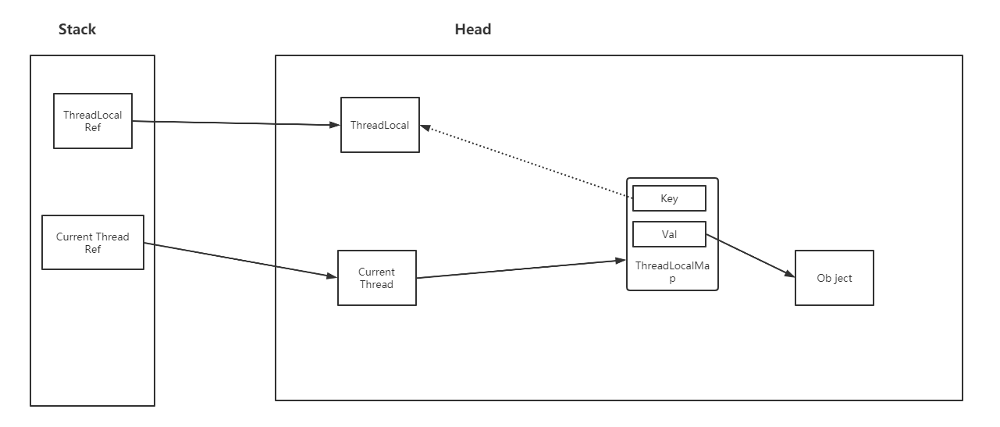
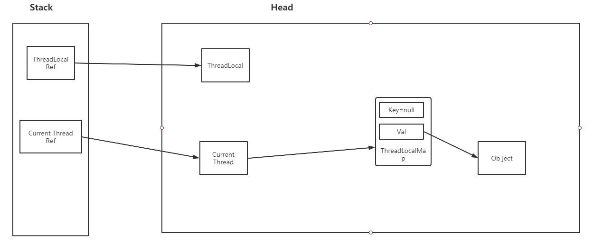
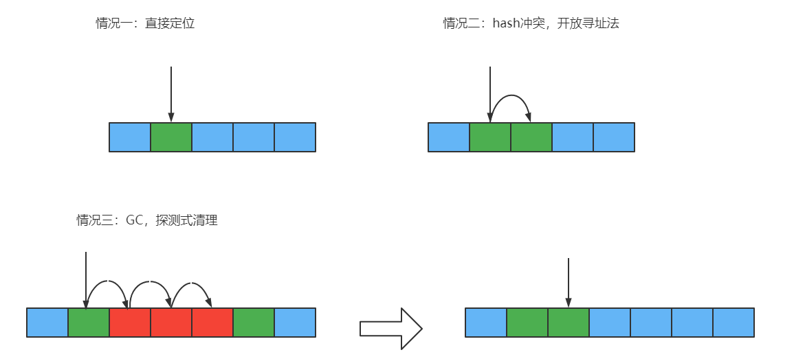

# ThreadLocal解析

## 简介

ThreadLocal实现了线程局部变量，ThreadLocal通过技术手段（而非java本身语法支持）实现了如何去表示的是一个线程的变量。

## ThreadLocal实现原理



由图，ThreadLocal实现线程局部变量，其实质是由ThreadLocal.ThreadLocalMap这个数据结构来实现的，ThreadLocal为key，Object为val。 并且该ThreadLocalMap被当前线程所持有。

## ThreadLocal为什么会内存泄漏

`ThreadLocalMap`使用`ThreadLocal`的弱引用作为`key`，如果一个`ThreadLocal`没有外部强引用来引用它，那么系统 GC 的时候，这个`ThreadLocal`势必会被回收，这样一来，`ThreadLocalMap`中就会出现`key`为`null`的`Entry`，就没有办法访问这些`key`为`null`的`Entry`的`value`，如果当前线程再迟迟不结束的话，这些`key`为`null`的`Entry`的`value`就会一直存在一条强引用链：`Thread Ref -> Thread -> ThreaLocalMap -> Entry -> value`永远无法回收，造成内存泄漏。

其实，`ThreadLocalMap`的设计中已经考虑到这种情况，也加上了一些防护措施：在`ThreadLocal`的`get()`,`set()`,`remove()`的时候都会清除线程`ThreadLocalMap`里所有`key`为`null`的`value`。

但是这些被动的预防措施并不能保证不会内存泄漏：

- 使用`static`的`ThreadLocal`，延长了`ThreadLocal`的生命周期，可能导致的内存泄漏（参考ThreadLocal 内存泄露的实例分析）。
- 分配使用了`ThreadLocal`又不再调用`get()`,`set()`,`remove()`方法，那么就会导致内存泄漏。

在上图中当因为Key是弱引用，Key被GC后，其Object并没有被GC,因此造成的内存泄露,如下图。



## ThreadLocal方法解析

> 本节摘自：《面经手册》● 小傅哥

### 设置值set(T value)

ThreadLocal.set(T value)

```JAVA
public void set(T value) {
    Thread t = Thread.currentThread();
    //获取当前线程对应的ThreadLocalMap
    ThreadLocalMap map = getMap(t);
    if (map != null)
        //将ThreadLocal作为key，value作为值传入map中
        map.set(this, value);
    else
        createMap(t, value);
}
```


```JAVA
private void set(ThreadLocal<?> key, Object value) {

    // We don't use a fast path as with get() because it is at
    // least as common to use set() to create new entries as
    // it is to replace existing ones, in which case, a fast
    // path would fail more often than not.

    Entry[] tab = table;
    int len = tab.length;
    //斐波那契散列，计算数组下标。
    int i = key.threadLocalHashCode & (len-1);

    /**
    Entry，是一个弱引用对象的实现类，static class Entry extends WeakReference<ThreadLocal<?>>，所以在没有外部强引用下，会发生GC，删除 key。
    for 循环判断元素是否存在，当前下标不存在元素时，直接设置元素 tab[i] = new Entry(key, value);。
   如果元素存在，则会判断是否 key 值相等 if (k == key)，相等则更新值。
    如果不相等，就到了我们的 replaceStaleEntry，也就是上图说到的探测式清理过期元素。
    **/
    for (Entry e = tab[i];
         e != null;
         e = tab[i = nextIndex(i, len)]) {
        ThreadLocal<?> k = e.get();

        if (k == key) {
            e.value = value;
            return;
        }

        if (k == null) {
            replaceStaleEntry(key, value, i);
            return;
        }
    }

    tab[i] = new Entry(key, value);
    int sz = ++size;
    if (!cleanSomeSlots(i, sz) && sz >= threshold)
        rehash();
}
```

###  扩容机制

#### 扩容条件

```java
if (!cleanSomeSlots(i, sz) && sz >= threshold)
    rehash();
```

两行代码，做了三件事。

* 进行启发式清理*cleanSomeSlots*，把过期元素清理掉，看清理后是否有空间。
* 之后，判断 sz >= threshold，其中 threshold = len * 2 / 3，也就 是说数组中天填充的元素，大于 len * 2 / 3，就需要扩容了。
* 最后，rehash();，扩容重新计算元素位置。
* ThreadLocalMap.rehash()

```java
/**
 * Re-pack and/or re-size the table. First scan the entire
 * table removing stale entries. If this doesn't sufficiently
 * shrink the size of the table, double the table size.
 */
private void rehash() {
    expungeStaleEntries();

    // Use lower threshold for doubling to avoid hysteresis
    if (size >= threshold - threshold / 4)
        resize();
}
```

ThreadLocalMap.expungeStaleEntries()

```java
/**
 * Expunge all stale entries in the table.
 */
private void expungeStaleEntries() {
    Entry[] tab = table;
    int len = tab.length;
    for (int j = 0; j < len; j++) {
        Entry e = tab[j];
        if (e != null && e.get() == null)
            expungeStaleEntry(j);
    }
}
```

* expungeStaleEntries()这部分是主要是探测式清理过期元素，以及判断清理后是否满足扩容条件， size >= threshold * 3/4
* 满足后执行扩容操作，其实扩容完的核心操作就是重新计算哈希值，把元素填充到 新的数组中。


ThreadLocalMap.resize()

```java
/**
 * Double the capacity of the table.
 */
private void resize() {
    Entry[] oldTab = table;
    int oldLen = oldTab.length;
    int newLen = oldLen * 2;
    Entry[] newTab = new Entry[newLen];
    int count = 0;

    for (int j = 0; j < oldLen; ++j) {
        Entry e = oldTab[j];
        if (e != null) {
            ThreadLocal<?> k = e.get();
            if (k == null) {
                e.value = null; // Help the GC
            } else {
                int h = k.threadLocalHashCode & (newLen - 1);
                while (newTab[h] != null)
                    h = nextIndex(h, newLen);
                newTab[h] = e;
                count++;
            }
        }
    }

    setThreshold(newLen);
    size = count;
    table = newTab;
}
```

以上，代码就是扩容的整体操作，具体包括如下步骤；

1. 首先把数组长度扩容到原来的 2 倍，oldLen * 2，实例化新数组
2. 遍历 for，所有的旧数组中的元素，重新放到新数组中。
3. 在放置数组的过程中，如果发生哈希碰撞，则链式法顺延。
4. 同时这还有检测 key 值的操作 if (k == null)，方便 GC。

#### 启发式清理

有这么一段注释，大概意思是；试探的扫描一些单元格，寻找过期 元素，也就是被垃圾回收的元素。当添加新元素或删除另一个过时元素时，将调用此函数。它执行对数扫描次数，作为不扫描（快速但保留垃圾）和与元素数量成比例的扫描次数之间的平衡，这将找到所有垃圾，但会导致一些插入花费 O（n） 时

```
private boolean cleanSomeSlots(int i, int n) {
    boolean removed = false;
    Entry[] tab = table;
    int len = tab.length;
    do {
        i = nextIndex(i, len);
        Entry e = tab[i];
        if (e != null && e.get() == null) {
            n = len;
            removed = true;
            i = expungeStaleEntry(i);
        }
    } while ( (n >>>= 1) != 0);
    return removed;
}
```

### 获取值get()

new ThreadLocal<>().get(); 同样获取元素也就这么一句代码，如果没有分析源码之前，你能考虑到它在不同 的数据结构下，获取元素时候都做了什么操作吗。我们先来看下图，分为如下种 情况；



按照不同的数据元素存储情况，基本包括如下情况；

1. 直接定位到，没有哈希冲突，直接返回元素即可。
2. 没有直接定位到了，key 不同，需要拉链式寻找。
3. 没有直接定位到了，key 不同，拉链式寻找，遇到 GC 清理元素，需要探测式清 理，再寻找元素。

ThreadLocalMap.getEntry(ThreadLocal<?> key)

```
/**
 * Get the entry associated with key.  This method
 * itself handles only the fast path: a direct hit of existing
 * key. It otherwise relays to getEntryAfterMiss.  This is
 * designed to maximize performance for direct hits, in part
 * by making this method readily inlinable.
 *
 * @param  key the thread local object
 * @return the entry associated with key, or null if no such
 */
private Entry getEntry(ThreadLocal<?> key) {
    int i = key.threadLocalHashCode & (table.length - 1);
    Entry e = table[i];
    if (e != null && e.get() == key)
        return e;
    else
        return getEntryAfterMiss(key, i, e);
}
```

这部分就是获取元素的源码部分，和我们图中列举的情况是一致的。 expungeStaleEntry，是发现有 key == null 时，进行清理过期元素，并把后续 位置的元素，前移。

ThreadLocalMap.getEntryAfterMiss(ThreadLocal<?> key, int i, Entry e)

```java
/**
 * Version of getEntry method for use when key is not found in
 * its direct hash slot.
 *
 * @param  key the thread local object
 * @param  i the table index for key's hash code
 * @param  e the entry at table[i]
 * @return the entry associated with key, or null if no such
 */
private Entry getEntryAfterMiss(ThreadLocal<?> key, int i, Entry e) {
    Entry[] tab = table;
    int len = tab.length;

    while (e != null) {
        ThreadLocal<?> k = e.get();
        if (k == key)
            return e;
        if (k == null)
            expungeStaleEntry(i);
        else
            i = nextIndex(i, len);
        e = tab[i];
    }
    return null;
}
```

ThreadLocalMap.expungeStaleEntry(int staleSlot)

探测式清理，是以当前遇到的 GC 元素开始，向后不断的清理。直到遇到 null  为止，才停止 rehash 计算 Rehash until we encounter null。

```
/**
 * Expunge a stale entry by rehashing any possibly colliding entries
 * lying between staleSlot and the next null slot.  This also expunges
 * any other stale entries encountered before the trailing null.  See
 * Knuth, Section 6.4
 *
 * @param staleSlot index of slot known to have null key
 * @return the index of the next null slot after staleSlot
 * (all between staleSlot and this slot will have been checked
 * for expunging).
 */
private int expungeStaleEntry(int staleSlot) {
    Entry[] tab = table;
    int len = tab.length;

    // expunge entry at staleSlot
    tab[staleSlot].value = null;
    tab[staleSlot] = null;
    size--;

    // Rehash until we encounter null
    Entry e;
    int i;
    for (i = nextIndex(staleSlot, len);
         (e = tab[i]) != null;
         i = nextIndex(i, len)) {
        ThreadLocal<?> k = e.get();
        if (k == null) {
            e.value = null;
            tab[i] = null;
            size--;
        } else {
            int h = k.threadLocalHashCode & (len - 1);
            if (h != i) {
                tab[i] = null;

                // Unlike Knuth 6.4 Algorithm R, we must scan until
                // null because multiple entries could have been stale.
                while (tab[h] != null)
                    h = nextIndex(h, len);
                tab[h] = e;
            }
        }
    }
    return i;
}
```

以上，启发式清理，有这么一段注释，大概意思是；试探的扫描一些单元格，寻找过期 元素，也就是被垃圾回收的元素。当添加新元素或删除另一个过时元素时，将调 用此函数。它执行对数扫描次数，作为不扫描（快速但保留垃圾）和与元素数量 成比例的扫描次数之间的平衡，这将找到所有垃圾，但会导致一些插入花费 O（n） 时间
