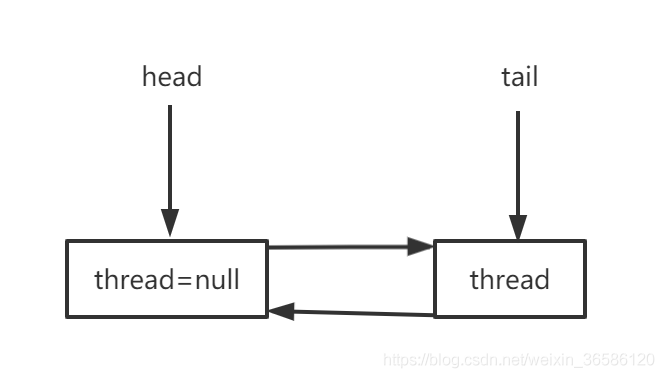

# AQS源码解读（一）——AQS是什么？CLH变种体现在哪里？并发控制的核心在哪里？

## 一、前言

AQS（AbstractQueuedSynchronizer），作为JUC并发包举足轻重的组成部分，承担并发控制的重要角色。例如ReentrantLock、ReentrantReadWriteLock、CountDownLatch、Semaphore、并发容器、线程池ThreadPoolExecutor内部类Worker等都需要依托AQS实现并发控制。

AQS中维护了两个队列，同步队列和阻塞队列（ConditionObject）。同步队列用于锁的实现，是基于链表实现的双向队列，也是CLH锁的变种。阻塞队列也是基于链表实现，但是单向的，和wait、notify具有同样功效，可以用于生产者消费者模式的实现，如JUC中部分阻塞队列的实现。

## 二、实现一把锁的核心要素

一把锁最基本的功能要有阻塞和唤醒，通常情况下还要设计成可重入的，否则一个线程获取锁进入互斥状态后，再次获取锁将会被阻塞，产生死锁问题。如下是设计一把锁，需要的几个核心要素：

需要一个state变量，记录锁的状态。state=0，代表没有线程持有锁，state>0 有线程持有锁，并且state的大小是重入的次数。state的操作需要CAS保证线程安全。
需要有一个变量记录持锁的当前线程（exclusiveOwnerThread）。
底层支持一个线程的阻塞（park）和唤醒（unpark）。
需要一个队列维护所有阻塞的线程，队列的操作需要CAS保证线程安全。
这几个要素在AQS中都有具体表现。了解了基本思想流程，带着思考读源码就会有一种豁然开朗，拨开云雾见天日的感觉。

## 三、AQS的双向同步队列

基于链表实现的双向同步队列，在CLH的基础上进行了变种。CLH是单向队列，其主要特点是自旋检查前驱节点的locked状态。而AQS同步队列是双向队列，每个节点也有状态waitStatus，而其并不是一直对前驱节点的状态自旋，而是自旋一段时间后阻塞让出cpu时间片（上下文切换），等待前驱节点主动唤醒后继节点，这就相当于CLH+MCS。

AQS同步队列有些特别，head节点是一个空节点，没有记录线程node.thread=null，其后继节点才是实质性的有线程的节点，这样做有什么好处呢，当最后一个有线程的节点出队列后，不需要想着清空队列，同时下次有新节点入队列也不需要重新实例化队列。

所以当队列为空时，head=tail=null，当第一个线程节点入队列时，需要先初始化，head和tail会先指向一个空节点，新节点加到tail的后面，tail指针后移到新节点，而head依然指向一个空节点，且head永远指向一个没有实质线程的空节点。


## 四、源码分析

### 1、两种模式

同步队列节点有两种模式，共享模式和独占模式：

共享模式Node SHARED = new Node()，所有共享节点拥有同一个节点对象。

独占模式Node EXCLUSIVE = null，独占节点用null对象来表示。

### 2、四种状态

同步队列节点有4种状态CANCELLED（1）、SIGNAL（-1）、CONDITION（-2）、PROPAGATE（-3），代码中经常以waitStatus>0 代表为取消节点，waitStatus < 0为正常节点。

CANCELLED（1）： 取消状态的节点会被剔除。当获取锁意外中断而导致没有获取锁时，节点会被取消。

SIGNAL（-1）： 预示后继节点的线程需要被唤醒，但是节点node在获取锁失败后，检测前驱节点waitStatus=SIGNAL，判断为node应该放心阻塞，等待前驱唤醒。

CONDITION（-2）： 线程正在等待状态 这个状态只在condition阻塞队列中设置。

PROPAGATE（-3）：只设置在头节点，代表需要继续无条件唤醒后继，只应用于共享模式。


````java
public abstract class AbstractQueuedSynchronizer
    extends AbstractOwnableSynchronizer
    implements java.io.Serializable {

    private static final long serialVersionUID = 7373984972572414691L;
    
    /**
     * Wait queue node class.
     *
     * <p>The wait queue is a variant of a "CLH" (Craig, Landin, and
     * Hagersten) lock queue. CLH locks are normally used for
     * spinlocks.
     * <p>To enqueue into a CLH lock, you atomically splice it in as new
     * tail. To dequeue, you just set the head field.
     * <pre>
     *      +------+  prev +-----+       +-----+
     * head |      | <---- |     | <---- |     |  tail
     *      +------+       +-----+       +-----+
     * </pre>
    //双向队列
    static final class Node {
        /** Marker to indicate a node is waiting in shared mode */
        //共享一个节点对象
        static final Node SHARED = new Node();
        /** Marker to indicate a node is waiting in exclusive mode */
        //独占节点
        static final Node EXCLUSIVE = null;

        /** waitStatus value to indicate thread has cancelled */
        //取消状态的节点会被剔除
        static final int CANCELLED =  1;
        /** waitStatus value to indicate successor's thread needs unparking */
        //预示后继节点的线程需要被唤醒
        static final int SIGNAL    = -1;
        /** waitStatus value to indicate thread is waiting on condition */
        //线程正在等待状态  这个状态只在condition await时设置
        static final int CONDITION = -2;
        /**
         * waitStatus value to indicate the next acquireShared should
         * unconditionally propagate
         */
        static final int PROPAGATE = -3;

        //节点状态-节点在获取锁和释放锁的状态流程
        volatile int waitStatus;

        //有前继指针，说明是双向队列
        volatile Node prev;

        volatile Node next;

        //记录阻塞的线程
        volatile Thread thread;

        //condition中记录下一个节点，Lock中记录当前的node是独占node还是共享node
        Node nextWaiter;

        /**
         * Returns true if node is waiting in shared mode.
         */
        final boolean isShared() {
            return nextWaiter == SHARED;
        }

        /**
         * 获取前继节点
         * Returns previous node, or throws NullPointerException if null.
         * @return the predecessor of this node
         */
        final Node predecessor() throws NullPointerException {
            Node p = prev;
            //node的上一个节点为空，直接抛异常
            if (p == null)
                throw new NullPointerException();
            else
                return p;
        }
        ...
    }

   //队列头指针
    private transient volatile Node head;

    //队列尾指针
    private transient volatile Node tail;

    //The synchronization state.
    private volatile int state;
    ...
}
````

### 3、一个state一个exclusiveOwnerThread

state变量用于记录锁的状态，state=0代表锁空闲，state>0代表有线程持有锁，独占模式下state数值代表锁重入的次数；共享模式下，因为可以多个线程持有锁，所以state不能作为重入次数的记录，需要单独实现。

AbstractQueuedSynchronizer还继承了AbstractOwnableSynchronizer，主要继承了AbstractOwnableSynchronizer独占模式下记录锁所有者线程的功能。
````java
public abstract class AbstractOwnableSynchronizer
    implements java.io.Serializable {
    private static final long serialVersionUID = 3737899427754241961L;
    protected AbstractOwnableSynchronizer() { }
    /**
     * The current owner of exclusive mode synchronization.
     */
    private transient Thread exclusiveOwnerThread;
    
    protected final void setExclusiveOwnerThread(Thread thread) {
        exclusiveOwnerThread = thread;
    }
    protected final Thread getExclusiveOwnerThread() {
        return exclusiveOwnerThread;
    }
}
````

### 4、何时入队列，出队列呢？

1. 入队列，线程获取锁失败，入队列将新节点加到tail后面，然后对tail进行CAS操作，将tail指针后移到新节点上。
2. 出队列，锁释放唤醒head的后继节点，head的后继节点从阻塞中醒来，开始抢锁，获取锁成功，此时head指针向后移一个位置，原先head的后继节点成为新的head。

#### （1）入队列

1. 新建一个节点。
2. 判断tail不为空，新节点CAS排到队列尾部，tail指针指向新节点。
3. 若tail为空或者CAS排到队列尾部失败，进入自旋enq。
4. 判断tail是否为空，为空则初始化，初始化需要CAS设置head，此时head和tail都指向一个空节点（thread=null）。
5. 初始化完成后再循环一次，CAS将新节点排到队列尾部，失败则继续自旋。

````java
private Node addWaiter(Node mode) {
    Node node = new Node(Thread.currentThread(), mode);
    // Try the fast path of enq; backup to full enq on failure
    Node pred = tail;
    if (pred != null) {
        //设置node节点的上一个节点是tail
        node.prev = pred;
        //cas设置tail指针指向node
        if (compareAndSetTail(pred, node)) {
            pred.next = node;
            //mode进入尾部成功，返回
            return node;
        }
    }
    //pred = null  还没初始化
    //or mode没有插入链接尾部，自旋cas到尾部
    enq(node);
    return node;
}
//cas自旋入队列->尾部
private Node enq(final Node node) {
    for (;;) {
        Node t = tail;
        if (t == null) { // Must initialize
            //先初始化
            if (compareAndSetHead(new Node()))
                tail = head;
        } else {
            //自旋 cas node到链表尾部
            node.prev = t;
            if (compareAndSetTail(t, node)) {
                t.next = node;
                return t;
            }
        }
    }
}
````

#### （2）出队列

出队列就很简单，就是一个换头的动作。出队换头不需要CAS，对于独占锁只有一个线程获取锁所以是安全的；对于共享锁，虽然可以多个线程获取锁，但是共享锁的唤醒出队操作是顺序进行的，所以出队换头也是安全的。

````java
private void setHead(Node node) {
    head = node;
    node.thread = null;
    node.prev = null;
}
````

### 5、AQS中模板方法设计模式

AQS作为一个基础组件，将队列操作封装成一个个模板，其中获取锁、释放锁的动作交由子类自主实现。

#### （1）独占模式获取锁

独占模式获取锁失败后，进入队列的操作是可复用的，至于在没有入队列前怎么获取锁全由子类决定，所以子类只需要实现`tryAcquire`方法。

````java
public final void acquire(int arg) {
    //若没有抢到锁，则进入同步队列
    if (!tryAcquire(arg) &&
        acquireQueued(addWaiter(Node.EXCLUSIVE), arg))
        //自己中断自己
        selfInterrupt();
}
protected boolean tryAcquire(int arg) {
    throw new UnsupportedOperationException();
}
````

#### （2）独占模式释放锁

独占模式下释放锁，唤醒后继的动作也是可复用的，至于如何释放锁，由子类自行实现`tryRelease`方法。

````java
public final boolean release(int arg) {
    if (tryRelease(arg)) {
        Node h = head;
        if (h != null && h.waitStatus != 0)
            //释放锁成功后唤醒后继节点
            unparkSuccessor(h);
        return true;
    }
    return false;
}
protected boolean tryRelease(int arg) {
    throw new UnsupportedOperationException();
}
````

#### （3）共享模式获取锁

共享模式获取锁和独占模式获取锁类似，进入队列的操作可以复用，子类只需要实现`tryAcquireShared`即可。

````java
public final void acquireShared(int arg) {
    //tryAcquireShared 返回-1获取锁失败，返回值大于1或者0获取锁成功
    if (tryAcquireShared(arg) < 0)
        //获取锁失败，进入队列操作
        doAcquireShared(arg);
}
protected int tryAcquireShared(int arg) {
    throw new UnsupportedOperationException();
}
````

#### （4）共享模式释放锁

同样，共享模式释放锁，子类只需要实现`tryReleaseShared`。

````java
public final boolean releaseShared(int arg) {
    if (tryReleaseShared(arg)) {
        //读锁锁释放才唤醒后继节点
        doReleaseShared();
        return true;
    }
    return false;
}
protected boolean tryReleaseShared(int arg) {
    throw new UnsupportedOperationException();
}
````

还有一些可中断、可超时的获取锁的操作都是一个个模板。

## 六、总结

- AQS中双向同步队列是CLH的变种，既在前驱节点上自旋一段时间，又依赖于前驱节点的唤醒，相当于CLH+MCS。
- AQS作为一个基础组件，运用了模板方法设计模式，将可复用的操作封装成一个个模板，将一些灵活的方法交由子类去实现。