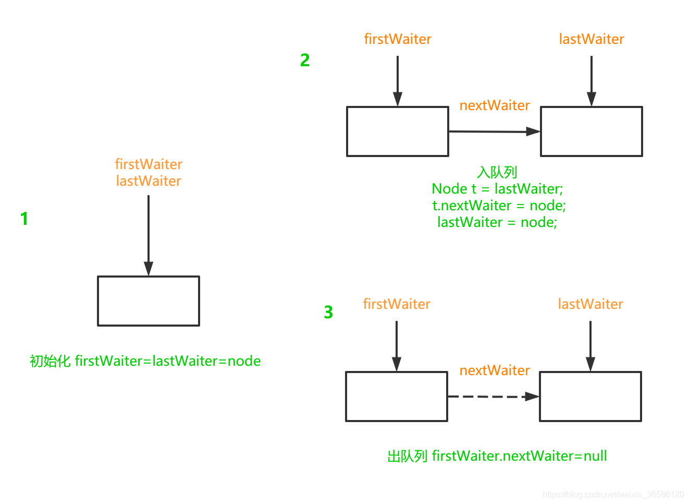

# AQS源码解读（四）——Condition原理详解（Object#wait/notify优化？singnal唤醒线程了吗？）

## 一、前言

Condition的功能类似于wait/notify，可用于实现生产者消费者模式，在阻塞队列中有着广泛实践。但是有了wait/notify为什么还要有Condition呢？

wait/notify必须和synchronized配套使用，正因为如此，wait/notify作用的对象和synchronized的对象是同一个，无法区分队列空和队列满的情况，导致生产者可以唤醒消费者，也可以唤醒其他生产者，反之亦然。

Condition的出现就是为了解决wait/notify不能针对性唤醒的问题。Condition也是需要和Lock配套使用，所以Condition也是Lock的一部分。Condition是如何解决wait/notify的问题的呢？


## 二、代码示例

如下利用`Condition`实现了一个简易的生产者和消费者模式。将集合容量设置为1，生产者和消费者将交替运行。

* notFull表示生产者的状态，notFull.await()负负为正表示集合满状态，生产者阻塞，停止生产；notFull.signal()表示集合不满，生产者唤醒，继续生产。
* notEmpty表示消费者状态，notEmpty.await()负负为正表示集合空状态，消费者阻塞，停止消费；notEmpty.signal()表示集合不空，消费者唤醒，继续消费。

````java
public class Test {
    public static void main(String[] args) throws InterruptedException {
        final int maxCapacity = 1;
        List<Integer> store = new ArrayList<>(maxCapacity);
        Lock lock = new ReentrantLock();
       
        Condition notEmpty = lock.newCondition();
        Condition notFull = lock.newCondition();

        Thread producer = new Thread(new Runnable() {
            @Override
            public void run() {
                for (;;) {
                    lock.lock();
                    try {
                        if (store.size() >= maxCapacity) {
                            try {
                                System.out.println("store 满了，生产者阻塞,不满等待notFull.wait()");
                                notFull.await();
                            } catch (InterruptedException e) {
                                e.printStackTrace();
                            }
                        }
                        int rand = new Random().nextInt();
                        store.add(rand);
                        System.out.println("store 没有满，生产者生产，并唤醒消费者notEmpty.signal()");
                        notEmpty.signal();
                    } finally {
                        lock.unlock();
                    }
                }
            }
        });
        Thread consumer = new Thread(new Runnable() {
            @Override
            public void run() {
                for (;;) {
                    lock.lock();
                    try {
                        if (store.size() == 0) {
                            try {
                                System.out.println("store 空了，消费者阻塞,不空等待notEmpty.wait()");
                                notEmpty.await();
                            } catch (InterruptedException e) {
                                e.printStackTrace();
                            }
                        }
                        store.remove(0);
                        System.out.println("store不空，消费者消费, 不满唤醒notFull.signal()");
                        notFull.signal();
                    } finally {
                        lock.unlock();
                    }
                }
            }
        });
        producer.start();
        consumer.start();
    }
}

//控制台输出
store 没有满，生产者生产，并唤醒消费者notEmpty.signal()
store 满了，生产者阻塞,不满等待notFull.wait()
store不空，消费者消费, 不满唤醒notFull.signal()
store 空了，消费者阻塞,不空等待notEmpty.wait()
store 没有满，生产者生产，并唤醒消费者notEmpty.signal()
store 满了，生产者阻塞,不满等待notFull.wait()
store不空，消费者消费, 不满唤醒notFull.signal()
store 空了，消费者阻塞,不空等待notEmpty.wait()
store 没有满，生产者生产，并唤醒消费者notEmpty.signal()
store 满了，生产者阻塞,不满等待notFull.wait()
... ...
````

## 三、Condition实现原理

Condition是一个接口，它的实现类是AbstractQueuedSynchronizer的一个内部类ConditionObject。从源码可以看出ReentrantLock和ReentrantReadWriteLock.WriteLock有Condition的功能且都是调用了AQS的ConditionObject，所以其实现逻辑是一样的；ReentrantReadWriteLock.ReadLock不支持Condition的功能。
````java
//ReentrantLock#newCondition
public Condition newCondition() {
    return sync.newCondition();
}
//ReentrantLock.Sync#newCondition
final ConditionObject newCondition() {
    return new ConditionObject();
}
//ReentrantReadWriteLock.WriteLock#newCondition
public Condition newCondition() {
    return sync.newCondition();
}
//ReentrantReadWriteLock.Sync#newCondition
final ConditionObject newCondition() {
    return new ConditionObject();
}
//ReentrantReadWriteLock.ReadLock#newCondition
public Condition newCondition() {
    throw new UnsupportedOperationException();
}
````

### 1、Condition单向队列

`ConditionObject`中维护了一个单向链表队列。`firstWaiter`相当于head，`lastWaiter`相当于tail。

入队列流程如下：

1. 新建一个节点node，node.thread=Thread.currentThread() ;node.waitStatus=CONDITION。
2. 若等待队列为空时，firstWaiter和lastWaiter都指向新节点node。
3. 等待队列不为空，node拼接到队列尾部，lastWaiter指针后移到node。

````java
public class ConditionObject implements Condition, java.io.Serializable {
    private static final long serialVersionUID = 1173984872572414699L;
    /** First node of condition queue. */
    //相当于head
    private transient Node firstWaiter;
    /** Last node of condition queue. */
    //相当于tail
    private transient Node lastWaiter;
    public ConditionObject() { }
    
    /**
     * Adds a new waiter to wait queue.
     * @return its new wait node
     */
    private Node addConditionWaiter() {
        Node t = lastWaiter;
        // If lastWaiter is cancelled, clean out.
        if (t != null && t.waitStatus != Node.CONDITION) {
            unlinkCancelledWaiters();//清除取消节点
            t = lastWaiter;
        }
        Node node = new Node(Thread.currentThread(), Node.CONDITION);
        if (t == null)
            //空的  firstWaiter和 lastWaiter都指向 node
            // firstWaiter=lastWaiter=null 是空
            // firstWaiter=lastWaiter!=null 说明只有一个节点
            firstWaiter = node;
        else
            //tail != null，将节点拼接到尾部
            t.nextWaiter = node;
        //lastWaiter指针后移到新节点
        lastWaiter = node;
        return node;
    }
}
````



了解了`ConditionObject`的单向队列原理，`await()`和`signal()`的原理也就容易理解了。

### 2、ConditionObject#await

`await()`是在一个线程持有锁的情况下调用，所以整体是线程安全的，同时`await()`会响应线程中断。如下是`await()`基本流程：

1. 将当前线程赋值给新节点并拼接到队列尾部。
2. 完全释放锁fullyRelease，使得当前线程不再持有锁，state=0。
3. 当node节点不在AQS同步队列中，则阻塞当前线程。
4. 线程被唤醒有可能是其他线程调用了unpark，也有可能是发生中断导致唤醒，中断唤醒跳出循环，自然唤醒则循环一次判断节点是否在AQS同步队列中，在则终止循环。
5. 若唤醒循环结束，重新获取锁。
6. 无论获取锁成功与否，若唤醒的过程发生过中断，最后都需要对中断做出补偿reportInterruptAfterWait。

````java
public final void await() throws InterruptedException {
    if (Thread.interrupted())
        throw new InterruptedException();
    //1.放入condition队列-尾
    Node node = addConditionWaiter();
    //2.释放所有锁 state--->0，完全释放锁失败抛出异常不会继续往下走
    int savedState = fullyRelease(node);
    int interruptMode = 0;
    while (!isOnSyncQueue(node)) {
        //3.不在aqs的同步队列中，则继续阻塞
        LockSupport.park(this);
        //4.被唤醒，判断unpark过程中是否发生过中断
        if ((interruptMode = checkInterruptWhileWaiting(node)) != 0)
            break;
    }
    //5.acquireQueued  返回false为拿锁成功，返回true是阻塞被唤醒或者被中断
    if (acquireQueued(node, savedState) && interruptMode != THROW_IE)
        //不是唤醒前被中断  那就是唤醒后被中断
        interruptMode = REINTERRUPT;
    if (node.nextWaiter != null) // clean up if cancelled
        unlinkCancelledWaiters();
    if (interruptMode != 0)
        reportInterruptAfterWait(interruptMode);
}
````

#### （1）fullyRelease完全释放锁

调用await和调用`java.lang.Object#wait()`一样都要先完全释放锁，如果完全释放锁失败则将node节点状态设置为取消`Node.CANCELLED`，也就有了剔除`codition`队列取消节点的操作`unlinkCancelledWaiters`。

```java
调用await和调用java.lang.Object#wait()一样都要先完全释放锁，如果完全释放锁失败则将node节点状态设置为取消Node.CANCELLED，也就有了剔除codition队列取消节点的操作unlinkCancelledWaiters。

```

````java
final int fullyRelease(Node node) {
    boolean failed = true;
    try {
        //获取重入次数
        int savedState = getState();
        //完全释放锁
        if (release(savedState)) {
            failed = false;
            //返回重入次数
            return savedState;
        } else {
            //释放锁失败，直接抛出异常
            throw new IllegalMonitorStateException();
        }
    } finally {
        //如果完全释放锁失败，则将node节点状态设置为取消。
        //所以就有了剔除codition队列取消节点的操作
        if (failed)
            node.waitStatus = Node.CANCELLED;
    }
}
````

#### （2）isOnSyncQueue判断节点是否在AQS同步队列

- `node.waitStatus=CONDITION`，node在`ConditionObject`等待队列。
- `node.prev=null`，node没有前继节点，不在AQS的同步队列。
- `node.next != null`，node有后继节点，node必须在AQS同步队列。

如果node.waitStatus!=CONDITION，且node.prev!=null并不能说明node在AQS同步队列，还需要判断node.next是否等于null，node.next不为null那一定在AQS的同步队列，但是node.next为null的情况就需要从尾部遍历aqs的队列是否有该节点了，因为入同步队列是到尾部，先修改被添加节点的前驱指针指向旧的tail节点，然后cas修改tail指针指向新节点，cas修改tail指针成功后才是将前一个节点的next指针指向新节点。而cas修改tail指针是有可能失败的。

````java
final boolean isOnSyncQueue(Node node) {
    if (node.waitStatus == Node.CONDITION || node.prev == null)
        return false;
    if (node.next != null) // If has successor, it must be on aqs queue
        return true;
    //从aqs 尾开始遍历查找 node
    return findNodeFromTail(node);
}

private boolean findNodeFromTail(Node node) {
    Node t = tail;
    for (;;) {
        if (t == node)
            return true;
        if (t == null)
            return false;
        t = t.prev;
    }
}
````

#### （3）checkInterruptWhileWaiting判断唤醒过程中是否发生中断

线程从`await`中唤醒，需要判断唤醒的过程中是否发生过中断，若发生过中断，需要进一步判断是唤醒后中断（`REINTERRUPT = 1`），还是唤醒前中断（`THROW_IE = -1`）？

```java
/** Mode meaning to reinterrupt on exit from wait */
//唤醒后被中断
private static final int REINTERRUPT =  1;
/** Mode meaning to throw InterruptedException on exit from wait */
//唤醒前中断
private static final int THROW_IE    = -1;

private int checkInterruptWhileWaiting(Node node) {
    return Thread.interrupted() ?
        (transferAfterCancelledWait(node) ? THROW_IE : REINTERRUPT) :
        0;
}

```

（1）node可以从CONDITION修改为0，说明node还在condition队列中，需要将node放入AQS同步队列，并返回true,代表唤醒前（调用`singal`前）发生的中断。

（2）如果node不能可以从condition修改为0，则判断node是否在AQS中，不在则自旋让出cpu资源（等其他线程调用singal将node移动到AQS同步队列），在则返回false，代表唤醒后（调用`singal`后）被中断。

```java
final boolean transferAfterCancelledWait(Node node) {
    if (compareAndSetWaitStatus(node, Node.CONDITION, 0)) {
        //可以从condition修改为0，说明node还在condition队列中，需要将node放入AQS队列，
        //并返回true,代表唤醒前发生的中断。
        enq(node);
        return true;
    }
    /*
     * If we lost out to a signal(), then we can't proceed
     * until it finishes its enq().  Cancelling during an
     * incomplete transfer is both rare and transient, so just
     * spin.
     */
    //如果node不能可以从condition修改为0，则判断node是否在AQS中，不在则自旋让出cpu
    //在则返回false，代表唤醒后被中断
    while (!isOnSyncQueue(node))
        Thread.yield();
    return false;
}
```

#### （4）acquireQueued重新获取锁

需要注意acquireQueued返回值代表的是，是否发生中断，acquireQueued是自旋获取锁，虽然会有阻塞，但是唤醒后依然自旋获取锁，直至获取锁成功才返回，所以其既然能执行完毕返回就代表获取锁成功了。

```java
final boolean acquireQueued(final Node node, int arg) {
    boolean failed = true;
    try {
        boolean interrupted = false;
        for (;;) {
            //拿node的前一个节点
            final Node p = node.predecessor();
            //若p是头节点，，说明自己排在队列的第一个尝试抢锁
            if (p == head && tryAcquire(arg)) {
                //node成为新的head
                setHead(node);
                p.next = null; // help GC
                failed = false;
                //拿到锁了返回false
                return interrupted;
            }
            if (shouldParkAfterFailedAcquire(p, node) &&
                parkAndCheckInterrupt())
                interrupted = true;
        }
    } finally {
        if (failed)
            //基本不可能走到这一步，除非是系统级别的异常导致获取锁失败for循环意外退出，
            cancelAcquire(node);
    }
}
```

#### （5）unlinkCancelledWaiters剔除取消节点

`if (node.nextWaiter != null)`如果node还有后继，说明condition队列中还有其他节点则从头遍历执行剔除取消节点的操作。

```java
private void unlinkCancelledWaiters() {
    Node t = firstWaiter;
    Node trail = null;
    while (t != null) {
        Node next = t.nextWaiter;
        if (t.waitStatus != Node.CONDITION) {
            t.nextWaiter = null;
            if (trail == null)
                firstWaiter = next;
            else
                //trail指向的是上一个正常的节点
                trail.nextWaiter = next;
            if (next == null)
                lastWaiter = trail;
        }
        else
            trail = t;
        //从头遍历
        t = next;
    }
}
```

#### （6）reportInterruptAfterWait对中断做出补偿

对这两种中断做出相应的补偿措施，唤醒前中断（`THROW_IE = -1`），抛出异常；唤醒后中断（`REINTERRUPT = 1`），作为补偿再自己中断一下自己。

```java
private void reportInterruptAfterWait(int interruptMode)
    throws InterruptedException {
    if (interruptMode == THROW_IE)
        throw new InterruptedException();
    else if (interruptMode == REINTERRUPT)
        selfInterrupt();
}
static void selfInterrupt() {
    Thread.currentThread().interrupt();
}
```

### 3、ConditionObject#awaitUninterruptibly

`awaitUninterruptibly()`和`await()`逻辑类似，区别在于不会响应线程中断，不会对中断做出补偿，也不会做剔除取消节点的操作。

```java
//不会响应中断
public final void awaitUninterruptibly() {
    //加入condition双向队列
    Node node = addConditionWaiter();
    int savedState = fullyRelease(node);
    boolean interrupted = false;
    while (!isOnSyncQueue(node)) {
        LockSupport.park(this);
        if (Thread.interrupted())
        //线程中断不会跳出循环
            interrupted = true;
    }
    if (acquireQueued(node, savedState) || interrupted)
        //补偿机制
        selfInterrupt();
}
```

### 4、ConditionObject#await(long, java.util.concurrent.TimeUnit)

`await(long, java.util.concurrent.TimeUnit)`可以传递两个参数时长和时间类型，同时也可响应中断。代码结构上和`await()`相似，只是加入了时间因素，而时间因素就用在了自旋的过程中：

1. 通过传入的时长time，计算出deadline。
2. 自旋如果超时nanosTimeout <= 0L，则主动将node放入AQS同步队列，此时node并没有移出condition队列，只是将状态从Node.CONDITION改为0，会在后面unlinkCancelledWaiters时移出condition队列。
3. 自旋还未超时，则会给一个自旋的阈值（spinForTimeoutThreshold = 1000L），自旋1000纳秒后未跳出自旋则阻塞线程一段时长(parkNanos(this, nanosTimeout))。
4. 线程阻塞时长到，自动唤醒，继续自旋，判断node是否在AQS同步队列，判断是否超时。

````java
public final boolean await(long time, TimeUnit unit)
        throws InterruptedException {
    long nanosTimeout = unit.toNanos(time);
    if (Thread.interrupted())
        throw new InterruptedException();
    Node node = addConditionWaiter();
    int savedState = fullyRelease(node);
    final long deadline = System.nanoTime() + nanosTimeout;
    boolean timedout = false;
    int interruptMode = 0;
    while (!isOnSyncQueue(node)) {
        if (nanosTimeout <= 0L) {
            //时间到，自动唤醒，放入aqs队列
            timedout = transferAfterCancelledWait(node);
            break;
        }
        //自旋一定时间1000纳秒后，阻塞
        if (nanosTimeout >= spinForTimeoutThreshold)
            LockSupport.parkNanos(this, nanosTimeout);
        if ((interruptMode = checkInterruptWhileWaiting(node)) != 0)
            break;
        nanosTimeout = deadline - System.nanoTime();
    }
    if (acquireQueued(node, savedState) && interruptMode != THROW_IE)
        interruptMode = REINTERRUPT;
    if (node.nextWaiter != null)
        unlinkCancelledWaiters();
    if (interruptMode != 0)
        reportInterruptAfterWait(interruptMode);
    return !timedout;
}
````

注：`await(long, java.util.concurrent.TimeUnit)`返回结果是是否超时，true为未超时，false为超时。

### 5、ConditionObject#awaitNanos(long nanosTimeout)

awaitNanos(long nanosTimeout)与await(long, java.util.concurrent.TimeUnit)类似，也和时间有关。awaitNanos(long nanosTimeout)只能传入一个纳秒的时长，返回是超时剩余时长（deadline - System.nanoTime()）。

````java
public final long awaitNanos(long nanosTimeout)
        throws InterruptedException {
    if (Thread.interrupted())
        throw new InterruptedException();
    Node node = addConditionWaiter();
    int savedState = fullyRelease(node);
    final long deadline = System.nanoTime() + nanosTimeout;
    int interruptMode = 0;
    while (!isOnSyncQueue(node)) {
        if (nanosTimeout <= 0L) {
            //时间到，自动唤醒，放入aqs队列
            transferAfterCancelledWait(node);
            break;
        }
        if (nanosTimeout >= spinForTimeoutThreshold)
            LockSupport.parkNanos(this, nanosTimeout);
        //响应中断
        if ((interruptMode = checkInterruptWhileWaiting(node)) != 0)
            break;
        nanosTimeout = deadline - System.nanoTime();
    }
    if (acquireQueued(node, savedState) && interruptMode != THROW_IE)
        interruptMode = REINTERRUPT;
    if (node.nextWaiter != null)
        unlinkCancelledWaiters();
    if (interruptMode != 0)
        reportInterruptAfterWait(interruptMode);
    return deadline - System.nanoTime();
}
````

### 6、ConditionObject#awaitUntil(Date deadline)

`awaitUntil`也是和时间有关，只是这个时间不是一个时间段，而是一个日期，或者说是一个时间戳。自旋过程没有给定一个阈值，若未到截止日期，则线程会阻塞，在没有其他线程唤醒或者中断的情况下，线程会到截止日期后自动唤醒。

```
public final boolean awaitUntil(Date deadline)
        throws InterruptedException {
    long abstime = deadline.getTime();
    if (Thread.interrupted())
        throw new InterruptedException();
    Node node = addConditionWaiter();
    int savedState = fullyRelease(node);
    boolean timedout = false;
    int interruptMode = 0;
    while (!isOnSyncQueue(node)) {
        if (System.currentTimeMillis() > abstime) {
            //时间到，自动唤醒，放入aqs队列
            timedout = transferAfterCancelledWait(node);
            break;
        }
        //abstime绝对时长，是个时间戳
        LockSupport.parkUntil(this, abstime);
        if ((interruptMode = checkInterruptWhileWaiting(node)) != 0)
            break;
    }
    if (acquireQueued(node, savedState) && interruptMode != THROW_IE)
        interruptMode = REINTERRUPT;
    if (node.nextWaiter != null)
        unlinkCancelledWaiters();
    if (interruptMode != 0)
        reportInterruptAfterWait(interruptMode);
    return !timedout;
}
```

### 7、ConditionObject#signal

唤醒是从队头开始唤醒，同样是天生的线程安全。

```
public final void signal() {
    if (!isHeldExclusively())
        //持有锁的不是当前线程
        throw new IllegalMonitorStateException();
    Node first = firstWaiter;
    if (first != null)
        doSignal(first);
}
```

唤醒的逻辑在`doSignal()`中：

1. first移出condition等待队列（`first.nextWaiter = null`）。
2. `first.waitStatus`设置为0。
3. first入AQS同步队列。
4. 设置first的前继节点的`waitStatus`为`SIGNAL`，等待其他线程释放锁的时候真正唤醒。

````java
private void doSignal(Node first) {
    do {
        if ( (firstWaiter = first.nextWaiter) == null)
            lastWaiter = null;//等待队列空的 无需唤醒

        first.nextWaiter = null;
        //first ！= null，这里的唤醒只是将first取出等待队列，放入aqs队列的尾部，
        // 并不会unpark
        //除非aqs前继节点被取消或者signal状态设置失败，会直接唤醒first节点的线程
    } while (!transferForSignal(first) &&
             (first = firstWaiter) != null);
}
final boolean transferForSignal(Node node) {
    /*
     * If cannot change waitStatus, the node has been cancelled.
     */
    //1.修改状态，改不了就是已经被取消了
    if (!compareAndSetWaitStatus(node, Node.CONDITION, 0))
        return false;
    
    //2.入aqs同步队列
    Node p = enq(node);
    int ws = p.waitStatus;
    //前继节点 ws > 0代表取消
    //设置前继节点的ws为SIGNAL，预示 其后继节点要被唤醒
    if (ws > 0 || !compareAndSetWaitStatus(p, ws, Node.SIGNAL))
        //前继节点取消  or  ws设置 SIGNAL 失败，将立即唤醒node节点的线程
        LockSupport.unpark(node.thread);
    return true;
}
````

何为唤醒？正常情况下， `signal()`不会真正唤醒线程，而是将condition队列的头结点移到AQS的同步队列中，等待某个线程释放锁的时候真正唤醒。除非放入AQS同步队列后，其前继节点被取消或者状态设置为`SIGNAL`失败，才会直接唤醒first节点的线程。

### 8、ConditionObject#signalAll

`signalAll()`唤醒等待队列中的所有节点，唤醒过程和`signal()`类似。

```
public final void signalAll() {
    if (!isHeldExclusively())
        throw new IllegalMonitorStateException();
    Node first = firstWaiter;
    if (first != null)
        //唤醒所有
        doSignalAll(first);
}
private void doSignalAll(Node first) {
    //清空等待队列
    lastWaiter = firstWaiter = null;
    //循环唤醒
    do {
        Node next = first.nextWaiter;
        first.nextWaiter = null;
        transferForSignal(first);
        first = next;
    } while (first != null);
}
```

## 四、临界问题

明确AQS有两个队列，一个变体的CLH同步队列，一个`Condition`队列，并且二者共享节点对象，一个节点出`Condition`队列，再入同步队列就是改改指针的事。

梳理一下`Condition`阻塞线程`await`和唤醒线程`signal`的流程：

1、持有锁的当前线程调用await，首先创建一个新节点添加到Condition队列，新节点包含当前线程对象并且waitStatus属性设置为CONDITION。

2、接着完全释放锁，检查新节点是否在同步队列中，不在同步队列中，就调用LockSupport.park阻塞当前线程。

3、另一个抢到锁的线程调用signal，signal并不会立即唤醒调用await的线程，而是将Condition队列的头节点移出Condition队列，并将该节点的waitStatus属性从CONDITION设置为0。

4、然后将该节点添加到同步队列尾部，并设置该节点的前驱节点的waitStatus为SIGNAL，这个过程相当于需要唤醒的节点，进入了阻塞获取锁的流程，真正的唤醒是当前持有锁的线程释放锁的时候。

看第2步，调用`await`的线程完全释放锁后，到阻塞线程之间，就不是线程安全了，如果调用await的线程还没来得及阻塞，另一个线程就抢到锁并很快调用signal释放锁，那岂不是调用`await`的线程没有线程唤醒了？

且看阻塞线程前，先检查了入Condition队列的节点的状态，先检查了waitStatus是否为CONDITION，waitStatus是volatile修饰的，如果调用signal的线程cas修改了waitStatus，调用await的线程是可以立马获取最新值的，并且这里还涉及到volatile的知识点happen-before，被volatile修饰的属性，对它的写总先发生于对它的读，那么处于临界状态时，调用await的线程读取waitStatus时一定晚于调用signal的线程修改waitStatus。


所以并不存在调用`await`的线程完全释放锁后，出现线程安全问题，导致`await`的线程无法唤醒的情况。

临界问题不好理解，我也是根据现掌握的知识自圆其说罢了，如有疑问可以讨论。

## 五、总结

* Condition必须和Lock配套使用，线程只有获取锁后才能调用Condition的await或者singal。
* await过程中会完全释放锁。
* 正常情况下signal不会唤醒condition队列中的节点，只是将头节点移到了AQS同步队列中，并设置其前驱状态为SIGNAL，等待其他线程释放锁后正在唤醒。

> 本文摘自： https://blog.csdn.net/weixin_36586120/article/details/108946045