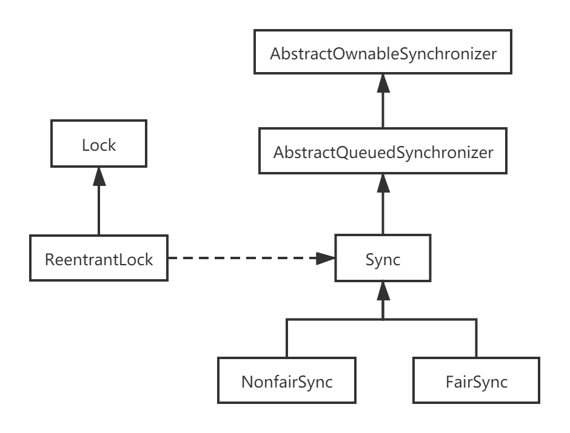

# AQS源码解读（三）——ReentrantLock原理详解（Sync、NonfairSync、FairSync）

## 一、前言

ASQ实现的是一套通用的模板，并不能完全直接应用于实际并发生产中，ReentrantLock就是根据AQS实现的互斥可重入锁。ReentrantLock和synchronized类似，互斥、阻塞、可重入，不同之处在于synchronized基于Java语法层面实现隐式加锁和释放锁，ReentrantLock基于API层面实现显式加锁和释放锁。

`ReentrantLock`实现了接口`Lock`，相较于`synchronized`，对锁的操作更灵活可控，同时根据不同的环境实现了公平锁和非公平锁。

## 二、ReentrantLock基本结构

ReentrantLock本身没有什么代码逻辑，实现的方法调用的是Sync的模板方法，所以锁机制的所有实现逻辑都在ReentrantLock的内部类Sync中。Sync继承自AbstractQueuedSynchronizer，其还有两个子类NonfairSync和FairSync，分别具体实现非公平和公平情况下加锁的逻辑。如下是ReentrantLock的类关系图：



````java
public class ReentrantLock implements Lock, java.io.Serializable {
    private static final long serialVersionUID = 7373984872572414699L;
    /** Synchronizer providing all implementation mechanics */
    //sync同步器提供所有的实现机制
    private final Sync sync;

    /**
     * Base of synchronization control for this lock. Subclassed
     * into fair and nonfair versions below. Uses AQS state to
     * represent the number of holds on the lock.
     */
    abstract static class Sync extends AbstractQueuedSynchronizer {
        abstract void lock();
        ... ...
    }
    static final class NonfairSync extends Sync {
        final void lock() {}
        ... ...
    }
    static final class FairSync extends Sync {
        final void lock() {}
        ... ...
    }
    ... ...
}
````

## 三、锁的公平性

`ReentrantLock`默认情况下提供非公平锁，同时也可以在实例化的时候指定锁公平性。

```
public ReentrantLock() {
    sync = new NonfairSync();
}
public ReentrantLock(boolean fair) {
    sync = fair ? new FairSync() : new NonfairSync();
}
```

何为公平和非公平，例如实际生活中的排队，新来的人按规矩排在队尾是公平，插队就是非公平。对于锁也是同样的道理，新来线程排在阻塞队列队尾是公平，一上来就抢锁是非公平。不同于现实生活，`ReentrantLock`默认非公平锁是为了减少线程间的切换，从而提高效率。

## 四、锁的获取与释放

ReentrantLock锁的获取分别实现了不可中断获取锁lock，尝试获取锁tryLock（获取成功返回true，获取失败返回false），可中断获取锁lockInterruptibly；锁的释放unlock很简单，直接调用的AQS的模板方法release，不需要区分公平性。

### 1、ReentrantLock#lock

`ReentrantLock#lock`调用了`sync.lock()`，`Sync`中`lock()`是一个抽象函数，具体的实现在其子类`NonfairSync`和`FairSync`中。

```
public void lock() {
    sync.lock();
}
abstract static class Sync extends AbstractQueuedSynchronizer {
    /**
     * Performs {@link Lock#lock}. The main reason for subclassing
     * is to allow fast path for nonfair version.
     */
    abstract void lock();
}
```

#### （1）ReentrantLock.NonfairSync

ReentrantLock.NonfairSync#lock实现了Sync中的抽象方法lock，其非公平性体现在，一上来就抢锁设置statecompareAndSetState(0, 1)，如果抢锁成功就设置当前线程为持有独占锁的线程setExclusiveOwnerThread(Thread.currentThread())。

````java
static final class NonfairSync extends Sync {
    private static final long serialVersionUID = 7316153563782823691L;

    /**
     * Performs lock.  Try immediate barge, backing up to normal
     * acquire on failure.
     */
    final void lock() {
        //非公平，直接抢锁
        if (compareAndSetState(0, 1))
            //抢成功，设置当前独占锁的线程为当前线程
            setExclusiveOwnerThread(Thread.currentThread());
        else
            //没有抢到
            acquire(1);
    }

    protected final boolean tryAcquire(int acquires) {
        return nonfairTryAcquire(acquires);
    }
}
````

如果一上来抢锁失败则进入AQS的模板方法acquire(1)，acquire(1)中还会再进行一次抢锁tryAcquire，抢锁失败才进入AQS队列操作acquireQueued(addWaiter(Node.EXCLUSIVE), arg)。（acquire详解请看拙作《AQS源码解读——从acquireQueued探索独占锁实现原理，如何阻塞？如何唤醒？》）

````java
//AbstractQueuedSynchronizer#acquire
public final void acquire(int arg) {
    //若没有抢到锁，则进入等待队列
    if (!tryAcquire(arg) &&
        acquireQueued(addWaiter(Node.EXCLUSIVE), arg))
        //自己中断自己
        selfInterrupt();
}
````

加锁的通用模板`acquire()`已经在AQS中实现，子类只需要实现`tryAcquire`即可。`NonfairSync#tryAcquire`调用了父类的`Sync#nonfairTryAcquire`。具体逻辑如下：

- 查看当前state，是否有线程持有锁，没有`state=0`则继续抢锁。
- 有线程持有锁，判断持有锁的线程是否是当前线程，是就重入。

````java
//ReentrantLock.Sync#nonfairTryAcquire
final boolean nonfairTryAcquire(int acquires) {
    final Thread current = Thread.currentThread();
    int c = getState();
    if (c == 0) {
        //若此时锁空着，则再次尝试抢锁
        if (compareAndSetState(0, acquires)) {
            setExclusiveOwnerThread(current);
            return true;
        }
    }
    //若当前持锁线程是当前线程(重入性)
    else if (current == getExclusiveOwnerThread()) {
        int nextc = c + acquires;
        if (nextc < 0) // overflow
            throw new Error("Maximum lock count exceeded");
        //重入
        setState(nextc);
        return true;
    }
    return false;
}
````

#### （2）ReentrantLock.FairSync

`FairSync`和`NonfairSync`的主要区别在于，`FairSync`不会一上来就抢锁，而是先判断队列中是否有其他线程在等待锁，没有再抢锁。

代码的模板逻辑和`NonfairSync`类似，区别在于`FairSync`中`tryAcquire`的实现。

```
static final class FairSync extends Sync {
    private static final long serialVersionUID = -3000897897090466540L;

    final void lock() {
        acquire(1);
    }
    /**
     * Fair version of tryAcquire.  Don't grant access unless
     * recursive call or no waiters or is first.
     */
    protected final boolean tryAcquire(int acquires) {
        final Thread current = Thread.currentThread();
        int c = getState();
        if (c == 0) {
            //是否有线程在等待锁，没有则抢锁
            if (!hasQueuedPredecessors() &&
                compareAndSetState(0, acquires)) {
                setExclusiveOwnerThread(current);
                return true;
            }
        }
        //如果当前线程已经持有该锁，重入
        else if (current == getExclusiveOwnerThread()) {
            int nextc = c + acquires;
            if (nextc < 0)
                throw new Error("Maximum lock count exceeded");
            setState(nextc);
            return true;
        }
        return false;
    }
}
```

`FairSync`的公平性主要体现在`tryAcquire`判断当前没有线程持有锁时，不会立即去抢锁，而是判断AQS队列中是否有其他线程也在等待锁，没有才去抢锁。如果有线程正持有锁，判断是否是当前线程，是则重入。

```java
public final boolean hasQueuedPredecessors() {
    // The correctness of this depends on head being initialized
    // before tail and on head.next being accurate if the current
    // thread is first in queue.
    Node t = tail; // Read fields in reverse initialization order
    Node h = head;
    Node s;
    return h != t &&
        ((s = h.next) == null || s.thread != Thread.currentThread());
}
```

### 2、ReentrantLock#lockInterruptibly

`lock`是不可中断锁，`lockInterruptibly`是可中断锁，其直接调用了AQS的模板方法`acquireInterruptibly`。

```java
public void lockInterruptibly() throws InterruptedException {
    sync.acquireInterruptibly(1);
}
```

`acquireInterruptibly`和`doAcquireInterruptibly`代码中分别响应中断抛出异常`InterruptedException`。

`acquireInterruptibly`和`doAcquireInterruptibly`详解请看拙作《AQS源码解读——从acquireQueued探索独占锁实现原理，如何阻塞？如何唤醒？》

### 3、ReentrantLock#tryLock

`tryLock`尝试获取锁，调用的是`sync.nonfairTryAcquire(1)`，不会涉及到AQS队列操作，获取锁成功返回true，失败返回false。

```java
public boolean tryLock() {
    return sync.nonfairTryAcquire(1);
}
```

`tryLock`还有一个重载方法，可传入一个超时时长`timeout`和一个时间单位`TimeUnit`，超时时长会被转为纳秒级。

```java
public boolean tryLock(long timeout, TimeUnit unit)
        throws InterruptedException {
    return sync.tryAcquireNanos(1, unit.toNanos(timeout));
}
```

`tryLock(long timeout, TimeUnit unit)`直接调用了AQS的模板方法`tryAcquireNanos`，也具备了响应中断，超时获取锁的功能：

1. 若一开始获取锁`tryAcquire`失败则进入AQS同步队列`doAcquireNanos`。
2. 进入同步队列后自旋1000纳秒，还没有获取锁且判断应该阻塞，则会阻塞一定时长。
3. 超时时长到线程自动唤醒，再自旋还没获取锁，且判断超时则返回false。

（`tryAcquireNanos`详解请看拙作《AQS源码解读——从acquireQueued探索独占锁实现原理，如何阻塞？如何唤醒？》）

### 4、ReentrantLock#unlock

`ReentrantLock`释放锁的过程没有区分公平性，调用的是AQS的模板方法`release()`，其基本逻辑如下：

 

1. 释放锁`tryRelease`。
2. 唤醒后继节点`unparkSuccessor`。（`unparkSuccessor`详解请看拙作《AQS源码解读——从acquireQueued探索独占锁实现原理，如何阻塞？如何唤醒？》）

````java
//ReentrantLock
public void unlock() {
    sync.release(1);
}
//AbstractQueuedSynchronizer
public final boolean release(int arg) {
    if (tryRelease(arg)) {
        Node h = head;
        if (h != null && h.waitStatus != 0)
            //释放锁成功后唤醒head后继节点。
            unparkSuccessor(h);
        return true;
    }
    return false;
}
````

释放锁的逻辑由`ReentrantLock`实现，释放锁之后唤醒后继由AQS负责。释放锁的代码`ReentrantLock.Sync#tryRelease`基本逻辑如下：

1. 判断持有锁的线程是否是当前线程，不是当前线程则抛出异常。
2. 判断释放之后的state==0，等于0说明完全释放锁，将持锁的线程设置为null。
3. 修改state，因为是排它锁，只有当前线程才会走到这里，所以是线程安全的。

注：如果是当前线程多次重入，releases=1是不能完全释放锁的，free=false，也不会唤醒后继节点。

```java
//ReentrantLock.Sync#tryRelease
protected final boolean tryRelease(int releases) {
    //释放锁之后的state值
    int c = getState() - releases;
    if (Thread.currentThread() != getExclusiveOwnerThread())
        //不是当前线程，不能unLock 抛异常
        throw new IllegalMonitorStateException();
    boolean free = false;
    if (c == 0) {
        //每次减一，c = 0,证明没有线程持有锁了，可以释放了
        free = true;
        setExclusiveOwnerThread(null);
    }
    setState(c); //排它锁，只有当前线程才会走到这，是线程安全的  修改state
    return free;
}
```

## 五、总结

* ReentrantLock通过AQS实现了互斥锁的逻辑，核心模板代码都在AQS中，ReentrantLock中只需要实现tryAcquire和tryRelease即可。
* ReentrantLock是互斥锁且可重入。
* ReentrantLock实现了不可中断获取锁，可中断获取锁，可超时获取锁。
* ReentrantLock获取锁有公平与非公平之分，释放锁没有。

> 本文摘自： https://blog.csdn.net/weixin_36586120/article/details/108934089