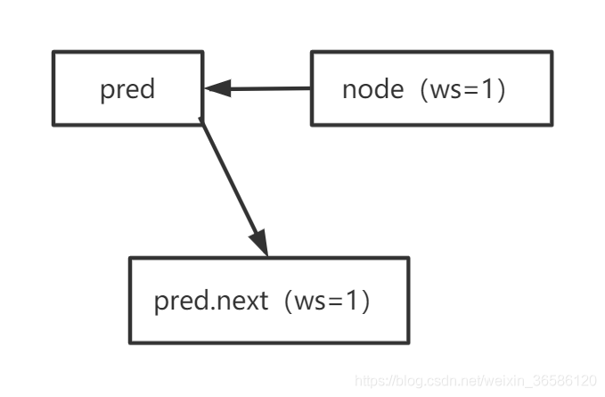

# AQS源码解读（二）——从acquireQueued探索独占锁实现原理，如何阻塞？如何唤醒？

## 一、前言

在AQS中，独占锁又称为互斥锁，其获取与释放锁的过程由两个模板方法实现：acquire与release，其中两个函数tryAcquire与tryRelease，AQS并没有给出具体实现，需要子类根据实际情况自行实现，如ReentrantLock中实现了公平与非公平的tryAcquire。

一个线程获取锁，无非就是对state变量进行CAS修改，修改成功则获取锁，修改失败则进入队列，而AQS就是负责线程进入同步队列以后的逻辑，如何出入队列？如何阻塞？如何唤醒？一切的核心都在AQS里。

## 二、独占模式获取锁

`tryAcquire`，AQS中没有给出具体实现，暂且不谈，主要看`acquireQueued`。

`tryAcquire`获取锁失败，返回false，则执行`acquireQueued`，进入同步队列流程。`addWaiter`是进入队列的操作，其主要流程是新建节点然后将新节点CAS排到队列尾部，而`acquireQueued`的职责是线程进入队列之后的操作，继续获取锁？还是阻塞？

````java
public final void acquire(int arg) {
    //若没有抢到锁，则进入同步队列
    if (!tryAcquire(arg) &&
        acquireQueued(addWaiter(Node.EXCLUSIVE), arg))
        //自己中断自己(补偿机制)
        selfInterrupt();
}
````

### 1、acquireQueued做的不只是阻塞线程

`acquireQueued`要做的不只是单纯的阻塞线程，还有被唤醒或者自旋获取锁后出队列。

1. 获取node节点的前驱节点，判断其是否是head,是则继续抢锁（可能刚入队列就排在head后面，也有可能自旋后，有其他节点获取锁出队列，而使得node排在head后面），抢锁成功则出队换头。
2. node的前驱节点不是head或者抢锁失败，进入阻塞判断shouldParkAfterFailedAcquire。
3. 判断应该放心阻塞，调用parkAndCheckInterrupt阻塞当前线程。

````java
final boolean acquireQueued(final Node node, int arg) {
    boolean failed = true;
    try {
        boolean interrupted = false;
        for (;;) {
            //拿node的前一个节点
            final Node p = node.predecessor();
            //若p是头节点，，说明自己排在队列的第一个尝试抢锁
            if (p == head && tryAcquire(arg)) {
                //node成为新的head
                setHead(node);
                p.next = null; // help GC
                failed = false;
                //拿到锁了返回false
                return interrupted;
            }
            //1.应该阻塞，调用parkAndCheckInterrupt阻塞线程
            //2.不应该阻塞，再给一次抢锁的机会
            if (shouldParkAfterFailedAcquire(p, node) &&
                parkAndCheckInterrupt())
                interrupted = true;
        }
    } finally {
        if (failed)
            //基本不可能走到这一步，除非是系统级别的异常导致获取锁失败for循环意外退出，
            cancelAcquire(node);
    }
}
````

### 2、shouldParkAfterFailedAcquire通过前驱判断是否应该阻塞

阻塞判断`shouldParkAfterFailedAcquire`，什么情况下应该阻塞线程？什么情况下应该再给一次抢锁的机会？3种情况：

1. 判断node的前驱节点waitStatus=SIGNAL（这里和CLH锁自旋检测前驱状态一样），node的线程就放心阻塞，因为会在下次某个线程释放锁后，被node前驱唤醒。
2.  node的前驱节点waitStatus>0，waitStatus只有CANCELLED>0，所以node前驱节点被取消了，剔除取消节点，给node链接一个正常的前驱，然后再自旋一次。
3. node的前驱节点waitStatus=0或者waitStatus=PROPAGATE（waitStatus=PROPAGATE是共享锁传播的情况暂时不考虑），此时将node前驱节点waitStatus设置为SIGNAL，然后再给一次自旋的机会。

````java
private static boolean shouldParkAfterFailedAcquire(Node pred, Node node) {
    int ws = pred.waitStatus;
    if (ws == Node.SIGNAL)
        /*
         * This node has already set status asking a release
         * to signal it, so it can safely park.
         * node拿锁失败，前驱节点的状态是SIGNAL，node节点可以放心的阻塞，
         * 因为下次会被唤醒
         */
        return true;
    if (ws > 0) {
        /*
         * Predecessor was cancelled. Skip over predecessors and
         * indicate retry.
         * pred节点被取消了，跳过pred
         */
        do {
            //pred = pred.prev;
            //node.pred = pred;
            node.prev = pred = pred.prev;
        } while (pred.waitStatus > 0);
        pred.next = node; 
        //跳过取消节点，给node找一个正常的前驱,然后再循环一次
    } else {
        /* 0 -3
         * waitStatus must be 0 or PROPAGATE.  Indicate that we
         * need a signal, but don't park yet.  Caller will need to
         * retry to make sure it cannot acquire before parking.
         */
        compareAndSetWaitStatus(pred, ws, Node.SIGNAL);
    }
    return false;
}
````

### 3、parkAndCheckInterrupt阻塞线程

shouldParkAfterFailedAcquire判断应该阻塞线程，则调用parkAndCheckInterrupt，其内部调用LockSupport.park(this)阻塞当前线程。LockSupport对UNSAFE中的park、unpark进行了封装，其能精准阻塞一个线程，也能精准唤醒一个线程（不同于wait和notify）。阻塞唤醒会导致线程进行上下文切换。
````java
private final boolean parkAndCheckInterrupt() {
    LockSupport.park(this);
    return Thread.interrupted();
}
````

## 三、独占模式可中断获取锁

可中断获取锁`acquireInterruptibly`和不可中断获取锁`acquire`逻辑类似，区别在于`acquireInterruptibly`可响应`InterruptedException`中断异常（外部调用`Thread#interrupt`，就可能会导致中断）。

````java
public final void acquireInterruptibly(int arg)
        throws InterruptedException {
    if (Thread.interrupted())
        //有被中断  抛异常
        throw new InterruptedException();
    if (!tryAcquire(arg))
        doAcquireInterruptibly(arg);
}
````

### doAcquireInterruptibly阻塞线程并响应中断

`doAcquireInterruptibly`进入队列以后的逻辑也与`acquireQueued`差不多，区别也是在于`doAcquireInterruptibly`可响应`InterruptedException`中断异常。

````java
private void doAcquireInterruptibly(int arg)
    throws InterruptedException {
    //新建node，入队列
    final Node node = addWaiter(Node.EXCLUSIVE);
    boolean failed = true;
    try {
        for (;;) {
            //判断前驱是否是head
            final Node p = node.predecessor();
            if (p == head && tryAcquire(arg)) {
                setHead(node);
                p.next = null; // help GC
                failed = false;
                return;
            }
            //1.应该阻塞，调用parkAndCheckInterrupt阻塞线程
            //2.不应该阻塞，再给一次抢锁的机会
            if (shouldParkAfterFailedAcquire(p, node) &&
                parkAndCheckInterrupt())
                //遇到中断抛了异常InterruptedException
                throw new InterruptedException();
        }
    } finally {
        if (failed)
            //没有获取锁，被中断，取消节点
            cancelAcquire(node);
    }
}
````

## 四、独占模式可超时获取锁

可超时获取锁，不仅可以响应中断，还可以将线程阻塞一段时间，自动唤醒。`tryAcquireNanos`可传入一个纳秒单位的时间`nanosTimeout`，可超时的逻辑在`doAcquireNanos`中。

````java
public final boolean tryAcquireNanos(int arg, long nanosTimeout)
        throws InterruptedException {
    if (Thread.interrupted())
        //响应中断
        throw new InterruptedException();
    return tryAcquire(arg) ||
        doAcquireNanos(arg, nanosTimeout);
}
````

### doAcquireNanos阻塞线程自动唤醒响应中断

`doAcquireNanos`和`acquireQueued`逻辑类似，但是也可以响应中断，同时还可以让线程阻塞一段时间自动唤醒，如果超时了还没获取锁则返回false。

doAcquireNanos还有一个非常不同之处，就是即使shouldParkAfterFailedAcquire判断应该阻塞了，也有可能不阻塞，还会再自旋一段时间，这个自旋的时长有一个阈值spinForTimeoutThreshold = 1000L，1000纳秒，自旋了1000纳秒后还没有获取锁，且此时也判断应该阻塞了，就让线程休眠一段时间。

线程唤醒，有可能是自动唤醒，有可能是被其他释放锁的线程唤醒，唤醒后又被中断过则抛出异常`InterruptedException`，如果没有中断，则继续循环刚才的流程（判断前驱是否是head，判断是否超时，判断是否应该阻塞）。

````java
private boolean doAcquireNanos(int arg, long nanosTimeout)
        throws InterruptedException {
    if (nanosTimeout <= 0L)
        //已经超时直接返回false，获取锁失败
        return false;
    //计算deadline
    final long deadline = System.nanoTime() + nanosTimeout;
    //入队列
    final Node node = addWaiter(Node.EXCLUSIVE);
    boolean failed = true;
    try {
        for (;;) {
            //判断前驱是否是head
            final Node p = node.predecessor();
            if (p == head && tryAcquire(arg)) {
                setHead(node);
                p.next = null; // help GC
                failed = false;
                return true;
            }
            nanosTimeout = deadline - System.nanoTime();
            //超时返回false，获取锁失败
            if (nanosTimeout <= 0L)
                return false;
            //1.应该阻塞，调用parkAndCheckInterrupt阻塞线程
            //2.不应该阻塞，再给一次抢锁的机会
            //3.自旋1000纳秒，还没有获取锁就休眠一段时间。1毫秒=1*1000*1000纳秒
            if (shouldParkAfterFailedAcquire(p, node) &&
                nanosTimeout > spinForTimeoutThreshold)
                //阻塞一段时间
                LockSupport.parkNanos(this, nanosTimeout);
            if (Thread.interrupted())
                //响应中断
                throw new InterruptedException();
        }
    } finally {
        if (failed)
            cancelAcquire(node);
    }
}
````

## 五、独占模式释放锁

释放锁的流程很简单，`tryRelease`需要子类实现，暂时不考虑，当`tryRelease`释放锁成功后唤醒后继节点。

```java
public final boolean release(int arg) {
    if (tryRelease(arg)) {
        Node h = head;
        if (h != null && h.waitStatus != 0)
            //head不为空，head不是初始化，释放锁成功后唤醒后继节点
            unparkSuccessor(h);
        return true;
    }
    return false;
}
```

### unparkSuccessor唤醒后继线程

唤醒后继的条件是`h != null && h.waitStatus != 0`，head不为null且head的状态不是初始状态，则唤醒后继。在独占模式下`h.waitStatus`可能等于0，-1：

- `h.waitStatus=0`，线程释放锁，同步队列中的节点可能刚入队列，还没有阻塞，所以无需唤醒队列。
- `h.waitStatus=-1`，head后继应该正常唤醒。

`unparkSuccessor`唤醒后继需要做如下两步：

- `h.waitStatus < 0`将`node.waitStatus`重置为0。
- 唤醒后继节点，若后继节点为空或者被取消，则从tail向前找一个距离head最近的正常的节点唤醒。

````java
private void unparkSuccessor(Node node) {
    /*
     * If status is negative (i.e., possibly needing signal) try
     * to clear in anticipation of signalling.  It is OK if this
     * fails or if status is changed by waiting thread.
     */
    int ws = node.waitStatus;
    if (ws < 0)
        compareAndSetWaitStatus(node, ws, 0);

    /*
     * Thread to unpark is held in successor, which is normally
     * just the next node.  But if cancelled or apparently null,
     * traverse backwards from tail to find the actual
     * non-cancelled successor.
     */
    //唤醒后继节点的线程，若为空，从tail往后遍历找一个距离head最近的正常的节点
    Node s = node.next;
    if (s == null || s.waitStatus > 0) {
        s = null;
        for (Node t = tail; t != null && t != node; t = t.prev)
            if (t.waitStatus <= 0)
                //这里找到的正常节点，并没有返回，而是继续往前找
                s = t;
    }
    if (s != null)
        //唤醒线程
        LockSupport.unpark(s.thread);
}
````

node后继是null或者取消状态，为什么要从tail向前找，而不是直接从head向后找到第一个正常的节点就可以返回了？目的在于为了照顾刚入队列的节点。看入队列操作`addWaiter`。

节点入队不是一个原子操作, 虽然用了compareAndSetTail操作保证了当前节点被设置成尾节点，但是只能保证，此时step1和step2是执行完成的，有可能在step3还没有来的及执行到的时候，有其他线程调用了unparkSuccessor方法，此时pred.next的值还没有被设置成node，所以从head往后遍历可能遍历不到尾节点，但是因为尾节点此时已经设置完成，node.prev = pred也被执行过了，所以如果从tail往前遍历，新加的尾节点就可以遍历到了，并且可以通过它一直往前找。

总结来说，之所以从tail往前遍历，是因为在多线程并发条件下，如果一个节点的next属性为null, 并不能保证它就是尾节点（可能是因为新加的尾节点还没来得及执行pred.next = node）, 但是一个节点如果能入队, 则它的prev属性一定是有值的,所以反向查找一定是最精确的。（这里需要感谢这篇文章[《逐行分析AQS源码(2)——独占锁的释放》](https://blog.csdn.net/weixin_34234829/article/details/88764071)，之前唤醒节点从tail往前找我理解错了，看了这位博主分析，才更理解了源码的逻辑。）

````java
private Node addWaiter(Node mode) {
    Node node = new Node(Thread.currentThread(), mode);
    // Try the fast path of enq; backup to full enq on failure
    Node pred = tail;
    if (pred != null) {
        //设置node节点的上一个节点是tail
        node.prev = pred; //step1
        //cas设置tail指针指向node
        if (compareAndSetTail(pred, node)) {//step2
            pred.next = node; //step3
            //mode进入尾部成功，返回
            return node;
        }
    }
    enq(node);
    return node;
}
````

## 六、取消获取锁cancelAcquire

什么时候可以取消获取锁呢？AQS并没有对外开放取消节点的操作权限，而是在可中断获取锁的时候，中断导致获取失败，则会被取消获取锁。

取消获取锁的条件是双向队列，一个节点可知前驱和后继，如单向的`CLH`队列锁就不能有取消的动作。而且取消这个动作还是相对复杂的，但是目的很简单，就是剔除队列中的取消节点。

* 首先会将node的thread设置为空。
* 其次检查node前驱是否是取消状态，是则循环跳过，一直为node找一个正常的前驱。
* 接着node.waitStatus 设置为CANCELLED。
* 判断node是否在尾部，是则tail指针前移到node前驱上，node前驱成为新的tail，其next指针（predNext）设置为null。
* 若node不是在尾部，判断其前驱是否是head以及是否是正常节点。node前驱不是head且正常节点，则将node后继链接到node前驱next指针（predNext）上（Node next = node.next;compareAndSetNext(pred, predNext, next);），从而使node被剔除。
* 若node不是在尾部，且node前驱是head，则唤醒node的后继。node前驱不是head，但是不正常节点（刚好被取消的），则也唤醒node的后继，这时的唤醒不是为了让node后继获取锁，而是为node的后继链接一个正常的前驱（node后继自旋判断阻塞时shouldParkAfterFailedAcquire，会链接一个正常的前驱）。

若node的前驱是取消状态，在跳过取消节点，找到一个正确前驱链接给node，此时新找到的前驱`pred.next`不会指向node，所以`pred.next`就不是node。类似如下的三角关系。



````java
private void cancelAcquire(Node node) {
    // Ignore if node doesn't exist
    if (node == null)
        return;

    node.thread = null;

    // Skip cancelled predecessors
    Node pred = node.prev;
    while (pred.waitStatus > 0)
        //pred = pred.prev;
        //node.prev = pred;
        node.prev = pred = pred.prev;
    //如果node的前驱也是取消节点，则pred.next就不是node
    Node predNext = pred.next;
    
    node.waitStatus = Node.CANCELLED;

    // If we are the tail, remove ourselves.
    //如果node在尾部，tail前移
    if (node == tail && compareAndSetTail(node, pred)) {
        //node设置为null
        compareAndSetNext(pred, predNext, null);
    } else {
        //node不在尾部
        // If successor needs signal, try to set pred's next-link
        // so it will get one. Otherwise wake it up to propagate.
        int ws;
        //前继节点是个正常阻塞节点
        if (pred != head &&
            ((ws = pred.waitStatus) == Node.SIGNAL ||
             (ws <= 0 && compareAndSetWaitStatus(pred, ws, Node.SIGNAL))) &&
            pred.thread != null) {
            Node next = node.next;
            if (next != null && next.waitStatus <= 0)
                //node后继成为pred的后继
                compareAndSetNext(pred, predNext, next);
        } else {
            // 如果node的前驱是个head，则唤醒node后继，
            //node前继节点不是一个正常的节点，唤醒后继节点
            unparkSuccessor(node);
        }
        node.next = node; // help GC
    }
}
````

## 七、总结

* AQS实现的锁终归还是个自旋锁（for (;;)），虽然不是无限自旋，也是给了一定的自旋次数，然后再阻塞。
* AQS之所以是CLH的变种就在于判断阻塞时shouldParkAfterFailedAcquire，自旋检查前驱节点的状态。
* 取消获取锁必须是双向队列，且只在可中断获取锁时，中断导致获取锁失败后取消节点。取消过程中有可能唤醒取消节点的后继，但不一定是让其获取锁，而是让其链接一个正常的前驱。

> 本文摘自： https://blog.csdn.net/weixin_36586120/article/details/108859583