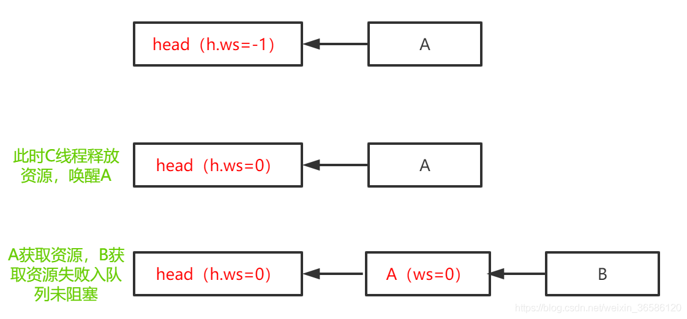
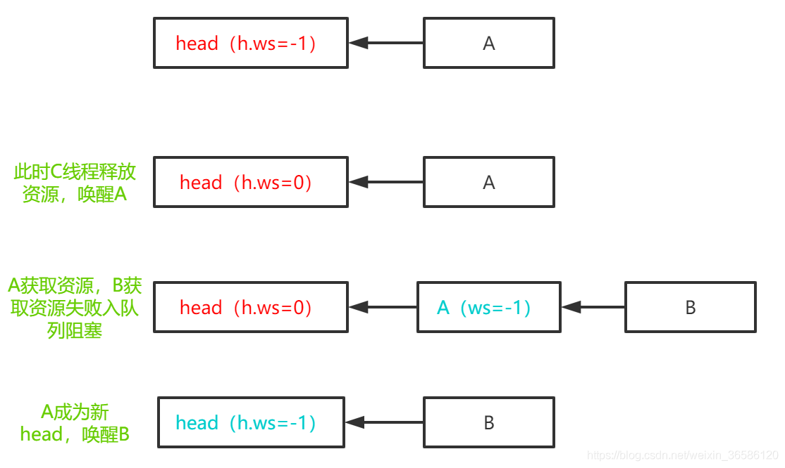
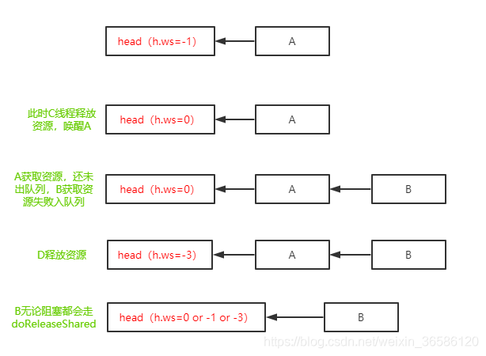
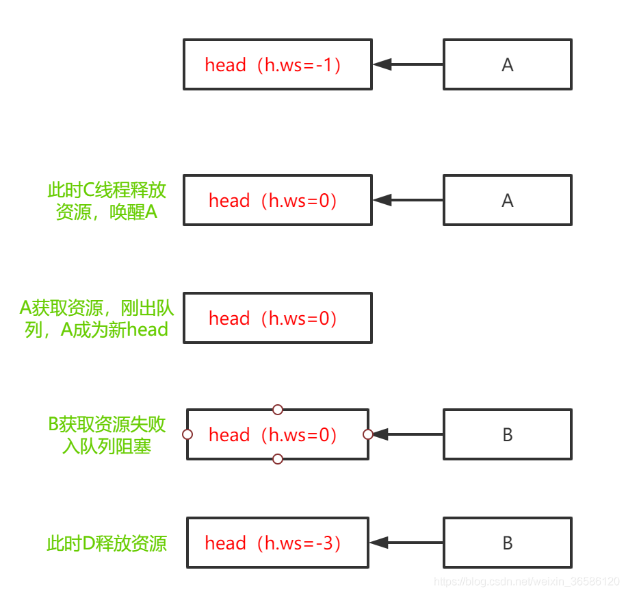

# AQS源码解读（六）——从PROPAGATE和setHeadAndPropagate()分析共享锁的传播性

## 一、前言

对于共享锁的传播性，官方给了三处英文注释，但初看不是很明白，等到真正理解了传播的意图，才豁然开朗：

>  waitStatus value to indicate the next acquireShared should unconditionally propagate.
>
> PROPAGATE 状态表示下一次获取共享锁应该无条件传播
>
> static final int PROPAGATE = -3;


> PROPAGATE: A releaseShared should be propagated to other nodes. This is set (for head node only) in doReleaseShared to ensure propagation continues, even if other operations have since intervened.
>
> 释放资源后应该传播给其他节点，在调用doReleaseShared 时只为head设置PROPAGATE状态，为了确保继续传播，即使有其他操作介入。


> The conservatism in both of these checks may cause unnecessary wake-ups, but only when there are multiple racing acquires/releases, so most need signals now or soon anyway.


## 二、共享模式和独占模式

共享锁是多个线程可以共享一把锁，如ReentrantReadWriteLock的ReadLock是共享锁，Semaphore是共享锁，CountDownLatch是共享锁，且这三个都是基于AQS实现的。与之相对的就是独占锁，ReentrantLock和ReentrantReadWriteLock的WriteLock都是独占锁，独占锁也称为互斥锁，表示一把锁只能有一个线程持有。所谓，读读共享，读写互斥，写写互斥。

在`AQS`中分别用`Node SHARED = new Node()`表示共享模式，`Node EXCLUSIVE = null`表示独占模式。

```java
static final class Node {
    /** Marker to indicate a node is waiting in shared mode */
    //共享一个节点对象
    static final Node SHARED = new Node();
    /** Marker to indicate a node is waiting in exclusive mode */
    //独占节点
    static final Node EXCLUSIVE = null;
    //condition中记录下一个节点，Lock中记录当前的node是独占node还是共享node
    Node nextWaiter;
    /**
     * Returns true if node is waiting in shared mode.
     */
    final boolean isShared() {
        return nextWaiter == SHARED;
    }
}
```

## 三、acquireShared获取共享锁

共享锁除了可以多个线程共享外，在共享节点间还具有传播性。何为传播性，先看共享锁获取锁的代码：

```java
//java.util.concurrent.locks.AbstractQueuedSynchronizer#acquireShared
public final void acquireShared(int arg) {
    //tryAcquireShared 返回-1获取锁失败，返回值大于1或者0获取锁成功
    if (tryAcquireShared(arg) < 0)
        //获取锁失败，进入队列操作
        doAcquireShared(arg);
}
```

`tryAcquireShared`在`ReentrantReadWriteLock`中的实现，返回值只有两种，1表示获取锁成功，-1表示获取锁失败。在`Semaphore`中`tryAcquireShared`的返回值代表资源剩余量，返回值大于等于0表示获取锁成功，小于0表示获取锁失败。

## 四、doAcquireShared进入同步队列操作

tryAcquireShared获取锁失败后，进入AQS同步队列操作doAcquireShared。创建共享节点node，并CAS排到队列尾部，接下来判断是应该阻塞还是继续获取锁。当node的前驱节点是head时，尝试获取锁tryAcquireShared，如果获取锁成功返回值r >= 0，则执行函数setHeadAndPropagate，这个函数就是共享锁的传播性。

````java
//java.util.concurrent.locks.AbstractQueuedSynchronizer#doAcquireShared
private void doAcquireShared(int arg) {
    //创建一个读节点，并入队列
    final Node node = addWaiter(Node.SHARED);
    boolean failed = true;
    try {
        boolean interrupted = false;
        for (;;) {
            final Node p = node.predecessor();
            if (p == head) {
                //如果前继节点是head，则尝试获取锁
                int r = tryAcquireShared(arg);
                if (r >= 0) {
                    //获取锁成功，设置新head和共享传播（唤醒后继共享节点）
                    setHeadAndPropagate(node, r);
                    p.next = null; // help GC
                    if (interrupted)
                        selfInterrupt();
                    failed = false;
                    return;
                }
            }
            /**
             * p不是头结点 or 获取锁失败，判断是否应该被阻塞
             * 前继节点的ws = SIGNAL 时应该被阻塞
             */
            if (shouldParkAfterFailedAcquire(p, node) &&
                parkAndCheckInterrupt())
                interrupted = true;
        }
    } finally {
        if (failed)
            cancelAcquire(node);
    }
}
````

## 五、setHeadAndPropagate共享锁的传播性

node获取锁成功出队，设置新head，并将共享性传播给后继节点，即唤醒后继共享节点。为什么当一个节点的线程获取共享锁后，要唤醒后继共享节点？共享锁是可以多个线程共有的，当一个节点的线程获取共享锁后，必然要通知后继共享节点的线程，也可以获取锁了，这样就不会让其他等待的线程等很久，而传播性的目的也是尽快通知其他等待的线程尽快获取锁。

````java
private void setHeadAndPropagate(Node node, int propagate) {
    Node h = head; // Record old head for check below
    //设置node为新head
    setHead(node);
    /*
     * The conservatism in both of these checks may cause
     * unnecessary wake-ups, but only when there are multiple
     * racing acquires/releases, so most need signals now or soon
     * anyway.
     */
    // propagate > 0，短路后面的判断
    if (propagate > 0 || h == null || h.waitStatus < 0 ||
        (h = head) == null || h.waitStatus < 0) {
        //唤醒后继共享节点
        Node s = node.next;
        if (s == null || s.isShared())
            doReleaseShared();
    }
}
````

`setHeadAndPropagate`中调用`doReleaseShared`前需要一连串的条件判断，大概可以分为三部分：

### 1. propagate > 0

在`ReentrantReadWriteLock`中走到`setHeadAndPropagate`，只可能是`propagate > 0`，所以后面判断旧、新`head`的逻辑就被短路了。

而在`Semaphore`中走到`setHeadAndPropagate`，`propagate`是可以等于0的，表示没有剩余资源了，故`propagate > 0`不满足，往后判断。

### 2. h == null || h.waitStatus < 0

首先判断旧head是否为`null`，一般情况下是不可能是等于null，除非旧`head`刚好被`gc`了。`h == null`不满足，继续判断`h.waitStatus < 0`，`h.waitStatus`可能等于0，可能等于-3。

* h.waitStatus=0的情况，某个线程释放了锁(release or releaseShared)或者前一个节点获取共享锁传播setHeadAndPropagate，唤醒后继节点的时候将h.waitStatus=-1设置为0。
* h.waitStatus=-3，doReleaseShared唤醒head后继节点后h.waitStatus从-1到0，还没来得及更新head，即被唤醒的共享节点还没有setHeadAndPropagate，又有其他线程doReleaseShared唤醒head后继节点h.waitStatus从0到-3。

````java
//java.util.concurrent.locks.AbstractQueuedSynchronizer#unparkSuccessor
private void unparkSuccessor(Node node) {
    
    int ws = node.waitStatus;
    if (ws < 0)
        //cas设置h.waitStatus -1 --> 0
        compareAndSetWaitStatus(node, ws, 0);
    //唤醒后继节点的线程，若为空or取消了，从tail往后遍历找到一个正常的节点
    Node s = node.next;
    if (s == null || s.waitStatus > 0) {
        s = null;
        for (Node t = tail; t != null && t != node; t = t.prev)
            if (t.waitStatus <= 0)
                s = t;
    }
    if (s != null)
        //uppark线程
        LockSupport.unpark(s.thread);
}
````

当释放共享锁or共享锁传播后会调用`doReleaseShared`唤醒同步队列中head的后继节点。

首先明确几个判断：

 

* h.waitStatus = Node.SIGNAL ，compareAndSetWaitStatus(h, Node.SIGNAL, 0))和unparkSuccessor。
* h.waitStatus = 0，compareAndSetWaitStatus(h, 0, Node.PROPAGATE)设置head为传播模式。
* h == head，head没有变，break中断循环；也可能被唤醒的节点立刻获取了锁出队列，导致head变了，所以继续循环唤醒head后继节点。

````java
//java.util.concurrent.locks.AbstractQueuedSynchronizer#doReleaseShared
private void doReleaseShared() {
    for (;;) {
        Node h = head;
        if (h != null && h != tail) {
            int ws = h.waitStatus;
            if (ws == Node.SIGNAL) {
                //SIGNAL --> 0
                if (!compareAndSetWaitStatus(h, Node.SIGNAL, 0))
                    continue;            // loop to recheck cases
                //唤醒后继节点的线程
                unparkSuccessor(h);
            }
            else if (ws == 0 &&
                    //0 --> PROPAGATE
                     !compareAndSetWaitStatus(h, 0, Node.PROPAGATE))
                continue;                // loop on failed CAS
        }
        /**
         * we must loop in case a new node is added
         * while we are doing this
         */
        if (h == head)                   // loop if head changed
            //head没有变则break
            break;
    }
}
````

### 3. (h = head) == null || h.waitStatus < 0

首先判断新head是否为空，一般情况下新head不为空，`(h = head) == null`不满足，判断`h.waitStatus < 0`，`h.waitStatus`可能等于0，可能小于0（-3 or -1）。

* h.waitStatus可能等于0的情况，后继节点刚好入队列，还没有走到shouldParkAfterFailedAcquire()中的修改前继节点waitStatus的代码。
* h.waitStatus=-3，上一个共享节点被唤醒后，成为新head，后继节点刚入队列，又有其他线程释放锁调用doReleaseShared，h.waitStatus从0改为-3。
* h.waitStatus=-1，已经调用了shouldParkAfterFailedAcquire()，h.waitStatus从0 or -3 改为-1，可能阻塞，可能未阻塞。

````java
//java.util.concurrent.locks.AbstractQueuedSynchronizer#shouldParkAfterFailedAcquire
private static boolean shouldParkAfterFailedAcquire(Node pred, Node node) {
    int ws = pred.waitStatus;
    if (ws == Node.SIGNAL)
        /*
         * This node has already set status asking a release
         * to signal it, so it can safely park.
         * node拿锁失败，前继节点的状态是SIGNAL，node节点可以放心的阻塞，
         * 因为下次会被唤醒
         */
        return true;
    if (ws > 0) {
        /*
         * Predecessor was cancelled. Skip over predecessors and
         * indicate retry.
         * pred节点被取消了，跳过pred
        do {
            node.prev = pred = pred.prev;
        } while (pred.waitStatus > 0);
        pred.next = node;
    } else {
        /* 0 -3
         * waitStatus must be 0 or PROPAGATE.  Indicate that we
         * need a signal, but don't park yet.  Caller will need to
         * retry to make sure it cannot acquire before parking.
         */
        compareAndSetWaitStatus(pred, ws, Node.SIGNAL);
    }
    return false;
}
````

## 六、举例求证共享锁传播性

接下来通过控制变量法，求证共享锁的传播性。

对于ReentrantReadWriteLock，既然走到了setHeadAndPropagate，tryAcquireShared返回值就一定大于0，即propagate > 0，所以对于ReentrantReadWriteLock，PROPAGATE只是一个中间状态值，即使没有PROPAGATE也不会影响共享锁的传播性。


而`Semaphore`具有资源的概念，走到`setHeadAndPropagate`，`tryAcquireShared`返回值代表资源剩余量，返回值可能等于0，所以需要配合状态`PROPAGATE`完成共享锁的传播性。

接下来只讨论`Semaphore`的传播情况。

（1）假设Semaphore有10个资源都被占用。A线程获取资源失败入队列阻塞。此时C释放资源，唤醒A（h.ws=-1 ---> h.ws=0）。A获取资源成功，但是没有资源了，tryAcquireShared返回0（p=0）。此时B线程获取资源失败进入队列，但是还没有阻塞（A.ws=0）。

`p>0`不满足，`h==null || h.ws < 0` 不满足，`h=head==null || h.ws < 0`不满足。都不满足，A线程执行`setHeadAndPropagate`不唤醒B线程，因为没有资源了，没必要唤醒。



（2）在（1）的基础上，当判断完3个条件后，D线程释放资源，B还没有阻塞，B也无需被D唤醒，B在阻塞前还有一次重试的机会；在D释放资源前，B已经阻塞了，就由D唤醒B。

3）在（1）的基础上，当在判断3个条件前，B已经阻塞了，`h=head==null || h.ws < 0`判断新head满足条件，A唤醒B，B可能因为没有资源而获取资源失败继续阻塞，造成了不必要的唤醒，也可能因为此时刚好有线程释放了资源，B获取资源出队列。



（4）在（1）的基础上，C唤醒A后，A获取锁成功，tryAcquireShared返回0，A还未出队列，此时B又刚好获取锁失败进入队列。此时D释放资源h.ws=0 ---> h.ws=-3。p>0不满足，h==null || h.ws < 0满足，执行doReleaseShared唤醒B。B还没有阻塞没必要唤醒，若B没有抢过其他线程而阻塞，此时唤醒B，B可能因为没有资源而获取资源失败继续阻塞，造成了不必要的唤醒，也可能因为此时刚好有线程释放了资源，B获取资源出队列。



（5）在（1）的基础上，C唤醒A后，A获取锁成功，tryAcquireShared返回0，A刚出队列，还没执行到3个判断，B获取资源失败进入队列还未阻塞。此时D释放资源，新head h.ws=0 ---> h.ws=-3，p>0不满足，h==null || h.ws < 0 不满足，h=head==null || h.ws < 0满足，执行doReleaseShared唤醒B。B还没有阻塞没必要唤醒，若B没有抢过其他线程而阻塞，此时唤醒B，B可能因为没有资源而获取资源失败继续阻塞，造成了不必要的唤醒，也可能因为此时刚好有线程释放了资源，B获取资源出队列。



假设没有状态`PROPAGATE`：

线程多次调用doReleaseShared，保持head的waitStatus为0，（4）和（5）在B没有阻塞的前提是不会继续doReleaseShared，若B线程在3个判断后阻塞，此时B就需要等下一个线程释放资源唤醒，这样有可能会导致B等待时间过长。
若多次doReleaseShared，head的waitStatus改为-1，也是不合理的，这样可能会导致B还没有阻塞直接就判断应该阻塞，丧失了重试一次的机会。

# 七、总结
* ReentrantReadWriteLock中PROPAGATE只是一个中间状态，共享锁的传播性由setHeadAndPropagate完成。

* 对于有资源概念的Semaphore，PROPAGATE和setHeadAndPropagate组合完成共享锁的传播性。

* 共享锁的传播性目的是尽快唤醒同步队列中等待的线程，使其尽快获取资源（锁），但是也有一定的副作用，可能会造成不必要的唤醒。

* PROPAGATE只设置给head的waitStatus，让head节点具有传播性。

* PROPAGATE作为中间状态的流转（h.ws=0 ---> h.ws=-3 ---> h.ws=-1）和临界判断（h.ws < 0）。

* 出现h.ws=0 ---> h.ws=-3的情况：

1. 有一线程获取共享锁后唤醒后继节点（h.ws=-1--->h.ws=0），这时有另一个线程释放了共享锁（h.ws=0--->h.ws=-3）。（ReentrantReadWriteLock和Semaphore都可能有这种情况）
2. 有一线程释放了共享锁（h.ws=-1--->h.ws=0）又有一线程释放了共享锁（h.ws=0--->h.ws=-3）。（Semaphore可能有这种情况，ReentrantReadWriteLock不可能，因为ReentrantReadWriteLock不是每次释放共享锁都会唤醒head后继节点，必须完全释放锁）

* AQS的设计，尽快唤醒其他等待线程体现在3个地方：
  1. 共享锁的传播性。
  2. doReleaseShared()中head改变，会循环唤醒head的后继节点。
  3. 线程获取锁失败后入队列并不会立刻阻塞，而是判断是否应该阻塞shouldParkAfterFailedAcquire，如果前继是head，会再给一次机会获取锁。

> 本文摘自： https://blog.csdn.net/weixin_36586120/article/details/108642253