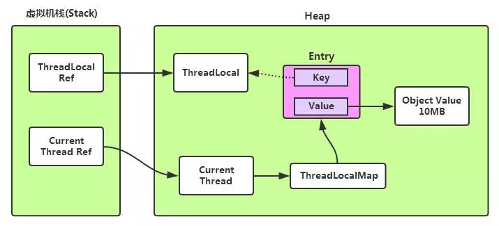

## ThreadLocal原理回顾

> 转载自：https://www.jianshu.com/p/a1cd61fa22da



ThreadLocal的原理：每个Thread内部维护着一个ThreadLocalMap，它是一个Map。这个映射表的Key是一个弱引用，其实就是ThreadLocal本身，Value是正真存的线程变量Objext。


也就是说ThreadLocal本身并不真正存储线程的变量值，它只是一个工具，用来维护Thread内部的Map，帮助存和取。注意上面的虚线，它代表一个弱引用类型，而弱引用的生命周期只能存活到下次GC前


## ThreadLocal为什么会内存泄漏

ThreadLocal在ThreadLocalMap中是以一个弱引用身份被Entry中的Key引用的，因此如果**ThreadLocal没有外部强引用**来引用它，那么ThreadLocal会在下次JVM垃圾收集时被回收。这个时候就会出现Entry中Key已经呗回收，出现一个null Key的情况，外部读取ThreadLocalMap中的元素是无法通过null Key来找到Value的。因此如果当前线程的生命周期很长，一直存在，那么其内部的ThreadLocalMap对象也一直生存下来，这些 null Key就存在一条强引用链的关系一直存在：

Thread -->  ThreadLocalMap --> Entry --> Value，这条强引用链会导致Entry不会回收，Value也不会回收，但Entry中的Key却已经被回收的情况，造成内存泄漏。


但是JVM团队已经考虑到这样的情况，并做了一些措施来保证ThreadLocal尽量不会内存泄漏：在TheadLocal的get()、set()、remove()方法调用的时候会清除掉线程ThreadLocalMap中所有Entry中Key为null的Value，并将整个Entry设置为null，利于下次内存回收。


来看看ThreadLocal的get()方法底层实现


````java

public T get() {
    Thread t = Thread.currentThread();
    ThreadLocalMap map = getMap(t);
    if (map != null) {
        ThreadLocalMap.Entry e = map.getEntry(this);
        if (e != null)
            return (T)e.value;
    }
    return setInitialValue();
}
````

在调用map.getEntry(this)时，内部会判断key是否为null，继续看map.getEntry(this)源码

````
private Entry getEntry(ThreadLocal key) {
    int i = key.threadLocalHashCode & (table.length - 1);
    Entry e = table[i];
    if (e != null && e.get() == key)
        return e;
    else
        return getEntryAfterMiss(key, i, e);
}
````


在getEntry方法中，如果Entry中的key发现时null，会继续调用getEntryAfterMiss(key,i,e)方法

其内部回做回收必要的设置，继续看内部源码：

````java
private Entry getEntryAfterMiss(ThreadLocal key, int i, Entry e) {
    Entry[] tab = table;
    int len = tab.length;

    while (e != null) {
        ThreadLocal k = e.get();
        if (k == key)
            return e;
        if (k == null)
            expungeStaleEntry(i);
        else
            i = nextIndex(i, len);
        e = tab[i];
    }
    return null;
}
````

注意 k== null 这里，继续调用expungeStaleEntry(i)，expunge的意思是

擦除，删除的意思，在来看expungeStaleEntry方法的内部实现：

````java
private int expungeStaleEntry(int staleSlot) {
    Entry[] tab = table;
    int len = tab.length;

    // expunge entry at staleSlot（意思是，删除value，设置为null便于下次回收）
    tab[staleSlot].value = null;
    tab[staleSlot] = null;
    size--;

    // Rehash until we encounter null
    Entry e;
    int i;
    for (i = nextIndex(staleSlot, len);
         (e = tab[i]) != null;
         i = nextIndex(i, len)) {
        ThreadLocal k = e.get();
        if (k == null) {
            e.value = null;
            tab[i] = null;
            size--;
        } else {
            int h = k.threadLocalHashCode & (len - 1);
            if (h != i) {
                tab[i] = null;

                // Unlike Knuth 6.4 Algorithm R, we must scan until
                // null because multiple entries could have been stale.
                while (tab[h] != null)
                    h = nextIndex(h, len);
                tab[h] = e;
            }
        }
    }
    return i;
}
````

注意这里，将当前Entry删除后，回继续循环往下检查是否有key为null的节点，如果有则一并删除，以防止内存泄漏。

但这样也并不能保证ThreadLocal不会发生内存泄漏，例如：

使用static的ThreadLocal，延长了ThreadLocal的生命周期，可能导致的内存泄漏。

分配使用了ThreadLocal又不在调用get()、set()、remove()方法，那么就会导致内存泄漏。

## 为什么使用弱引用？

从表面上看，发生内存泄漏，是因为Key使用了弱引用类型。但其实是因为整个Entry的key为null后，没有主动清楚value导致。很多文章分析了ThreadLocal使用了弱引用会导致内存泄漏，但为什么使用弱引用而不是强引用？

官方文档的说法：

> To help deal with very large and long-lived usages, the hash table entries use WeakReferences for keys.
>  为了处理非常大和生命周期非常长的线程，哈希表使用弱引用作为 key。

下面我们分两种情况讨论：

1.  key使用强引用：引用的ThreadLocal的对象被回收了，但是ThreadLocalMap还持有ThreadLocal的强引用，如果没有手动删除，TheadLocal不会被回收，导致Entry内存泄漏
2. key使用弱引用：引用的ThreadLocal的对象被回收了，由于ThreadLocalMap持有ThreadLocal的弱引用，计时没有手动删除，ThreadLocal也会被回收。value下一次ThreadLocalMap调用set，get，remove的时候会被清楚。

比较两种情况，我们可以发现：由于ThreadLocalMap的生命周期跟Thread一样，如果都没有手动删除对用key，都会导致内存泄漏，但是使用弱引用可以多一层保障：弱引用ThreadLocal不会内存泄漏，对应的value在下一次ThreadLocalMap调用set，get，remove的时候会被清除。

因此，ThreadLocal内存泄漏的根源是：由于ThreadLocalMap的生命周期跟Thread一样长，如果没有手动删除对应的key的value就会导致内存泄漏，而不是因为弱引用。

## 总结

综合上面的分析，我们可以理解ThreadLocal内存泄漏的前因后果，那么怎么避免内存泄漏呢？

* 每次使用ThreadLocal，都调用它的remove()，清楚数据。

在使用线程池的情况下，没有即使清理ThreadLocal，不仅是内存泄漏的问题，更严重的是可能导致业务逻辑出现问题。所以，使用ThreadLocal就跟加锁完要解锁一样，用完就清理。