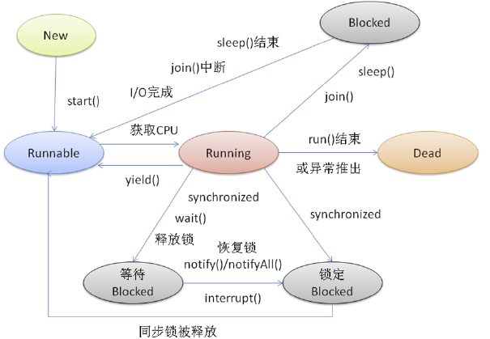
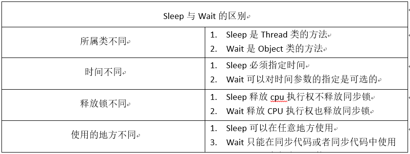

### 线程的状态

##### java线程的五种状态



* **NEW**

  当我们在使用new Thread创建一个线程后。此时JVM为其``分配内存``，并初始化其成员变量的值。此时的线程对象没有表现出任何线程的动态特征，程序也不会执行线程的线程执行体。

* **Runnable**

  当代码执行到thread.start（）方法的时候，线程就处于可运行状态。Jvm会为其创建方法调用栈，程序计数器。等到分配CPU进行调度运行。处于这个状态中的线程并没有开始运行，只是表示该线程可以运行了。至于该线程何时开始运行，取决于JVM里线程调度器的调度。

  ````
  注意：启动线程使用 start() 方法，而不是 run() 方法。调用 start()方法启动线程，系统会把该 run方法当成方法执行体处理。需要切记的是：调用了线程的 run()方法之后，该线程就不在处于新建状态，不要再次调用 start()方法，只能对新建状态的线程调用start()方法，否则会引发 IllegaIThreadStateExccption异常。
  ````

  

* **Running**

  处于可运行状态的线程失去了所占有的资源。

* **Blocked**

  当处于运行状态的线程失去了所占有的资源

* **Dead**

  程序正常完成、或者线程跑出一个未捕获的Exception或Error。或者调用线程的中断方法。

  

#### 线程状态间的转换

线程等待synchronized的隐式锁,synchronized修饰的方法、代码同一时刻只允许一个线程执行，其他线程只能等待。这个时候等待的线程就会从RUNNALBE(可运行)转换到BLOCKED(阻塞)状态。当某个等待的线程获取sunchronized隐式锁时，就会从BLOCKED转换到RUNNABLE状态。

#### RUNNABLE与WAITING的状态转换

一共有三种场景触发与这种状态的转换

* 获取synchronized锁的线程调用Object.wait()方法。会释放锁，并且放弃CPU分片调度。
* 调用Thread.join方法。假如一个线程对象A，调用A.join()，执行这条语句的线程会等待Thread A执行完，而作为等待的这个线程就会从运行中变成WAITING。比如主线程等待thread A执行完成，那么主线程就会变成等待转态。
* 调用LockSupport.park()方法。JAVA并发包的锁都是基于此实现，调用LockSupport.park()方法，释放锁。当前线程会阻塞，线程的状态会从RUNNABLE转换到WAITING。调用LockSupport.unpark(Thread thread)可唤醒目标线程，目标线程竞争到锁后状态又从WAINTTING状态转换到RUNNABLE。

#### Runnable与TIMED_WAITING的状态转换

触发场景如下所示：

* 调用带超时参数的Thread.sleep(long millis)，并不会释放锁。
* 获得synchronized隐式锁的线程，调用带超时参数的Object.await(long timeout)方法；会释放锁。
* 调用带超时参数的Thread.join(long millis)方法；
* 调用带超时参数的`LockSupport.parkNanos(Object blocker, long deadline)`方法；会释放锁。
* 调用带超时参数的`LockSupport.parkUntil(long deadline)`方法。会释放锁。

#### 从运行中到终止状态

线程执行玩run()方法后，会自动转换到终止状态，但是当运行run()方法异常的时候，也会导致线程终止，有时候我们需要中断run()方法的执行，在 Java 中 Thread 类里面倒是有个 stop()方法，不过已经标记为 @Deprecated，所以不建议使用了。正确的姿势其实是调用 interrupt()方法。

#### stop与interrupt方法的主要区别是什么呢？

stop() 方法会真的杀死线程，不给线程喘息的机会，如果线程持有 synchronized 隐式锁，也不会释放，那其他线程就再也没机会获得 synchronized 隐式锁，这实在是太危险了。所以该方法就不建议使用了，类似的方法还有 suspend() 和 resume() 方法，这两个方法同样也都不建议使用了，所以这里也就不多介绍了。

而 interrupt() 方法就温柔多了，interrupt() 方法仅仅是通知线程，线程有机会执行一些后续操作，同时也可以无视这个通知。被 interrupt 的线程，是怎么收到通知的呢？一种是异常，另一种是主动检测。

#### sleep与wait的区别

在学习sellp与wait的过程中，sleep与wait都能使线程进入阻塞状态，那么这两者之间有什么区别呢？下图给出了sleep与wait的区别图



#### 总结

理解 Java 线程的各种状态以及生命周期对于诊断多线程 Bug 非常有帮助，多线程程序很难调试，出了 Bug 基本上都是靠日志，靠线程 dump 来跟踪问题，分析线程 dump 的一个基本功就是分析线程状态，大部分的死锁、饥饿、活锁问题都需要跟踪分析线程的状态。同时，本文介绍的线程生命周期具备很强的通用性，对于学习其他语言的多线程编程也有很大的帮助。

你可以通过 `jstack`

命令或者`Java VisualVM`。

> 本章节参考自：https://juejin.im/post/6844903942485180429