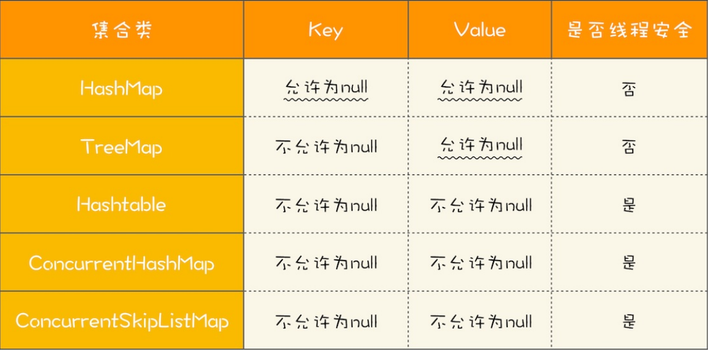
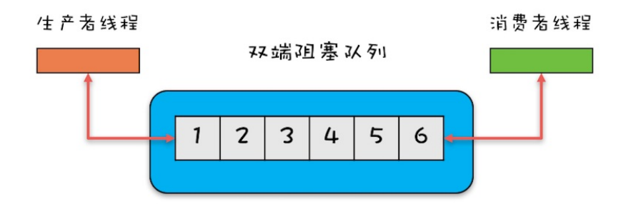

# 并发容器

Java多线程编程中，我们常常会用到jdk并发包里的容器。并发容器大致可以分为List、Map、Set、Queue四种，并发容器的关系图如下。本文将对下面几种容器的使用场景进行介绍：

## List

在List这类中，只有一个并发容器CopyOnWriteArrayList。CopyOnWriteArrayList在内部会维护一个array老时间。当我们在对该容器进行写操作的时候，容器内部会copy一份array数据。当写数据后会将array只想新的数组中。如果在遍历CopyOnWriteArrayList容器的时候，则是遍历copy动作前的数据。在read操作与write操作同时发生时，read操作是无法获取write操作添加的数据的。

CopyOnWriteArrayList**适合读多写少的场景**，不过这类慎用 ，因为谁也没法保证CopyOnWriteArrayList 到底要放置多少数据，万一数据稍微有点多，每次add/set都要重新复制数组，这个代价实在太高昂了。在高性能的互联网应用中，这种操作分分钟引起故障。

## Map

在List这类中有两个并发容器，ConcurrentHashMap与ConcurrentSkipListMap。

它们从应用的角度来 看，主要区别在于ConcurrentHashMap 的 key 是无序的，而 ConcurrentSkipListMap 的 key 是 有序的。所以如果你需要保证 key 的顺序，就只能使用 ConcurrentSkipListMap。

使用 ConcurrentHashMap 和 ConcurrentSkipListMap 需要注意的地方是，它们的 key 和 value 都不能为空，否则会抛出NullPointerException。

这个运行时异常。下面这个表格总结了 Map 相关的实现类对于 key 和 value 的要求，你可以对比 学习。

ConcurrentSkipListMap	里面的	SkipList	本身就是一种数据结构，中文一般都翻译为“跳表”。 跳表插入、删除、查询操作平均的时间复杂度是	O(log	n)，理论上和并发线程数没有关系，所以 在并发度非常高的情况下，若你对	ConcurrentHashMap	的性能还不满意，可以尝试一下 ConcurrentSkipListMap。

## Set

Set接口的两个实现是CopyOnWriteArraySet和ConcurrentSkipListSet，使用场景可以参考前面讲述的CopyOnWriteArrayList和ConcurrentSkipListMap，它们的原理都是一样的，这里就不再 赘述了。

## Queue

Java并发包里面Queue这类并发容器是最复杂的，可以从以下两个维度来分类。一个维度是 阻塞与非阻塞，所谓阻塞指的是当队列已满时，入队操作阻塞；当队列已空时，出队操作阻塞。 另一个维度是单端与双端，单端指的是只能队尾入队，队首出队；而双端指的是队首队尾皆可入队出队。Java并发包里阻塞队列都用Blocking关键字标识，单端队列使用Queue标识，双端队列使用Deque标识。

这两个维度组合后，可以将	Queue	细分为四大类，分别是：

1. 单端阻塞队列：其实现有ArrayBlockingQueue、LinkedBlockingQueue、 SynchronousQueue、LinkedTransferQueue、PriorityBlockingQueue和DelayQueue。内部一 般会持有一个队列，这个队列可以是数组（其实现是ArrayBlockingQueue）也可以是链表（其实 现是	LinkedBlockingQueue）；甚至还可以不持有队列（其实现是SynchronousQueue），此时 生产者线程的入队操作必须等待消费者线程的出队操作。而LinkedTransferQueue融合 LinkedBlockingQueue和SynchronousQueue的功能，性能比LinkedBlockingQueue更好； PriorityBlockingQueue支持按照优先级出队；DelayQueue支持延时出队。

2. 双端阻塞队列：其实现是 LinkedBlockingDeque。

3. 单端非阻塞队列：其实现是 ConcurrentLinkedQueue。

4. 双端非阻塞队列：其实现是 ConcurrentLinkedDeque。