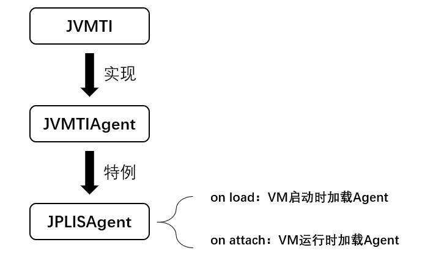

# 深入理解Instrument

> 转载自：https://www.jianshu.com/p/5c62b71fd882

# 一. 前提

很早之前就了解到目前主流的`APM`开源框架如`Pinpoint`、`SkyWalking`等等都是通过`java.lang.instrument`包提供的字节码增强功能来实现的。趁着对这块的热情还没消退，抽时间分析一下`java.lang.instrument`包的使用方式，记录下来写成一个系列的文章。本系列博文针对的是JDK11，其他版本的JDK可能不适合。

# 二. instrument简介

`java.lang.instrument`包的结构如下：


```css
java.lang.instrument
    - ClassDefinition
    - ClassFileTransformer
    - IllegalClassFormatException
    - Instrumentation
    - UnmodifiableClassException
    - UnmodifiableModuleException
```

其中，核心功能由接口`java.lang.instrument.Instrumentation`提供，这里可以通过`Instrumentation`类的API注释来理解一下什么是`instrument`：

> `Instrumentation`类提供控制Java语言程序代码的服务。`Instrumentation`可以实现在方法插入额外的字节码从而达到收集使用中的数据到指定工具的目的。由于插入的字节码是附加的，这些更变不会修改原来程序的状态或者行为。通过这种方式实现的良性工具包括监控代理、分析器、覆盖分析程序和事件日志记录程序等等。

也就是说，`java.lang.instrument`包的最大功能就是可以**在已有的类上附加（修改）字节码来实现增强的逻辑**，如果良性使用当然不会影响程序的正常行为，如果恶性使用就可能产生一些负面的影响（其实很多商用Java程序如IntelliJ IDEA的License的破解都可以基于`Instrumentation`的功能实现，前提是找到程序认证License的入口）。

# 2.1 instrument原理

`instrument`的底层实现依赖于`JVMTI`，也就是`JVM Tool Interface`，它是JVM暴露出来的一些供用户扩展的接口集合，JVMTI是基于事件驱动的，JVM每执行到一定的逻辑就会调用一些事件的回调接口（如果有的话），这些接口可以供开发者去扩展自己的逻辑。`JVMTIAgent`是一个利用JVMTI暴露出来的接口提供了代理启动时加载(`agent on load`)、代理通过attach形式加载(`agent on attach`)和代理卸载(`agent on unload`)功能的动态库。而`instrument agent`可以理解为一类JVMTIAgent动态库，别名是`JPLISAgent(Java Programming Language Instrumentation Services Agent)`，也就是专门为java语言编写的插桩服务提供支持的代理。因为涉及到源码分析，笔者暂时没能力展开，可以详细阅读参考资料中你假笨大神的那篇专门分析JVM相关源码实现的文章。



其中，VM启动时加载Agent可以使用命令行参数-javaagent:yourAgent.jar的形式实现。

# 三. Instrumentation接口详解

- `void addTransformer(ClassFileTransformer transformer, boolean canRetransform)`
   注册`ClassFileTransformer`实例，注册多个会按照注册顺序进行调用。所有的类被加载完毕之后会调用`ClassFileTransformer`实例，相当于它们通过了`redefineClasses`方法进行重定义。布尔值参数`canRetransform`决定这里被重定义的类是否能够通过`retransformClasses`方法进行回滚。
- `void addTransformer(ClassFileTransformer transformer)`
   相当于`addTransformer(transformer, false)`，也就是通过`ClassFileTransformer`实例重定义的类不能进行回滚。
- `boolean removeTransformer(ClassFileTransformer transformer)`
   移除(反注册)ClassFileTransformer实例。
- `boolean isRetransformClassesSupported()`
   返回当前JVM配置是否支持类重新转换的特性。
- `void retransformClasses(Class<?>... classes) throws UnmodifiableClassException`
   已加载类进行重新转换的方法，重新转换的类会被回调到`ClassFileTransformer`的列表中进行处理，想深入理解建议阅读API注释。
- `boolean isRedefineClassesSupported()`
   返回当前JVM配置是否支持重定义类（修改类的字节码）的特性。

```
void redefineClasses(ClassDefinition... definitions) throws ClassNotFoundException, UnmodifiableClassException
```

重定义类，也就是对已经加载的类进行重定义，ClassDefinition类型的入参包括了对应的类型Class<?>对象和字节码文件对应的字节数组。

**其他功能**：

- `boolean isModifiableClass(Class<?> theClass)`：判断对应类是否被修改过。
- `Class[] getAllLoadedClasses()`：获取所有已经被加载的类。
- `Class[] getInitiatedClasses(ClassLoader loader)`：获取所有已经被初始化过了的类。
- `long getObjectSize(Object objectToSize)`：获取某个对象的(字节)大小，注意嵌套对象或者对象中的属性引用需要另外单独计算。
- `void appendToBootstrapClassLoaderSearch(JarFile jarfile)`：将某个jar加入到Bootstrap Classpath里优先其他jar被加载。
- `void appendToSystemClassLoaderSearch(JarFile jarfile)`：将某个jar加入到Classpath里供AppClassloard去加载。
- `void setNativeMethodPrefix(ClassFileTransformer transformer, String prefix)`：设置某些native方法的前缀，主要在找native方法的时候做规则匹配。
- `boolean isNativeMethodPrefixSupported()`：是否支持设置native方法的前缀。
- `void redefineModule(...)`：重定义Module。
- `boolean isModifiableModule(Module module)`：判断指定Module是否重定义过。

# 四. 如何使用Instrumentation

`Instrumentation`类在API注释中有十分简洁的使用方式描述：

> 有两种方式可以获取Instrumentation接口的实例：
>
> 1. JVM在指定代理的方式下启动，此时Instrumentation实例会传递到代理类的premain方法。
> 2. JVM提供一种在启动之后的某个时刻启动代理的机制，此时Instrumentation实例会传递到代理类代码的agentmain方法。

首先我们知道Instrumentation的实现类是`sun.instrument.InstrumentationImpl`，在JDK9之后，由于模块权限控制，不可能通过反射构造其实例，一般情况下反射做不到的东西只能通过JVM实现。而且根据上面简洁的API注释我们是无法得知如何使用`Instrumentation`。其实，`premain`对应的就是VM启动时的`Instrument Agent`加载，也就是上文提到的`agent on load`，而`agentmain`对应的是VM运行时的`Instrument Agent`加载，也就是上文提到的`agent on attach`。两种加载形式所加载的`Instrument Agent`都关注同一个JVMTI事件 – `ClassFileLoadHook`事件，而这个事件是在读取字节码文件之后回调时用。换言之，**`premain和agentmain`方式的回调时机都是类文件字节码读取之后（或者说是类加载之后）**。

实际上，`premain`和`agentmain`两种方式最终的目的都是为了回调`Instrumentation`实例并且激活`sun.instrument.InstrumentationImpl#transform()`从而回调注册到`Instrumentation`中的`ClassFileTransformer`实现字节码修改，本质功能上没有很大区别。两者的非本质功能的区别如下：

- `premain`需要通过命令行使用外部代理jar包；而`agentmain`则可以通过`attach`机制直接附着到目标VM中加载代理，也就是使用`agentmain`方式下，操作attach的程序和被代理的程序可以是完全不同的两个程序。
- `premain`方式回调到`ClassFileTransformer`中的类是虚拟机加载的所有类，这个是由于代理加载的顺序比较靠前决定的，在开发者逻辑看来就是：所有类首次加载并且进入程序main()方法之前，`premain`方法会被激活，然后所有被加载的类都会执行`ClassFileTransformer`列表中的回调。
- `agentmain`方式由于是采用`attach`机制，被代理的目标程序VM有可能很早之前已经启动，当然其所有类已经被加载完成，这个时候需要借助`Instrumentation#retransformClasses(Class<?>... classes)`让对应的类可以重新转换，从而激活重新转换的类执行`ClassFileTransformer`列表中的回调。
- `premain`方式是JDK1.5引入的，而`agentmain`方式是JDK1.6引入的，也就是JDK1.6之后可以自行选择使用`premain`或者`agentmain`。

## 4.1 premain使用方式

`premain`方式依赖独立的`javaagent`，也就是单独建立一个项目编写好代码之后打成jar包供另一个使用程序通过代理形式引入。简单的步骤如下：

**①编写premain函数，也就是编写一个普通的Java类，包含下面两个方法的其中之一。**


```cpp
public static void premain(String agentArgs, Instrumentation inst);  [1]
public static void premain(String agentArgs); [2]
```

**②**通过指定Agent运行。


```css
java -javaagent:代理Jar包的路径 [=传入premain的参数] yourTarget.jar
```

简单例子如下：

新建一个`premain-agent`的项目，新建一个类`club.throwable.permain.PermainAgent`如下：


```csharp
public class PermainAgent {
    private static Instrumentation INST;
    public static void premain(String agentArgs, Instrumentation inst) {
        INST = inst;
        process();
    }
    private static void process() {
        INST.addTransformer(new ClassFileTransformer() {
            @Override
                        public byte[] transform(ClassLoader loader, String className,
                                                Class<?> clazz,
                                                ProtectionDomain protectionDomain,
                                                byte[] byteCode) throws IllegalClassFormatException {
                System.out.println(String.format("Process by ClassFileTransformer,target class = %s", className));
                return byteCode;
            }
        }
        );
    }
}
```

引入`Maven`插件`maven-jar-plugin`：


```xml
<plugins>
    <plugin>
        <groupId>org.apache.maven.plugins</groupId>
        <artifactId>maven-jar-plugin</artifactId>
        <version>3.1.2</version>
        <configuration>
            <archive>
                <manifestEntries>
                    <Premain-Class>club.throwable.permain.PermainAgent</Premain-Class>
                    <Can-Redefine-Classes>true</Can-Redefine-Classes>
                    <Can-Retransform-Classes>true</Can-Retransform-Classes>
                </manifestEntries>
            </archive>
        </configuration>
    </plugin>
</plugins>
```

通过`mvn package`命令打包即可得到`premain-agent.jar`（笔者发现该插件未支持JDK11，所以降级到JDK8）。接着可以使用该代理Jar：


```csharp
// 这个是样品类
public class HelloSample {
    public void sayHello(String name) {
        System.out.println(String.format("%s say hello!", name));
    }
}
// main函数，vm参数：-javaagent:I:J-Projectsinstrument-samplepremain-agenttargetpremain-agent.jar
public class PermainMain {
    public static void main(String[] args) throws Exception{
    }
}
// 输出结果
Process by ClassFileTransformer,target class = sun/nio/cs/ThreadLocalCoders
Process by ClassFileTransformer,target class = sun/nio/cs/ThreadLocalCoders$1
Process by ClassFileTransformer,target class = sun/nio/cs/ThreadLocalCoders$Cache
Process by ClassFileTransformer,target class = sun/nio/cs/ThreadLocalCoders$2
Process by ClassFileTransformer,target class = com/intellij/rt/execution/application/AppMainV2$Agent
Process by ClassFileTransformer,target class = com/intellij/rt/execution/application/AppMainV2
Process by ClassFileTransformer,target class = com/intellij/rt/execution/application/AppMainV2$1
Process by ClassFileTransformer,target class = java/lang/reflect/InvocationTargetException
Process by ClassFileTransformer,target class = java/net/InetAddress$1
Process by ClassFileTransformer,target class = java/lang/ClassValue
// ... 省略大量其他输出
```

实际上，如果我们要定制功能需要排除掉一些java.lang包和sun包的类，当然这里仅仅作为演示所以无伤大雅。

## 4.2 agentmain使用方式

`agentmain`的使用方式和`permain`十分相似，包括编写`MANIFEST.MF`和生成代理Jar包。但是，它并不需要通过-`javaagent`命令行形式引入代理Jar，而是在运行时通过attach工具激活指定代理即可。简单的步骤如下：

**①编写`premain`函数，也就是编写一个普通的Java类，包含下面两个方法的其中之一**。


```cpp
public static void agentmain(String agentArgs, Instrumentation inst);  [1]
public static void agentmain(String agentArgs); [2]
```

①的回调优先级会比②高，也就是[1]和[2]同时存在的情况下，只有①会被回调。而`agentArgs`是`agentmain`函数得到的程序参数，通过`com.sun.tools.attach.VirtualMachine#loadAgent(var1,var2)`中的var2传入，var1就是代理Jar的绝对路径。

**②代理服务打包为Jar。**

Agent一般是一个普通的Java服务，只是需要编写agentmain函数，并且该Jar包的manifest(也就是MANIFEST.MF文件)属性中需要加入Agent-Class来指定步骤1中编写好agentmain函数的那个Java类。

**③通过attach工具直接加载Agent，执行attach的程序和需要被代理的程序可以是两个完全不同的程序。**


```cpp
// 列出所有VM实例
List<VirtualMachineDescriptor> list = VirtualMachine.list();
// attach目标VM
VirtualMachine.attach(descriptor.id());
// 目标VM加载Agent
VirtualMachine#loadAgent("代理Jar路径","命令参数");
```

举个简单的例子：编写agentmain函数的类如下：


```csharp
public class AgentmainAgent {
    private static Instrumentation INST;
    public static void agentmain(String agentArgs, Instrumentation inst) {
        INST = inst;
        process();
    }
    private static void process() {
        INST.addTransformer(new ClassFileTransformer() {
            @Override
                        public byte[] transform(ClassLoader loader, String className,
                                                Class<?> clazz,
                                                ProtectionDomain protectionDomain,
                                                byte[] byteCode) throws IllegalClassFormatException {
                System.out.println(String.format("Agentmain process by ClassFileTransformer,target class = %s", className));
                return byteCode;
            }
        }
        , true);
        try {
            INST.retransformClasses(Class.forName("club.throwable.instrument.AgentTargetSample"));
        }
        catch (Exception e) {
            e.printStackTrace();
        }
    }
}
```

更改Maven插件maven-jar-plugin的配置，然后通过mvn pacakge打包：


```xml
<plugins>
    <plugin>
        <groupId>org.apache.maven.plugins</groupId>
        <artifactId>maven-jar-plugin</artifactId>
        <version>3.1.2</version>
        <configuration>
            <archive>
                <manifestEntries>
                    <!-- 主要改这个配置项 -->
                    <Agent-Class>club.throwable.permain.PermainAgent</Premain-Class> 
                    <Can-Redefine-Classes>true</Can-Redefine-Classes>
                    <Can-Retransform-Classes>true</Can-Retransform-Classes>
                </manifestEntries>
            </archive>
        </configuration>
    </plugin>
</plugins>
```

负责attach工作的程序AgentmainAttachMain：


```cpp
public class AgentmainAttachMain {
    public static void main(String[] args) throws Exception {
        List<VirtualMachineDescriptor> list = VirtualMachine.list();
        for (VirtualMachineDescriptor descriptor : list) {
            if (descriptor.displayName().endsWith("AgentTargetSample")) {
                VirtualMachine virtualMachine = VirtualMachine.attach(descriptor.id());
                virtualMachine.loadAgent("I:\J-Projects\instrument-sample\premain-agent\target\premain-agent.jar", "arg1");
                virtualMachine.detach();
            }
        }
    }
}
```

被代理的目标程序AgentTargetSample：


```csharp
public class AgentTargetSample {
    public void sayHello(String name) {
        System.out.println(String.format("%s say hello!", name));
    }
    public static void main(String[] args) throws Exception {
        AgentTargetSample sample = new AgentTargetSample();
        for (; ; ) {
            Thread.sleep(1000);
            sample.sayHello(Thread.currentThread().getName());
        }
    }
}
```

接着先启动AgentTargetSample，然后再启动AgentmainAttachMain:


```csharp
main say hello!
main say hello!
main say hello!
main say hello!
main say hello!
main say hello!
main say hello!
Agentmain process by ClassFileTransformer,target class = club/throwable/instrument/AgentTargetSample
main say hello!
main say hello!
main say hello!
```

> PS：如果没有找到`VirtualMachineDescriptor`或者`VirtualMachine`，只需要把`${JAVA_HONE}/lib/tools.jar`拷贝到`${JAVA_HONE}/jre/lib`目录下即可。

# 五. Instrumentation的局限性

大多数情况下，我们使用Instrumentation都是使用其字节码插桩的功能，或者笼统说就是类重定义(Class Redefine)的功能，但是有以下的局限性：

- premain和agentmain两种方式修改字节码的时机都是类文件加载之后，也就是说必须要带有Class类型的参数，不能通过字节码文件和自定义的类名重新定义一个本来不存在的类。
- 类的字节码修改称为类转换(Class Transform)，类转换其实最终都回归到类重定义Instrumentation#redefineClasses()方法，此方法有以下限制：
  - 新类和老类的父类必须相同。
  - 新类和老类实现的接口数也要相同，并且是相同的接口。
  - 新类和老类访问符必须一致。
  - 新类和老类字段数和字段名要一致。
  - 新类和老类新增或删除的方法必须是private static/final修饰的。
  - 可以修改方法体。

除了上面的方式，如果想要重新定义一个类，可以考虑基于**类加载器隔离**的方式：创建一个新的自定义类加载器去通过新的字节码去定义一个全新的类，不过也存在只能通过反射调用该全新类的局限性。

# 六. 小结

本文仅仅简单分析`instrument`的原理和基本使用，可以体会到`instrument`让Java具有了更强的动态控制、解释能力，从而让Java语言变得更加灵活多变。在JDK1.6之后，使用`Instrumentation`，开发者可以构建一个独立于应用程序的代理程序，用来监测和协助运行在JVM上的程序，可以远程重新转换指定JVM实例里面的已经加载的类，这一点实现从开发者角度来看就像是从JVM级别支持了AOP编程。