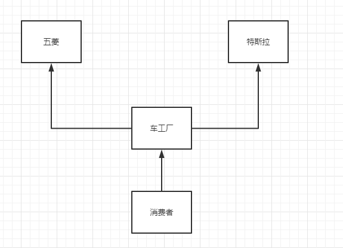
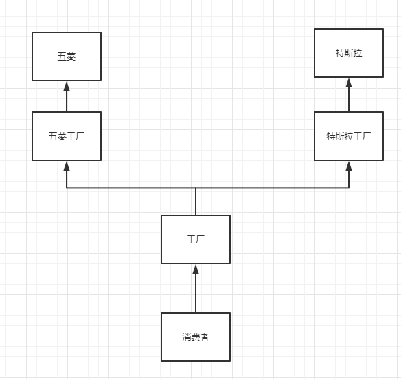
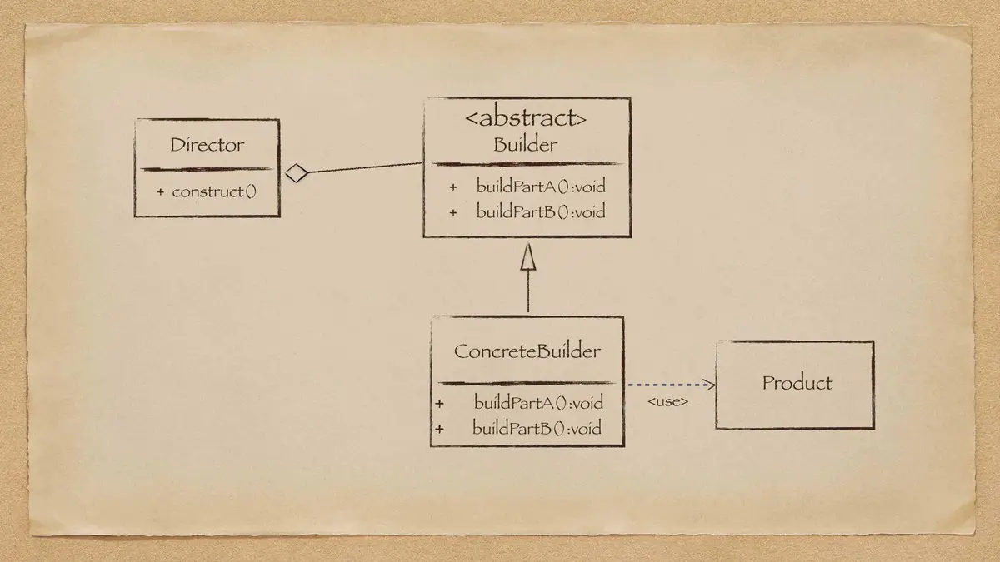

### 设计模式

#### OOP七大设计原则

**开闭原则**：对扩展开放，对修改关闭

**里氏替换原则**：继承必须确保父类所拥有的性质在子类中任然成立，不对父类方法进行重写。

**依赖倒置原则**：要面向接口编程，不要面向实现编程

**单一职责原则**：控制类的力度的大小、将对象解耦、提高其内聚性

**接口隔离原则**：要为各个类建立他们需要的专用接口

**迪米特法则**：只与你直接朋友交谈，不跟“陌生人”说话

**合成复用原则**：尽量先使用组合或者聚合等关联联系来实现，其次才考虑使用继承关系来实现


#### 工厂模式

##### 概念

* 实例化对象不使用new,用工厂方法代替
* 将选择实现类，创建对象统一管理和控制。从而将调用者跟我们的实现解耦

##### 三种工厂模式

* 简单工厂模式：用来生产同一等级结构中的任意产品（对于增加新的产品，需要覆盖已有代码）
* 工厂方法模式：用来生产同一等级结构中的固定产品（支持增加任意产品）
* 抽象工厂模式：围绕一个超级工厂创建其他工厂。该超级工厂又称为其他工厂的工程

**简单工厂模式（静态工厂模式）**



```java
public class CarFactory {

    //方法一
    public static Car getCar(String car){
        if (car.equals("五菱")){
            return new Wuling();
        }else if (car.equals("特斯拉")){
            return new Tesla();
        }else {
            return null;
        }
    }

    //方法二
    public static Car getWuling(){
        return new Wuling();
    }

    public static Car getTesla(){
        return new Tesla();
    }
}
```

从上面代码容易看出，在简单工程模式中创建实例的方式有两种。第一种就是将需要创建的不同实例写在同一个代码块中，然后通过参数来控制实例的创建。第二种方法通过为每一个实例都单独写一个静态的方法，来创建实例。简单工厂模式的好处在于创建实例的逻辑简单清晰，缺点在于如果需要添加新的实例，则需要改动简单工厂的代码块。

**工厂方法模式**



````java
public interface CarFactory {

    Car createCar();
}

public class TeslaFactory implements CarFactory{

    @Override
    public Car createCar() {
        return new Tesla();
    }
}

public class WulingFactory implements CarFactory{

    @Override
    public Car createCar() {
        return new Wuling();
    }
}
````

工厂方法模式的优点在于，它实现了工厂创建实例的解耦，每一种类的实例都有对应的工厂，这样使得代码逻辑变得更为清晰，而且也满足的开闭原则。但是工厂方法模式也使得代码变得复杂，因此在大多数情况下，使用简单工厂模式的情况更多。

**抽象工厂模式**


#### 建造者模式

当我第一次使用[Picasso](https://link.jianshu.com?t=http://square.github.io/picasso/)的时候，看见下面的官网示例时，我和我的小伙伴都惊呆了！

```java
Picasso.with(context).load("http://i.imgur.com/DvpvklR.png").into(imageView);
```

如此简洁明了的使用方式，如此灵活多变的链式调用，让我深深地迷住了，然后我一直苦苦追求它，奈何天资愚笨，不知如何掀起它的神秘面纱，直到我在网上找到了[这篇](https://link.jianshu.com?t=http://jlordiales.me/2012/12/13/the-builder-pattern-in-practice/)教程...

不好意思，中二病又犯了，重来一遍。经过不懈的努力，终于发现它就是传说中的Builder(建造者)模式，并学会了如何与它亲密相处。

**Builder模式是怎么来的**

不知道是哪位贤人曾经说过，存在即为合理。Builder模式在众多的框架以及android原生代码中存在（比如AlertDialog)，就一定有其价值，用来解决某些需求。

考虑这样一个场景，假如有一个类(****User****)，里面有很多属性，并且你希望这些类的属性都是不可变的(final)，就像下面的代码：


```java
public class User {

    private final String firstName;     // 必传参数
    private final String lastName;      // 必传参数
    private final int age;              // 可选参数
    private final String phone;         // 可选参数
    private final String address;       // 可选参数
}
```

在这个类中，有些参数是必要的，而有些参数是非必要的。就好比在注册用户时，用户的姓和名是必填的，而年龄、手机号和家庭地址等是非必需的。那么问题就来了，如何创建这个类的对象呢？

一种可行的方案就是实用构造方法。第一个构造方法只包含两个必需的参数，第二个构造方法中，增加一个可选参数，第三个构造方法中再增加一个可选参数，依次类推，直到构造方法中包含了所有的参数。


```java
    public User(String firstName, String lastName) {
        this(firstName, lastName, 0);
    }

    public User(String firstName, String lastName, int age) {
        this(firstName, lastName, age, "");
    }

    public User(String firstName, String lastName, int age, String phone) {
        this(firstName, lastName, age, phone, "");
    }

    public User(String firstName, String lastName, int age, String phone, String address) {
        this.firstName = firstName;
        this.lastName = lastName;
        this.age = age;
        this.phone = phone;
        this.address = address;
    }
```

这样做的好处只有一个：可以成功运行。但是弊端很明显：

- 参数较少的时候问题还不大，一旦参数多了，代码可读性就很差，并且难以维护。
- 对调用者来说也很麻烦。如果我只想多传一个`address`参数，还必需给`age`、`phone`设置默认值。而且调用者还会有这样的困惑：我怎么知道第四个`String`类型的参数该传`address`还是`phone`？

第二种解决办法就出现了，我们同样可以根据JavaBean的习惯，设置一个空参数的构造方法，然后为每一个属性设置`setters`和`getters`方法。就像下面一样：


```java
public class User {

    private String firstName;     // 必传参数
    private String lastName;      // 必传参数
    private int age;              // 可选参数
    private String phone;         // 可选参数
    private String address;       // 可选参数

    public User() {
    }

    public String getFirstName() {
        return firstName;
    }

    public String getLastName() {
        return lastName;
    }

    public int getAge() {
        return age;
    }

    public String getPhone() {
        return phone;
    }

    public String getAddress() {
        return address;
    }
}
```

这种方法看起来可读性不错，而且易于维护。作为调用者，创建一个空的对象，然后只需传入我感兴趣的参数。那么缺点呢？也有两点：

- 对象会产生不一致的状态。当你想要传入5个参数的时候，你必需将所有的`setXX`方法调用完成之后才行。然而一部分的调用者看到了这个对象后，以为这个对象已经创建完毕，就直接食用了，其实User对象并没有创建完成。
- ****User****类是可变的了，不可变类所有好处都不复存在。

终于轮到主角上场的时候了，利用Builder模式，我们可以解决上面的问题，代码如下：


```java
public class User {

    private final String firstName;     // 必传参数
    private final String lastName;      // 必传参数
    private final int age;              // 可选参数
    private final String phone;         // 可选参数
    private final String address;       // 可选参数

    private User(UserBuilder builder) {
        this.firstName = builder.firstName;
        this.lastName = builder.lastName;
        this.age = builder.age;
        this.phone = builder.phone;
        this.address = builder.address;
    }

    public String getFirstName() {
        return firstName;
    }

    public String getLastName() {
        return lastName;
    }

    public int getAge() {
        return age;
    }

    public String getPhone() {
        return phone;
    }

    public String getAddress() {
        return address;
    }

    public static class UserBuilder {
        private final String firstName;
        private final String lastName;
        private int age;
        private String phone;
        private String address;

        public UserBuilder(String firstName, String lastName) {
            this.firstName = firstName;
            this.lastName = lastName;
        }

        public UserBuilder age(int age) {
            this.age = age;
            return this;
        }

        public UserBuilder phone(String phone) {
            this.phone = phone;
            return this;
        }

        public UserBuilder address(String address) {
            this.address = address;
            return this;
        }

        public User build() {
            return new User(this);
        }
    }
}
```

有几个重要的地方需要强调一下：

- ****User****类的构造方法是私有的。也就是说调用者不能直接创建User对象。
- ****User****类的属性都是不可变的。所有的属性都添加了final修饰符，并且在构造方法中设置了值。并且，对外只提供`getters`方法。
- Builder模式使用了链式调用。可读性更佳。
- Builder的内部类构造方法中只接收必传的参数，并且该必传的参数适用了final修饰符。

相比于前面两种方法，Builder模式拥有其所有的优点，而没有上述方法中的缺点。客户端的代码更容易写，并且更重要的是，可读性非常好。唯一可能存在的问题就是会产生多余的Builder对象，消耗内存。然而大多数情况下我们的Builder内部类使用的是静态修饰的(static)，所以这个问题也没多大关系。

现在，让我们看看如何创建一个`User`对象呢？


```java
new User.UserBuilder("王", "小二")
                .age(20)
                .phone("123456789")
                .address("亚特兰蒂斯大陆")
                .build();
```

相当整洁，不是吗？你甚至可以用一行代码完成对象的创建。

**关于Builder的一点说明**

* 线程安全问题

由于Builder是非线程安全的，所以如果要在Builder内部类中检查一个参数的合法性，必需要在对象创建完成之后再检查。


```java
public User build() {
  User user = new user(this);
  if (user.getAge() > 120) {
    throw new IllegalStateException(“Age out of range”); // 线程安全
  }
  return user;
}
```

上面的写法是正确的，而下面的代码是非线程安全的：


```java
public User build() {
  if (age > 120) {
    throw new IllegalStateException(“Age out of range”); // 非线程安全
  }
  return new User(this);
}
```

**经典的Builder模式**

上面介绍的Builder模式当然不是“原生态”的啦，经典的Builder模式的类图如下：



builder

其中：

- Product  产品抽象类。
- Builder  抽象的Builder类。
- ConcretBuilder  具体的Builder类。
- Director  同一组装过程。

当然，之前实例中的Builder模式，是省略掉了Director的，这样结构更加简单。所以在很多框架源码中，涉及到Builder模式时，大多都不是经典GOF的Builder模式，而是省略后的。


#### 原型模式

