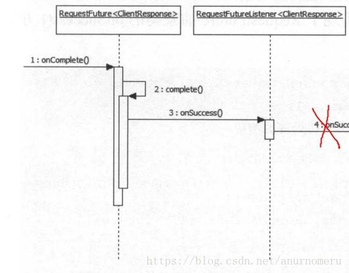
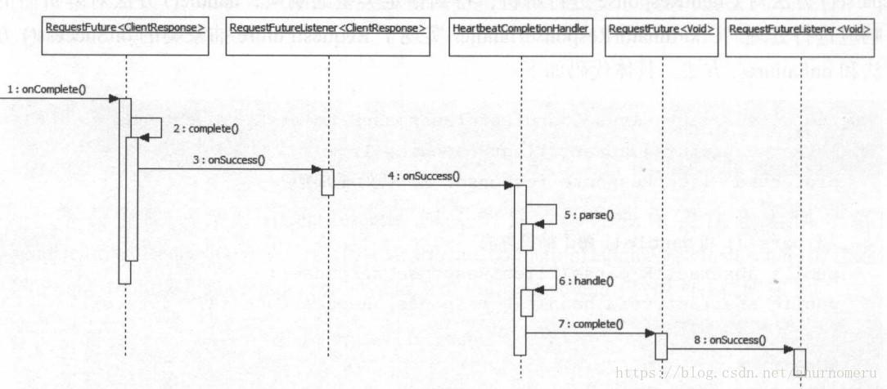

# 适配器与监听器组合

##### 1.1 从 KAFKA REQUESTFUTURE<\T> 简单看看监听器的实现

我们可以看到，在这个RequestFuture类中，有一个 addListener 方法，这个方法实际上非常简单，就是将一个RequestFutureListener<\T> 对象添加到维护的 List <\RequestFutureListener<\T>> listeners 中。

```java
public class RequestFuture<T> {

    private boolean isDone = false;

    private T value;

    private RuntimeException exception;

    private List<RequestFutureListener<T>> listeners = new ArrayList<>();

    /**
     * Check whether the response is ready to be handled
     *
     * 接收是否已经准备好处理
     *
     * @return true if the response is ready, false otherwise
     */
    public boolean isDone() {
        return isDone;
    }

    /**
     * Get the value corresponding to this request (only available if the request succeeded)
     *
     * 获取此请求对应的值(仅当请求成功)
     *
     * @return the value if it exists or null
     */
    public T value() {
        return value;
    }

    /**
     * Check if the request succeeded;
     *
     * 检查请求是否成功
     *
     * @return true if the request completed and was successful
     */
    public boolean succeeded() {
        return isDone && exception == null;
    }

    /**
     * Check if the request failed.
     *
     * 检查请求是否失败
     *
     * @return true if the request completed with a failure
     */
    public boolean failed() {
        return isDone && exception != null;
    }

    /**
     * Get the exception from a failed result (only available if the request failed)
     *
     * 获取请求失败的异常（仅失败时）
     *
     * @return The exception if it exists or null
     */
    public RuntimeException exception() {
        return exception;
    }

    /**
     * Complete the request successfully. After this call, {@link #succeeded()} will return true
     * and the value can be obtained through {@link #value()}.
     *
     * 请求成功完成。调用完这个方法后， succeeded会返回true，并且可以通过 value() 方法来获得结果
     *
     * @param value corresponding value (or null if there is none)
     */
    public void complete(T value) {
        if (isDone) {
            throw new IllegalStateException("Invalid attempt to complete a request future which is already complete");
        }
        this.value = value;
        this.isDone = true;

        // 调用 listener的onSuccess
        fireSuccess();
    }

    /**
     * Raise The request will be marked as failed, and the caller can either
     * handle the exception or throw it.
     *
     * @param e corresponding exception to be passed to caller
     */
    public void raise(RuntimeException e) {
        if (isDone) {
            throw new IllegalStateException("Invalid attempt to complete a request future which is already complete");
        }
        this.exception = e;
        this.isDone = true;

        // 调用 listener的onFail
        fireFailure();
    }

    /**
     * Raise an error. The request will be marked as failed.
     *
     * @param error corresponding error to be passed to caller
     */
    public void raise(Errors error) {
        raise(error.exception());
    }

    private void fireSuccess() {
        for (RequestFutureListener<T> listener : listeners)
            listener.onSuccess(value);
    }

    private void fireFailure() {
        for (RequestFutureListener<T> listener : listeners)
            listener.onFailure(exception);
    }

    /**
     * Add a listener which will be notified when the future completes
     */
    public void addListener(RequestFutureListener<T> listener) {
        if (isDone) {
            if (exception != null) {
                listener.onFailure(exception);
            } else {
                listener.onSuccess(value);
            }
        } else {
            this.listeners.add(listener);
        }
    }
}123456789101112131415161718192021222324252627282930313233343536373839404142434445464748495051525354555657585960616263646566676869707172737475767778798081828384858687888990919293949596979899100101102103104105106107108109110111112113114115116117118119120121122123124125126127128129130131132133134135
```

而 listener 的调用也十分简单，在listener上注册的 onSuccess 和 onFailure 会分别在 fireSuccess 和 fireFailure 时调用。

```java
    private void fireSuccess() {
        for (RequestFutureListener<T> listener : listeners)
            listener.onSuccess(value);
    }

    private void fireFailure() {
        for (RequestFutureListener<T> listener : listeners)
            listener.onFailure(exception);
    }123456789
```

而两个 fireXxxx方法，则是 complete 与 raise 时调用。

```java
    /**
     * Complete the request successfully. After this call, {@link #succeeded()} will return true
     * and the value can be obtained through {@link #value()}.
     *
     * 请求成功完成。调用完这个方法后， succeeded会返回true，并且可以通过 value() 方法来获得结果
     *
     * @param value corresponding value (or null if there is none)
     */
    public void complete(T value) {
        if (isDone) {
            throw new IllegalStateException("Invalid attempt to complete a request future which is already complete");
        }
        this.value = value;
        this.isDone = true;

        // 调用 listener的onSuccess
        fireSuccess();
    }

    /**
     * Raise The request will be marked as failed, and the caller can either
     * handle the exception or throw it.
     *
     * @param e corresponding exception to be passed to caller
     */
    public void raise(RuntimeException e) {
        if (isDone) {
            throw new IllegalStateException("Invalid attempt to complete a request future which is already complete");
        }
        this.exception = e;
        this.isDone = true;

        // 调用 listener的onFail
        fireFailure();
    }1234567891011121314151617181920212223242526272829303132333435
```

#### 1.2 简单分析监听器的工作流程

这里只说正向流程，总结一下，从compute方法开始。我们无需管是谁，通过何种方式调用了这个方法。在compute中，我们将会调用fireSuccess方法，而fireSuccess则十分简单，就是将注册过的监听器列表循环一下，分别调用其onSuccess方法。

```java
    public void complete(T value) {
        if (isDone) {
            throw new IllegalStateException("Invalid attempt to complete a request future which is already complete");
        }
        this.value = value;
        this.isDone = true;

        // 调用 listener的onSuccess
        fireSuccess();
    }
```



## 二、监听器 + 适配器组合实现强大的功能（正片）

##### 2.1 场景预设

我们先不管RequestFuture里面那个泛型ClientResponse是个什么东西，我们把它想象成一个Future，future里面是一个Json对象。

- 已知我们现有的网络请求代码，都会返回一个Future，future里面是一个Json对象。
- 新的需求进来了，我们想要返回一个Future<\Meat>，**而且Future<\Json>的请求的过程和处理的流程是它的子集**（这点很重要，我们的适配器是要基于这个前提，因为如果请求的过程和处理的流程都不一样了，那就不叫适配器了）。

假如我们原本的请求构建是这样的（伪代码，和Kafka没关系）：

```java
    public void Future request(String url, Param param)
        Future future = new Future(param);
        future.addListener(new Listener() {

            @Override
            public void onSuccess(Json json) {
                check(json);
            }

            @Override
            public void onFailure() {
                xxxxx;
            }
        });// 验证返回是否有效

        future.addListener(new Listener() {

            @Override
            public void onSuccess(Json json) {
                console(json);
            }

            @Override
            public void onFailure() {
                xxxxx;
            }
        });// 打印日志

        future.addListener(new Listener() {

            @Override
            public void onSuccess(Json json) {
                persist(json);
            }

            @Override
            public void onFailure() {
                xxxxx;
            }
        });// 记录请求信息以进行统计

        xxxxx......// 更多处理

        sendRequest(url, future).fetch(() -> {
            void success(Json json){
                future.complete(json);
            }
        });// 异步发送请求

        return future;
    }

............................

    Json json = future.value();// 获取请求结果12345678910111213141516171819202122232425262728293031323334353637383940414243444546474849505152535455
```

我们当然可以为新的Future<\Meat> **写一个新的sendRequest方法，同时也要为它写一个request方法。**
我们首先为Future对象新增泛型（当然也可以直接用一个新的对象），然后为其单独写一套request方法与sendRequest（这里就不详细写了）方法。

```java
    public void Future<Meat> request4Meat(String url, Param param)
        Future<Meat> future = new Future<>(param);
        future.addListener(new Listener<Meat>() {

            @Override
            public void onSuccess(Meat meat) {
                check(meat);// 原future里的验证返回是否有效，重载的方法
                checkMeat(meat);// 进一步校验（比如说check只是校验返回的格式对不对，而checkMeat
                                // 要校验肉是否新鲜，是前腿肉还是五花肉等等）
            }

            @Override
            public void onFailure() {
                xxxxx;
            }
        });// 验证返回是否有效

        future.addListener(new Listener<Meat>() {

            @Override
            public void onSuccess(Meat meat) {
                console(meat);// 日常输出
                consoleMeat();// 和肉有关的输出
            }

            @Override
            public void onFailure() {
                xxxxx;
            }
        });// 打印日志

        future.addListener(new Listener<Meat>() {

            @Override
            public void onSuccess(Meat meat) {
                persist(meat);// 记录普通的请求信息，比如请求发起时间，结束时间，请求了哪一个url等等
                persistMeat(meat);// 记录肉质，肉的来源，哪里生产的等等，和肉相关的信息
            }

            @Override
            public void onFailure() {
                xxxxx;
            }
        });// 记录请求信息以进行统计

        xxxxx......// 更多处理


        sendRequestMeat(url, future).fetch(() -> {
            void success(Meat meat){
                future.complete(meat);
            }
        });// 异步发送请求，我们这里还要将返回来的对象封装成Meat对象，而不再是Json对象。

        return future;
    }

............................

    Meat meat = future.value();// 获取请求结果123456789101112131415161718192021222324252627282930313233343536373839404142434445464748495051525354555657585960
```

##### 2.2 场景解释

在这个例子中，很明显的特点就是：Future<\Json>的请求的过程和处理的流程是Future<\Meat>的子集。

如果每一个新的Future我们都为其写一套代码，不仅仅会造成代码的臃肿。另外，如果传输的方式改变了，比如我想将tcp请求改成socket请求，那么所有的Future都必须修改。

##### 所以适配器要为我们解决什么问题呢？

**之前看到一篇文章里很好的解释（忘了在哪里看到的，对不起原作者），我们要取一个快递，无论是我们让快递小哥哥放在门口，还是我们自己去拿，还是放在快递柜，首先都有一个快递从发货人开始发货，然后交给快递小哥的这个过程。中途的无论什么处理，比如说快递丢失处理，快递被烧了，还是快递正常送达派件中心。这些操作都是相同的，我们完全没有必要为了要使用快递柜去接收而重写一套完整的逻辑。**

除了上面的大白话，这里引用其他博客对适配器模式的解释：

适配器模式（Adapter Pattern）是作为两个不兼容的接口之间的桥梁。这种类型的设计模式属于结构型模式，它结合了两个独立接口的功能。这种模式涉及到一个单一的类，该类负责加入独立的或不兼容的接口功能。举个真实的例子，读卡器是作为内存卡和笔记本之间的适配器。您将内存卡插入读卡器，再将读卡器插入笔记本，这样就可以通过笔记本来读取内存卡。主要解决在软件系统中，常常要将一些”现存的对象”放到新的环境中，而新环境要求的接口是现对象不能满足的。

大话设计模式中程杰老师给出的定义是，适配器模式：将一个类的接口转换成客户希望的另外一个接口。适配器模式使得原本由于接口不兼容而不能一起工作的那些类可以一起工作。

系统数据和行为都正确，但接口不符合时，我们应该考虑用适配器，目的是使控制范围之外的一个原有对象与某个接口匹配。

[来自CSDN，May的博客](https://blog.csdn.net/lmb55/article/details/51008762)

##### 2.3 加入适配器

于是我们引入

```java
public abstract class RequestFutureAdapter<F, T> {

    public abstract void onSuccess(F value, RequestFuture<T> future);

    public void onFailure(RuntimeException e, RequestFuture<T> future) {
        future.raise(e);
    }
}12345678
```

Kafka在RequestFuture中加入了适配方法，这个适配方法十分简单，实际上就是new了一个新的Future对象，然后在原来的future对象在success时调用适配器中，的onSuccess方法。

```java
public <S> RequestFuture<S> compose(final RequestFutureAdapter<T, S> adapter) {
        final RequestFuture<S> adapted = new RequestFuture<S>();
        addListener(new RequestFutureListener<T>() {

            // 实际上这里就是让原来的 future 在succeed 时，会调用 adapter 中的 onSuccess 方法
            @Override
            public void onSuccess(T value) {
                adapter.onSuccess(value, adapted);
            }

            @Override
            public void onFailure(RuntimeException e) {
                adapter.onFailure(e, adapted);
            }
        });

        // 返回的这个新的 future 对象
        return adapted;
    }12345678910111213141516171819
```

在结合上面说的快递过程，我们可以这么做：

```java
    RequestFuture<快递柜> future = request(url, param).compose(new RequestFutureAdapter<Json, 快递柜>() {
            @Override
            public void onSuccess(Json json, RequestFuture<快递柜> future) {
                快递柜 k = json.parse();// 将json（快递）对象转换为快递柜对象，也就是扔到快递柜中
                if (k.check()){// 如果扔到快递柜中的校验都没问题
                    future.complete(k);// 没问题的话，可以通知我们新的RequestFuture<快递柜>对象正常了
                } else {
                    future.raise(new 快递柜Exception);
                }
            }

            // 失败的就不写了，这可能是快递在路上出问题了，快递都没到快递小哥哥手上
        });12345678910111213
```

然后我们可以在新的 RequestFuture<快递柜> 上添加一些和快递柜相关的操作。比如说，

```java
    future.addListener(new Listener<快递柜>() {

            @Override
            public void onSuccess(快递柜 快递柜对象) {
                sendSucceededMsg(快递柜对象.getPhoneNum);// 告诉我快递到快递柜了
            }

            @Override
            public void onFailure() {
                sout(e)// 由于某种原因失败，比如说快递柜满了。
            }
        });
12345678910111213
```

甚至可以这样：

```java
        RequestFuture<拿快递>futureN（快递柜future）.compose(new RequestFutureAdapter<快递柜, 拿快递>() {
            @Override
            public void onSuccess(快递柜 快递柜对象, RequestFuture<拿快递> future) {
                拿快递 n = 快递柜对象.parse();
                if (n.check()){// 我们来拿快递了
                    future.complete(n);// 成功取走了快递
                } else {
                    future.raise(new 滞留Exception);
                }
            }

            // 失败的就不写了
        });

        futureN.addListener(xxxx);
        // xxxx，成功拿了快递后，要拆快递，等等。
        // 如果滞留了，要怎么处理等等1234567891011121314151617
```

##### 2.4 为什么要使用适配器？

首先，不使用适配器的情况下，我们当然可以在原有的future上，通过添加监听器，接着分支判断的方式，来实现上述功能，不过比较恶心。

适配器 + 监听器 的模式，可以发现，我们不仅将一种对象适配成了另一种对象。而且适配前的状态，和适配后Future的状态，是隔离的。我们通过适配器，将他们的状态进行了隔离。前面Future对象的success，并不代表适配后的对象就是success的。

比如说，快递success抵达了配送中心，可能会在第一个适配器，也就是快递转快递柜适配器中被发现，这个快递无法经过check。比如快递太大了，根本放不进快递柜。

这时候就会在快递柜适配器中，唤醒raise操作，而不会调用complete方法，也就是不会通知我来拿快递，间接也不会在第二个适配器中，出现我去快递柜拿快递这种操作了。在这种情况下，就会调用Future<快递柜>的所有 onFailure方法，比如通知快递小哥，快递放不下；通知我们，无法使用快递柜寄存这种方式进行取快递，需要自己来拿等等。

##### 2.5 简单说说KAFKA中的应用



kafka在心跳处理中，首先拿到正常的clientResponse请求，将clientResponse转换成了心跳对象（实际上就是 errorCode = struct.getShort(ERROR_CODE_KEY_NAME);），将clientResponse中struct（可以看作是包体）的errorCode取出。

最后根据errorCode来判断是否要重新加入消费组，协调器是否挂了等等。

紧接着

```java
    /**
     * 这个适配器并没有做什么特殊的逻辑处理，只是判断请求成功或者失败（失败的各种类型）来进行各种补偿操作，
     * 比如重新加入消费组之类的。
     */
    private class HeartbeatCompletionHandler extends CoordinatorResponseHandler<HeartbeatResponse/* 从这个 */, Void/* 到这个 */> {

        // 原 client.send(coordinator, ApiKeys.HEARTBEAT, req) 会返回的对象。
        protected ClientResponse response;

        @Override
        public void onSuccess(ClientResponse clientResponse, RequestFuture<Void> future) {
            // 让我们看看在成功时都做了什么
            try {
                this.response = clientResponse;
                // 将clientResponse解析为心跳包 HeartbeatResponse
                HeartbeatResponse responseObj = parse(clientResponse);

                // 处理心跳包
                handle(responseObj, future);
            } catch (RuntimeException e) {
                if (!future.isDone()) {
                    future.raise(e);
                }
            }
        }

        @Override
        public void onFailure(RuntimeException e, RequestFuture<Void> future) {
            // mark the coordinator as dead
            if (e instanceof DisconnectException) {
                coordinatorDead();
            }
            future.raise(e);
        }

        @Override
        public HeartbeatResponse parse(ClientResponse response) {
            // 提取返回的body （Struct对象），new一个HeartbeatResponse
            return new HeartbeatResponse(response.responseBody());
        }

        @Override
        public void handle(HeartbeatResponse heartbeatResponse, RequestFuture<Void> future) {
            sensors.heartbeatLatency.record(response.requestLatencyMs());

            // 将heartbeatResponse中short类型的 errCode 转为 Error对象
            Errors error = Errors.forCode(heartbeatResponse.errorCode());
            if (error == Errors.NONE) {
                log.debug("Received successful heartbeat response for group {}", groupId);

                // 没报错，直接将这个引用置为成功，成功后会调用 RequestFuture<Void> future 的 onSuccess方法
                future.complete(null);
            } else if (error == Errors.GROUP_COORDINATOR_NOT_AVAILABLE// 组协调器不可用
                || error == Errors.NOT_COORDINATOR_FOR_GROUP) {// 没有协调器
                log.debug("Attempt to heart beat failed for group {} since coordinator {} is either not started or not valid.",
                    groupId, coordinator);
                coordinatorDead();// 标记协调器挂了
                future.raise(error);
            } else if (error == Errors.REBALANCE_IN_PROGRESS) {// 当前组在重负载，所以需要重加入
                log.debug("Attempt to heart beat failed for group {} since it is rebalancing.", groupId);
                // 表示需要重新join
                AbstractCoordinator.this.rejoinNeeded = true;// 表示当前协调器需要重加入
                future.raise(Errors.REBALANCE_IN_PROGRESS);
            } else if (error == Errors.ILLEGAL_GENERATION) {// 世代错误
                log.debug("Attempt to heart beat failed for group {} since generation id is not legal.", groupId);
                // 表示需要重新join
                AbstractCoordinator.this.rejoinNeeded = true;// 表示当前协调器需要重加入
                future.raise(Errors.ILLEGAL_GENERATION);
            } else if (error == Errors.UNKNOWN_MEMBER_ID) {// 协调器不认识这个成员
                log.debug("Attempt to heart beat failed for group {} since member id is not valid.", groupId);
                memberId = JoinGroupRequest.UNKNOWN_MEMBER_ID;
                // 表示需要重新join
                AbstractCoordinator.this.rejoinNeeded = true;// 表示当前协调器需要重加入
                future.raise(Errors.UNKNOWN_MEMBER_ID);
            } else if (error == Errors.GROUP_AUTHORIZATION_FAILED) {// 组认证失败
                future.raise(new GroupAuthorizationException(groupId));
            } else {
                future.raise(new KafkaException("Unexpected error in heartbeat response: " + error.message()));
            }
        }
    }
```

> 本文摘自： https://www.freesion.com/article/695330598/