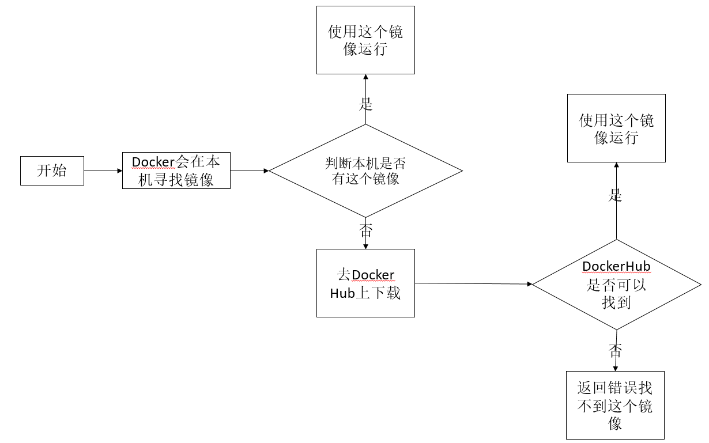
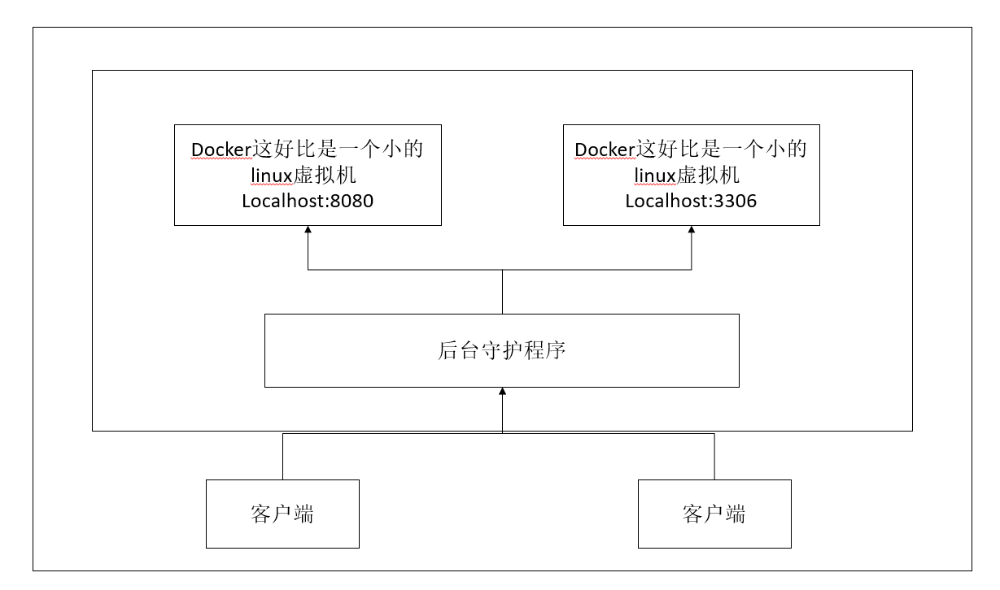
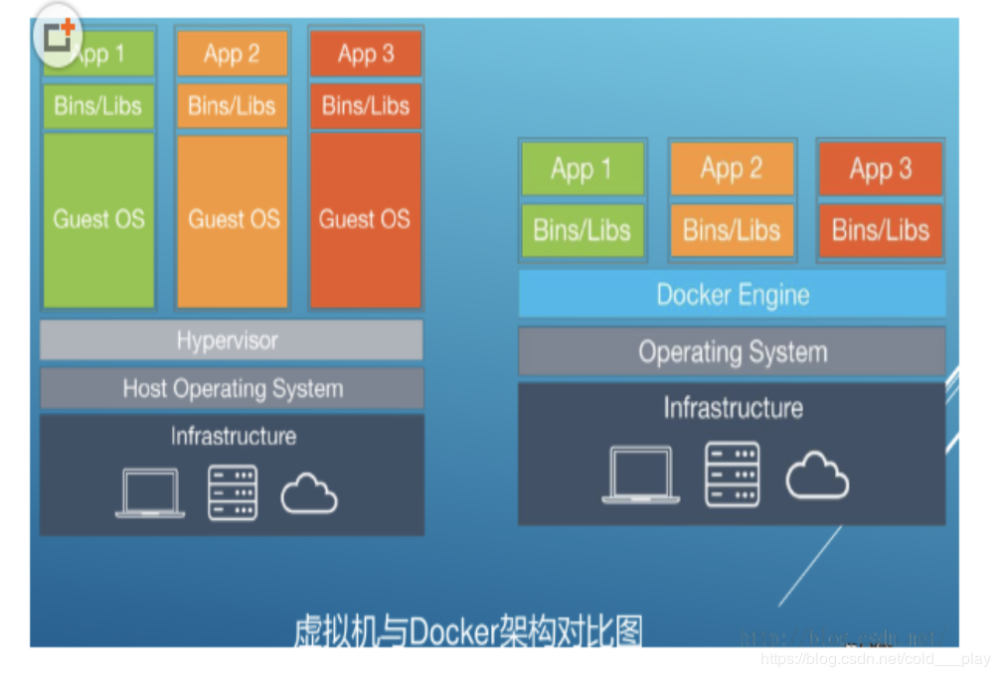
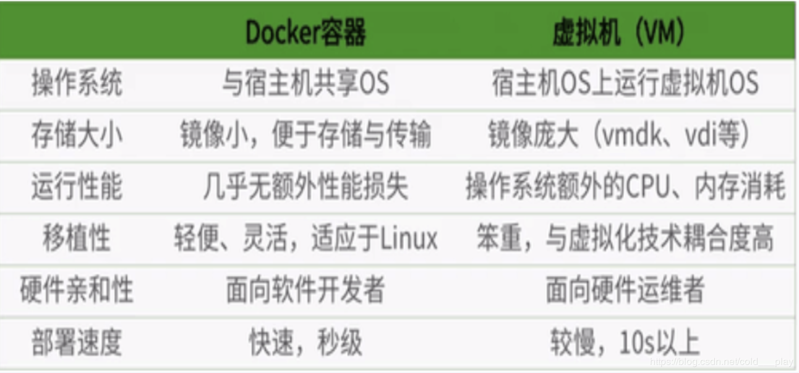

### docker安装

#### 卸载旧的版本

````shell
$ sudo yum remove docker \
                  docker-client \
                  docker-client-latest \
                  docker-common \
                  docker-latest \
                  docker-latest-logrotate \
                  docker-logrotate \
                  docker-engine
````

### 需要的安装包

````shell
sudo yum install -y yum-utils
````


#### 设置镜像的仓库

````shell
$ sudo yum-config-manager \
    --add-repo \
    https://download.docker.com/linux/centos/docker-ce.repo   #默认是国外的镜像
    
     yum-config-manager \
     --add-repo \
     http://mirrors.aliyun.com/docker-ce/linux/centos/docker-ce.repo  #推荐使用阿里云的，速度快
     
     
     #================================================
     # 创建或修改 /etc/docker/daemon.json 文件，修改为如下形式
     
{
    "registry-mirrors" : [
    "https://registry.docker-cn.com",
    "https://docker.mirrors.ustc.edu.cn",
    "http://hub-mirror.c.163.com",
    "https://cr.console.aliyun.com/"
  ]
}
# 重启docker服务使配置生效
$ systemctl restart docker.service

````

#### 更新yum

````shell
yum makecache fast
````


#### 安装docker

````shell
#	docker-ce 社区办  ee社区版
$ sudo yum install docker-ce docker-ce-cli containerd.io
````

#### 启动docker

````shell
$ sudo systemctl start docker
$ sudo  docker version   # 验证docker是否启动
````

输出结果

````
Client: Docker Engine - Community
 Version:           19.03.12
 API version:       1.40
 Go version:        go1.13.10
 Git commit:        48a66213fe
 Built:             Mon Jun 22 15:46:54 2020
 OS/Arch:           linux/amd64
 Experimental:      false

Server: Docker Engine - Community
 Engine:
  Version:          19.03.12
  API version:      1.40 (minimum version 1.12)
  Go version:       go1.13.10
  Git commit:       48a66213fe
  Built:            Mon Jun 22 15:45:28 2020
  OS/Arch:          linux/amd64
  Experimental:     false
 containerd:
  Version:          1.2.13
  GitCommit:        7ad184331fa3e55e52b890ea95e65ba581ae3429
 runc:
  Version:          1.0.0-rc10
  GitCommit:        dc9208a3303feef5b3839f4323d9beb36df0a9dd
 docker-init:
  Version:          0.18.0
  GitCommit:        fec3683
````

#### 测试hello world

````shell
$ sudo docker run hello-world
````

控制台输出为

````
Unable to find image 'hello-world:latest' locally

latest: Pulling from library/hello-world
0e03bdcc26d7: Already exists 
Digest: sha256:49a1c8800c94df04e9658809b006fd8a686cab8028d33cfba2cc049724254202
Status: Downloaded newer image for hello-world:latest

Hello from Docker!
This message shows that your installation appears to be working correctly.

To generate this message, Docker took the following steps:
 1. The Docker client contacted the Docker daemon.
 2. The Docker daemon pulled the "hello-world" image from the Docker Hub.
    (amd64)
 3. The Docker daemon created a new container from that image which runs the
    executable that produces the output you are currently reading.
 4. The Docker daemon streamed that output to the Docker client, which sent it
    to your terminal.

To try something more ambitious, you can run an Ubuntu container with:
 $ docker run -it ubuntu bash

Share images, automate workflows, and more with a free Docker ID:
 https://hub.docker.com/

For more examples and ideas, visit:
 https://docs.docker.com/get-started/
````

#### 重启docker

````shell
$ sudo system restart docker
````

#### 移除docker

1.  卸载docker引擎，客户以及容器包等等

   ```shell
   $ sudo yum remove docker-ce docker-ce-cli containerd.io
   ```

2. 不会自动删除主机上的映像、容器、卷或自定义配置文件。删除所有图像、容器和卷(删除资源)。

   ```shell
   $ sudo rm -rf /var/lib/docker
   ```

###  Docker工作原理

#### docker 工作流程



#### docker是怎么工作的呢？

Docker是一个Client + Server结构的系统，Docker的守护进程运行在主机上。通过Socket从客户端访问！

DockerServer接收到Docker + Client的指令，就会执行这个命令！



#### Docker为什么会比VM快

1. docker有着比虚拟机更少的抽象层。由亍docker不需要Hypervisor实现硬件资源虚拟化,运行在docker容器上的程序直接使用的都是实际物理机的硬件资源。因此在CPU、内存利用率上docker将会在效率上有明显优势。
2. docker利用的是宿主机的内核,而不需要Guest OS。因此,当新建一个容器时,docker不需要和虚拟机一样重新加载一个操作系统内核。仍而避免引寻、加载操作系统内核返个比较费时费资源的过程,当新建一个虚拟机时,虚拟机软件需要加载Guest OS,返个新建过程是分钟级别的。而docker由于直接利用宿主机的操作系统,则省略了返个过程,因此新建一个docker容器只需要几秒钟。





### Docker常用命令

#### 帮助命令

````shell
docker version   # 显示docker版本信息
docker info      # 显示docker的系统信息，包括镜像和容器的数量
docker --help    # 帮助命令
````

**docker 文档地址： **https://docs.docker.com/reference/

#### 镜像命令

````shell
[root@localhost ~]# docker images
REPOSITORY          TAG                 IMAGE ID            CREATED             SIZE
hello-world         latest              bf756fb1ae65        7 months ago        13.3kB

# 解释
REPOSITORY 镜像的仓库源
Tag  镜像的标签
IMAGE ID 镜像的ID
CREATED  镜像的创建时间
SIZE     镜像的大小

# 可选项

  -a, --all             Show all images (default hides intermediate images)
      --digests         Show digests
  -f, --filter filter   Filter output based on conditions provided
      --format string   Pretty-print images using a Go template
      --no-trunc        Don't truncate output
  -q, --quiet           Only show numeric IDs
````


#### Docker 搜索命令

````shell
[root@localhost ~]# docker search mysql
NAME                              DESCRIPTION                                     STARS               OFFICIAL            AUTOMATED
mysql                             MySQL is a widely used, open-source relation…   9804                [OK]                
mariadb                           MariaDB is a community-developed fork of MyS…   3579                [OK]                
mysql/mysql-server                Optimized MySQL Server Docker images. Create…   719                                     [OK]
percona                           Percona Server is a fork of the MySQL relati…   499                 [OK]                
# 可选项

Options:
  -f, --filter filter   Filter output based on conditions provided
      --format string   Pretty-print search using a Go template
      --limit int       Max number of search results (default 25)
      --no-trunc        Don't truncate output

````

####  Docker 下载镜像

````shell
[root@localhost ~]# docker pull mysql         #下载命令
Using default tag: latest                     #默认不写tag，某人就是latest
latest: Pulling from library/mysql	
bf5952930446: Pull complete                   #分成下载，docker image的核心 联合文件下载
8254623a9871: Pull complete 
938e3e06dac4: Pull complete 
ea28ebf28884: Pull complete 
f3cef38785c2: Pull complete 
894f9792565a: Pull complete 
1d8a57523420: Pull complete 
6c676912929f: Pull complete 
ff39fdb566b4: Pull complete 
fff872988aba: Pull complete 
4d34e365ae68: Pull complete 
7886ee20621e: Pull complete 
Digest: sha256:c358e72e100ab493a0304bda35e6f239db2ec8c9bb836d8a427ac34307d074ed  #签名
Status: Downloaded newer image for mysql:latest  
docker.io/library/mysql:latest                 #真是地址

#上面的下载命令等价于下面
[root@localhost ~]# docker pull docker.io/library/mysql:latest 

#指定版本下载
[root@localhost ~]# docker pull mysql:5.7
````


#### Docker 删除镜像

````shell
[root@localhost ~]# docker rmi 容器id    #删除指定容器
[root@localhost ~]# docker rmi -f 容器id  容器id  容器id
[root@localhost ~]# docker rmi -f(docker images -aq)  #删除全部容器
````


#### Docker容器命令

**说明：有镜像才能创建容器**

新建容器并启动

````
docker pull centos
[root@localhost ~]# docker run --it centos /bin/bash
unknown flag: --it
See 'docker run --help'.
[root@localhost ~]# docker run -it centos /bin/bash
WARNING: IPv4 forwarding is disabled. Networking will not work.
[root@188a6161c622 /]# 
````

**运行镜像命令**

````shell
docker run [可选参数] image

# 参数说明
--name="Name"  容器的名字
-d             后台方式运行
-it            使用交互方式运行，进入容器查看内容
-p             指定容器的端口
  ip:主机端口：容器端口
  主机端口：容器端口
  容器端口
-P             随机容器端口
````

**退出镜像命令**

````shell
# exit

[root@localhost ~]# docker run -it centos /bin/bash
WARNING: IPv4 forwarding is disabled. Networking will not work.
[root@188a6161c622 /]# 
[root@188a6161c622 /]# 
[root@188a6161c622 /]# ls
bin  dev  etc  home  lib  lib64  lost+found  media  mnt  opt  proc  root  run  sbin  srv  sys  tmp  usr  var
[root@188a6161c622 /]# 
[root@188a6161c622 /]# cd /home/
[root@188a6161c622 home]# ls
[root@188a6161c622 home]# cd ..
[root@188a6161c622 /]# 
[root@188a6161c622 /]# exit
exit
[root@localhost ~]#

[参数说明]
exit # 停止并退出容器
ctrp + P + Q #退出容器但不停止容器
````

**查看运行的容器**

````shell
[root@localhost ~]# docker ps
CONTAINER ID        IMAGE               COMMAND             CREATED             STATUS              PORTS               NAMES
[root@localhost ~]# docker ps -a
CONTAINER ID        IMAGE               COMMAND             CREATED             STATUS                     PORTS               NAMES
188a6161c622        centos              "/bin/bash"         4 minutes ago       Exited (0) 2 minutes ago                       condescending_cartwright
a5dc0f930239        hello-world         "/hello"            6 days ago          Exited (0) 6 days ago                          loving_galois
[root@localhost ~]# 

docker ps查看正在运行的容器
[参数说明]
-a  查看运行过的容器 
-n=?  显示最近常见的容器
````


**删除容器**

````
docker rm 容器id                   #删除指定的容器
docker rm -f ${docker ps -aq}     #删除所有的容器
docker ps -a -q|xargs dorcker -rm

docker rm  删除容器
[参数说明]
-f 强制删除容器
````

**启动和停止的操作**

````
docker start 容器id         #启动容器
docker restart 容器id       #重启容器
docker stop 容器id          #停止当前正在运行的容器
docker kill 容器id          #强制停止容器
````

#### 常用其他命令

​	**后台启动容器**

````shell
# 命令 docker run -d 镜像名！
[root@localhost ~]# docker run -d centos
WARNING: IPv4 forwarding is disabled. Networking will not work.
0bf34845e80743effd78830ecccfd5f692946353f76294ebc39e252a1c8dd795
[root@localhost ~]# docker ps
CONTAINER ID        IMAGE               COMMAND             CREATED             STATUS              PORTS               NAMES
[root@localhost ~]# 

[问题] 在docker没有启动centos的情况下，用 docker run -d centos去启动centos容器，发现centos容器并没有启动起来。
【原因】docker容器使用后台运行，就必须要一个前台进程，docker发现没有应用，就会自动停止。（运行了一个空的mian()方法？）
````


**查看日志**

````shell
# docker logs
docker logs -tf  --tail 10 404cc7e9b2fd
````


**查看容器中的进程信息**

````shell
docker top  [容器id]
````

**查看容器的元信息**

````shell
docker inspect [容器id]

[root@localhost ~]# docker inspect  d4c5303f1540
[
    {
        "Id": "d4c5303f1540f9b5b9004a2017e0999fe3282900abaf700ce4fa36ebcdc000b2",
        "Created": "2020-08-09T09:03:20.461736094Z",
        "Path": "/bin/sh",
        "Args": [
            "-c",
            "while true;do echo wuheng;sleep 1;done"
        ],
        "State": {
            "Status": "running",
            "Running": true,
            "Paused": false,
            "Restarting": false,
            "OOMKilled": false,
            "Dead": false,
            "Pid": 18662,
            "ExitCode": 0,
            "Error": "",
            "StartedAt": "2020-08-09T09:03:20.774201637Z",
            "FinishedAt": "0001-01-01T00:00:00Z"
        },
        "Image": "sha256:831691599b88ad6cc2a4abbd0e89661a121aff14cfa289ad840fd3946f274f1f",
        "ResolvConfPath": "/var/lib/docker/containers/d4c5303f1540f9b5b9004a2017e0999fe3282900abaf700ce4fa36ebcdc000b2/resolv.conf",
        "HostnamePath": "/var/lib/docker/containers/d4c5303f1540f9b5b9004a2017e0999fe3282900abaf700ce4fa36ebcdc000b2/hostname",
        "HostsPath": "/var/lib/docker/containers/d4c5303f1540f9b5b9004a2017e0999fe3282900abaf700ce4fa36ebcdc000b2/hosts",
        "LogPath": "/var/lib/docker/containers/d4c5303f1540f9b5b9004a2017e0999fe3282900abaf700ce4fa36ebcdc000b2/d4c5303f1540f9b5b9004a2017e0999fe3282900abaf700ce4fa36ebcdc000b2-json.log",
        "Name": "/vigilant_snyder",
        "RestartCount": 0,
        "Driver": "overlay2",
        "Platform": "linux",
        "MountLabel": "",
        "ProcessLabel": "",
        "AppArmorProfile": "",
        "ExecIDs": null,
        "HostConfig": {
            "Binds": null,
            "ContainerIDFile": "",
            "LogConfig": {
                "Type": "json-file",
                "Config": {}
            },
            "NetworkMode": "default",
            "PortBindings": {},
            "RestartPolicy": {
                "Name": "no",
                "MaximumRetryCount": 0
            },
            "AutoRemove": false,
            "VolumeDriver": "",
            "VolumesFrom": null,
            "CapAdd": null,
            "CapDrop": null,
            "Capabilities": null,
            "Dns": [],
            "DnsOptions": [],
            "DnsSearch": [],
            "ExtraHosts": null,
            "GroupAdd": null,
            "IpcMode": "private",
            "Cgroup": "",
            "Links": null,
            "OomScoreAdj": 0,
            "PidMode": "",
            "Privileged": false,
            "PublishAllPorts": false,
            "ReadonlyRootfs": false,
            "SecurityOpt": null,
            "UTSMode": "",
            "UsernsMode": "",
            "ShmSize": 67108864,
            "Runtime": "runc",
            "ConsoleSize": [
                0,
                0
            ],
            "Isolation": "",
            "CpuShares": 0,
            "Memory": 0,
            "NanoCpus": 0,
            "CgroupParent": "",
            "BlkioWeight": 0,
            "BlkioWeightDevice": [],
            "BlkioDeviceReadBps": null,
            "BlkioDeviceWriteBps": null,
            "BlkioDeviceReadIOps": null,
            "BlkioDeviceWriteIOps": null,
            "CpuPeriod": 0,
            "CpuQuota": 0,
            "CpuRealtimePeriod": 0,
            "CpuRealtimeRuntime": 0,
            "CpusetCpus": "",
            "CpusetMems": "",
            "Devices": [],
            "DeviceCgroupRules": null,
            "DeviceRequests": null,
            "KernelMemory": 0,
            "KernelMemoryTCP": 0,
            "MemoryReservation": 0,
            "MemorySwap": 0,
            "MemorySwappiness": null,
            "OomKillDisable": false,
            "PidsLimit": null,
            "Ulimits": null,
            "CpuCount": 0,
            "CpuPercent": 0,
            "IOMaximumIOps": 0,
            "IOMaximumBandwidth": 0,
            "MaskedPaths": [
                "/proc/asound",
                "/proc/acpi",
                "/proc/kcore",
                "/proc/keys",
                "/proc/latency_stats",
                "/proc/timer_list",
                "/proc/timer_stats",
                "/proc/sched_debug",
                "/proc/scsi",
                "/sys/firmware"
            ],
            "ReadonlyPaths": [
                "/proc/bus",
                "/proc/fs",
                "/proc/irq",
                "/proc/sys",
                "/proc/sysrq-trigger"
            ]
        },
        "GraphDriver": {
            "Data": {
                "LowerDir": "/var/lib/docker/overlay2/320ad6491994a9630f409b4c041bcce05f9e989e45d16a4058c0d8933a0a0757-init/diff:/var/lib/docker/overlay2/ffe0a6511ff34f160da057ff53100d81dc7c5097b874837a5b900aa94a78ae60/diff",
                "MergedDir": "/var/lib/docker/overlay2/320ad6491994a9630f409b4c041bcce05f9e989e45d16a4058c0d8933a0a0757/merged",
                "UpperDir": "/var/lib/docker/overlay2/320ad6491994a9630f409b4c041bcce05f9e989e45d16a4058c0d8933a0a0757/diff",
                "WorkDir": "/var/lib/docker/overlay2/320ad6491994a9630f409b4c041bcce05f9e989e45d16a4058c0d8933a0a0757/work"
            },
            "Name": "overlay2"
        },
        "Mounts": [],
        "Config": {
            "Hostname": "d4c5303f1540",
            "Domainname": "",
            "User": "",
            "AttachStdin": false,
            "AttachStdout": false,
            "AttachStderr": false,
            "Tty": false,
            "OpenStdin": false,
            "StdinOnce": false,
            "Env": [
                "PATH=/usr/local/sbin:/usr/local/bin:/usr/sbin:/usr/bin:/sbin:/bin"
            ],
            "Cmd": [
                "/bin/sh",
                "-c",
                "while true;do echo wuheng;sleep 1;done"
            ],
            "Image": "centos",
            "Volumes": null,
            "WorkingDir": "",
            "Entrypoint": null,
            "OnBuild": null,
            "Labels": {
                "org.label-schema.build-date": "20200611",
                "org.label-schema.license": "GPLv2",
                "org.label-schema.name": "CentOS Base Image",
                "org.label-schema.schema-version": "1.0",
                "org.label-schema.vendor": "CentOS"
            }
        },
        "NetworkSettings": {
            "Bridge": "",
            "SandboxID": "43a8d733853b20aa738402ea4b58e20d1c1730ed6090dbd53e026999ba16c0cf",
            "HairpinMode": false,
            "LinkLocalIPv6Address": "",
            "LinkLocalIPv6PrefixLen": 0,
            "Ports": {},
            "SandboxKey": "/var/run/docker/netns/43a8d733853b",
            "SecondaryIPAddresses": null,
            "SecondaryIPv6Addresses": null,
            "EndpointID": "561bedbba91a7c64227720bc6df89dd78a94604282d9f5c6566df8bc463d0905",
            "Gateway": "172.17.0.1",
            "GlobalIPv6Address": "",
            "GlobalIPv6PrefixLen": 0,
            "IPAddress": "172.17.0.2",
            "IPPrefixLen": 16,
            "IPv6Gateway": "",
            "MacAddress": "02:42:ac:11:00:02",
            "Networks": {
                "bridge": {
                    "IPAMConfig": null,
                    "Links": null,
                    "Aliases": null,
                    "NetworkID": "6ead10118ffd86793e631ac373d7b6ef87d65b571772d5669a31339ac3647f88",
                    "EndpointID": "561bedbba91a7c64227720bc6df89dd78a94604282d9f5c6566df8bc463d0905",
                    "Gateway": "172.17.0.1",
                    "IPAddress": "172.17.0.2",
                    "IPPrefixLen": 16,
                    "IPv6Gateway": "",
                    "GlobalIPv6Address": "",
                    "GlobalIPv6PrefixLen": 0,
                    "MacAddress": "02:42:ac:11:00:02",
                    "DriverOpts": null
                }
            }
        }
    }
]
[root@localhost ~]# 

````

**进入当前正在运行的容器**