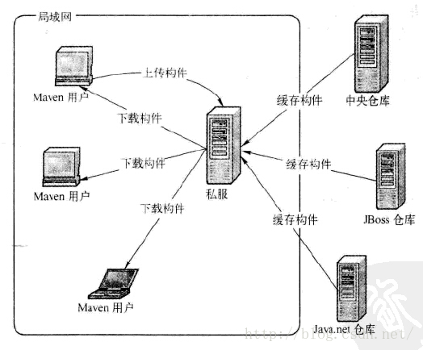
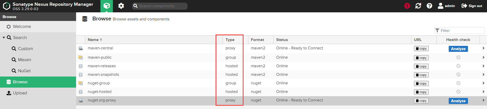
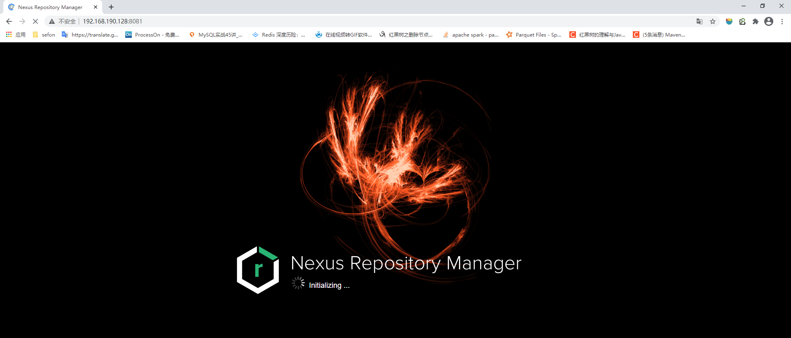
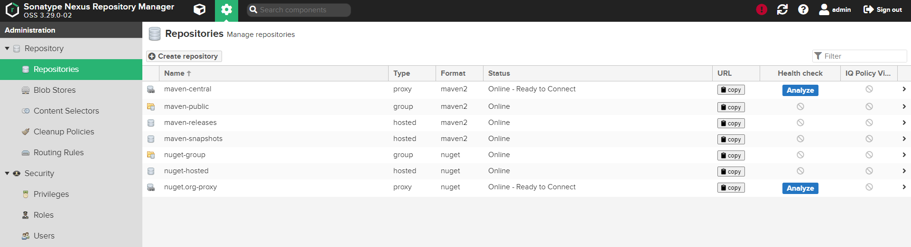

# Maven私服仓库搭建

## 序言

maven私服类似.net中的nuget包服务器，主要是用来对jar的管理，比如jar包的上传和下载。

## 下载

地址：https://www.sonatype.com/

下载地址：https://www.sonatype.com/download-nexus-repo-oss

版本/收费/免费：Nexus Repository Manager 仓库管理有2个版本，专业版和oss版，oss版是免费的，专业版是收费的，我们使用oss版。

## 简介

nexus是一个强大的maven仓库管理器,它极大的简化了本地内部仓库的维护和外部仓库的访问.

nexus是一套开箱即用的系统不需要数据库,它使用文件系统加Lucene来组织数据

nexus使用ExtJS来开发界面,利用Restlet来提供完整的REST APIs,通过IDEA和Eclipse集成使用

nexus支持webDAV与LDAP安全身份认证.

nexus提供了强大的仓库管理功能,构件搜索功能,它基于REST,友好的UI是一个extjs的REST客户端,占用较少的内存,基于简单文件系统而非数据库.

## 为什么使用

- 节省外网带宽。
- 加速Maven构建。
- 部署第三方构件。
- 提高稳定性，增强控制。
- 降低中央仓库的负荷。
- 控制和审计
- 建立本地内部公用仓库

私服仓库的工作流程



## Nexus仓库类型介绍

hosted，本地仓库，通常我们会部署自己的构件到这一类型的仓库。比如公司的第二方库。

proxy，代理仓库，它们被用来代理远程的公共仓库，如maven中央仓库。

group，仓库组，用来合并多个hosted/proxy仓库，当你的项目希望在多个repository使用资源时就不需要多次引用了，只需要引用一个group即可。




## **管理本地仓库**

我们前面讲到类型为hosted的为本地仓库，Nexus预定义了3个本地仓库，分别是Releases, Snapshots, 3rd Party. 分别讲一下这三个预置的仓库都是做什么用的:

**Releases:** 这里存放我们自己项目中发布的构建, 通常是Release版本的, 比如我们自己做了一个FTP Server的项目, 生成的构件为ftpserver.war, 我们就可以把这个构建发布到Nexus的Releases本地仓库. 关于符合发布后面会有介绍.

**Snapshots:**这个仓库非常的有用, 它的目的是让我们可以发布那些非release版本, 非稳定版本, 比如我们在trunk下开发一个项目,在正式release之前你可能需要临时发布一个版本给你的同伴使用, 因为你的同伴正在依赖你的模块开发, 那么这个时候我们就可以发布Snapshot版本到这个仓库, 你的同伴就可以通过简单的命令来获取和使用这个临时版本.

**3rd Party:**顾名思义, 第三方库, 你可能会问不是有中央仓库来管理第三方库嘛,没错, 这里的是指可以让你添加自己的第三方库, 比如有些构件在中央仓库是不存在的. 比如你在中央仓库找不到Oracle 的JDBC驱动, 这个时候我们就需要自己添加到3rdparty仓库。 

## Linux上安装Nexus

本文使用的版本


官方安装文档：https://help.sonatype.com/repomanager3/installation

**1.解压**

````shell
[root@localhost myfile]# ll
-rw-r--r--. 1 root root 163835797 Dec 13 20:44 nexus-3.29.0-02-unix.tar.gz
[root@localhost myfile]# tar -zxvf nexus-3.29.0-02-unix.tar.gz
[root@localhost myfile]# ll
drwxrwxrwx. 9 root root       163 Dec 13 20:44 nexus-3.29.0-02
-rw-r--r--. 1 root root 163835797 Dec 13 20:44 nexus-3.29.0-02-unix.tar.gz
drwxr-xr-x. 3 root root        20 Dec 13 20:44 sonatype-work
````

**2.运行**

````shell
[root@localhost nexus]# cd  nexus-3.29.0-02/bin/
[root@localhost nexus]# ./nexus start
````

**3.访问**

nexus默认端口为8081，可在/etc/nexus-default.properties文件中进行修改




## 配置Nexus



**Maven用到的Repositories说明**：

maven-central：maven中央库，默认从https://repo1.maven.org/maven2/拉取jar

maven-releases：私库发行版jar

maven-snapshots：私库快照（调试版本）jar

maven-public：仓库分组，把上面三个仓库组合在一起对外提供服务，在本地maven基础配置settings.xml中使用。

如果不够用，自己也可以根据博文上面的仓库类型进行选用创建。