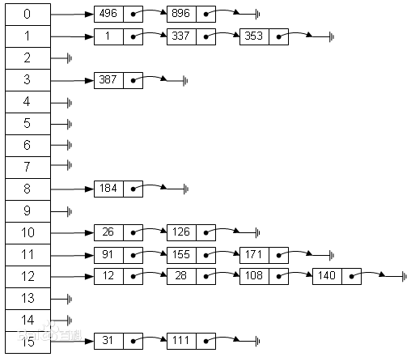
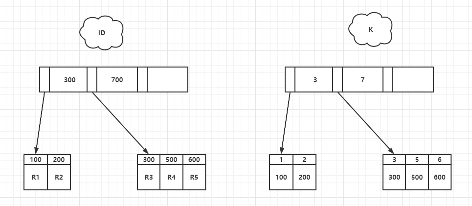

> 本文摘自林晓斌的《MySQL实战45讲》

# MySQL索引

## 简介

索引的出现就是为了提高数据库的查询效率，就像我们在使用字典的时候，我们可以更加字典等待拼音、部首、笔画来更加快速的去寻找到想要查询的字，而不用一页一页的找。MySQL的的索引也可以做相似的理解，如果说查询没有索引的表是一辆人力三轮车的速度的话，那么加了索引的表则是则是行驶在告诉公路的上跑车。不过添加索引也会带来额外的开销，MySQL会在存储数据的同时额外保存索引相关的信息，因此添加索引也会降低查询、更新、删除的速度。

## 使用

### 普通索引

这是最基本的索引，它没有任何限制。它有以下几种创建方式：

```
CREATE INDEX indexName ON table_name (column_name)
```

如果是CHAR，VARCHAR类型，length可以小于字段实际长度；如果是BLOB和TEXT类型，必须指定 length。

**修改表结构(添加索引)**

```
ALTER table tableName ADD INDEX indexName(columnName)
```

**创建表的时候直接指定**

```
CREATE TABLE mytable(  
 
ID INT NOT NULL,   
 
username VARCHAR(16) NOT NULL,  
 
INDEX [indexName] (username(length))  
 
);  
```

**删除索引的语法**

```
DROP INDEX [indexName] ON mytable; 
```

### 唯一索引

它与前面的普通索引类似，不同的就是：索引列的值必须唯一，但允许有空值。如果是组合索引，则列值的组合必须唯一。它有以下几种创建方式：

**创建索引**

```
CREATE UNIQUE INDEX indexName ON mytable(username(length)) 
```

**修改表结构**

```
ALTER table mytable ADD UNIQUE [indexName] (username(length))
```

**创建表的时候直接指定**

```
CREATE TABLE mytable(  
 
ID INT NOT NULL,   
 
username VARCHAR(16) NOT NULL,  
 
UNIQUE [indexName] (username(length))  
 
);  
```


### 使用ALTER 命令添加和删除索引

有四种方式来添加数据表的索引：

- ALTER TABLE tbl_name ADD PRIMARY KEY (column_list):

   

  该语句添加一个主键，这意味着索引值必须是唯一的，且不能为NULL。

  

- **ALTER TABLE tbl_name ADD UNIQUE index_name (column_list):** 这条语句创建索引的值必须是唯一的（除了NULL外，NULL可能会出现多次）。

- **ALTER TABLE tbl_name ADD INDEX index_name (column_list):** 添加普通索引，索引值可出现多次。

- **ALTER TABLE tbl_name ADD FULLTEXT index_name (column_list):**该语句指定了索引为 FULLTEXT ，用于全文索引。

以下实例为在表中添加索引。

```sql
mysql> ALTER TABLE testalter_tbl ADD INDEX (c);
```

你还可以在 ALTER 命令中使用 DROP 子句来删除索引。尝试以下实例删除索引:

```sql
mysql> ALTER TABLE testalter_tbl DROP INDEX c;
```

------

### 使用 ALTER 命令添加和删除主键

主键作用于列上（可以一个列或多个列联合主键），添加主键索引时，你需要确保该主键默认不为空（NOT NULL）。实例如下：

```sql
mysql> ALTER TABLE testalter_tbl MODIFY i INT NOT NULL;
mysql> ALTER TABLE testalter_tbl ADD PRIMARY KEY (i);
```

你也可以使用 ALTER 命令删除主键：

```sql
mysql> ALTER TABLE testalter_tbl DROP PRIMARY KEY;
```

删除主键时只需指定PRIMARY KEY，但在删除索引时，你必须知道索引名。

------

### 显示索引信息

你可以使用 SHOW INDEX 命令来列出表中的相关的索引信息。可以通过添加 \G 来格式化输出信息。

尝试以下实例:

```sql
mysql> SHOW INDEX FROM table_name; \G
........
```


## 索引模型

> 本章节参考自：《MySQL实战45讲》

”索引“并非是一种神秘的东西，它本质上是一种数据结构，那么只要能够提高查询速度的数据结构模型，我们都可以将其称之为”索引“，下面本文将列出常见的3种数据模型。

### Hash

hash应该是我们日常工作中最经常接触的数据结构了，他有着O(1)的高效查找速度。hash表的思路很简单，用一个数据来存储value，通过一个hash函数将key映射到数据的下标上。



不过一旦数据变多，就不可避免的会出现多个不同的key通过hash被映射到一个数据下表上，这样就会拉出一个链表。设想一下在执行sql为：

````sql
select num from table where  num between 1 and 385
````

这时就需要从1到385，进行385次hash操作然后，然后在每个数据index后面的链表中去查询对应的数据。这种区间查询在hash模型中的表现是很糟糕的。

所以，hash表这种结构比较适合做等值查询的场景。

### 二叉搜索树

二叉搜索树的特点就是：父节点的左子树节点的值都小于父节点的值，父节点右子树节点的值都大于父节点的值。


如果我们要删除43，只需要经过27 -> 45 -> 42 -> 43就行了。这样的时间复杂度是O(logN)。同样的对这个这颗树某个节点值的更新所用的时间复杂度也是O(logN)。

树可以有二叉，也可以有多叉。多叉树就是每个节点有多个儿子，儿子之间的大小保证从左到右递增。二叉树是搜索效率最高的，但是实际上大多数的数据库存储却并不使用二叉树。其原因是，索引不止存在内存中，还要写到磁盘上。

可以想象一下一棵 100 万节点的平衡二叉树，树高 20。一次查询可能需要访问 20 个数据块。在机械硬盘时代，从磁盘随机读一个数据块需要 10 ms 左右的寻址时间。也就是说，对于一个 100 万行的表，如果使用二叉树来存储，单独访问一个行可能需要 20 个 10 ms 的时间，这个查询可真够慢的。为了让一个查询尽量少地读磁盘，就必须让查询过程访问尽量少的数据块。那么，我们就不应该使用二叉树，而是要使用“N 叉”树。这里，“N 叉”树中的“N”取决于数据块的大小。

**InnoDB 的索引模型**

InnoDB使用了B+树模型，数据都是以B+树的形式存放的。**每一个所在在InnoDB中都对应了一棵B+树。**

假设，我们有一个主键为ID的表，表中有字段K，并在K上建立了索引

````shell

mysql> create table T(
id int primary key, 
k int not null, 
name varchar(16),
index (k))engine=InnoDB;
````

表中 R1~R5 的 (ID,k) 值分别为 (100,1)、(200,2)、(300,3)、(500,5) 和 (600,6)，两棵树的示例示意图如下。


从图中不难看出，根据叶子节点的内容，索引类型分为主键索引和非主键索引：

* 主键索引的叶子节点存的是整行数据。在 InnoDB 里，主键索引也被称为聚簇索引（clustered index）。

* 非主键索引的叶子节点内容是主键的值。在 InnoDB 里，非主键索引也被称为二级索引（secondary index）。

根据上面的索引结构说明，我们来讨论一个问题：基于主键索引和普通索引的查询有什么区别？如果语句是 select * from T where ID=500，即主键查询方式，则只需要搜索 ID 这棵 B+ 树；如果语句是 select * from T where k=5，即普通索引查询方式，则需要先搜索 k 索引树，得到 ID 的值为 500，再到 ID 索引树搜索一次。这个过程称为回表。也就是说，基于非主键索引的查询需要多扫描一棵索引树。因此，我们在应用中应该尽量使用主键查询。

## 索引维护

> 本节摘自《MySQL实战45讲》

B+ 树为了维护索引有序性，在插入新值的时候需要做必要的维护。以上面这个图为例，如果插入新的行 ID 值为 700，则只需要在 R5 的记录后面插入一个新记录。如果新插入的 ID 值为 400，就相对麻烦了，需要逻辑上挪动后面的数据，空出位置。

而更糟的情况是，如果 R5 所在的数据页已经满了，根据 B+ 树的算法，这时候需要申请一个新的数据页，然后挪动部分数据过去。这个过程称为页分裂。在这种情况下，性能自然会受影响。

除了性能外，页分裂操作还影响数据页的利用率。原本放在一个页的数据，现在分到两个页中，整体空间利用率降低大约 50%。

当然有分裂就有合并。当相邻两个页由于删除了数据，利用率很低之后，会将数据页做合并。合并的过程，可以认为是分裂过程的逆过程。

基于上面的索引维护过程说明，我们来讨论一个案例：

> 你可能在一些建表规范里面见到过类似的描述，要求建表语句里一定要有自增主键。当然事无绝对，我们来分析一下哪些场景下应该使用自增主键，而哪些场景下不应该。

自增主键是指自增列上定义的主键，在建表语句中一般是这么定义的： NOT NULL PRIMARY KEY AUTO_INCREMENT。

插入新记录的时候可以不指定 ID 的值，系统会获取当前 ID 最大值加 1 作为下一条记录的 ID 值。

也就是说，自增主键的插入数据模式，正符合了我们前面提到的递增插入的场景。每次插入一条新记录，都是追加操作，都不涉及到挪动其他记录，也不会触发叶子节点的分裂。

而有业务逻辑的字段做主键，则往往不容易保证有序插入，这样写数据成本相对较高。

除了考虑性能外，我们还可以从存储空间的角度来看。假设你的表中确实有一个唯一字段，比如字符串类型的身份证号，那应该用身份证号做主键，还是用自增字段做主键呢？

由于每个非主键索引的叶子节点上都是主键的值。如果用身份证号做主键，那么每个二级索引的叶子节点占用约 20 个字节，而如果用整型做主键，则只要 4 个字节，如果是长整型（bigint）则是 8 个字节。

显然，主键长度越小，普通索引的叶子节点就越小，普通索引占用的空间也就越小。

所以，从性能和存储空间方面考量，自增主键往往是更合理的选择。

有没有什么场景适合用业务字段直接做主键的呢？还是有的。比如，有些业务的场景需求是这样的：

1. 只有一个索引；
2. 该索引必须是唯一索引。

由于没有其他索引，所以也就不用考虑其他索引的叶子节点大小的问题。

## 回表

在下面这个表 T 中，如果我执行 select * from T where k between 3 and 5，需要执行几次树的搜索操作，会扫描多少行？

下面是这个表的初始化语句。

````shell

mysql> create table T (
ID int primary key,
k int NOT NULL DEFAULT 0, 
s varchar(16) NOT NULL DEFAULT '',
index k(k))
engine=InnoDB;

insert into T values(100,1, 'aa'),(200,2,'bb'),(300,3,'cc'),(500,5,'ee'),(600,6,'ff'),(700,7,'gg');
````


现在，我们一起来看看这条 SQL 查询语句的执行流程：

1. 在 k 索引树上找到 k=3 的记录，取得 ID = 300；

2. 再到 ID 索引树查到 ID=300 对应的 R3；

3. 在 k 索引树取下一个值 k=5，取得 ID=500；

4. 再回到 ID 索引树查到 ID=500 对应的 R4；

5. 在 k 索引树取下一个值 k=6，不满足条件，循环结束。

在这个过程中，回到主键索引树搜索的过程，我们称为回表。可以看到，这个查询过程读了 k 索引树的 3 条记录（步骤 1、3 和 5），回表了两次（步骤 2 和 4）。

在这个例子中，由于查询结果所需要的数据只在主键索引上有，所以不得不回表。那么，有没有可能经过索引优化，避免回表过程呢？

## 覆盖索引

如果执行的语句是 select ID from T where k between 3 and 5，这时只需要查 ID 的值，而 ID 的值已经在 k 索引树上了，因此可以直接提供查询结果，不需要回表。也就是说，在这个查询里面，索引 k 已经“覆盖了”我们的查询需求，我们称为覆盖索引。

由于覆盖索引可以减少树的搜索次数，显著提升查询性能，所以使用覆盖索引是一个常用的性能优化手段。

需要注意的是，在引擎内部使用覆盖索引在索引 k 上其实读了三个记录，R3~R5（对应的索引 k 上的记录项），但是对于 MySQL 的 Server 层来说，它就是找引擎拿到了两条记录，因此 MySQL 认为扫描行数是 2。

基于上面覆盖索引的说明，我们来讨论一个问题：**在一个市民信息表上，是否有必要将身份证号和名字建立联合索引？**

假设这个市民表的定义是这样的：

````sql

CREATE TABLE `tuser` (
  `id` int(11) NOT NULL,
  `id_card` varchar(32) DEFAULT NULL,
  `name` varchar(32) DEFAULT NULL,
  `age` int(11) DEFAULT NULL,
  `ismale` tinyint(1) DEFAULT NULL,
  PRIMARY KEY (`id`),
  KEY `id_card` (`id_card`),
  KEY `name_age` (`name`,`age`)
) ENGINE=InnoDB
````

我们知道，身份证号是市民的唯一标识。也就是说，如果有根据身份证号查询市民信息的需求，我们只要在身份证号字段上建立索引就够了。而再建立一个（身份证号、姓名）的联合索引，是不是浪费空间？

如果现在有一个高频请求，要根据市民的身份证号查询他的姓名，这个联合索引就有意义了。它可以在这个高频请求上用到覆盖索引，不再需要回表查整行记录，减少语句的执行时间。

当然，索引字段的维护总是有代价的。因此，在建立冗余索引来支持覆盖索引时就需要权衡考虑了。这正是业务 DBA，或者称为业务数据架构师的工作。

## 最左前缀原则

看到这里你一定有一个疑问，如果为每一种查询都设计一个索引，索引是不是太多了。如果我现在要按照市民的身份证号去查他的家庭地址呢？虽然这个查询需求在业务中出现的概率不高，但总不能让它走全表扫描吧？反过来说，单独为一个不频繁的请求创建一个（身份证号，地址）的索引又感觉有点浪费。应该怎么做呢？

这里，我先和你说结论吧。B+ 树这种索引结构，可以利用索引的“最左前缀”，来定位记录。

为了直观地说明这个概念，我们用（name，age）这个联合索引来分析。


可以看到，索引项是按照索引定义里面出现的字段顺序排序的。

当你的逻辑需求是查到所有名字是“张三”的人时，可以快速定位到 ID4，然后向后遍历得到所有需要的结果。

如果你要查的是所有名字第一个字是“张”的人，你的 SQL 语句的条件是"where name like ‘张 %’"。这时，你也能够用上这个索引，查找到第一个符合条件的记录是 ID3，然后向后遍历，直到不满足条件为止。

可以看到，不只是索引的全部定义，只要满足最左前缀，就可以利用索引来加速检索。这个最左前缀可以是联合索引的最左 N 个字段，也可以是字符串索引的最左 M 个字符。

基于上面对最左前缀索引的说明，我们来讨论一个问题：在建立联合索引的时候，如何安排索引内的字段顺序。

这里我们的评估标准是，索引的复用能力。因为可以支持最左前缀，所以当已经有了 (a,b) 这个联合索引后，一般就不需要单独在 a 上建立索引了。因此，第一原则是，如果通过调整顺序，可以少维护一个索引，那么这个顺序往往就是需要优先考虑采用的。

所以现在你知道了，这段开头的问题里，我们要为高频请求创建 (身份证号，姓名）这个联合索引，并用这个索引支持“根据身份证号查询地址”的需求。

那么，如果既有联合查询，又有基于 a、b 各自的查询呢？查询条件里面只有 b 的语句，是无法使用 (a,b) 这个联合索引的，这时候你不得不维护另外一个索引，也就是说你需要同时维护 (a,b)、(b) 这两个索引。

这时候，我们要考虑的原则就是空间了。比如上面这个市民表的情况，name 字段是比 age 字段大的 ，那我就建议你创建一个（name,age) 的联合索引和一个 (age) 的单字段索引。

## 索引下推

上一段我们说到满足最左前缀原则的时候，最左前缀可以用于在索引中定位记录。这时，你可能要问，那些不符合最左前缀的部分，会怎么样呢？

我们还是以市民表的联合索引（name, age）为例。如果现在有一个需求：检索出表中“名字第一个字是张，而且年龄是 10 岁的所有男孩”。那么，SQL 语句是这么写的：

````shell
mysql> select * from tuser where name like '张%' and age=10 and ismale=1;
````

你已经知道了前缀索引规则，所以这个语句在搜索索引树的时候，只能用 “张”，找到第一个满足条件的记录 ID3。当然，这还不错，总比全表扫描要好。

然后呢？

当然是判断其他条件是否满足。

在 MySQL 5.6 之前，只能从 ID3 开始一个个回表。到主键索引上找出数据行，再对比字段值。

而 MySQL 5.6 引入的索引下推优化（index condition pushdown)， 可以在索引遍历过程中，对索引中包含的字段先做判断，直接过滤掉不满足条件的记录，减少回表次数。

这两个过程的执行流程图。

无索引下推执行流程


索引下推执行流程


在上面第一张图 和 第二张图 这两个图里面，每一个虚线箭头表示回表一次。

图 第一张图 中，在 (name,age) 索引里面我特意去掉了 age 的值，这个过程 InnoDB 并不会去看 age 的值，只是按顺序把“name 第一个字是’张’”的记录一条条取出来回表。因此，需要回表 4 次。

第二张图跟图第一张图的区别是，InnoDB 在 (name,age) 索引内部就判断了 age 是否等于 10，对于不等于 10 的记录，直接判断并跳过。在我们的这个例子中，只需要对 ID4、ID5 这两条记录回表取数据判断，就只需要回表 2 次。小结


## 选择唯一索引还是普通索引

### 搜索

在实际工作中，不同的业务场景下我们应该怎样来选择索引的类型呢，本文接下来将对实际场景中选择“唯一索引”还是“普通索引”进行讨论。

首先创建表：

````shell
mysql> create table T(
id int primary key, 
k int not null, 
name varchar(16),
index (k))engine=InnoDB;
````




现在我们尝试执行下面的语句，看看会发生什么呢！

````sql
select id from T where k=5
````

首先因为是对k进行的条件查询，所以系统会去k对应的索引树上进行查找，这个时候会出现下面几种情况：

* 对于普通索引来说，查找到满足条件的第一条记录(5,500)，然后接着往下找，直到确定不存在匹配的条件为止。
* 对于唯一索引来说，查找到满足条件的第一条记录(5,500)后，本次查找就已经结束了。

虽然两者在查找上有着差别，但是其性能的差别其实是很小的。因为存储引擎是按页读写的，所以说，当找到 k=5 的记录的时候，它所在的数据页就都在内存里了。那么，对于普通索引来说，要多做的那一次“查找和判断下一条记录”的操作，就只需要一次指针寻找和一次计算就OK了。

### 更新

在更新过程中，我来一起来探讨一下不同的索引在更新的过程的情况是如何的呢？不过说到更新就不得不提到change buffer了，如果不能理解change buffer的作用，也就无法理解普通索引与唯一索引的区别在哪，换句话来说，普通索引与唯一索引的主要区别就在change buffer。

#### change buffer

Change Buffer是一种特殊的数据结构，缓存对二级索引页面的更改并且这些页面不在Buffer Pool中。缓存的changes可能由 Insert 、Delete 和 Update的结果导致。稍后在页面被其他`读取`操作加载到Buffer Pool的时候合并。

当需要更新一个数据页时，如果数据页在内存中就直接更新，而如果这个数据页还没有在内存中的话，在不影响数据一致性的前提下，InnoDB 会将这些更新操作缓存在 change buffer 中，这样就不需要从磁盘中读入这个数据页了。在下次查询需要访问这个数据页的时候，将数据页读入内存，然后执行 change buffer 中与这个页有关的操作。通过这种方式就能保证这个数据逻辑的正确性。

将 change buffer 中的操作应用到原数据页，得到最新结果的过程称为 merge。除了访问这个数据页会触发 merge 外，系统有后台线程会定期 merge。在数据库正常关闭（shutdown）的过程中，也会执行 merge 操作。

**那么什么情况下应该用change buffer呢？**

对于唯一索引来说，所有的更新操作都要先判断这个操作是否违反唯一性约束。因此，唯一索引的更新就不能使用 change buffer，实际上也只有普通索引可以使用。

那么我们再一起来看看如果要在这张表中插入一个新记录 (4,400) 的话，InnoDB 的处理流程是怎样的。

第一种情况是，这个记录要更新的目标页在内存中。这时，InnoDB 的处理流程如下：

* 对于唯一索引来说，找到 3 和 5 之间的位置，判断到没有冲突，插入这个值，语句执行结束；
* 对于普通索引来说，找到 3 和 5 之间的位置，插入这个值，语句执行结束。

这样看来，普通索引和唯一索引对更新语句性能影响的差别，只是一个判断，只会耗费微小的 CPU 时间。

第二种情况是，这个记录要更新的目标页不在内存中。这时，InnoDB 的处理流程如下：

* 对于唯一索引来说，需要将数据页读入内存，判断到没有冲突，插入这个值，语句执行结束；
* 对于普通索引来说，则是将更新记录在 change buffer，语句执行就结束了。

将数据从磁盘读入内存涉及随机 IO 的访问，是数据库里面成本最高的操作之一。change buffer 因为减少了随机磁盘访问，所以对更新性能的提升是会很明显的。

**现在我们回顾一下使用buffer有什么好处。**

先想想没有change buffer时候，在缓冲池中没有对应数据页时会怎么更新。概括来说，有两个步骤：

1. 首先需要从磁盘中读取对应的数据页到内存中
2. 然后更新内存中的数据页。

分析一下非主键索引中的唯一索引，插入或者更新的操作。

* 针对非主键索引中的唯一索引，大概率需要做随机磁盘IO读取，然后判断**唯一性**，再插入对应的行。

所以对于非主键的唯一索引，因为有唯一性判断，所以更新操作时，必须要从磁盘中读取数据页，判断唯一性，然后才能确定这个更新操作是否成功，即这个磁盘的IO操作是不可避免的。

对于非唯一索引来说，其实步骤也是类似的。但是因为不需要做唯一性判断，所以为了提高更新的性能，Mysql给出的解决方案就是使用change buffer来保存对非唯一索引的更新。也就是说，当需要更新非唯一索引时，直接操作change buffer，成功即可返回。

那么什么时候会真正更新数据页呢？有两种情况会触发：

* 被动：在后续的真正需要读这个非唯一索引时，把索引的数据页从磁盘读取到内存中，再通过change buffer做一个merge操作，merge操作以后，内存中的数据页就是最新的了。
* 主动：innoDB引擎中有线程会主动的定期做merge操作

### 场景选择

在了解了chage buffer后，我们应该就可以区别出了唯一索引与普通索引的区别了。

1. 利用普通索引的change buffer特性，当业务场景中的写远大于读时，常见场景为日志表，当某些列必须建立索引时，可以考虑建立普通索引，提高写入性能。
2. 如果业务场景的写之后立即伴随读，如果列的值是唯一的那么其实建立普通索引是不合适的，因为写的过程，虽然利用了change buffer暂时提高了写的性能，但是在读的时候还是需要磁盘IO。可以考虑建立唯一索引，在索引写的时候，就提前读取数据到缓冲池中，提高读的性能。