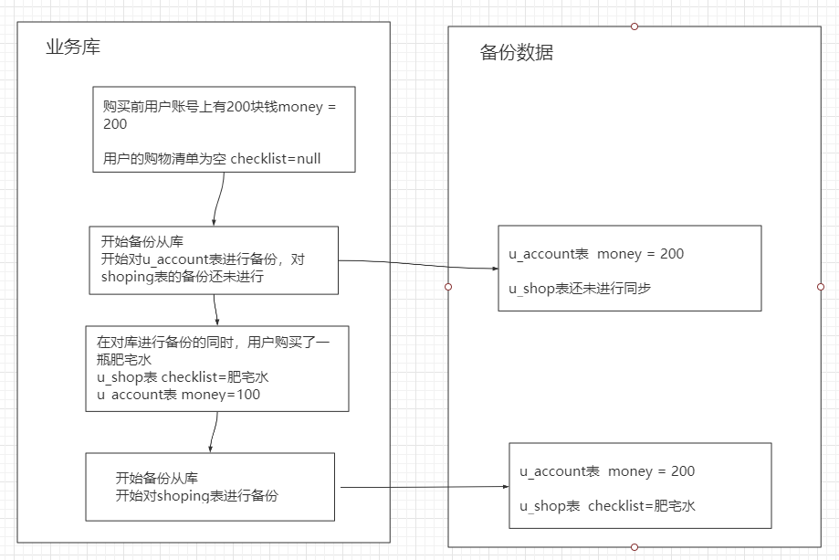

# MySQL之锁

数据库锁设计的初衷是处理并发问题。作为多用户共享的资源，当出现并发访问的时候，数据库需要合理地控制资源的访问规则。而锁就是用来实现这些访问规则的数据结构。

## 1.全局锁

MySQL提供了一个加全局锁的方法：flush tables with read lock(FTWRL）其对应的解锁命令为unlock tables或者断开枷锁的Session。

顾名思义，全局锁的作用就是给整个数据库实例进行枷锁。在开启全局锁后，之后的其他线程执行一下类型的语句的时候就会被阻塞：数据更新语句（数据的增删改），数据的定义语句（建表、改表等）和更新类事务的提交语句。

全局锁的典型使用场景就是做**全库逻辑备份**(mysqldump)。也就是把库中的每一张表都select出来保存为文件。通过打开FTWRL打开全局锁，然后对整个库做备份。**注意**：在备份的整个过程库都处于只读状态中。

如果将数据库设置为只读状态，会存在一下两个风险：

* 如果在主库上备份，那么在备份期间都不能执行更新，业务基本上就得停摆。
* 如果你在从库上备份，那么备份期间从库就不能执行主库同步过来的binlog，会导致主从延迟

开启全局锁做备份的方式似乎非常不妥，但是反过来想一想如果不开启全局锁就做备份会发生生命情况呢？

设想有一天，咱们代码搬不动了，只好回老家开启了小超市，我们在设计数据库的时候，用u_account表示用户表，用u_shop表示购物表。此时隔壁家的小胖子跑来咱们的商店买了一瓶100块钱的肥宅水，会发生什么事情呢。

可以发现最终的备份数据中，小胖子账户上的钱并没有减少，而且还买到了肥宅水。如果有一天我们用备份的数据去恢复数据库，那么小胖子就会白赚一瓶肥宅水（露出来不甘的眼泪）。那么为什么会发生这样的情况呢？ 原因就是在对业务库进行备份的时候，业务操作与备份数据的操作是同时进行的，这样才导致了备份的数据文件与业务库的数据不是一个逻辑时间点的。因此这个时候是有必要开启FTWRL来对库的数据进行备份的。

使用过mysqldump的朋友都知道，MySQL自带了逻辑备份工具。当 mysqldump 使用参数`--single-transaction`的时候，导数据之前就会启动一个事务，来确保拿到一致性快照视图。而由于 MVCC 的支持，这个过程中数据是可以正常更新的。

**那么既然有了mysqldump为什么我们还需要FTWRL?**

一致性读是好，但前提是引擎要支持这个隔离级别。比如，对于 MyISAM 这种不支持事务的引擎，如果备份过程中有更新，总是只能取到最新的数据，那么就破坏了备份的一致性。这时，我们就需要使用FTWRL 命令了。

所以，single-transaction 方法只适用于所有的表使用事务引擎的库。如果有的表使用了不支持事务的引擎，那么备份就只能通过 FTWRL 方法。这往往是 DBA 要求业务开发人员使用 InnoDB 替代 MyISAM 的原因之一。

能使得全库只读的命令不只是FTWRL还有`set global readonly=true`，但是比起set global readonly=true，该应该被使用的是FTWRL命令。原因有二：

* 一是，在有些系统中，readonly 的值会被用来做其他逻辑，比如用来判断一个库是主库还是备库。因此，修改 global 变量的方式影响面更大，
* 二是，在异常处理机制上有差异。如果执行 FTWRL 命令之后由于客户端发生异常断开，那么 MySQL 会自动释放这个全局锁，整个库回到可以正常更新的状态。而将整个库设置为 readonly 之后，如果客户端发生异常，则数据库就会一直保持 readonly 状态，这样会导致整个库长时间处于不可写状态，风险较高。

## 2.表级锁

MySQL种的表级锁有两种：一种是表锁，一种是元数据锁（meta data lock,MDL)

表锁的语法是 lock tables … read/write。与 FTWRL 类似，可以用 unlock tables 主动释放锁，也可以在客户端断开的时候自动释放。需要注意，lock tables 语法除了会限制别的线程的读写外，也限定了本线程接下来的操作对象。

举个例子, 如果在某个线程 A 中执行 lock tables t1 read, t2 write; 这个语句，则其他线程写 t1、读写 t2 的语句都会被阻塞。同时，线程 A 在执行 unlock tables 之前，也只能执行读 t1、读写 t2 的操作。连写 t1 都不允许，自然也不能访问其他表。

在还没有出现更细粒度的锁的时候，表锁是最常用的处理并发的方式。而对于 InnoDB 这种支持行锁的引擎，一般不使用 lock tables 命令来控制并发，毕竟锁住整个表的影响面还是太大。

另一类表级的锁是 MDL（metadata lock)。MDL 不需要显式使用，在访问一个表的时候会被自动加上。MDL 的作用是，保证读写的正确性。你可以想象一下，如果一个查询正在遍历一个表中的数据，而执行期间另一个线程对这个表结构做变更，删了一列，那么查询线程拿到的结果跟表结构对不上，肯定是不行的。

因此，在 MySQL 5.5 版本中引入了 MDL，当对一个表做增删改查操作的时候，加 MDL 读锁；当要对表做结构变更操作的时候，加 MDL 写锁。

* 读锁之间不互斥，因此你可以有多个线程同时对一张表的数据增删改查（这里的读锁指的是mdl读锁，而这里的增删查改指的是对表数据的增删查改）。
* 读写锁之间、写锁之间是互斥的，用来保证变更表结构操作的安全性。因此，如果有两个线程要同时给一个表加字段，其中一个要等另一个执行完才能开始执行。

虽然 MDL 锁是系统默认会加的，但却是你不能忽略的一个机制。比如下面这个例子，我经常看到有人掉到这个坑里：给一个小表加个字段，导致整个库挂了。

你肯定知道，给一个表加字段，或者修改字段，或者加索引，需要扫描全表的数据。在对大表操作的时候，你肯定会特别小心，以免对线上服务造成影响。而实际上，即使是小表，操作不慎也会出问题。我们来看一下下面的操作序列，假设表 t 是一个小表。

> 备注：这里的实验环境是 MySQL 5.6。

我们可以看到 session A 先启动，这时候会对表 t 加一个 MDL 读锁。由于 session B 需要的也是 MDL 读锁，因此可以正常执行。

之后 session C 会被 blocked，是因为 session A 的 MDL 读锁还没有释放，而 session C 需要 MDL 写锁，因此只能被阻塞。

如果只有 session C 自己被阻塞还没什么关系，但是之后所有要在表 t 上新申请 MDL 读锁的请求也会被 session C 阻塞。前面我们说了，所有对表结构的增删改查操作都需要先申请 MDL 读锁，就都被锁住，等于这个表现在完全不可读写了。

如果某个表上的查询语句频繁，而且客户端有重试机制，也就是说超时后会再起一个新 session 再请求的话，这个库的线程很快就会爆满。

你现在应该知道了，事务中的 MDL 锁，在语句执行开始时申请，但是语句结束后并不会马上释放，而会等到整个事务提交后再释放。

基于上面的分析，我们来讨论一个问题，如何安全地给小表加字段？

首先我们要解决长事务，事务不提交，就会一直占着 MDL 锁。在 MySQL 的 information_schema 库的 innodb_trx 表中，你可以查到当前执行中的事务。如果你要做 DDL 变更的表刚好有长事务在执行，要考虑先暂停 DDL，或者 kill 掉这个长事务。因此有未提交的事务时无法修改表字段，而且在存在长事务时执行修改表字段命令是一个危险的操作，可能阻塞其它增删改查请求，或导致线程爆满。

但考虑一下这个场景。如果你要变更的表是一个热点表，虽然数据量不大，但是上面的请求很频繁，而你不得不加个字段，你该怎么做呢？

这时候 kill 可能未必管用，因为新的请求马上就来了。比较理想的机制是，在 alter table 语句里面设定等待时间，如果在这个指定的等待时间里面能够拿到 MDL 写锁最好，拿不到也不要阻塞后面的业务语句，先放弃。之后开发人员或者 DBA 再通过重试命令重复这个过程。

MariaDB 已经合并了 AliSQL 的这个功能，所以这两个开源分支目前都支持 DDL NOWAIT/WAIT n 这个语法。

