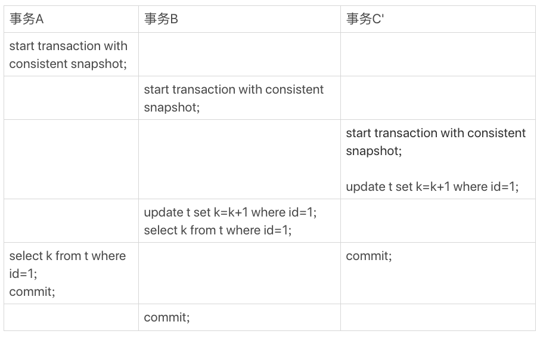
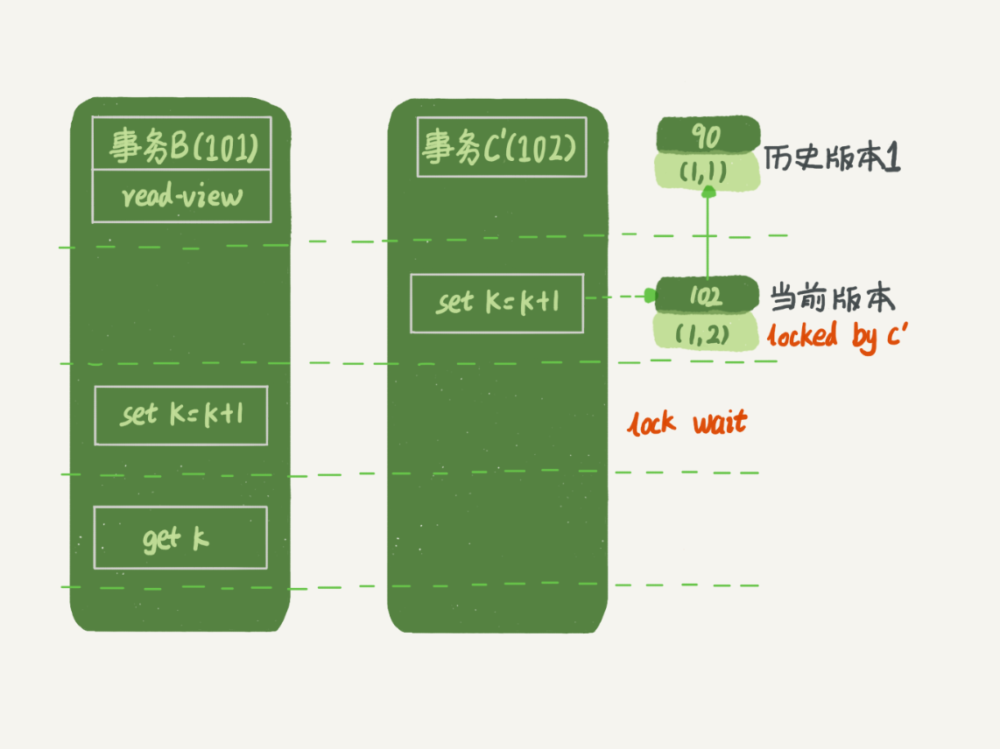

> 本文摘自林晓斌的《MySQL实战45讲》

# MySQL事务

## 简介

提到事务，你肯定会想到 ACID（Atomicity、Consistency、Isolation、Durability，即原子性、一致性、隔离性、持久性）

## Isolation隔离性

当数据库上有多个事务同时执行的时候，就可能出现脏读(dirty read)、不可重复读（non-repeatable read）、幻读（phantom read）的问题，为了解决这个问题，就有了“隔离级别”的概念。

* 脏读：读到其他事务未提交的数据；
* 不可重复读：前后读取的记录内容不一致；
* 幻读：前后读取的记录数据不一致

在隔离级别中，首先需要明确的一点就是隔离级别越严格，效率越低。SQL标准的事务隔离级别包括：读未提交（read uncommited)、读提交（read committed）、可重复读（repeatable read）和串行化(serializable)。

* 读未提交：一个事务还没提交时，它做的变更就能被别的事务看到，即别人改数据的事务尚未提交，我在我的事务中也能读到。
* 读提交：一个事务提交后，它做的变更才会被其他事务看到，即别人改数据的事务已经提交，我在我的事务中才能读到
* 可重复读：一个事务执行的过程中看到的数据，即别人改数据的事务已经提交，我在我的事务中也不去读。
* 串行化：：对于对同一行记录的操作，“写”会加“写锁”，“读”会加“读锁”，即当出现读写锁冲突的时候，后访问的事务必须等前一个事务执行完成，才继续执行。我的事务尚未提交，别人就别想改数据

其中“读提交”和“可重复读”比较难理解，下面举几个例子来说明：

````shell
mysql > create table person(name varchar) engine=InnoDB;
mysql > insert into person(name) values("zhangsan")
````


|       事务A        |       事务B        |
| :----------------: | :----------------: |
|      启动事务      |      启动事务      |
| 查询得到值zhangsan |                    |
|                    | 查询得到值zhangsan |
|                    | 将zhangsan改为lisi |
|   查询，得到值V1   |                    |
|                    |     提交事务B      |
|   查询，得到值V2   |                    |
|     提交事务A      |                    |
|   查询，得到值V3   |                    |

我们来看看在不同的隔离级别下，V1,V2,V3的值会是什么呢？

* 若隔离级别是“读未提交”，则V1的值lisi。这个时候事务B虽然还没有提交，但是结果已经被A看到了。因此V2，V3也是lisi。
* 若隔离级别是“读提交”，则V1的值是zhangsan，V2，V3的值是lisi。
* 若隔离级别是“可重复读”，则V1,V2的值都是zhangsan，V3的值是lisi，遵循的就是这个要求：事务在执行期间看到的数据前后必须是一致的。
* 若隔离级别是“串行化”，则在事务B执行“将zhangsan改成lisi”的时候，会被锁住。因为事务A先执行查询，因此只能等到A事务执行完后才会去执行B事务的事务，因此V1、V2的值是zhangsan，V3的值是lisi。串行化只有在加『读锁』或者「写锁」的时候才会尝试加锁。而不是事务一开始就进行加锁。


在实现上，数据库是以创建视图的方式来区别几种隔离级别的。

* 隔离级别是“读提交”，视图是在每个语句前创建的，所以在“读提交”级别下，一个事务是可以看到另一个事务已经提交的内容，因为它在每一次查询都会冲i性能给与最新的数据创建一个新的MVCC视图。
* 隔离级别是“可重复读”，视图实实在开始事务的时候创建好了，这个视图会一直使用，直到该事务结束。这里需要注意的是不同的隔离级别他们的一致性事务视图创建的时间点是不同的。
* 隔离级别是“串行话”，直接锁表。

##  设置事务等级

说了这么多，那么怎么去调整mysql的事务等级呢？

1. 全局修改，修改mysql.ini配置文件，在最后加上

````shell
1 #可选参数有：READ-UNCOMMITTED, READ-COMMITTED, REPEATABLE-READ, SERIALIZABLE.
2 [mysqld]
3 transaction-isolation = REPEATABLE-READ
````

这里全局默认是REPEATABLE-READ,其实MySQL本来默认也是这个级别

2. 对当前session修改，在登录mysql客户端后，执行命令：

````shell
set transcation isolation level read uncommitted;
````


要记住mysql有一个autocommit参数，默认是on，他的作用是每一条单独的查询都是一个事务，并且自动开始，自动提交（执行完以后就自动结束了，如果你要适用select for update，而不手动调用 start transaction，这个for update的行锁机制等于没用，因为行锁在自动提交后就释放了），所以事务隔离级别和锁机制即使你不显式调用start transaction，这种机制在单独的一条查询语句中也是适用的，分析锁的运作的时候一定要注意这一点


## 事务隔离的实现

在MySQL使用InnoDB，每一次更新操作都会对应的记录一条回滚日志(undo log）。通过回滚操作，就可以恢复前一条数据的值。比如将1每次加1，一直到4位置，则回滚记录就会记录如下图的链表。


当前的值是4，在查询这条记录的时候，不同的事务有着自己的read-view。在视图read-viewA、read-viewB、read-viewC、read-viewD这个记录分别未4、3、2、1。同一条记录在数据库中有着多个版本，即数据库的多版本控制(MVCC)。对于视图C要想得到2，就必须从版本链上进行回滚，即从4开始回滚找到`属于自己`的版本2。即使现在有另外一个事务，将4改为5，也不会影响到其他read-view读取这条记录的结果，这个新的事务跟其他事务不是冲突的。

## 回滚过期

回滚日志总不能一直保留的，那么什么时候可以去删除它呢？即在这个回滚日志不在被需要的时候，就去删除它。读操作会产生视图，当这个事务结束后该视图删除，那么在这个视图后的回滚日志可以删除，因为已经没有谁会驱动当前版本的数据执行回滚到删除的那个视图版本了。

## 长事务

既然每次提交事务都会都会有着自己的view，那么如果这个事务一直存在而不提交，或着这个事务的存在时间非常长，那么上文提交的`回滚连`不久回长时间存在吗？如果是这样对同一条数据的多次操作不久会使得`回滚链`变得非常长么。我们称这样的事务`为长事务`。 

在实际场景中，本文不推荐使用长事务， 长事务会使得回滚日志变长，可能数据只有1个G，回滚日志有10个G。同时回滚日志还会占据数据库的锁资源等等。

## 启动事务

MySQL事务的启动方式有一下几种：

1. 显示启动事务语句。begin或者start transcation。提交语句为commit，回滚语句为rallback。start transcation命令并不是一个事务的起点，在执行到它们之后的第一个操作 InnoDB 表的语句，事务才真正启动。如果你想要马上启动一个事务，可以使用 start transaction with consistent snapshot 这个命令。 
2. set autocommit=0，这个命令会将这个线程的自动提交关掉。意味着如果你只执行一个 select 语句，这个事务就启动了，而且并不会自动提交。这个事务持续存在直到你主动执行 commit 或 rollback 语句，或者断开连接。

有些客户端连接框架会默认连接成功后先执行一个 set autocommit=0 的命令。这就导致接下来的查询都在事务中，如果是长连接，就导致了意外的长事务。因此对于一般情况，建议还是使用set autocommit=1，每条语句默认在都在一个单独事务里面且自动提交。

但是有的开发同学会纠结“多一次交互”的问题。对于一个需要频繁使用事务的业务，第二种方式每个事务在开始时都不需要主动执行一次 “begin”，减少了语句的交互次数。如果你也有这个顾虑，我建议你使用 commit work and chain 语法。在 autocommit 为 1 的情况下，用 begin 显式启动的事务，如果执行 commit 则提交事务。如果执行 commit work and chain，则是提交事务并自动启动下一个事务，这样也省去了再次执行 begin 语句的开销。同时带来的好处是从程序开发的角度明确地知道每个语句是否处于事务中。

你可以在 information_schema 库的 innodb_trx 这个表中查询长事务，比如下面这个语句，用于查找持续时间超过 60s 的事务。select * from information_schema.innodb_trx where TIME_TO_SEC(timediff(now(),trx_started))>60

````shell
select * from information_schema.innodb_trx where TIME_TO_SEC(timediff(now(),trx_started))>60
````


##  事务到底是隔离的还是不隔离的？

前面提到事务隔离级别的时候提到过，如果是可重复读隔离级别，事务 T 启动的时候会创建一个视图 read-view，之后事务 T 执行期间，即使有其他事务修改了数据，事务 T 看到的仍然跟在启动时看到的一样。也就是说，一个在可重复读隔离级别下执行的事务，好像与世无争，不受外界影响。

但是，学习了行锁相关知识后，一个事务要更新一行，如果刚好有另外一个事务拥有这一行的行锁，它又不能这么超然了，会被锁住，进入等待状态。问题是，既然进入了等待状态，那么等到这个事务自己获取到行锁要更新数据的时候，它读到的值又是什么呢？【这个问句的点是：一方面事务是可重复读，即整个事务期间都看到的是事务刚刚启动时候的视图；但是又因为行锁，事务在执行过程中可能需要等待别的事务更新同一行，那这时候如果该事务也要更新，看到的还是事务刚刚创建时事务的状态吗？ 显然不是，这里的关键就是对于更新操作来说，需要当前读。】

我给你举一个例子吧。下面是一个只有两行的表的初始化语句。

````sql

mysql> CREATE TABLE `t` (
  `id` int(11) NOT NULL,
  `k` int(11) DEFAULT NULL,
  PRIMARY KEY (`id`)
) ENGINE=InnoDB;
insert into t(id, k) values(1,1),(2,2);
````


这里，我们需要注意的是事务的启动时机。

begin/start transaction 命令并不是一个事务的起点，在执行到它们之后的第一个操作 InnoDB 表的语句，事务才真正启动。如果你想要马上启动一个事务，可以使用 start transaction with consistent snapshot 这个命令。

* 第一种启动方式，一致性视图是在执行第一个快照读语句时创建的；
* 第二种启动方式，一致性视图是在执行 start transaction with consistent snapshot 时创建的。

还需要注意的是，我们的例子中如果没有特别说明，都是默认 autocommit=1。

在这个例子中，事务 C 没有显式地使用 begin/commit，表示这个 update 语句本身就是一个事务，语句完成的时候会自动提交。事务 B 在更新了行之后查询 ; 事务 A 在一个只读事务中查询，并且时间顺序上是在事务 B 的查询之后

这时，如果我告诉你事务 B 查到的 k 的值是 3，而事务 A 查到的 k 的值是 1，你是不是感觉有点晕呢？

所以，今天这篇文章，我其实就是想和你说明白这个问题，希望借由把这个疑惑解开的过程，能够帮助你对 InnoDB 的事务和锁有更进一步的理解。

在 MySQL 里，有两个“视图”的概念：

* 一个是 view。它是一个用查询语句定义的虚拟表，在调用的时候执行查询语句并生成结果。创建视图的语法是 create view … ，而它的查询方法与表一样。
* 另一个是 InnoDB 在实现 MVCC 时用到的一致性读视图，即 consistent read view，用于支持 RC（Read Committed，读提交）和 RR（Repeatable Read，可重复读）隔离级别的实现。

它没有物理结构，作用是事务执行期间用来定义“我能看到什么数据”。【没有物理结构，就是通过高低水位，数据版本号，undo日记来进行判断数据可见不可见，达到MVCC目的】

为了说明查询和更新的区别，我换一个方式来说明，把 read view 拆开。你可以结合这两篇文章的说明来更深一步地理解 MVCC。

**“快照”在 MVCC 里是怎么工作的？**

在可重复读隔离级别下，事务在启动的时候就“拍了个快照”。注意，这个快照是基于整库的。

这时，你会说这看上去不太现实啊。如果一个库有 100G，那么我启动一个事务，MySQL 就要拷贝 100G 的数据出来，这个过程得多慢啊。可是，我平时的事务执行起来很快啊。

实际上，我们并不需要拷贝出这 100G 的数据。我们先来看看这个快照是怎么实现的。

InnoDB 里面每个事务有一个唯一的事务 ID，叫作 transaction id。它是在事务开始的时候向 InnoDB 的事务系统申请的，是按申请顺序严格递增的。

而每行数据也都是有多个版本的。每次事务更新数据的时候，都会生成一个新的数据版本，并且把 transaction id 赋值给这个数据版本的事务 ID，记为 row trx_id。同时，旧的数据版本要保留，并且在新的数据版本中，能够有信息可以直接拿到它。

也就是说，数据表中的一行记录，其实可能有多个版本 (row)，每个版本有自己的 row trx_id。

如图 2 所示，就是一个记录被多个事务连续更新后的状态。


图中虚线框里是同一行数据的 4 个版本，当前最新版本是 V4，k 的值是 22，它是被 transaction id 为 25 的事务更新的，因此它的 row trx_id 也是 25。

你可能会问，前面的文章不是说，语句更新会生成 undo log（回滚日志）吗？那么，undo log 在哪呢？

实际上，图 2 中的三个虚线箭头，就是 undo log；而 V1、V2、V3 并不是物理上真实存在的，而是每次需要的时候根据当前版本和 undo log 计算出来的。比如，需要 V2 的时候，就是通过 V4 依次执行 U3、U2 算出来。

明白了多版本和 row trx_id 的概念后，我们再来想一下，InnoDB 是怎么定义那个“100G”的快照的。

按照可重复读的定义，一个事务启动的时候，能够看到所有已经提交的事务结果。但是之后，这个事务执行期间，其他事务的更新对它不可见。

因此，一个事务只需要在启动的时候声明说，“以我启动的时刻为准，如果一个数据版本是在我启动之前生成的，就认；如果是我启动以后才生成的，我就不认，我必须要找到它的上一个版本”。

当然，如果“上一个版本”也不可见，那就得继续往前找。还有，如果是这个事务自己更新的数据，它自己还是要认的。

在实现上， InnoDB 为每个事务构造了一个数组，用来保存这个事务启动瞬间，当前正在“活跃”的所有事务 ID。“活跃”指的就是，启动了但还没提交。【就是说每一个事务启动的时候，都会拥有一个属于自己的“活跃”事务数组，而且每个事务所拥有的“活跃”事务数据也不一定相同】

数组里面事务 ID 的最小值记为低水位，当前系统里面已经创建过的事务 ID 的最大值加 1 记为高水位。【这里的高水位，我的理解是被创建事务本身的id，感觉作者的描述有点绕，如果事务的trx_id是递增的，那么事务本身被创建的那一刻，所获取的trx_id应该就是系统内最大的】

这个视图数组和高水位，就组成了当前事务的一致性视图（read-view）。

而数据版本的可见性规则，就是基于数据的 row trx_id 和这个一致性视图的对比结果得到的。

这个视图数组把所有的 row trx_id 分成了几种不同的情况。


这样，对于当前事务的启动瞬间来说，一个数据版本的 row trx_id，有以下几种可能：

* 1、如果落在绿色部分，表示这个版本是已提交的事务或者是当前事务自己生成的，这个数据是可见的【此时事务已经提交，并且已经完成】；
* 2、如果落在红色部分，表示这个版本是由将来启动的事务生成的，是肯定不可见的【“将来启动”的事务，也可以理解为为“未启动”的事务】；
* 3、如果落在黄色部分，那就包括两种情况
  * 若 row trx_id 在数组中，表示这个版本是由还没提交的事务生成的，不可见；
  * 若 row trx_id 不在数组中，表示这个版本是已经提交了的事务生成的，可见。

【对于第三点的理解可能会容易让人摸不着头脑，既然第1点排除已经提交的事务，第2点排除了未启动的事务，那么第3点应该只剩下已经启动但未提交的事务了，为什么还会存在已经启动而且已经提交的事务呢？比如仙子有三个**活跃**的事务A、B、C，对应的trx_id为10、11、12，那么事务A对应的活跃事务数据为A-->[10],B对应的活跃事务数组为B-->[10,11]，C对应的活跃事务数组为B-->[10,11,13]，如果B在A之前并在C之后执行完，那么对事务C来说trx_id11便是事务还未提交，trx_id12已经提交，这个时候虽然trx_id12在C的活跃事务数组内，但是可见的，trx_id11在C的活跃事务数组内，却是不可见的】


比如，对于图 2 中的数据来说，如果有一个事务，它的低水位是 18，那么当它访问这一行数据时，就会从 V4 通过 U3 计算出 V3，所以在它看来，这一行的值是 11。

你看，有了这个声明后，系统里面随后发生的更新，是不是就跟这个事务看到的内容无关了呢？因为之后的更新，生成的版本一定属于上面的 2 或者 3(a) 的情况，而对它来说，这些新的数据版本是不存在的，所以这个事务的快照，就是“静态”的了。

所以你现在知道了，InnoDB 利用了“所有数据都有多个版本”的这个特性，实现了“秒级创建快照”的能力。

接下来，我们继续看一下图 1 中的三个事务，分析下事务 A 的语句返回的结果，为什么是 k=1。

这里，我们不妨做如下假设：

1. 这里，我们不妨做如下假设：
2. 事务 A、B、C 的版本号分别是 100、101、102，且当前系统里只有这四个事务；
3. 三个事务开始前，(1,1）这一行数据的 row trx_id 是 90。

这样，事务 A 的视图数组就是[99,100], 事务 B 的视图数组是[99,100,101], 事务 C 的视图数组是[99,100,101,102]。

为了简化分析，我先把其他干扰语句去掉，只画出跟事务 A 查询逻辑有关的操作：


从图中可以看到，第一个有效更新是事务 C，把数据从 (1,1) 改成了 (1,2)。这时候，这个数据的最新版本的 row trx_id 是 102，而 90 这个版本已经成为了历史版本。

第二个有效更新是事务 B，把数据从 (1,2) 改成了 (1,3)。这时候，这个数据的最新版本（即 row trx_id）是 101，而 102 又成为了历史版本。

你可能注意到了，在事务 A 查询的时候，其实事务 B 还没有提交，但是它生成的 (1,3) 这个版本已经变成当前版本了。但这个版本对事务 A 必须是不可见的，否则就变成脏读了。

好，现在事务 A 要来读数据了，它的视图数组是[99,100]。当然了，读数据都是从当前版本读起的。所以，事务 A 查询语句的读数据流程是这样的：

* 找到 (1,3) 的时候，判断出 row trx_id=101，比高水位大，处于红色区域，不可见；
* 接着，找到上一个历史版本，一看 row trx_id=102，比高水位大，处于红色区域，不可见；
* 再往前找，终于找到了（1,1)，它的 row trx_id=90，比低水位小，处于绿色区域，可见。

这样执行下来，虽然期间这一行数据被修改过，但是事务 A 不论在什么时候查询，看到这行数据的结果都是一致的，所以我们称之为一致性读。

这个判断规则是从代码逻辑直接转译过来的，但是正如你所见，用于人肉分析可见性很麻烦。	

所以，我来给你翻译一下。一个数据版本，对于一个事务视图来说，除了自己的更新总是可见以外，有三种情况：

1. 所以，我来给你翻译一下。一个数据版本，对于一个事务视图来说，除了自己的更新总是可见以外，有三种情况：
2. 版本已提交，但是是在视图创建后提交的，不可见；
3. 版本已提交，而且是在视图创建前提交的，可见。

现在，我们用这个规则来判断图 4 中的查询结果，事务 A 的查询语句的视图数组是在事务 A 启动的时候生成的，这时候：

* (1,3) 还没提交，属于情况 1，不可见；
* (1,2) 虽然提交了，但是是在视图数组创建之后提交的，属于情况 2，不可见；
* (1,1) 是在视图数组创建之前提交的，可见。

你看，去掉数字对比后，只用时间先后顺序来判断，分析起来是不是轻松多了。所以，后面我们就都用这个规则来分析。

**更新逻辑**

细心的同学可能有疑问了：事务 B 的 update 语句，如果按照一致性读，好像结果不对哦？

你看图 5 中，事务 B 的视图数组是先生成的，之后事务 C 才提交，不是应该看不见 (1,2) 吗，怎么能算出 (1,3) 来？


是的，如果事务 B 在更新之前查询一次数据，这个查询返回的 k 的值确实是 1。

但是，当它要去更新数据的时候，就不能再在历史版本上更新了，否则事务 C 的更新就丢失了。因此，事务 B 此时的 set k=k+1 是在（1,2）的基础上进行的操作。

所以，这里就用到了这样一条规则：更新数据都是先读后写的，而这个读，只能读当前的值，称为“当前读”（current read）。

因此，在更新的时候，当前读拿到的数据是 (1,2)，更新后生成了新版本的数据 (1,3)，这个新版本的 row trx_id 是 101。

所以，在执行事务 B 查询语句的时候，一看自己的版本号是 101，最新数据的版本号也是 101，是自己的更新，可以直接使用，所以查询得到的 k 的值是 3。

这里我们提到了一个概念，叫作当前读。其实，除了 update 语句外，select 语句如果加锁，也是当前读。

所以，如果把事务 A 的查询语句 select * from t where id=1 修改一下，加上 lock in share mode 或 for update，也都可以读到版本号是 101 的数据，返回的 k 的值是 3。下面这两个 select 语句，就是分别加了读锁（S 锁，共享锁）和写锁（X 锁，排他锁）。

````sql
mysql> select k from t where id=1 lock in share mode;
mysql> select k from t where id=1 for update;
````

再往前一步，假设事务 C 不是马上提交的，而是变成了下面的事务 C’，会怎么样呢？



事务 C’的不同是，更新后并没有马上提交，在它提交前，事务 B 的更新语句先发起了。前面说过了，虽然事务 C’还没提交，但是 (1,2) 这个版本也已经生成了，并且是当前的最新版本。那么，事务 B 的更新语句会怎么处理呢？

这时候，我们在上一篇文章中提到的“两阶段锁协议”就要上场了。事务 C’没提交，也就是说 (1,2) 这个版本上的写锁还没释放。而事务 B 是当前读，必须要读最新版本，而且必须加锁，因此就被锁住了，必须等到事务 C’释放这个锁，才能继续它的当前读。



到这里，我们把一致性读、当前读和行锁就串起来了。

现在，我们再回到文章开头的问题：事务的可重复读的能力是怎么实现的？

可重复读的核心就是一致性读（consistent read）；而事务更新数据的时候，只能用当前读。如果当前的记录的行锁被其他事务占用的话，就需要进入锁等待。

而读提交的逻辑和可重复读的逻辑类似，它们最主要的区别是：

* 在可重复读隔离级别下，只需要在事务开始的时候创建一致性视图，之后事务里的其他查询都共用这个一致性视图；
* 在读提交隔离级别下，每一个语句执行前都会重新算出一个新的视图。

那么，我们再看一下，在读提交隔离级别下，事务 A 和事务 B 的查询语句查到的 k，分别应该是多少呢？

这里需要说明一下，“start transaction with consistent snapshot; ”的意思是从这个语句开始，创建一个持续整个事务的一致性快照。所以，在读提交隔离级别下，这个用法就没意义了，等效于普通的 start transaction。

下面是读提交时的状态图，可以看到这两个查询语句的创建视图数组的时机发生了变化，就是图中的 read view 框。（注意：这里，我们用的还是事务 C 的逻辑直接提交，而不是事务 C’）


这时，事务 A 的查询语句的视图数组是在执行这个语句的时候创建的，时序上 (1,2)、(1,3) 的生成时间都在创建这个视图数组的时刻之前。但是，在这个时刻：

* (1,3) 还没提交，属于情况 1，不可见；
* (1,2) 提交了，属于情况 3，可见。

所以，这时候事务 A 查询语句返回的是 k=2。

显然地，事务 B 查询结果 k=3。