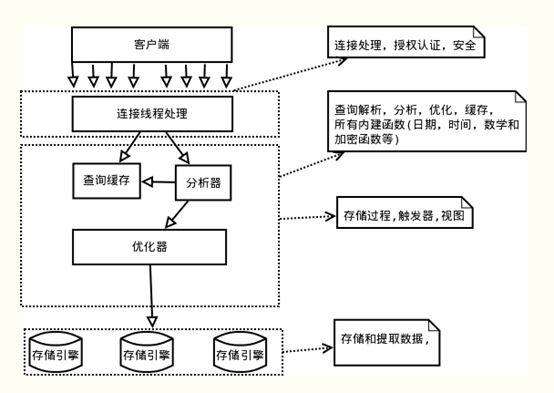

# MySQL执行流程

本文主要通过一些简单的实例，粗略的过一遍sql在MySQL服务器中是怎样执行的。是为鸟瞰全图，心里有数。

## Mysql逻辑架构图

Mysql主要由`连接器`、`分析器`、`优化器`、以及`存储引擎`组成,本文将从四个部分来简单概述MySQL的这四个组件。其中“连接器”、“分析器”、“优化器”为MySQL的Server层，“存储引擎”为单独的一层。



## 连接器

Mysql Server层的第一个模块，就是连接器。当我们使用MySQL客户端连接MySQL服务器的时候，处理连接的就是这一个模块。一般我们是这样连接MySQL服务器的

````shell
[root@localhost ~]# mysql -u${username} -p${password}
````

MySQL客户端与服务端使用TCP协议进行连接，完成连接后，服务器便对用户进行身份认证。

1. 如果用户的账号和密码都正确，则连接器回去用户的权限表查出用户账号拥有的权限。在**本次连接中**，以后所有的操作权限都基于此时查询的权限。这便意味着，用户连接成功后再修改用户的权限，对之前的连接也是不起作用的。只有修改权限后再连接MySQL服务才会起作用。连接建立成功后，再一段时间内没有进行操作，则MySQL会自动断开连接，断开连接的时间是由wait_timeout控制的（默认为8小时），如果连接自动断开后再试图去对MySQL进行操作则会收到“Lost connection to MySQL server during query”信息。
2. 如果用户的连接信息不正确。那么连接器会抛出一个 "Access denied for user"的错误，客户端结束执行。

使用show processList命令可以看到系统的所有连接信息

````sql
mysql> SHOW PROCESSLIST;
+----+-----------------+-----------------+------+---------+--------+------------------------+------------------+
| Id | User            | Host            | db   | Command | Time   | State                  | Info             |
+----+-----------------+-----------------+------+---------+--------+------------------------+------------------+
|  4 | event_scheduler | localhost       | NULL | Daemon  | 221803 | Waiting on empty queue | NULL             |
|  9 | root            | localhost:49456 | test | Sleep   |     13 |                        | NULL             |
| 10 | root            | localhost:49459 | test | Sleep   |     24 |                        | NULL             |
| 11 | root            | localhost:49484 | NULL | Query   |      0 | starting               | SHOW PROCESSLIST |
+----+-----------------+-----------------+------+---------+--------+------------------------+------------------+
4 rows in set (0.00 sec)
````

可以看淡 Command列中有几个状态，其中Sleep表示该链接此时为空闲状态，没有进行操作。

MySQL建立连接的过程比较复杂，会消耗一定的系统资源，因此在使用MySQL的过程中，推荐尽量使用长连接，而非使用使用频繁断开的短链接。

不过大量的使用长连接，也会占用大量的系统内存，到了一个临界点的时候


## 查询缓存

在执行SQL的时候，会首先去查询缓存中寻找是否执行过对应的sql语句，如果有则把对应SQL缓存的结果取出来返回给用户，如果没有则进入`分析器`的逻辑中，然后将查询的结果进行缓存。

在多数情况下本文都建议不要使用查询缓存，从经验来看查询缓存的弊大于利。为什么呢？当表被更新的时候，这张表的查询缓存就会被清除掉，因此在实际的场景中查询缓存的命中率会很低。除非能够确认目标表是一张更新频次非常低的表，不然强烈建议关闭查询缓存。

MySQL 也提供了这种“按需使用”的方式。你可以将参数 query_cache_type 设置成 DEMAND，这样对于默认的 SQL 语句都不使用查询缓存。而对于你确定要使用查询缓存的语句，可以用 SQL_CACHE 显式指定，像下面这个语句一样：

````shell
mysql > SELECT SQL_CACHE  * from test;
````

在MySQL 8.0 版本直接将查询缓存的整块功能删掉了，也就是说 8.0 开始彻底没有这个功能了。

## 分析器

