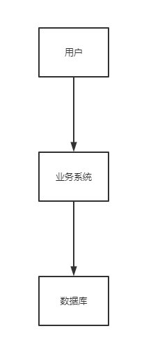
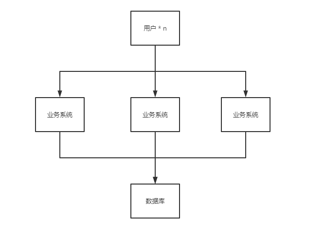
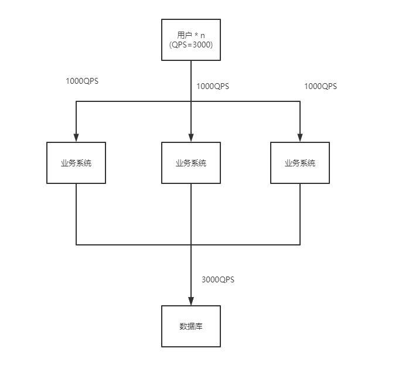
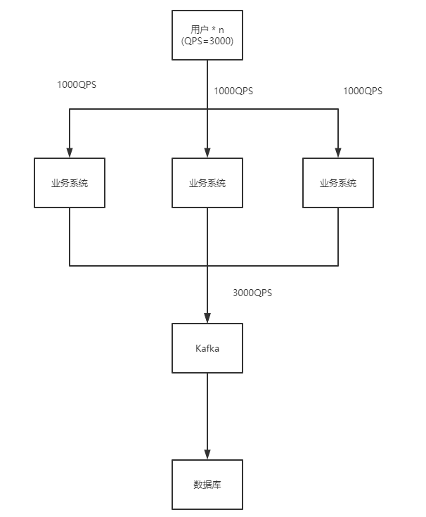
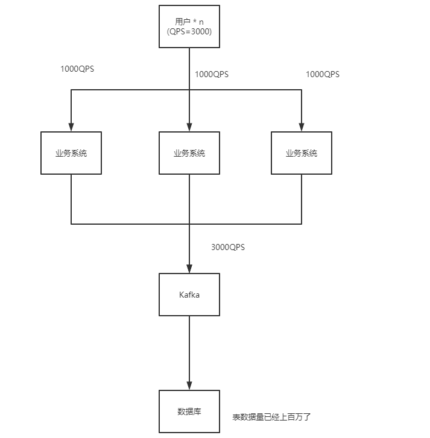
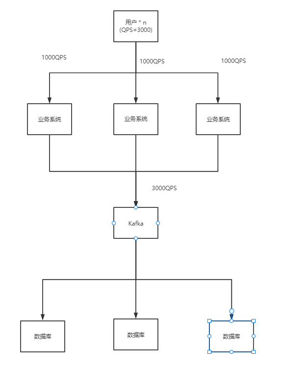

# MySql之分库分表

 

## 为什么要分库分表

在项目的初期，往往会根据团队的人员配置情况和项目紧急情况来做技术选型。即设计一个简单的系统模型或者一个功能完备的系统模型。因为项目未来的走向很难把握，一般不会一上来就就搞一个很复杂的系统，因此大多项目一开始会是一个很简单粗糙的系统。

随着公司的业务发展，在老板的英明带领下，公司的业务蒸蒸日上，用户访问量也渐渐增多了。单个的业务系统应付越来越多的用户访问已经开始变得力不从心了，此时部门老大一声令下，要求多搞几台机器来应对大量的用户访问。于是我们的业务流程架构开始变得复杂起来了。如下：

业务系统搞成上面的样子后，大量的请求也能及时得到处理，总算能交差了。然后就这样坐着工位上翘着脚，安逸的过了几个月的时光。在老板的英明带领下，公司又上了一个台阶，公司的人也渐渐多了起来。咱们做的业务系统也慢慢得到了市场认可，使用它的人也越来越多了。突然部门老大把在工位上打瞌睡的咱叫醒说，”快起来看看，客户说我们的系统越来越慢了，越来越难用了。你快起来看看“。咱一个激灵，心想，”卧槽，是不是出问题了，工作是不是要挂了“。于是赶忙对系统进行分析，然后发现问题出在这里。

虽然我们的应用在几台机器上都部署了，大量用户的访问也能勉强抗得住。但是咱做梦也没想到开发的系统居然能达到3000QPS，虽然每个业务应用只有1000QPS，但是无奈数据库只是一个薄弱单机实例，3000QPS哪里抗得住啊（心里暗暗骂娘这谁受得了啊）。然后赶忙跑到某度和某歌上面查找解决办法。找了半天终于找到了处理方法。

在数据库的上游加了一个MQ来削峰填谷。3000QPS先打在MQ上，然后再慢慢处理Kafka中的数据，这样数据库又能满血复活了。完美收官，把改了的系统上线后，用户的投诉也变少了，又可以安安心心的学习（摸鱼）了。

突然觉得一阵天旋地转，只听耳边传来，“醒醒，醒醒，出问题啦“。突然一个激灵，咱就醒了。原来是用户又投诉系统太慢了，不好用。干嘛打开电脑看看出啥问题了（心里想这个问题上次不是解决了么）。

过了大半天终于找到问题原因了。原来系统经过这么长时间运行，表数据已经积累了百万的数据量了，此时在数据库中无论是查询数据还是插入数据都会慢很多（心里想着，还是老板牛逼，能让业务发展得这么好）。

虽然找到原因了，却一时半会想不出解决办法。扣了半天脑袋，只好又跑到某歌、某度上面找一圈看看能不能有什么收获。

找了一圈下来，决定学习通用的**分库分表**方案来解决问题。

以前的系统虽然采用了分布式的处理手段，但是到了数据库这一层始终是一个单实例的DB在抗压力，现在我们将同样的数据库结构复制多分，然后再根据规则将数据存到对应的数据库实例中去。这样以前一个MySQL实例需要存储几百万数据并且承受所有的访问压力，现在均摊到了多个实例上去了。

照着这个方案改造系统后，系统又可以流畅的运行了。终于用户的怒火算是平息下去了，又可以抄着手学习了（摸鱼），心里想着今年年终奖是不是应该会多一些呢！
