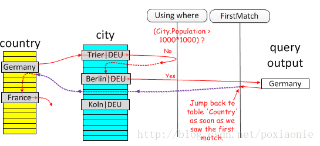
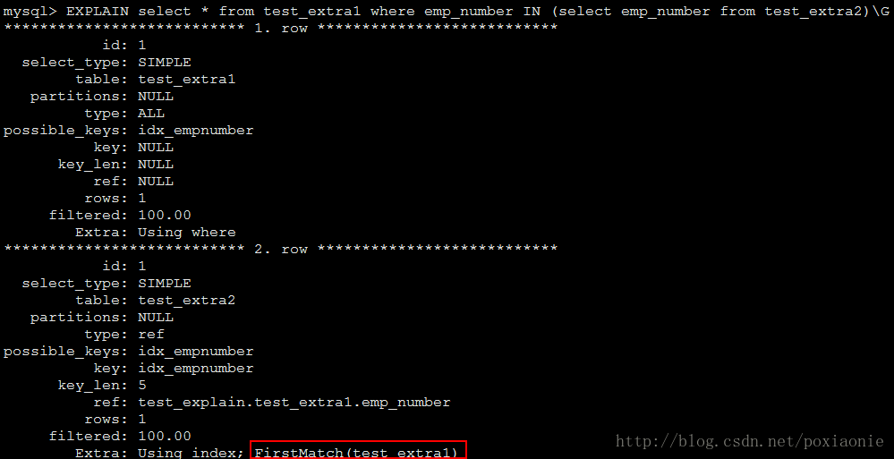
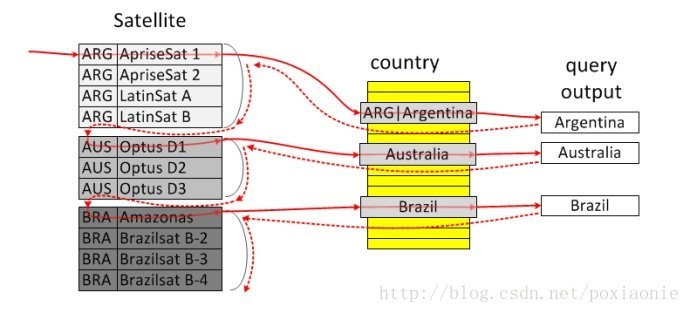
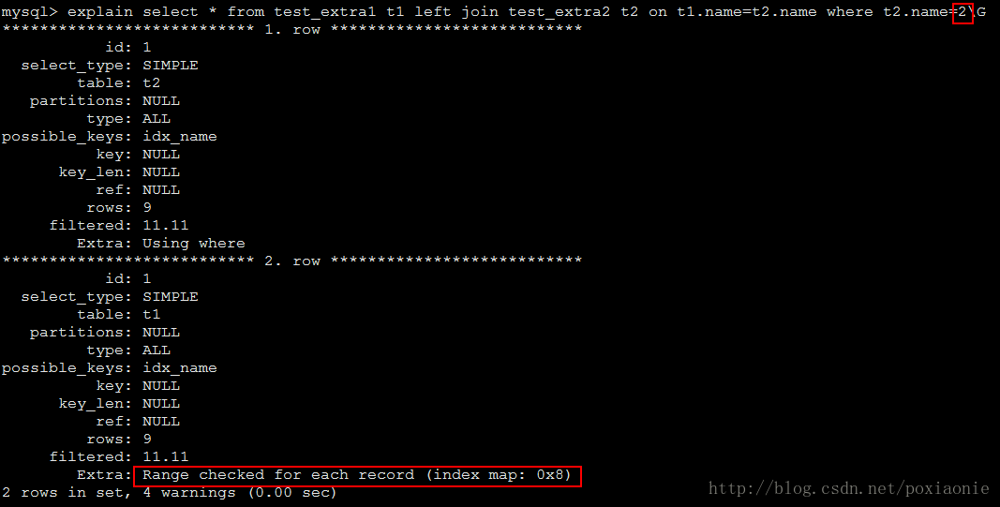
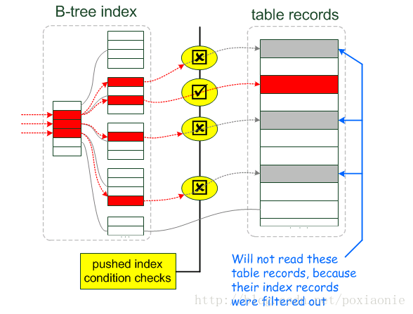

# InnoDB与MyISAM区别

## 简介

**InnoDB**

MySQL的默认的事务性引擎，也是最重要和使用最广发你的存储殷引擎。它为大量的短期事务操作而设计，短期事务大部分情况下是正常提交的，很少被回滚。InnoDB的性功能与自动崩溃恢复的特性，使得它在非实物来存储需求中也很流行。除非有非常特别的原因需要使用其他的存储引擎，否则应该优先考虑InnoDB引擎。

**MyISAM**

在MySQL5.1以前的版本，MyISAM是默认引擎。MyISAM提供了大量的特性，包括全文索引，压缩，空间函数（GIS)等，但MyISAMD并不是支持事务以及行级锁，而且一个毫无疑问的缺陷是奔溃落后无法安全恢复。正式由于MyISAM引擎的缘故，即使MySQL支持事务很长时间了，在很多人的概念中MySQL还是非事务型。尽管这样，它并不是一无是处的。对于只读MyISAM,而是应该默认使用InnoDB。

## 区别

### 1、存储结构

**MyISAM：**每个MyISAM在磁盘上存储成三个文件。第一个文件的名称以表的名字开始，扩展名指出文件类型。.frm文件存储表定义。数据文件的扩展名为.MYD(MyData)。索引文件的扩展名是.MYI(MyIndex)。

**InnoDB：**所有的表都保存在同一个数据文件中（也可能是多个文

件，或者是独立的表空间文件），InnoDB表的大小只受限于操作系统文件的大小，一般为2G。

### 2、存储空间

**MyISAM：**可被压缩，存储空间较小。支持三种不同的存储格式：静态表（默认，但是注意数据末尾不能有空格，会被去掉）、动态表、压缩表。

**InnoDB：**需要更多的内存和存储，它会在主内存中建立其专用的缓冲池用于高速缓冲数据和索引。

### 3、可移植性、备份及恢复

**MyISAM：**数据是以文件的形式存储，所以在跨平台的数据转移中会很方便。在备份和恢复时可单独针对某个表进行操作。

**InnoDB：**免费的方案可以是拷贝数据本舰、备份binlog、或者用mysqldump，在数据量达到几十G的时候就相对痛苦了。

### 4、事务支持

**MyISAM：**强调的是性能、每次查询具有原子性，其执行速度比InnoDB类型更快，但是不提供事务支持。

**InnoDB：**提供事务支持，外键等高级数据库功能。具有事务（commit)、回滚(rollback)可奔溃修复能力(crash recovery capabilities)的事务安全(transaction-safe  既ACID compliant)型表。


# MySQL索引

## 简介

在使用字典的时候，我们可以更加字典等待拼音、部首、笔画来更加快速的去寻找到想要查询的字，而不用一页一页的找。MySQL的的索引也可以做相似的理解，如果说查询没有索引的表是一辆人力三轮车的速度的话，那么加了索引的表则是则是行驶在告诉公路的上跑车。不过添加索引也会带来额外的开销，MySQL会在存储数据的同时额外保存索引相关的信息，因此添加索引也会降低查询、更新、删除的速度。

## 使用

### 普通索引

这是最基本的索引，它没有任何限制。它有以下几种创建方式：

```
CREATE INDEX indexName ON table_name (column_name)
```

如果是CHAR，VARCHAR类型，length可以小于字段实际长度；如果是BLOB和TEXT类型，必须指定 length。

**修改表结构(添加索引)**

```
ALTER table tableName ADD INDEX indexName(columnName)
```

**创建表的时候直接指定**

```
CREATE TABLE mytable(  
 
ID INT NOT NULL,   
 
username VARCHAR(16) NOT NULL,  
 
INDEX [indexName] (username(length))  
 
);  
```

**删除索引的语法**

```
DROP INDEX [indexName] ON mytable; 
```

### 唯一索引

它与前面的普通索引类似，不同的就是：索引列的值必须唯一，但允许有空值。如果是组合索引，则列值的组合必须唯一。它有以下几种创建方式：

**创建索引**

```
CREATE UNIQUE INDEX indexName ON mytable(username(length)) 
```

**修改表结构**

```
ALTER table mytable ADD UNIQUE [indexName] (username(length))
```

**创建表的时候直接指定**

```
CREATE TABLE mytable(  
 
ID INT NOT NULL,   
 
username VARCHAR(16) NOT NULL,  
 
UNIQUE [indexName] (username(length))  
 
);  
```


### 使用ALTER 命令添加和删除索引

有四种方式来添加数据表的索引：

- ALTER TABLE tbl_name ADD PRIMARY KEY (column_list):

   

  该语句添加一个主键，这意味着索引值必须是唯一的，且不能为NULL。

  

- **ALTER TABLE tbl_name ADD UNIQUE index_name (column_list):** 这条语句创建索引的值必须是唯一的（除了NULL外，NULL可能会出现多次）。

- **ALTER TABLE tbl_name ADD INDEX index_name (column_list):** 添加普通索引，索引值可出现多次。

- **ALTER TABLE tbl_name ADD FULLTEXT index_name (column_list):**该语句指定了索引为 FULLTEXT ，用于全文索引。

以下实例为在表中添加索引。

```sql
mysql> ALTER TABLE testalter_tbl ADD INDEX (c);
```

你还可以在 ALTER 命令中使用 DROP 子句来删除索引。尝试以下实例删除索引:

```sql
mysql> ALTER TABLE testalter_tbl DROP INDEX c;
```

------

### 使用 ALTER 命令添加和删除主键

主键作用于列上（可以一个列或多个列联合主键），添加主键索引时，你需要确保该主键默认不为空（NOT NULL）。实例如下：

```sql
mysql> ALTER TABLE testalter_tbl MODIFY i INT NOT NULL;
mysql> ALTER TABLE testalter_tbl ADD PRIMARY KEY (i);
```

你也可以使用 ALTER 命令删除主键：

```sql
mysql> ALTER TABLE testalter_tbl DROP PRIMARY KEY;
```

删除主键时只需指定PRIMARY KEY，但在删除索引时，你必须知道索引名。

------

### 显示索引信息

你可以使用 SHOW INDEX 命令来列出表中的相关的索引信息。可以通过添加 \G 来格式化输出信息。

尝试以下实例:

```sql
mysql> SHOW INDEX FROM table_name; \G
........
```

#  Explain详解

## 简介

在项目的开发过程中，我们都会对自己写的程序进行一些测试，比如用Jmeter之类的测试工具做压测、使用慢查询日志/mySQLdumslow对数据库的查询响应做测试，找到一些执行时间较长的SQL语句，然后对这些语句进行优化。优化的过程一般是这样的，先执行"Explain SQL"，然后对执行计划的结果进行分析，找出对应的语句使用用到索引，是否出现全表扫描等等。

## Explain的使用

````shell
mysql> EXPLAIN SELECT id FROM person WHERE id = '04c9fcbdf2b245f0bc771afff08e6ac5';
+----+-------------+--------+------------+-------+---------------+---------+---------+-------+------+----------+-------------+
| id | select_type | table  | partitions | type  | possible_keys | key     | key_len | ref   | rows | filtered | Extra       |
+----+-------------+--------+------------+-------+---------------+---------+---------+-------+------+----------+-------------+
|  1 | SIMPLE      | person | NULL       | const | PRIMARY       | PRIMARY | 8       | const |    1 |   100.00 | Using index |
+----+-------------+--------+------------+-------+---------------+---------+---------+-------+------+----------+-------------+
1 row in set, 2 warnings (0.00 sec)
````

使用explain执行sql会生成这条sql的执行计划，explain会生成**id、select_type、table、type、possible_keys、key、key_len、ref、rows、Extra**等信息，下面将对他们进行详细介绍。

### 1、id

id是SQL执行成功的标志，同时id也表示着sql执行的优先级，id的优先级会出现两种情况：

1. id相同时，执行顺序由`上至下`执行。
2. 如果是子查询,id的序号会递增，id值越大优先级越高，越先被执行。
3. id如相同，可以认为是一组，从上往下执行；在所有组中，id值越大优先级越高，越先被执行。


````shell
mysql> EXPLAIN SELECT t2.id FROM person t2 WHERE t2.id IN ( SELECT id FROM person WHERE id = '04c9fcbdf2b245f0bc771afff08e6ac5' UNION ALL SELECT id FROM person );
+----+--------------------+--------+------------+--------+---------------+-------------+---------+-------+-------+----------+--------------------------+
| id | select_type        | table  | partitions | type   | possible_keys | key         | key_len | ref   | rows  | filtered | Extra                    |
+----+--------------------+--------+------------+--------+---------------+-------------+---------+-------+-------+----------+--------------------------+
|  1 | PRIMARY            | t2     | NULL       | index  | NULL          | create_time | 4       | NULL  | 93089 |   100.00 | Using where; Using index |
|  2 | DEPENDENT SUBQUERY | person | NULL       | const  | PRIMARY       | PRIMARY     | 8       | const |     1 |   100.00 | Using index              |
|  3 | DEPENDENT UNION    | person | NULL       | eq_ref | PRIMARY       | PRIMARY     | 8       | func  |     1 |   100.00 | Using index              |
+----+--------------------+--------+------------+--------+---------------+-------------+---------+-------+-------+----------+--------------------------+
3 rows in set, 2 warnings (0.00 sec)

显然这条sql的是由内向外执行。
````


### 2、select_type

select类型，主要由一下几种

#### 一、SIMPLE

最简单的select(不使用UNION或子查询等)例如：

````shell
mysql> EXPLAIN SELECT id FROM person WHERE id = '04c9fcbdf2b245f0bc771afff08e6ac5';
+----+-------------+--------+------------+-------+---------------+---------+---------+-------+------+----------+-------------+
| id | select_type | table  | partitions | type  | possible_keys | key     | key_len | ref   | rows | filtered | Extra       |
+----+-------------+--------+------------+-------+---------------+---------+---------+-------+------+----------+-------------+
|  1 | SIMPLE      | person | NULL       | const | PRIMARY       | PRIMARY | 8       | const |    1 |   100.00 | Using index |
+----+-------------+--------+------------+-------+---------------+---------+---------+-------+------+----------+-------------+
1 row in set, 2 warnings (0.00 sec)
````


#### 二、PRIMARY

PRIMARY：查询中包含任何复杂的`子部分`，最外层查询则标记为**PRIMARY**

SUBQUERY：在select 或where 列表中包含了子查询

````shell
mysql> EXPLAIN SELECT * FROM person WHERE id = (SELECT id FROM person WHERE id = '04c9fcbdf2b245f0bc771afff08e6ac5')
    -> ;
+----+-------------+--------+------------+-------+---------------+---------+---------+-------+------+----------+-------------+
| id | select_type | table  | partitions | type  | possible_keys | key     | key_len | ref   | rows | filtered | Extra       |
+----+-------------+--------+------------+-------+---------------+---------+---------+-------+------+----------+-------------+
|  1 | PRIMARY     | person | NULL       | const | PRIMARY       | PRIMARY | 8       | const |    1 |   100.00 | NULL        |
|  2 | SUBQUERY    | person | NULL       | const | PRIMARY       | PRIMARY | 8       | const |    1 |   100.00 | Using index |
+----+-------------+--------+------------+-------+---------------+---------+---------+-------+------+----------+-------------+
2 rows in set, 2 warnings (0.00 sec)
````

#### 三、DERIVED(衍生)

在FROM列表中包含的子查询被标记为`DERIVED`，MySQL会递归执行这些子查询，把结果放在临时表里。

````shell
mysql> explain select *  from (select *  from person) a where id=2;
+----+-------------+------------+------+---------------+-------------+---------+-------+------+-------+
| id | select_type | table      | type | possible_keys | key         | key_len | ref   | rows | Extra |
+----+-------------+------------+------+---------------+-------------+---------+-------+------+-------+
|  1 | PRIMARY     | <derived2> | ref  | <auto_key0>   | <auto_key0> | 4       | const |    0 | NULL  |
|  2 | DERIVED     | person     | ALL  | NULL          | NULL        | NULL    | NULL  |    4 | NULL  |
+----+-------------+------------+------+---------------+-------------+---------+-------+------+-------+
容易发现DERIVED的会先执行。
````

#### 四、UNION 

若第二个SELECT出现在UNION后，则编辑为UNION

````shell
mysql> EXPLAIN SELECT id FROM person WHERE id = '04c9fcbdf2b245f0bc771afff08e6ac5' UNION ALL SELECT id FROM person;
+----+-------------+--------+------------+-------+---------------+-------------+---------+-------+-------+----------+-------------+
| id | select_type | table  | partitions | type  | possible_keys | key         | key_len | ref   | rows  | filtered | Extra       |
+----+-------------+--------+------------+-------+---------------+-------------+---------+-------+-------+----------+-------------+
|  1 | PRIMARY     | person | NULL       | const | PRIMARY       | PRIMARY     | 8       | const |     1 |   100.00 | Using index |
|  2 | UNION       | person | NULL       | index | NULL          | create_time | 4       | NULL  | 93089 |   100.00 | Using index |
+----+-------------+--------+------------+-------+---------------+-------------+---------+-------+-------+----------+-------------+
2 rows in set, 2 warnings (0.00 sec)
````

#### 五、DEPENDENT UNION

当UNION作为子查询时，第二或是第二个后的select的select_type值

````shell
mysql> EXPLAIN SELECT t1.id FROM person t1 WHERE t1.id in ( SELECT t2.id FROM person t2 WHERE id = '04c9fcbdf2b245f0bc771afff08e6ac5' UNION ALL SELECT t3.id FROM person t3);
+----+--------------------+-------+------------+--------+---------------+-------------+---------+-------+-------+----------+--------------------------+
| id | select_type        | table | partitions | type   | possible_keys | key         | key_len | ref   | rows  | filtered | Extra                    |
+----+--------------------+-------+------------+--------+---------------+-------------+---------+-------+-------+----------+--------------------------+
|  1 | PRIMARY            | t1    | NULL       | index  | NULL          | create_time | 4       | NULL  | 93089 |   100.00 | Using where; Using index |
|  2 | DEPENDENT SUBQUERY | t2    | NULL       | const  | PRIMARY       | PRIMARY     | 8       | const |     1 |   100.00 | Using index              |
|  3 | DEPENDENT UNION    | t3    | NULL       | eq_ref | PRIMARY       | PRIMARY     | 8       | func  |     1 |   100.00 | Using index              |
+----+--------------------+-------+------------+--------+---------------+-------------+---------+-------+-------+----------+--------------------------+
3 rows in set, 2 warnings (0.00 sec)
````


#### 六、SUBQUERY

SUBQUERY：子查询中的第一个SELECT。

#### 七、DEPENDENT SUBQUERY

DEPENDENT SUBQUERY：子查询中的第一个select，取决于外面的查询。这句话怎么理解呢，先看下表的SQL执行计划吧。

````shell
mysql> EXPLAIN SELECT t1.id FROM person t1 WHERE t1.id in ( SELECT t2.id FROM person t2 WHERE id = '04c9fcbdf2b245f0bc771afff08e6ac5' UNION ALL SELECT t3.id FROM person t3);
+----+--------------------+-------+------------+--------+---------------+-------------+---------+-------+-------+----------+--------------------------+
| id | select_type        | table | partitions | type   | possible_keys | key         | key_len | ref   | rows  | filtered | Extra                    |
+----+--------------------+-------+------------+--------+---------------+-------------+---------+-------+-------+----------+--------------------------+
|  1 | PRIMARY            | t1    | NULL       | index  | NULL          | create_time | 4       | NULL  | 93089 |   100.00 | Using where; Using index |
|  2 | DEPENDENT SUBQUERY | t2    | NULL       | const  | PRIMARY       | PRIMARY     | 8       | const |     1 |   100.00 | Using index              |
|  3 | DEPENDENT UNION    | t3    | NULL       | eq_ref | PRIMARY       | PRIMARY     | 8       | func  |     1 |   100.00 | Using index              |
+----+--------------------+-------+------------+--------+---------------+-------------+---------+-------+-------+----------+--------------------------+
3 rows in set, 2 warnings (0.00 sec)
````

从上表可以看出在id为2的这行出现了DEPENDENT SUBQUERY，什么意思呢？它意味着两步：

1. 首先执行`SELECT t1.id FROM person t1`  等到一个大结果b1，其数量就是93089了。
2. 上面的大结果b1中的每一行记录，都将与子查询SQL组成新的查询语句：`SELECT t2.id FROM person t2 WHERE id = '04c9fcbdf2b245f0bc771afff08e6ac5' UNION ALL SELECT t3.id FROM person t3 where id = %b1.id%`

等于说子查询要执行93089次，即使这两步都用到了索引，执行速度也会大大降低。

### 3、table

代表表名。有时不是真实的表名,看到的是<derived**X**>(数字X是第几步执行的结果)

````shell
mysql> explain select * from (select * from ( select * from person where id=123) a) b;
+----+-------------+------------+--------+-------------------+---------+---------+------+------+-------+
| id | select_type | table      | type   | possible_keys     | key     | key_len | ref  | rows | Extra |
+----+-------------+------------+--------+-------------------+---------+---------+------+------+-------+
|  1 | PRIMARY     | <derived2> | system | NULL              | NULL    | NULL    | NULL |    1 |       |
|  2 | DERIVED     | <derived3> | system | NULL              | NULL    | NULL    | NULL |    1 |       |
|  3 | DERIVED     | t3         | const  | PRIMARY,idx_t3_id | PRIMARY | 4       |      |    1 |       |
+----+-------------+------------+--------+-------------------+---------+---------+------+------+-------+
````

### 4、type

使用了哪种类别，是否使用索引.

> system > const > eq_ref > ref > range > index > ALL（从左到右，性能从好到差）


| **链接类型**    | 说明                                                         |
| --------------- | ------------------------------------------------------------ |
| system          | 表只有**一行**，`MyISAM`引擎。                               |
| const           | 常量连接，表最多只有一行匹配，通常用于主键或者唯一主键索引比较时。 |
| eq_ref          | 每次与之前的表合并行都                                       |
| ref             | 如果每次只匹配少数行，那就是比较好的一种，使用=或<=>，可以是左覆盖索引或**非主键**或**非唯一**键 |
| fulltext        | 全文索引                                                     |
| ref_or_null     | 与`ref`类似，但包含`NULL`                                    |
| index_merge     | 表示出现了索引合并优化（包括交集，并集以及交集之间的并集），但不包括跨表和全文索引。这个比较复杂，目前的理解是合并单表的范围索引扫描（如果成本估算比普通估算的range要优的话） |
| unique_subquery | 在in子查询，就是value in(select ...)把形如select unique_key_column的子查询替换。PS：所以不一定in子句使用子查询就是低效的！ |
| index_subquery  | 同上，但把形如“select non_unique_key_column"的子查询替换     |
| range           | 常数值的范围                                                 |
| index           | 索引树扫描。a.当查询时索引覆盖的，即所有数据均可从索引树取的时候（Extra中有Using Index）；b.以索引顺序从索引中查找数据行的全表扫描（无Using Index)；c.如果Extra中Using Index与Using Where同时出现的话，则是利用索引查找键值的意思；d.如单独出现，则是用读索引来代替读行，但不用于查找。 |
| all             | 全表扫描（full table scan)                                   |

#### 一、system

````sql
CREATE TABLE `person` (
  `id` int(10) UNSIGNED NOT NULL AUTO_INCREMENT,
  `name` varchar(255) NOT NULL,
  PRIMARY KEY (`id`)
) ENGINE=MyISAM DEFAULT CHARSET=utf8;
INSERT INTO `news` (`id`, `name`) VALUES
(1, 'test');

mysql> explain select * from peron where id=1;
+----+-------------+-------+------------+--------+---------------+------+---------+------+------+----------+-------+
| id | select_type | table | partitions | type   | possible_keys | key  | key_len | ref  | rows | filtered | Extra |
+----+-------------+-------+------------+--------+---------------+------+---------+------+------+----------+-------+
|  1 | SIMPLE      | news  | NULL       | system | PRIMARY       | NULL | NULL    | NULL |    1 |   100.00 | NULL  |
+----+-------------+-------+------------+--------+---------------+------+---------+------+------+----------+-------+
1 row in set, 1 warning (0.00 sec)
````

主键或唯一索引查找常量值，只有一条记录，并且是MyISAM引擎

#### 二、const

````shell
INSERT INTO `peron` (`id`, `name`) VALUES (NULL, 'las');

mysql> EXPLAIN select * from peron where id=1;
+----+-------------+-------+------------+-------+---------------+---------+---------+-------+------+----------+-------+
| id | select_type | table | partitions | type  | possible_keys | key     | key_len | ref   | rows | filtered | Extra |
+----+-------------+-------+------------+-------+---------------+---------+---------+-------+------+----------+-------+
|  1 | SIMPLE      | news  | NULL       | const | PRIMARY       | PRIMARY | 4       | const |    1 |   100.00 | NULL  |
+----+-------------+-------+------------+-------+---------------+---------+---------+-------+------+----------+-------+
1 row in set, 1 warning (0.00 sec)
````

const的扫描条件为：

1. 命中的主键(primary key)或者唯一（unique)索引
2. 被连接的部分是一个常量（const)


#### 三、eq_ref

````sql
CREATE TABLE `content` (
  `id` int(10) UNSIGNED NOT NULL AUTO_INCREMENT,
  `news_id` int(10) UNSIGNED NOT NULL,
  `content` text NOT NULL,
  PRIMARY KEY (`id`)
) ENGINE=INNODB DEFAULT CHARSET=utf8;
INSERT INTO `content` (`id`, `news_id`, `content`) VALUES (NULL, '1', 'content');
INSERT INTO `content` (`id`, `news_id`, `content`) VALUES (NULL, '2', 'content2');

mysql> EXPLAIN SELECT * FROM `news` JOIN `content` ON news.id=content.news_id;
+----+-------------+---------+------------+--------+---------------+---------+---------+----------------------+------+----------+-------+
| id | select_type | table   | partitions | type   | possible_keys | key     | key_len | ref                  | rows | filtered | Extra |
+----+-------------+---------+------------+--------+---------------+---------+---------+----------------------+------+----------+-------+
|  1 | SIMPLE      | content | NULL       | ALL    | NULL          | NULL    | NULL    | NULL                 |    2 |   100.00 | NULL  |
|  1 | SIMPLE      | news    | NULL       |eq_ref| PRIMARY       | PRIMARY | 4       | test.content.news_id |    1 |   100.00 | NULL  |
+----+-------------+---------+------------+--------+---------------+---------+---------+----------------------+------+----------+-------+
````

eq_ref扫描的条件为，对于前表的每一行(row)，后表只有一行被扫描:

1. `join`查询
2. 命中`主键`(primary)或者`非空唯一索引`(unique not null)
3. 等值连接

#### 四、ref

````sql
mysql> ALTER TABLE `news` ADD INDEX(`title`);
Query OK, 2 rows affected (0.07 sec)
Records: 2  Duplicates: 0  Warnings: 0

mysql> explain SELECT * FROM news where title="test";
+----+-------------+-------+------------+------+---------------+-------+---------+-------+------+----------+-------+
| id | select_type | table | partitions | type | possible_keys | key   | key_len | ref   | rows | filtered | Extra |
+----+-------------+-------+------------+------+---------------+-------+---------+-------+------+----------+-------+
|  1 | SIMPLE      | news  | NULL       | ref  | title         | title | 767     | const |    1 |   100.00 | NULL  |
+----+-------------+-------+------------+------+---------------+-------+---------+-------+------+----------+-------+
1 row in set, 1 warning (0.00 sec)
````

当id被改为普通非唯一索引title后，常量的连接查询，也有const降级为了ref，因为也可能多于一行的数据的数据被扫描。

ref扫描，可能出现在join里，也可能出现在单表普通索引里，每次匹配可能有多行数据返回，虽然它比eq_ref慢，但它仍然是一个很快的join类型。

#### 五、range

````sql
mysql> explain SELECT * FROM news where id>1;
+----+-------------+-------+------------+-------+---------------+---------+---------+------+------+----------+-----------------------+
| id | select_type | table | partitions | type  | possible_keys | key     | key_len | ref  | rows | filtered | Extra                 |
+----+-------------+-------+------------+-------+---------------+---------+---------+------+------+----------+-----------------------+
|  1 | SIMPLE      | news  | NULL       | range | PRIMARY       | PRIMARY | 4       | NULL |    2 |   100.00 | Using index condition |
+----+-------------+-------+------------+-------+---------------+---------+---------+------+------+----------+-----------------------+
1 row in set, 1 warning (0.00 sec)
````

between、in、>、<都是典型的范围查询

#### 六、index

如果是MyISAM引擎，type是NULL.

````sql
mysql> explain SELECT count(*) FROM news;
+----+-------------+-------+------------+------+---------------+------+---------+------+------+----------+------------------------------+
| id | select_type | table | partitions | type | possible_keys | key  | key_len | ref  | rows | filtered | Extra                        |
+----+-------------+-------+------------+------+---------------+------+---------+------+------+----------+------------------------------+
|  1 | SIMPLE      | NULL  | NULL       | NULL | NULL          | NULL | NULL    | NULL | NULL |     NULL | Select tables optimized away |
+----+-------------+-------+------------+------+---------------+------+---------+------+------+----------+------------------------------+
1 row in set, 1 warning (0.00 sec)
````

如果是INNODB引擎则显示为index

````shell
mysql> ALTER TABLE `news` ENGINE = InnoDB;
Query OK, 2 rows affected (0.06 sec)
Records: 2  Duplicates: 0  Warnings: 0

mysql> explain SELECT count(*) FROM news;
+----+-------------+-------+------------+-------+---------------+-------+---------+------+------+----------+-------------+
| id | select_type | table | partitions | type  | possible_keys | key   | key_len | ref  | rows | filtered | Extra       |
+----+-------------+-------+------------+-------+---------------+-------+---------+------+------+----------+-------------+
|  1 | SIMPLE      | news  | NULL       | index | NULL          | title | 767     | NULL |    2 |   100.00 | Using index |
+----+-------------+-------+------------+-------+---------------+-------+---------+------+------+----------+-------------+
1 row in set, 1 warning (0.00 sec)
````

index类型，需要**扫描索引上的全部数据**。

#### 七、ALL

````shell
mysql> explain select * from content;
+----+-------------+---------+------------+------+---------------+------+---------+------+------+----------+-------+
| id | select_type | table   | partitions | type | possible_keys | key  | key_len | ref  | rows | filtered | Extra |
+----+-------------+---------+------------+------+---------------+------+---------+------+------+----------+-------+
|  1 | SIMPLE      | content | NULL       | ALL  | NULL          | NULL | NULL    | NULL |    2 |   100.00 | NULL  |
+----+-------------+---------+------------+------+---------------+------+---------+------+------+----------+-------+
1 row in set, 1 warning (0.00 sec)
````

all则是全表扫描，在写sql的时候，要尽量避免这种情况的发生。

#### 八、总结

system最快：很少能出现。
const：PK或者unique上的等值查询
eq_ref：PK或者unique上的join查询，等值匹配，对于前表的每一行(row)，后表只有一行命中
ref：非唯一索引，等值匹配，可能有多行命中
range：索引上的范围扫描，例如：between/in/>
index：索引上的全集扫描，例如：InnoDB的count
ALL最慢：全表扫描(full table scan)

### 5、possible_keys

显示可能应用在这张表中的索引，一个或多个。查询涉及到的字段上若存在索引，则该索引将被列出，但不一定被查询实际使用。

如果该列是NULL，则没有相关的索引。在这种情况下，可以通过检查where子句看它是否引用某些列或者适合索引的列来提高你的查询性能。如果是这样，创造一个适当的索引并且再用EXPLAIN检查索引。

### 6、key

key列显示MySQL实际决定使用的键（索引），如果没有选择索引，则显示为NULL。要想强制MySQL使用或忽视possible_keys列中的索引，在查询中使用FORCE INDEX,USE INDEX或者INGORE INDEX。

### 7、ken_len

ken_len显示MySQL决定使用的键长度（单位：字节）。如果键是NULL，则长度为NULL。使用的索引的长度在不损失精度的情况下，长度越短越好。

### 8、ref

表示上述表的连接匹配条件，即哪些列或者常量被用于索引列上的值。

### 9、rows

rows列显示MySQL认为它执行查询时必须检查的行数。

### 10、Extra

> 参考自：https://blog.csdn.net/poxiaonie/article/details/77757471

接下来主要针对extra字段进行详细解释，EXPLAIN输出的Extra列包含有关MySQL如何解析查询的其他信息。此字段能够给出让我们深入理解执行计划进一步的细节信息，比如是否使用ICP，MRR等。
首先说明下在extra字段进行测试过程中使用到的表和MySQL版本：

````shell
CREATE TABLE `test_extra1` (
  `id` int(11) NOT NULL AUTO_INCREMENT,
  `emp_number` int(11) NOT NULL,
  `name` varchar(30) NOT NULL DEFAULT '',
  `age` int(11) DEFAULT NULL,
  `address` varchar(50) DEFAULT NULL,
  `region` varchar(20) DEFAULT NULL,
  PRIMARY KEY (`id`),
  KEY `idx_empnumber` (`emp_number`),
  KEY `idx_region` (`region`)
) ENGINE=InnoDB DEFAULT CHARSET=utf8;

CREATE TABLE `test_extra2` (
  `id` int(11) NOT NULL AUTO_INCREMENT,
  `name` varchar(30) NOT NULL DEFAULT '',
  `emp_number` int(11) NOT NULL,
  `salary` decimal(10,2) NOT NULL DEFAULT '0.00',
  PRIMARY KEY (`id`),
  UNIQUE KEY `idx_empnumber` (`emp_number`),
  KEY `idx_name` (`name`)
) ENGINE=InnoDB DEFAULT CHARSET=utf8;

mysql> select @@version;
+-----------+
| @@version |
+-----------+
| 5.7.14    |
+-----------+
1 row in set (0.00 sec)
````

extra字段详细解释说明：

#### 一、const row not found

````sql
mysql> explain select * from test_extra1 where id = 12321;
+----+-------------+-------+------------+------+---------------+------+---------+------+------+----------+--------------------------------+
| id | select_type | table | partitions | type | possible_keys | key  | key_len | ref  | rows | filtered | Extra                          |
+----+-------------+-------+------------+------+---------------+------+---------+------+------+----------+--------------------------------+
|  1 | SIMPLE      | NULL  | NULL       | NULL | NULL          | NULL | NULL    | NULL | NULL |     NULL | no matching row in const table |
+----+-------------+-------+------------+------+---------------+------+---------+------+------+----------+--------------------------------+
1 row in set, 1 warning (0.00 sec)
````

For a query such as SELECT … FROM tbl_name, the table was empty.(类似于select …. from tbl_name，而表记录为空)

#### 二、Deleting all rows

For DELETE, some storage engines (such as MyISAM) support a handler method that removes all table rows in a simple and fast way. This Extra value is displayed if the engine uses this optimization. (对于DELETE，一些存储引擎（如MyISAM）支持一种处理方法，可以简单而快速地删除所有的表行。 如果引擎使用此优化，则会显示此额外值)

#### 三、Distinct

The semi-join FirstMatch join shortcutting strategy is used for tbl_name. (半连接去重执行优化策略，当匹配了第一个值之后立即放弃之后记录的搜索。这为表扫描提供了一个早期退出机制而且还消除了不必要记录的产生)；如下图所示：



**注：**半连接： 当一张表在另一张表找到匹配的记录之后，半连接（semi-jion）返回第一张表中的记录。与条件连接相反，即使在右节点中找到几条匹配的记录，左节点的表也只会返回一条记录。另外，右节点的表一条记录也不会返回。半连接通常使用IN或EXISTS 作为连接条件。



#### 四、Full scan on NULL key

This occurs for subquery optimization as a fallback strategy when the optimizer cannot use an index-lookup access method.(子查询中的一种优化方式，主要在遇到无法通过索引访问null值的使用)

#### 五、LooseScan(m..n)

> 这里俺也没看懂，不过先记录下来吧

The semi-join LooseScan strategy is used. m and n are key part numbers. 利用索引来扫描一个子查询表可以从每个子查询的值群组中选出一个单一的值。松散扫描(LooseScan)策略采用了分组，子查询中的字段作为一个索引且外部SELECT语句可以可以与很多的内部SELECT记录相匹配。如此便会有通过索引对记录进行分组的效果。
如下图所示



#### 六、Impossible HAVING

The HAVING clause is always false and cannot select any rows.(HAVING子句总是为false，不能选择任何行)

````shell
mysql> explain select * from test_extra1 group by age having 1 < 0;
+----+-------------+-------+------------+------+---------------+------+---------+------+------+----------+-------------------+
| id | select_type | table | partitions | type | possible_keys | key  | key_len | ref  | rows | filtered | Extra             |
+----+-------------+-------+------------+------+---------------+------+---------+------+------+----------+-------------------+
|  1 | SIMPLE      | NULL  | NULL       | NULL | NULL          | NULL | NULL    | NULL | NULL |     NULL | Impossible HAVING |
+----+-------------+-------+------------+------+---------------+------+---------+------+------+----------+-------------------+
1 row in set, 1 warning (0.00 sec)
````

#### 七、Impossible WHERE

The WHERE clause is always false and cannot select any rows.(WHERE子句始终为false，不能选择任何行)

````sql
mysql> explain select  * from test where 1 = 2;
+----+-------------+-------+------------+------+---------------+------+---------+------+------+----------+------------------+
| id | select_type | table | partitions | type | possible_keys | key  | key_len | ref  | rows | filtered | Extra            |
+----+-------------+-------+------------+------+---------------+------+---------+------+------+----------+------------------+
|  1 | SIMPLE      | NULL  | NULL       | NULL | NULL          | NULL | NULL    | NULL | NULL |     NULL | Impossible WHERE |
+----+-------------+-------+------------+------+---------------+------+---------+------+------+----------+------------------+
1 row in set, 1 warning (0.00 sec)
````

#### 八、Impossible WHERE noticed after reading const tables

MySQL has read all const (and system) tables and notice that the WHERE clause is always false.(MySQL读取了所有的const和system表，并注意到WHERE子句总是为false)

````sql
mysql> explain select count(0) from test_extra1 where id = 1 and age != 18;
+----+-------------+-------+------------+------+---------------+------+---------+------+------+----------+--------------------------------+
| id | select_type | table | partitions | type | possible_keys | key  | key_len | ref  | rows | filtered | Extra                          |
+----+-------------+-------+------------+------+---------------+------+---------+------+------+----------+--------------------------------+
|  1 | SIMPLE      | NULL  | NULL       | NULL | NULL          | NULL | NULL    | NULL | NULL |     NULL | no matching row in const table |
+----+-------------+-------+------------+------+---------------+------+---------+------+------+----------+--------------------------------+
1 row in set, 1 warning (0.00 sec)
````

#### 九、No matching min/max row

No row satisfies the condition for a query such as SELECT MIN(…) FROM … WHERE condition.(没有满足SELECT MIN（…）FROM … WHERE查询条件的行)
示例中，emp_number最小值为1001，没有满足条件的行:

````shell
mysql> explain select  min(id) from person where id < "0";
+----+-------------+-------+------------+------+---------------+------+---------+------+------+----------+-------------------------+
| id | select_type | table | partitions | type | possible_keys | key  | key_len | ref  | rows | filtered | Extra                   |
+----+-------------+-------+------------+------+---------------+------+---------+------+------+----------+-------------------------+
|  1 | SIMPLE      | NULL  | NULL       | NULL | NULL          | NULL | NULL    | NULL | NULL |     NULL | No matching min/max row |
+----+-------------+-------+------------+------+---------------+------+---------+------+------+----------+-------------------------+
1 row in set, 1 warning (0.00 sec)
````

#### 十、no matching row in const table

For a query with a join, there was an empty table or a table with no rows satisfying a unique index condition.(表为空或者表中根据唯一键查询时没有匹配的行)

````sql
mysql> explain select min(salary) from test_extra2 where emp_number=10000;
+----+-------------+-------+------------+------+---------------+------+---------+------+------+----------+--------------------------------+
| id | select_type | table | partitions | type | possible_keys | key  | key_len | ref  | rows | filtered | Extra                          |
+----+-------------+-------+------------+------+---------------+------+---------+------+------+----------+--------------------------------+
|  1 | SIMPLE      | NULL  | NULL       | NULL | NULL          | NULL | NULL    | NULL | NULL |     NULL | no matching row in const table |
+----+-------------+-------+------------+------+---------------+------+---------+------+------+----------+--------------------------------+
1 row in set, 1 warning (0.00 sec)
````

#### 十一、No matching rows after partition pruning

For DELETE or UPDATE, the optimizer found nothing to delete or update after partition pruning. It is similar in meaning to Impossible WHERE for SELECT statements.(对于DELETE或UPDATE，优化器在分区修剪后没有发现任何删除或更新。 对于SELECT语句，它与Impossible WHERE的含义相似)

#### 十二、No tables used

The query has no FROM clause, or has a FROM DUAL clause.(没有FROM子句或者使用DUAL虚拟表)	

````sql
mysql> explain select sleep(10);
+----+-------------+-------+------------+------+---------------+------+---------+------+------+----------+----------------+
| id | select_type | table | partitions | type | possible_keys | key  | key_len | ref  | rows | filtered | Extra          |
+----+-------------+-------+------------+------+---------------+------+---------+------+------+----------+----------------+
|  1 | SIMPLE      | NULL  | NULL       | NULL | NULL          | NULL | NULL    | NULL | NULL |     NULL | No tables used |
+----+-------------+-------+------------+------+---------------+------+---------+------+------+----------+----------------+
````

#### 十三、Not exists

> 没看懂，先记录下来

MySQL能够对查询执行LEFT JOIN优化，并且在找到与LEFT JOIN条件匹配的一行后，不会在上一行组合中检查此表中的更多行。例如：
SELECT * FROM t1 LEFT JOIN t2 ON t1.id = t2.id
WHERE t2.id IS NULL;
假设t2.id被定义为NOT NULL。 在这种情况下，MySQL会扫描t1，并使用t1.id的值查找t2中的行。 如果MySQL在t2中找到一个匹配的行，它会知道t2.id永远不会为NULL，并且不扫描t2中具有相同id值的其余行。 换句话说，对于t1中的每一行，MySQL只需要在t2中只执行一次查找，而不考虑在t2中实际匹配的行数。



#### 十四、Select tables optimized away

当我们使用某些聚合函数来访问存在索引的某个字段时，优化器会通过索引直接一次定位到所需要的数据行完成整个查询。在使用某些聚合函数如min, max的query，直接访问存储结构(B树或者B+树)的最左侧叶子节点或者最右侧叶子节点即可，这些可以通过index解决。Select count(*) from table(不包含where等子句)，MyISAM保存了记录的总数，可以直接返回结果，而Innodb需要全表扫描。Query中不能有group by操作;

#### 十五、Skip_open_table, Open_frm_only, Open_full_table

这些值表示适用于INFORMATION_SCHEMA表查询的文件打开优化；
Skip_open_table：表文件不需要打开。信息已经通过扫描数据库目录在查询中实现可用。
Open_frm_only：只需要打开表的.frm文件。
Open_full_table：未优化的信息查找。必须打开.frm，.MYD和.MYI文件。

#### 十六、unique row not found

对于诸如SELECT … FROM tbl_name的查询，没有行满足表上的UNIQUE索引或PRIMARY KEY的条件。

#### 十七、Using filesort

当Query 中包含 ORDER BY 操作，而且无法利用索引完成排序操作的时候，MySQL Query Optimizer 不得不选择相应的排序算法来实现。数据较少时从内存排序，否则从磁盘排序。Explain不会显示的告诉客户端用哪种排序。官方解释：“MySQL需要额外的一次传递，以找出如何按排序顺序检索行。通过根据联接类型浏览所有行并为所有匹配WHERE子句的行保存排序关键字和行的指针来完成排序。然后关键字被排序，并按排序顺序检索行”

#### 十八、Using index

仅使用索引树中的信息从表中检索列信息，而不需要进行附加搜索来读取实际行(使用二级覆盖索引即可获取数据)。 当查询仅使用作为单个索引的一部分的列时，可以使用此策略。
示例中第一个查询所有数据时，无法通过emp_number的覆盖索引来获取整行数据，所以需要根据主键id回表查询表数据。

````shell
mysql> explain select id,emp_number from test_extra2 where emp_number = 1;
+----+-------------+-------+------------+------+---------------+------+---------+------+------+----------+--------------------------------+
| id | select_type | table | partitions | type | possible_keys | key  | key_len | ref  | rows | filtered | Extra                          |
+----+-------------+-------+------------+------+---------------+------+---------+------+------+----------+--------------------------------+
|  1 | SIMPLE      | NULL  | NULL       | NULL | NULL          | NULL | NULL    | NULL | NULL |     NULL | no matching row in const table |
+----+-------------+-------+------------+------+---------------+------+---------+------+------+----------+--------------------------------+
1 row in set, 1 warning (0.00 sec)

mysql>
mysql> explain select id,emp_number from test_extra1 where emp_number = 1;
+----+-------------+-------------+------------+------+---------------+---------------+---------+-------+------+----------+-------------+
| id | select_type | table       | partitions | type | possible_keys | key           | key_len | ref   | rows | filtered | Extra       |
+----+-------------+-------------+------------+------+---------------+---------------+---------+-------+------+----------+-------------+
|  1 | SIMPLE      | test_extra1 | NULL       | ref  | idx_empnumber | idx_empnumber | 4       | const |    1 |   100.00 | Using index |
+----+-------------+-------------+------------+------+---------------+---------------+---------+-------+------+----------+-------------+
1 row in set, 1 warning (0.00 sec)

mysql> explain select * from test_extra1 where emp_number = 1;
+----+-------------+-------------+------------+------+---------------+---------------+---------+-------+------+----------+-------+
| id | select_type | table       | partitions | type | possible_keys | key           | key_len | ref   | rows | filtered | Extra |
+----+-------------+-------------+------------+------+---------------+---------------+---------+-------+------+----------+-------+
|  1 | SIMPLE      | test_extra1 | NULL       | ref  | idx_empnumber | idx_empnumber | 4       | const |    1 |   100.00 | NULL  |
+----+-------------+-------------+------------+------+---------------+---------------+---------+-------+------+----------+-------+
1 row in set, 1 warning (0.00 sec)
````

#### 十九、Using index condition

Using index condition 会先条件过滤索引，过滤完索引后找到所有符合索引条件的数据行，随后用 WHERE 子句中的其他条件去过滤这些数据行；

````sql
mysql> explain select * from test_extra1 where emp_number > 1;
+----+-------------+-------------+------------+-------+---------------+---------------+---------+------+------+----------+-----------------------+
| id | select_type | table       | partitions | type  | possible_keys | key           | key_len | ref  | rows | filtered | Extra                 |
+----+-------------+-------------+------------+-------+---------------+---------------+---------+------+------+----------+-----------------------+
|  1 | SIMPLE      | test_extra1 | NULL       | range | idx_empnumber | idx_empnumber | 4       | NULL |    1 |   100.00 | Using index condition |
+----+-------------+-------------+------------+-------+---------------+---------------+---------+------+------+----------+-----------------------+
````

因为MySQL的架构原因，分成了server层和引擎层，才有所谓的“下推”的说法。所以ICP其实就是实现了index filter技术，将原来的在server层进行的table filter中可以进行index filter的部分，在引擎层面使用index filter进行处理，不再需要回表进行table filter(参考http://www.2cto.com/database/201511/451391.html)。
如下图描述：



#### 二十、Using index for group-by

数据访问和 Using index 一样，所需数据只须要读取索引，当Query 中使用GROUP BY或DISTINCT 子句时，如果分组字段也在索引中，Extra中的信息就会是 Using index for group-by。注：和Using index一样，只需读取覆盖索引

````sql
+----+-------------+-------------+------------+-------+---------------+------------+---------+------+------+----------+-------------+
| id | select_type | table       | partitions | type  | possible_keys | key        | key_len | ref  | rows | filtered | Extra                      |
+----+-------------+-------------+------------+-------+---------------+------------+---------+------+------+----------+-------------+
|  1 | SIMPLE      | test_extra1 | NULL       | index | idx_region    | idx_region | 63      | NULL |    1 |   100.00 | Using index for group-by |
+----+-------------+-------------+------------+-------+---------------+------------+---------+------+------+----------+-------------+
````


#### 二十一、Using MRR

使用MRR策略优化表数据读取，仅仅针对二级索引的范围扫描和 使用二级索引进行 join 的情况；
过程：先根据where条件中的辅助索引获取辅助索引与主键的集合，再将结果集放在buffer(read_rnd_buffer_size 直到buffer满了)，然后对结果集按照pk_column排序，得到有序的结果集rest_sort。最后利用已经排序过的结果集，访问表中的数据，此时是顺序IO。即MySQL 将根据辅助索引获取的结果集根据主键进行排序，将无序化为有序，可以用主键顺序访问基表，将随机读转化为顺序读，多页数据记录可一次性读入或根据此次的主键范围分次读入，减少IO操作，提高查询效率。
*注：MRR原理：Multi-Range Read Optimization，是优化器将随机 IO 转化为顺序 IO 以降低查询过程中 IO 开销的一种手段，这对IO-bound类型的SQL语句性能带来极大的提升，适用于range ref eq_ref类型的查询；*

#### 二十二、Using sort_union(…), Using union(…), Using intersect(…)

这些指示索引扫描如何合并为index_merge连接类型。
(参考https://dev.mysql.com/doc/refman/5.7/en/index-merge-optimization.html)
**索引合并交叉口访问算法(The Index Merge Intersection Access Algorithm)：**
index intersect merge就是多个索引条件扫描得到的结果进行交集运算。显然在多个索引提交之间是 AND 运算时，才会出现 index intersect merge. 下面两种where条件或者它们的组合时会进行 index intersect merge:
1) 条件使用到复合索引中的所有字段或者左前缀字段;
2) 主键上的任何范围条件。
intersect merge运行方式：多个索引同时扫描，然后结果取交集。如果所有条件字段都是索引字段，使用索引覆盖扫描，无需回表
示例：

```
SELECT * FROM innodb_table WHERE primary_key < 10 AND key_col1=20;
SELECT * FROM tbl_name  WHERE (key1_part1=1 AND key1_part2=2) AND key2=2;12
```

#### 二十三、索引合并联合访问算法(The Index Merge Union Access Algorithm)

index uion merge就是多个索引条件扫描，对得到的结果进行并集运算，显然是多个条件之间进行的是 OR 运算。以下几种可能会使用到index merge union: 1) 条件使用到复合索引中的所有字段或者左前缀字段(对单字段索引也适用)；2) 主键上的任何范围条件；3) 任何符合 index intersect merge 的where条件；
示例：

```
SELECT * FROM t1 WHERE key1=1 OR key2=2 OR key3=3;
SELECT * FROM innodb_table WHERE (key1=1 AND key2=2) OR  (key3='foo' AND key4='bar') AND key5=5;12
```

#### 二十四、索引合并排序联合访问算法(The Index Merge Sort-Union Access Algorithm)

多个条件扫描进行 OR 运算，但是不符合 index union merge算法的，此时可能会使用 sort_union算法；

```sql
SELECT * FROM tbl_name WHERE key_col1 < 10 OR key_col2 < 20;
SELECT * FROM tbl_name
  WHERE (key_col1 > 10 OR key_col2 = 20) AND nonkey_col=30;123
```

#### 二十五、Using temporary

要解决查询，MySQL需要创建一个临时表来保存结果。 如果查询包含不同列的GROUP BY和ORDER BY子句，则通常会发生这种情况。官方解释：”为了解决查询，MySQL需要创建一个临时表来容纳结果。典型情况如查询包含可以按不同情况列出列的GROUP BY和ORDER BY子句时。很明显就是通过where条件一次性检索出来的结果集太大了，内存放不下了，只能通过家里临时表来辅助处理；

#### 二十六、Using where

表示Mysql将对storage engine提取的结果进行过滤，过滤条件字段无索引；