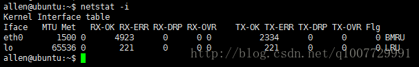

# TCP 协议（MSS）

> MSS全称为 Maximum Segment Size最大报文段

### TCP头部


### MSS(Maximum Segment Size)
MSS，最大报文段长度。在连接建立的时候，即在发送 SYN 段的时候，同时会将 MSS 发送给对方（MSS 选项只能出现在 SYN 段中！！！），告诉对端它期望接收的 TCP 报文段数据部分最大长度。

MSS 保存在 TCP 首部的可选项中，图 2 中显示 MSS 的值为 1260。


可选项的格式，非常简单：它通常包含三个部分：

```
<类型>[条目总长度][内容]1
```

尖括号表示必须有，方括号表示可有可无，它依赖于<类型>。常用的可选项有以下几种：


现在我们只需要关心MSS选项就可以了。其他选项以后再作介绍。

### MSS的作用

一般来说，TCP 报文段携带的数据当然是越多越好。

如果 TCP 报文段传输的数据只有一个字节，在 IP 层传输的数据报大小就是 40 + 1 = 41 字节（至少 20 字节的 IP 头 + 20 字节的 TCP 头 + 1 字节数据）。这样网络的利用率就只有 1/41. 传输 n 字节的数据利用率就是 n/(n+40)，显然 TCP 报文段传输的数据如果越大，网络利用率就越高。

但是实际上并非如此。因为网络传输数据时，数据是最终是要交付到链路层协议上的，也就是说最后要封装成“帧”。二型以太网（Ethernet Type 2）中规定，帧的大小不能超过 1518 个字节（14 字节的帧头 + 4 字节帧校验和 + 最多 1500 字节数据）。所以 IP 数据报的大小如果超过了 1500 字节，要想交付给链路层就必须进行“分片”。

“分片”指的是一个 IP 数据报太大，需要拆分成一个一个的小段，变成多个 IP 数据报。

这种分片显然是不利的，有一定的开销。为了避免分片开销，我们希望 IP 数据报的大小不超过 1500 字节。除去 IP 数据报的首部 20 字节，也就是希望 TCP 报文段不超过 1480 字节。再减去 TCP 报文段首部 20 字节，也就是 TCP 携带的数据不超过 1460 字节。


实际上，链路层对这种帧数据长度的限制称为**最大传输单元**(Maximum Transmission Unit, MTU)。不同的链路层协议，对 MTU 的值也有所规定，通常这个值可以进行更改。使用命令 `netstat -i` 可以看到自己的网卡的 MTU 值。




# 3. MTU

有些同学对 MSS 与 MTU 的概念仍然很模糊，分不清两者之间的关系。

- MSS 是软件层的概念，它是由软件控制的
- MTU 是硬件（比如网卡出口）的属性，是指二层链路层帧携带的数据最大大小。


再举个例子，MTU 的大小就好像一座桥的承重吨位，而桥就相当于网卡。**事先给定 MSS，可以防止因为你货车载货过多，要进行分批运输**。如果不指定 MSS，一旦你货车超载，吨位超过桥的承重能力，你就得把货拆分成几批运过去，运过去之后你还得组装，这是得不偿失的。


> 本文转载自：https://blog.csdn.net/q1007729991/article/details/69668576