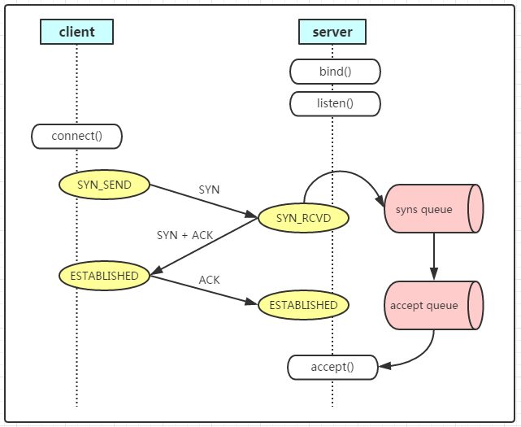

# 浅谈tcp socket的backlog参数

最近看netty源码碰到`ChannelOption.SO_BACKLOG`参数，通过跟踪代码发现其实是用于设置底层tcp socket的backlog参数，由于不了解这个参数，有必要彻底的理解一下。

### 底层

backlog参数主要用于底层方法`int listen(int sockfd, int backlog)`， 在解释backlog参数之前，我们先了解下tcp在内核的请求过程，其实就是tcp的三次握手：

1、client发送SYN到server，将状态修改为SYN_SEND，如果server收到请求，则将状态修改为SYN_RCVD，并把该请求放到syns queue队列中。
 2、server回复SYN+ACK给client，如果client收到请求，则将状态修改为ESTABLISHED，并发送ACK给server。
 3、server收到ACK，将状态修改为ESTABLISHED，并把该请求从syns queue中放到accept queue。

在linux系统内核中维护了两个队列：syns queue和accept queue

**syns queue**
 用于保存半连接状态的请求，其大小通过/proc/sys/net/ipv4/tcp_max_syn_backlog指定，一般默认值是512，不过这个设置有效的前提是系统的syncookies功能被禁用。互联网常见的TCP SYN FLOOD恶意DOS攻击方式就是建立大量的半连接状态的请求，然后丢弃，导致syns queue不能保存其它正常的请求。

**accept queue**
 用于保存全连接状态的请求，其大小通过/proc/sys/net/core/somaxconn指定，在使用listen函数时，内核会根据传入的backlog参数与系统参数somaxconn，取二者的较小值。

如果accpet queue队列满了，server将发送一个ECONNREFUSED错误信息Connection refused到client。

### 应用层

在netty实现中，backlog默认通过NetUtil.SOMAXCONN指定。

当然也可以通过option方法自定义backlog的大小

### backlog设置注意点

前面已经提到过，内核会根据somaxconn和backlog的较小值设置accept queue的大小，如果想扩大accept queue的大小，必须要同时调整这两个参数。

> 文章转载自：https://www.jianshu.com/p/e6f2036621f4