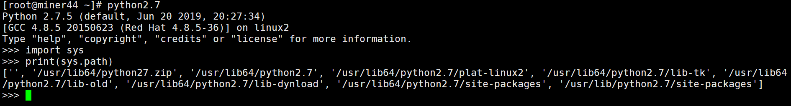

# linux在pyhton的环境里添加自己的Py文件，并应用

在linux中输入python，进入Python控制台

```python
import sys
print(sys.path)
```



找到/user/lib64/python2.7/site-packages，如果是anaconda，则路径~/anaconda3/lib/python3.6/site-packages  (注: 在此~表示anaconda3的安装路径)

然后将自己写的py文件放入改文件夹就OK了