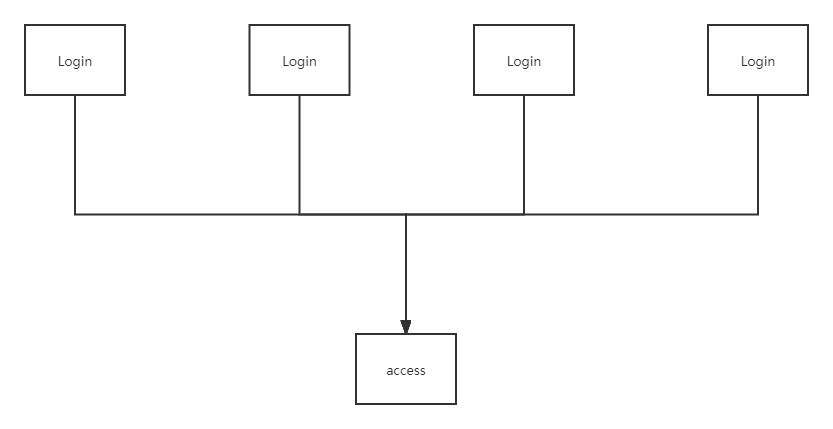
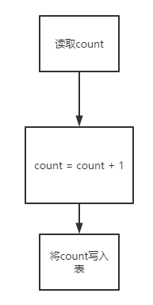
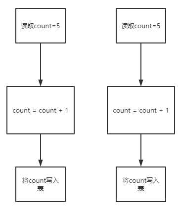

# Redis之分布式锁原理

## 为什么需要分布式锁

在以前的单机系统的时候，很少有听说使用分布式锁,因为Java的juc包已经提供了丰富的并发工具包，能够满足应用的同步问题的处理需求。但随着微服务的兴起，仅仅只是java的自身的并发工具包已经不能完全解决数据同步的问题了。

**场景：**

数据库中存在一张表access，该表的作用就是记录该系统被访问了多少次。现在有部署了n个登录服务。



登录服务的执行逻辑很简单就是将access表的count字段先读出来，然后加1,接着将计算的结果写回表中，SQL为（不要纠结为什么不用一条SQL去解决问题，故意的）：

````java
String sql = "select count from access";
PreparedStatement preparedStatement = connection.prepareStatement(sql);
ResultSet resultSet = preparedStatement.executeQuery();
if (resultSet.next()){
    Integer count = resultSet.getInt(1);
    PreparedStatement preparedStatement2 = connection.prepareStatement(sql);
    String updateSql = "update access set count = ?";
    preparedStatement2.setInt(1,count + 1);
    preparedStatement2.executeUpdate();
}
````

将SQL抽象为图片：



如果此时，在同一时刻有大量用户访问系统的话，就可能出现数据统计不准确的地方。



如上图，两个用户同时访问系  统，却只统计到一个用户的访问数，又因为两个用户是分别通过两个login服务访问系统的，所以此时想用java自带的同步工具去处理脏数据问题就不可能了。因此就需要使用到分布式锁。


## 分布式锁的关键要点

### 唯一key

在redis中，我们需要找一个唯一key作为锁，当key被设置成功了即加锁成功了，当key已经被加锁了，此时就应该设置唯一key失败，即加锁失败。

### 过期时间

如果程序加锁成功后，宕机了，没有释放锁。那么其他程序来加锁的时候就会发现已经有其他程序（即宕机的那个程序）加锁成功，无法加锁。因此需要给redis的key设置一个过期时间，使得程序自动释放锁。 

### 锁续期 

即给锁重新设置过期时间。

为什么需要续期？假设锁过期时间设置了 3s，但是业务代码执行了 4s 还没执行完，那锁过期自动释放了，其他线程在请求接口的时候发现目前没锁，就又加上了锁，这时候不就两个客户端并发执行了吗？相当于还是线程不安全。

那锁续期是如何解决此问题的呢？

开辟另外一个线程，专门用于锁续期，上锁的时候就起个线程进行死循环续期，核心流程就是判断锁的时间过三分之一了就给他重新续期为上锁时间。比如设置的锁是 3s，检查超过 1s 了还没执行完，那就重新给这个锁续期为 3s，防止方法没执行完呢，锁先过期了的情况。

### 解锁

解锁的操作很简单，就是将redis中锁对应的key给删掉就OK了，不过解锁会遇到一下几个问题。

#### 业务未执行完，锁被自己释放了

释放锁可能释放了别人的锁。比如，锁设置了 3s，但是业务代码执行了 4s 还没执行完，那锁过期了，其他线程在请求接口的时候又加上了锁，然后第一个执行了 4s 的线程运行完后，释放了第二个线程加的锁，这时候其他线程又能抢锁了，这不安全！

那如何解决呢？引发问题的关键在于业务代码没执行完锁却过期了，那我们有什么办法让锁在业务未执行完成之前不过期？可以进行锁续期，下面是锁续期的伪代码：

#### 业务未执行完，锁被别人释放了

客户端 A 上了锁，客户端 B 却错误的将A给解锁了，这时候直接执行`redis.del(key)`将客户端 A 的锁给释放了。这就相当于释放了别人的锁，这种情况怎么解决呢？

首先我们应该想一个问题：客户端 B 释放锁的时候为什么会释放掉客户端 A 的锁呢？因为锁的 key 肯定是一样的，毕竟锁的是同资源嘛。那么就需要从 value 入手了，解锁前先判断下这个 key 的 value 是不是自己加的，value 不能是线程 ID，因为分布式环境线程 ID 会重复，所以可以换成类似 userID 等业务主键；或者也可以换成随机数，因为加锁、解锁都在一个方法里，解锁的时候是可以得到这个随机数的。