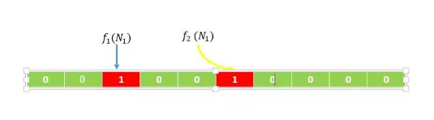
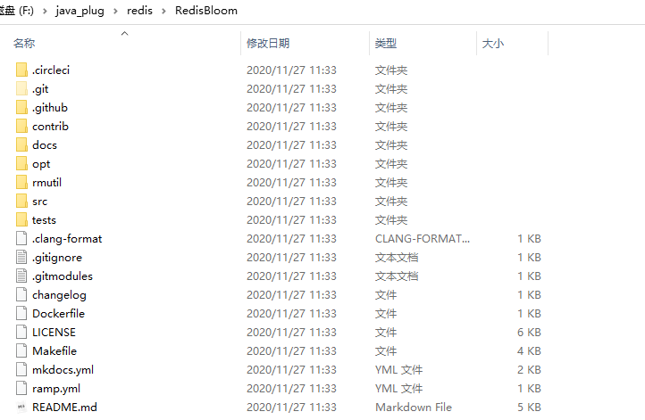

# 布隆（Bloom）过滤器

## 简介

在实际应用中，布隆过滤器被大量的使用着，布隆过滤器有着巨大作用，它能够迅速的判断出一个元素是否在集合中。同学们看到这里肯定会想，我用set也能够判断元素是否在集合中，有必要再使用别的方式进行过滤么。在一般的应用当中，确实可以直接使用set来对元素直接进行去重或者判重，但是数据量比较大的时候，比如有着上亿的数据，再使用set去重就显得比较笨重了。set既占用大量的存储空间又会花费大量时间查询。此时如果使用布隆过滤器进行判重，那就能再很快的时间内判断出元素是否重复，以及节约90%以上的存储空间，只是稍微有那么点不精确，也就是有一定的误判概率。

## 什么是布隆过滤器

布隆过滤器应该可以说是一个有着小瑕疵的set，如果数据被判断不存在于布隆过滤器中，那么它一定不存在。如果数据存被判断存在于布隆顾虑器中，那它可能不存在。

## 应用场景

布隆过滤器的巨大用处就是，能够迅速判断一个元素是否在一个集合中。因此他有如下三个使用场景:

1. 网页爬虫对URL的去重，避免爬取相同的URL地址
2. 反垃圾邮件，从数十亿个垃圾邮件列表中判断某邮箱是否垃圾邮箱（同理，垃圾短信）
3. 缓存穿透，将所有可能存在的数据缓存放到布隆过滤器中，当黑客访问不存在的缓存时迅速返回避免缓存及DB挂掉。

## 原理

接下来我们来谈谈布隆过滤器的原理

其内部维护一个全为0的bit数组，需要说明的是，布隆过滤器有一个误判率的概念，误判率越低，则数组越长，所占空间越大。误判率越高则数组越小，所占的空间越小。

假设，根据误判率，我们生成一个10位的bit数组，以及2个hash函数（(f1,f2)），如下图所示(生成的数组的位数和hash函数的数量，我们不用去关心是如何生成的，有数学论文进行过专业的证明)。


假设输入集合为((N1,N2)),经过计算(f1(N1))得到的数值得为2，(f2(N1))得到的数值为5，则将数组下标为2和下表为5的位置置为1，如下图所示



同理，经过计算(f1(N2))得到的数值得为3，(f2(N2))得到的数值为6，则将数组下标为3和下表为6的位置置为1，如下图所示


这个时候，我们有第三个数(N3)，我们判断(N3)在不在集合((N1,N2))中，就进行(f1(N3)，f2(N3))的计算

1. 若值恰巧都位于上图的红色位置中，我们则认为，(N3)在集合((N1,N2))中
2. 若值有一个不位于上图的红色位置中，我们则认为，(N3)不在集合((N1,N2))中

## Redis安装bloom过滤器

###  编译module

首先去github上将安装文件夹拉去下来

````shell
git clone https://github.com/RedisBloom/RedisBloom/
````



将下载的文件上传到服务器上进行编译。

````shell
[root@localhost RedisBloom]# make
make: Warning: File `/opt/RedisBloom/src/rebloom.c' has modification time 31830 s in the future
cc  -Wall -Wno-unused-function -g -ggdb -O2 -fPIC -std=gnu99 -D_GNU_SOURCE -I/opt/RedisBloom -I/opt/RedisBloom/contrib  -c -o /opt/RedisBloom/src/rebloom.o /opt/RedisBloom/src/rebloom.c
cc  -Wall -Wno-unused-function -g -ggdb -O2 -fPIC -std=gnu99 -D_GNU_SOURCE -I/opt/RedisBloom -I/opt/RedisBloom/contrib  -c -o /opt/RedisBloom/contrib/MurmurHash2.o /opt/RedisBloom/contrib/MurmurHash2.c
cc  -Wall -Wno-unused-function -g -ggdb -O2 -fPIC -std=gnu99 -D_GNU_SOURCE -I/opt/RedisBloom -I/opt/RedisBloom/contrib  -c -o /opt/RedisBloom/rmutil/util.o /opt/RedisBloom/rmutil/util.c
cc  -Wall -Wno-unused-function -g -ggdb -O2 -fPIC -std=gnu99 -D_GNU_SOURCE -I/opt/RedisBloom -I/opt/RedisBloom/contrib  -c -o /opt/RedisBloom/src/sb.o /opt/RedisBloom/src/sb.c
cc  -Wall -Wno-unused-function -g -ggdb -O2 -fPIC -std=gnu99 -D_GNU_SOURCE -I/opt/RedisBloom -I/opt/RedisBloom/contrib  -c -o /opt/RedisBloom/src/cf.o /opt/RedisBloom/src/cf.c
cc  -Wall -Wno-unused-function -g -ggdb -O2 -fPIC -std=gnu99 -D_GNU_SOURCE -I/opt/RedisBloom -I/opt/RedisBloom/contrib  -c -o /opt/RedisBloom/src/rm_topk.o /opt/RedisBloom/src/rm_topk.c
cc  -Wall -Wno-unused-function -g -ggdb -O2 -fPIC -std=gnu99 -D_GNU_SOURCE -I/opt/RedisBloom -I/opt/RedisBloom/contrib  -c -o /opt/RedisBloom/src/topk.o /opt/RedisBloom/src/topk.c
cc  -Wall -Wno-unused-function -g -ggdb -O2 -fPIC -std=gnu99 -D_GNU_SOURCE -I/opt/RedisBloom -I/opt/RedisBloom/contrib  -c -o /opt/RedisBloom/src/rm_cms.o /opt/RedisBloom/src/rm_cms.c
cc  -Wall -Wno-unused-function -g -ggdb -O2 -fPIC -std=gnu99 -D_GNU_SOURCE -I/opt/RedisBloom -I/opt/RedisBloom/contrib  -c -o /opt/RedisBloom/src/cms.o /opt/RedisBloom/src/cms.c
cc /opt/RedisBloom/src/rebloom.o /opt/RedisBloom/contrib/MurmurHash2.o /opt/RedisBloom/rmutil/util.o /opt/RedisBloom/src/sb.o /opt/RedisBloom/src/cf.o /opt/RedisBloom/src/rm_topk.o /opt/RedisBloom/src/topk.o /opt/RedisBloom/src/rm_cms.o /opt/RedisBloom/src/cms.o -o /opt/RedisBloom/redisbloom.so -shared -Wl,-Bsymbolic,-Bsymbolic-functions -lm -lc
make: warning:  Clock skew detected.  Your build may be incomplete.
````

编译完后会在文件夹中生成redisbloom.so文件，这个文件就是redis需要集成的文件。


### 集成module

**方式一：修改redis的配置文件。**

````shell
################################## MODULES #####################################
 
# Load modules at startup. If the server is not able to load modules
# it will abort. It is possible to use multiple loadmodule directives.
#
# loadmodule /path/to/my_module.so
# loadmodule /path/to/other_module.so
 
loadmodule /opt/apps/RedisBloom-2.0.3/redisbloom.so
````

**方式二：启动服务时加载**

````shell
redis-server /opt/apps/redis-5.0.7/redis.conf \
--loadmodule /opt/apps/RedisBloom-2.0.3/redisbloom.so
````

## Bloom过滤器基本使用

### bf.add添加元素

bf.add的用法和set集合的sadd差不多，注意 `bf.add` 只能一次添加一个元素，如果想要一次添加多个，就需要用到 `bf.madd` 指令。

````shell
127.0.0.1:6379> BF.ADD mybloom  data1
(integer) 1
127.0.0.1:6379> BF.ADD mybloom  data2
(integer) 1
127.0.0.1:6379> BF.ADD mybloom  data1
(integer) 0
````

### bf.exists判断元素是否存在于过滤器中

`````shell
127.0.0.1:6379> BF.EXISTS mybloom data3
(integer) 0
127.0.0.1:6379> BF.EXISTS mybloom data2
(integer) 1
127.0.0.1:6379> BF.EXISTS mybloom data1
(integer) 1
`````

### 自定义过滤器

我们上面使用的布隆过滤器只是默认参数的布隆过滤器，它在我们第一次 add 的时候自动创建。Redis 其实还提供了自定义参数的布隆过滤器，需要我们在 add 之前使用`bf.reserve`指令显式创建。如果对应的 key 已经存在，`bf.reserve`会报错。`bf.reserve`有三个参数，分别是 key, `error_rate`和`initial_size`。错误率越低，需要的空间越大。`initial_size`参数表示预计放入的元素数量，当实际数量超出这个数值时，误判率会上升。

所以需要提前设置一个较大的数值避免超出导致误判率升高。如果不使用 bf.reserve，默认的`error_rate`是 0.01，默认的`initial_size`是 100。

````shell
127.0.0.1:6379> BF.RESERVE mybloom2  0.001  10000000
-> Redirected to slot [9183] located at 192.168.190.128:6380
OK
````

## 总结

总结一下：布隆过滤器的使用目的不是为了存储对象，而是标记对象，以在后续能判断此对象是否被标记过。如果判断为此对象未被标记，则此对象肯定未被标记；若判断为此对象已经标记，则大概率上此对象已经被标记。布隆过滤器的原理