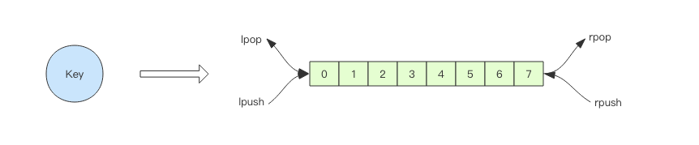

# 消息队列

## 简介

在我们平时的开发过程中，一般做消息发送的需求，都会用到RabbitMQ或者KafKa。实事求是的说在大多数时候都首先选择这两个组件来实现消息的异步传输。不过有点时候，我们或许不需要这么“重”的组件来实现一些简单的消息队列的需求，或者说我们的需求很简单，不需要那么“重”的组件，比如系统只有一组消费者的消息队列，这个时候就可以考虑使用redis。

## 由浅入深-异步消息队列

Redis中的List常常被作为消息队列来使用，使用`Lpush/Rpush`进行消息入队，使用`Rpop/Lpop`来实现消息出队



## POP空转

使用上面的方式已经能够满足我们的需求，不过其中还是却在着一些缺陷。在消息入队的时候，我们一方面向redis中push数据，一方面pop数据，如果由于某些原因，不向redis中push数据，但是pop却一直在空转，这样浪费CPU也提高了Redis的QPS。通常可以在程序中加一个定时休眠，来处理这个问题

````shell
#伪代码
while(true){
     reids.pop
     sleep(time)
}
````

## 阻塞POP

在上面的讨论中，其实是没有必要每次对pop后都进行sleep，应该是如果队列中没有数据才slepp，经过反复思考，我们可以得出，使用List做为消息队列的流程模型应该是这样的。

````shell

while(true){
    if(redis.list is not null ? ){
          redis.pop
    }else{
          wait
    }
}
````

redis提供`BLpop/BRpop key [key ...] timeout`的api可以满足上述流程模型。这两个命令前都带有`B`，就是阻塞(BLOCK)的意思。

阻塞读在队列没有数据的时候，会立即进入休眠状态，一旦数据到来，则立刻醒过来。消息的延迟几乎为零。用`blpop/brpop`替代前面的`lpop/rpop`，就完美解决了上面的问题。

##  RPOPLPUSH

让我们考虑这样一个情况，先向list里插入一条数据

````shell
127.0.0.1:6379> lpush myqueue  1
(integer) 1
````

然后我们的程序从list去取一条数据进行业务操作，以java为例

````shell
JedisCluster jedis = new JedisCluster(set);
String value = jedis.rpop("myqueue");      
doSomeThing(value);                        
jedis.close();
````

数据从myqueue队列取出后，然后在doSomeThing方法进行业务逻辑处理。如果在获取value之后处理value之前，程序奔溃了，这个时候数据已经从redis中pop了，但是相应的业务却没有被处理。

那怎么来实现一个更安全的队列呢？ 可以试试redis的`RPOPLPUSH` (或者其阻塞版本的 `BRPOPLPUSH`）命令。

具体是操作是：

- 在A队列推出元素(并删除)时，保存元素到 B队列。
- 如果处理元素的客户端奔溃了，还可以在B队列找到

````shell
redis> RPUSH mylist "one"
(integer) 1
redis> RPUSH mylist "two"
(integer) 2
redis> RPUSH mylist "three"
(integer) 3
redis> RPOPLPUSH mylist myotherlist
"three"
redis> LRANGE mylist 0 -1
1) "one"
2) "two"
redis> LRANGE myotherlist 0 -1
1) "three"
````

讲到这里，我觉得使用list来作为消息队列始终有所欠缺的，除非系统能容忍消息的丢失，不让还是用专业的消息队列中间件比较好。

## 更进一步-延时队列

延时队列可以通过zset（有序集合）来实现，我们先来看看zset的api长什么样。

````shell
zadd key [NX|XX] [CH] [INCR] score member [score member ...]
````

我们可以将score作为时间判断的字段，来判断member是否该现在处理

````shell
192.168.190.128:6380> zadd delayQueue  1606377048 new1
````

然后在程序中对delayQueue进行扫描，获取当前应该被处理的消息

````shell
192.168.190.128:6379> zrangebyscore delayQueue 0 1606377244         #扫描当前应该被处理的消息
1) "new1"
2) "new2"
192.168.190.128:6379> zrem delayQueue "new1"                       #这一步模拟程序中取争抢消息
(integer) 1
hadleMessage()                                                     #这一步模拟程序处理抢到的消息
````

这里并没有给出具体编程语言的实现方式，因为`懒`。

### 优化

上面的算法中同一个任务可能会被多个进程取到之后再使用 zrem 进行争抢，那些没抢到的进程都是白取了一次任务，这是浪费。可以考虑使用 lua scripting 来优化一下这个逻辑，将 zrangebyscore 和 zrem 一同挪到服务器端进行原子化操作，这样多个进程之间争抢任务时就不会出现这种浪费了。

````lua
local value = redis.call("zrangebyscore", "delay-queue", 0, ARGV[1], "LIMIT", "0", "1")
if not value or not value[1] then
 return nil
end
redis.log(redis.LOG_DEBUG, cjson.encode(value))
redis.call("zrem", "delay-queue", value[1])
return value[1]

````

