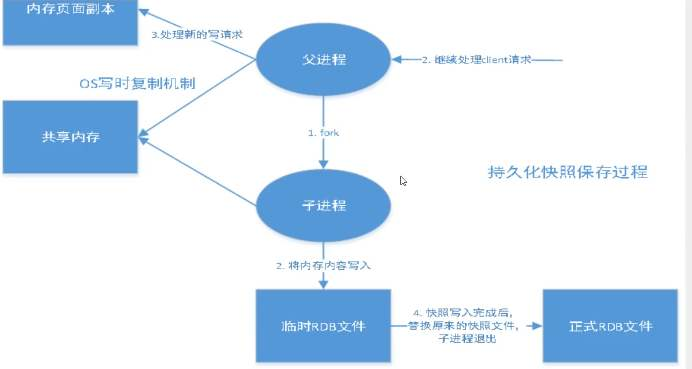
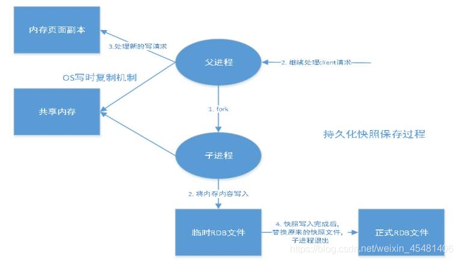
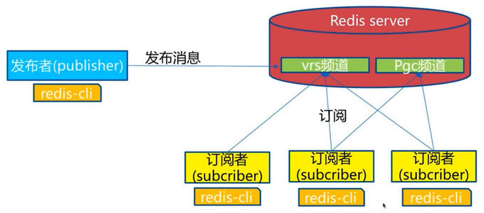
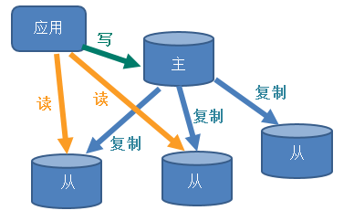
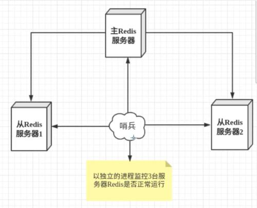
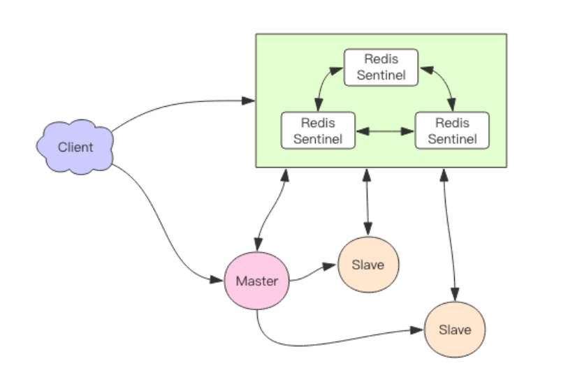
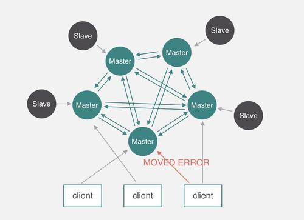
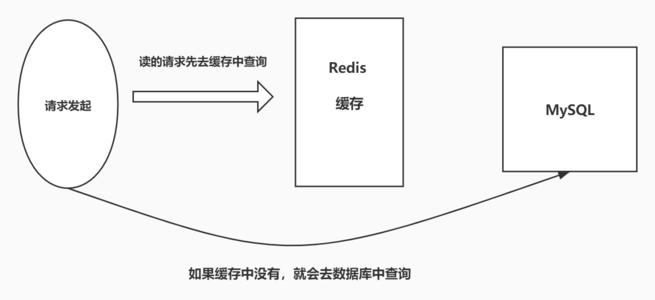
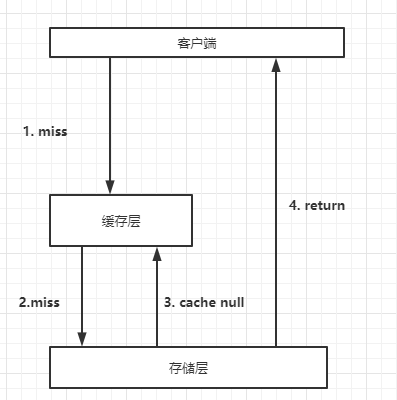
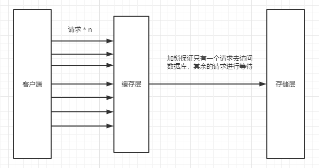

### 3V与3高

大数据时代的3V，主要的问题：

1. 海量Volume
2. 多样Variety
3. 实时Velocity

大数据的3高，主要对程序的要求：

1. 高并发
2. 扩展性
3.  高性能

### NOSQL的四大分类

#### KV键值对

* 新浪：redis
* 美团：redis + Tair
* 阿里、百度：Redis + Memecache

**文档型数据库(bson)**

* MongoDB:是一个基于分布式文件存储的数据库，c++编写，主要处理大量的文档。

### 列存储数据库

* HBase
* 分布式文件系统

### 图关系型数据库

* Neo4J,InfoGrid;


### Redis入门

> Redis(Remote Dirctory Server)

#### Redis安装

1. [下载](https://redis.io/)Redis的安装包，将安装包上传至/home/softwore目录

2. 安装gcc
   1. 安装gcc，yum install gcc-c++
   2. 进入redis目录，输入make命令

   ````shell
   [root@master ~]# cd /home/softwore/redis-6.0.8
   [root@master redis-6.0.8]# ls
   00-RELEASENOTES  CONTRIBUTING  deps     Makefile   README.md   runtest          runtest-moduleapi  sentinel.conf  tests   utils
   BUGS             COPYING       INSTALL  MANIFESTO  redis.conf  runtest-cluster  runtest-sentinel   src            TLS.md
   [root@master redis-6.0.8]# 
   [root@master redis-6.0.8]# 
   [root@master redis-6.0.8]# make & make install
   ````
   3. make完后会在/usr/local/bin目录下生成redis的相关文件

   ````shell
   [root@master bin]# cd /usr/local/bin/
   [root@master bin]# ls
   mysql_miner  node  npm  pm2  redis-benchmark  redis-check-aof  redis-check-rdb  redis-cli  redis-sentinel  redis-server
   ````

   4. 配置redis的配置文件目录

   ````shell
   mkdir -p  /usr/local/bin/redis_config
   cp -r /home/softwore/redis-6.0.8/redis.conf /usr/local/bin/redis_config
   ````

   5. 启动redis服务

   ````shell
   cd /usr/local/bin
   [root@master redis_config]# ./redis-server  redis_config/redis.conf 
   bash: ./redis-server: No such file or directory
   [root@master redis_config]# cd ..
   [root@master bin]# ./redis-server  redis_config/redis.conf 
   20812:C 22 Oct 2020 11:02:48.254 # oO0OoO0OoO0Oo Redis is starting oO0OoO0OoO0Oo
   20812:C 22 Oct 2020 11:02:48.254 # Redis version=6.0.8, bits=64, commit=00000000, modified=0, pid=20812, just started
   20812:C 22 Oct 2020 11:02:48.254 # Configuration loaded
   20812:M 22 Oct 2020 11:02:48.255 * Increased maximum number of open files to 10032 (it was originally set to 1024).
                   _._                                                  
              _.-``__ ''-._                                             
         _.-``    `.  `_.  ''-._           Redis 6.0.8 (00000000/0) 64 bit
     .-`` .-```.  ```\/    _.,_ ''-._                                   
    (    '      ,       .-`  | `,    )     Running in standalone mode
    |`-._`-...-` __...-.``-._|'` _.-'|     Port: 6378
    |    `-._   `._    /     _.-'    |     PID: 20812
     `-._    `-._  `-./  _.-'    _.-'                                   
    |`-._`-._    `-.__.-'    _.-'_.-'|                                  
    |    `-._`-._        _.-'_.-'    |           http://redis.io        
     `-._    `-._`-.__.-'_.-'    _.-'                                   
    |`-._`-._    `-.__.-'    _.-'_.-'|                                  
    |    `-._`-._        _.-'_.-'    |                                  
     `-._    `-._`-.__.-'_.-'    _.-'                                   
         `-._    `-.__.-'    _.-'                                       
             `-._        _.-'                                           
                 `-.__.-'                                               
   
   20812:M 22 Oct 2020 11:02:48.257 # WARNING: The TCP backlog setting of 511 cannot be enforced because /proc/sys/net/core/somaxconn is set to the lower value of 128.
   20812:M 22 Oct 2020 11:02:48.257 # Server initialized
   20812:M 22 Oct 2020 11:02:48.257 # WARNING overcommit_memory is set to 0! Background save may fail under low memory condition. To fix this issue add 'vm.overcommit_memory = 1' to /etc/sysctl.conf and then reboot or run the command 'sysctl vm.overcommit_memory=1' for this to take effect.
   20812:M 22 Oct 2020 11:02:48.257 # WARNING you have Transparent Huge Pages (THP) support enabled in your kernel. This will create latency and memory usage issues with Redis. To fix this issue run the command 'echo madvise > /sys/kernel/mm/transparent_hugepage/enabled' as root, and add it to your /etc/rc.local in order to retain the setting after a reboot. Redis must be restarted after THP is disabled (set to 'madvise' or 'never').
   20812:M 22 Oct 2020 11:02:48.258 * Ready to accept connections
   
   ````

   

### 安装遇到的问题

#### Redis6安装遇到的问题

这里安装redis的时候会可能会出现下面的问题

````shell
server.c:5170:39: error: ‘struct redisServer’ has no member named ‘maxmemory’
if (server.maxmemory > 0 && server.maxmemory < 1024*1024) {
                                  ^
server.c:5171:176: error: ‘struct redisServer’ has no member named ‘maxmemory’
    serverLog(LL_WARNING,"WARNING: You specified a maxmemory value that is less than 1MB (current value is %llu bytes). Are you sure this is what you really want?", server.maxmemory);
                                                                                                                                                                           ^
server.c:5174:31: error: ‘struct redisServer’ has no member named ‘server_cpulist’
redisSetCpuAffinity(server.server_cpulist);
````

解决办法：
出现这种错误是由于gcc版本太低，升级gcc

````shell
# 查看gcc版本是否在5.3以上，centos7.6默认安装4.8.5
gcc -v
# 升级gcc到5.3及以上,如下：
升级到gcc 9.3：
yum -y install centos-release-scl
yum -y install devtoolset-9-gcc devtoolset-9-gcc-c++ devtoolset-9-binutils
scl enable devtoolset-9 bash
需要注意的是scl命令启用只是临时的，退出shell或重启就会恢复原系统gcc版本。
如果要长期使用gcc 9.3的话：
 
echo "source /opt/rh/devtoolset-9/enable" >>/etc/profile
这样退出shell重新打开就是新版的gcc了
以下其他版本同理，修改devtoolset版本号即可
````


### 性能测试

redis-benchmark是一个压力测试工具！

redis 性能测试工具可选参数如下所示：

| 序号 | 选项      | 描述                                       | 默认值    |
| :--- | :-------- | :----------------------------------------- | :-------- |
| 1    | **-h**    | 指定服务器主机名                           | 127.0.0.1 |
| 2    | **-p**    | 指定服务器端口                             | 6379      |
| 3    | **-s**    | 指定服务器 socket                          |           |
| 4    | **-c**    | 指定并发连接数                             | 50        |
| 5    | **-n**    | 指定请求数                                 | 10000     |
| 6    | **-d**    | 以字节的形式指定 SET/GET 值的数据大小      | 2         |
| 7    | **-k**    | 1=keep alive 0=reconnect                   | 1         |
| 8    | **-r**    | SET/GET/INCR 使用随机 key, SADD 使用随机值 |           |
| 9    | **-P**    | 通过管道传输 <numreq> 请求                 | 1         |
| 10   | **-q**    | 强制退出 redis。仅显示 query/sec 值        |           |
| 11   | **--csv** | 以 CSV 格式输出                            |           |
| 12   | **-l**    | 生成循环，永久执行测试                     |           |
| 13   | **-t**    | 仅运行以逗号分隔的测试命令列表。           |           |
| 14   | **-I**    | Idle 模式。仅打开 N 个 idle 连接并等待。   |           |

````shell
#测试：100个并发，10w请求
redis-benchmark  -h localhost  -p 6379 -c 100 -n 1000000 
````


### Redis尝试

#### 切换数据库

````shell
select 3
````

#### 查看数据库大小

````shell
DBSIZE
````

#### 查看数据库所有的key

````shell
keys *
````

#### 清空当前库

````
flushdb
````

#### 清空全部数据库

````shell
flushall
````

#### 判断key是否存在

````shell
EXISTS KEYS
````

#### 移动Key到别的数据库

````shell
move  key  database
move  name  1
````

#### 给key设置过期时间

````shell
EXPIRE key  second
#设置key 10秒后过期
EXPIRE name 10
````

#### 查看key的type类型

````shell
127.0.0.1:6379> type name
string
````


#### Redis是单线程的

Redis是很快的，Redis是基于内存操作的，CPU不是Redis性能瓶颈，Redis的瓶颈是根据机器的内存和网络带宽，既然可以使用单线程来实现，那就使用单线程了！不过Redis 6之后就是多线程了。

#### Redis为什么单线程还这么快？

以前一直有个误区，以为：高性能服务器 一定是 多线程来实现的

原因很简单因为误区二导致的：多线程 一定比 单线程 效率高。其实不然。

在说这个事前希望大家都能对 CPU 、 内存 、 硬盘的速度都有了解了，这样可能理解得更深刻一点，不了解的朋友点：[CPU到底比内存跟硬盘快多少](https://blog.csdn.net/world6/article/details/79375690)

redis 核心就是 如果我的数据全都在内存里，我单线程的去操作 就是效率最高的，为什么呢，因为多线程的本质就是 CPU 模拟出来多个线程的情况，这种模拟出来的情况就有一个代价，就是上下文的切换，对于一个内存的系统来说，它没有上下文的切换就是效率最高的。redis 用 单个CPU 绑定一块内存的数据，然后针对这块内存的数据进行多次读写的时候，都是在一个CPU上完成的，所以它是单线程处理这个事。在内存的情况下，这个方案就是最佳方案 —— 阿里 沈询

因为一次CPU上下文的切换大概在 1500ns 左右。

从内存中读取 1MB 的连续数据，耗时大约为 250us，假设1MB的数据由多个线程读取了1000次，那么就有1000次时间上下文的切换，

那么就有1500ns * 1000 = 1500us ，我单线程的读完1MB数据才250us ,你光时间上下文的切换就用了1500us了，我还不算你每次读一点数据 的时间，

那什么时候用多线程的方案呢？

答案是：下层的存储等慢速的情况。比如磁盘

内存是一个 IOPS 非常高的系统，因为我想申请一块内存就申请一块内存，销毁一块内存我就销毁一块内存，内存的申请和销毁是很容易的。而且内存是可以动态的申请大小的。

磁盘的特性是：IPOS很低很低，但吞吐量很高。这就意味着，大量的读写操作都必须攒到一起，再提交到磁盘的时候，性能最高。为什么呢？

如果我有一个事务组的操作（就是几个已经分开了的事务请求，比如写读写读写，这么五个操作在一起），在内存中，因为IOPS非常高，我可以一个一个的完成，但是如果在磁盘中也有这种请求方式的话，

我第一个写操作是这样完成的：我先在硬盘中寻址，大概花费10ms，然后我读一个数据可能花费1ms然后我再运算（忽略不计），再写回硬盘又是10ms ，总共21ms

第二个操作去读花了10ms, 第三个又是写花费了21ms ,然后我再读10ms, 写21ms ，五个请求总共花费83ms，这还是最理想的情况下，这如果在内存中，大概1ms不到。

所以对于磁盘来说，它吞吐量这么大，那最好的方案肯定是我将N个请求一起放在一个buff里，然后一起去提交。

方法就是用异步：将请求和处理的线程不绑定，请求的线程将请求放在一个buff里，然后等buff快满了，处理的线程再去处理这个buff。然后由这个buff 统一的去写入磁盘，或者读磁盘，这样效率就是最高。java里的 IO不就是这么干的么~

对于慢速设备，这种处理方式就是最佳的，慢速设备有磁盘，网络 ，SSD 等等，

多线程 ，异步的方式处理这些问题非常常见，大名鼎鼎的netty 就是这么干的。

终于把 redis 为什么是单线程说清楚了，把什么时候用单线程跟多线程也说清楚了，其实也是些很简单的东西，只是基础不好的时候，就真的尴尬。。。。

补一发大师语录：来说说，为何单核cpu绑定一块内存效率最高

“我们不能任由操作系统负载均衡，因为我们自己更了解自己的程序，所以我们可以手动地为其分配CPU核，而不会过多地占用CPU”，默认情况下单线程在进行系统调用的时候会随机使用CPU内核，为了优化Redis，我们可以使用工具为单线程绑定固定的CPU内核，减少不必要的性能损耗！

redis作为单进程模型的程序，为了充分利用多核CPU，常常在一台server上会启动多个实例。而为了减少切换的开销，有必要为每个实例指定其所运行的CPU。

Linux 上 taskset 可以将某个进程绑定到一个特定的CPU。你比操作系统更了解自己的程序，为了避免调度器愚蠢的调度你的程序，或是为了在多线程程序中避免缓存失效造成的开销。

顺便再提一句：redis 的瓶颈在网络上 。。。。


### 五大数据类型

Redis是一种开放源代码（BSD许可）的内存中数据结构存储，用作数据库，缓存和消息代理。它支持数据结构，例如字符串，哈希，列表，集合，带范围查询的排序集合，位图，超日志，带有半径查询和流的地理空间索引。Redis具有内置的复制，Lua脚本，LRU驱逐，事务和不同级别的磁盘持久性，并通过Redis Sentinel和Redis Cluster自动分区提供高可用性。

#### String（字符串）

##### 普通字符串操作

````shell

127.0.0.1:6379> set name wuheng
OK
127.0.0.1:6379> get name
"wuheng"
127.0.0.1:6379> exists name
(integer) 1
127.0.0.1:6379> append name " nihao"
(integer) 12
127.0.0.1:6379> get name
"wuheng nihao"
````

##### 删除key

````shell
127.0.0.1:6379> del name
(integer) 1
````

##### 数字的自增

````shell
127.0.0.1:6379> set number 10
OK
127.0.0.1:6379> type number
string
127.0.0.1:6379> incrby number 8
(integer) 18
127.0.0.1:6379> get number
"18"
127.0.0.1:6379> type number
string
127.0.0.1:6379> incr number
(integer) 19
127.0.0.1:6379> get number
"19"
````

##### 字符串截取

````shell
#截取0到3
127.0.0.1:6379> getrange name 0 3
"wuhe"
#截取所有的串
127.0.0.1:6379> getrange name 0 -1
"wuheng nihao"
````

##### 字符串的替换

````shell
# 替换指定位置开始的字符串
127.0.0.1:6379> setrange name 2 runqiu
(integer) 12
127.0.0.1:6379> get name
"wurunqiuihao"
````

##### 创建key并设置过期时间(存在就覆盖)

````shell
127.0.0.1:6379> setex age 10 100
OK
127.0.0.1:6379> get age
"100"
127.0.0.1:6379> get age
(nil)
````

##### 创建key(不存在则创建，存在则创建失败)

> 该操作可用于分布式锁中

````shell
127.0.0.1:6379> setnx height 10
(integer) 1
127.0.0.1:6379> setnx height 10
(integer) 0
````

##### 多个值设置操作

````shell
127.0.0.1:6379> mset k1 v1 k2 v2 k3 v3 k4 v4
OK
127.0.0.1:6379> get k1
"v1"
127.0.0.1:6379> get k2
"v2"
127.0.0.1:6379> get k3
"v3"
````

##### 获取多个key值操作

````shell
127.0.0.1:6379> mget k1 k2 k3
1) "v1"
2) "v2"
3) "v3"
````

##### 组合命令getset

````shell
127.0.0.1:6379> getset aolige  100
(nil)
127.0.0.1:6379> get aolige
"100"
````


#### List(双向链表)

##### Lpush 添加数据

````shell
127.0.0.1:6379> lpush  list one
(integer) 1
(1.67s)
127.0.0.1:6379> lpush list two
(integer) 2
127.0.0.1:6379> lpush list three
(integer) 3
(1.66s)
````

##### Llen查询链表长度

````shell
127.0.0.1:6379> llen list
(integer) 4
````


##### Lrange范围查询

````shell
#从下面可以看出 list 的lpush操作是将数据按照入栈的顺序添加的
127.0.0.1:6379> lrange list 0 -1
1) "three"
2) "two"
3) "one"
127.0.0.1:6379> lrange list 0 1
1) "three"
2) "two"
````

##### Rpush从右端添加值

再list的另一端插入数据，这里的另一端是相较于Lpush命令的

````shell
127.0.0.1:6379> rpush list right
(integer) 4
127.0.0.1:6379> lrange list  0 -1
1) "three"
2) "two"
3) "one"
4) "right"
````

##### Lpop 从list的首端移除值

````shell
127.0.0.1:6379> lpop list
"three"
127.0.0.1:6379>
````

##### Rpop从list的未端移除值

````shell
127.0.0.1:6379> rpop list
"right"
````

##### Lindex获取list指定下标的数据

````shell
127.0.0.1:6379> lrange list 0 -1
1) "two"
2) "one"
127.0.0.1:6379> lindex list 1
"one"
````

##### Lrem移除值

````shell
127.0.0.1:6379> lpush list one
(integer) 3
127.0.0.1:6379> lpush list one
(integer) 4
127.0.0.1:6379> lpush list one
(integer) 5
127.0.0.1:6379> lrange list 0 -1
1) "one"
2) "one"
3) "one"
4) "two"
5) "one"
````

##### Ltrim对原列表进行修剪(截断)

````shell
127.0.0.1:6379> lpush list k1
(integer) 1
127.0.0.1:6379> lpush list k2
(integer) 2
127.0.0.1:6379> lpush list k3
(integer) 3
127.0.0.1:6379> lpush list k4
(integer) 4
127.0.0.1:6379> lrange list 0 -1
1) "k4"
2) "k3"
3) "k2"
4) "k1
#截取操作
127.0.0.1:6379> ltrim list 0 2
OK
127.0.0.1:6379> lrange list 0 -1
1) "k4"
2) "k3"
3) "k2"
````

##### 组合命令RpopLpush

将list的最右端数据插入newlist的最左端

````
127.0.0.1:6379> lrange list 0 -1
1) "k4"
2) "k3"
3) "k2"
127.0.0.1:6379> lrange newlist 0 -1
(empty array)
127.0.0.1:6379> RpopLpush list newlist
"k2"
127.0.0.1:6379> lrange newlist 0 -1
1) "k2"
````

##### Lset 对list指定下标设置值

````she
127.0.0.1:6379> lrange list 0 -1
1) "k4"
2) "k3"
127.0.0.1:6379> lset list 0  hw
OK
127.0.0.1:6379> lrange list 0 -1
1) "hw"
2) "k3"
````

##### Linsert 在指定值的前后插入数据

````sh
#在指定值前插入数据
127.0.0.1:6379> lrange list 0 -1
1) "hw"
2) "k3"
127.0.0.1:6379> Linsert list before k3 k2
(integer) 3
127.0.0.1:6379> lrange list 0 -1
1) "hw"
2) "k2"
3) "k3"
#在指定值后加入数据
127.0.0.1:6379> lrange list 0 -1
1) "hw"
2) "k2"
3) "k3"
127.0.0.1:6379> Linsert list after k3 k1
(integer) 4
127.0.0.1:6379> lrange list 0 -1
1) "hw"
2) "k2"
3) "k3"
4) "k1"
````


#### Set(无序不重复集合)

##### Sadd 添加元素

````shell
127.0.0.1:6379> Sadd myset hello
(integer) 1
127.0.0.1:6379> Sadd myset world
(integer) 1
````

##### Sismember 

````shell
127.0.0.1:6379> sismember myset "hello"
127.0.0.1:6379> Sismember myset hello
(integer) 1
````


##### Smembers获取某个key的所有数据

````shell
127.0.0.1:6379> smembers test
1) "1"
2) "2"
3) "3"
4) "4
````

##### Scard查询set的元素个数

````shell
127.0.0.1:6379> Scard myset
(integer) 2
````

##### Srem从set中移除元素

````shell
127.0.0.1:6379> Srem myset hello
(integer) 1
````

##### Srandmember随机获取set中的元素

````shell
127.0.0.1:6379> Sadd myset hello
(integer) 1
127.0.0.1:6379> Sadd myset meximexi
(integer) 1
127.0.0.1:6379> Sadd myset aoligei
(integer) 1
127.0.0.1:6379> Srandmember myset
"aoligei"
127.0.0.1:6379> Srandmember myset
"world"
127.0.0.1:6379> Srandmember myset
"world"
127.0.0.1:6379> Srandmember myset
"meximexi"
````

##### Spop随机移除元素

````shell
127.0.0.1:6379> spop myset
"meximexi"
127.0.0.1:6379> spop myset
"world"
````

##### Smove移动元素到另一个set中

````shell
127.0.0.1:6379> sadd myset2 lalala
127.0.0.1:6379> sadd myset2 hello
127.0.0.1:6379> smove myset myset2 aoligei
(integer) 0
127.0.0.1:6379> Srandmember myset2 4
1) "lalala"
2) "hello"
3) "aoligei"
````

##### Sdiff求多个集合的差集

````shell
127.0.0.1:6379> Sdiff myset myset2
(empty array)
127.0.0.1:6379> Sdiff myset2 myset
1) "lalala"
2) "hello"
3) "aoligei"
````

##### Sinter求多个集合交集

````shell
127.0.0.1:6379> Srandmember myset 4
1) "hello"
127.0.0.1:6379> Srandmember myset2 4
1) "lalala"
2) "hello"
3) "aoligei"
127.0.0.1:6379> Sinter myset myset2
1) "hello"
````

##### Sunion求多个集合并集

````shell
127.0.0.1:6379> Srandmember myset 4
1) "hello"
127.0.0.1:6379> Srandmember myset2 4
1) "lalala"
2) "hello"
3) "aoligei"
127.0.0.1:6379> Sunion myset myset2
1) "lalala"
2) "aoligei"
3) "hello"
````

#### Hash(hash，key-value)

##### Hset添加元素

````
# hset hashkey field  value
127.0.0.1:6379> hset myhash name hw
(integer) 1
````

##### Hget获取元素

````shell
# hget hashkey field
127.0.0.1:6379> hget myhash key1
"hw"
````

##### Hmset 添加多个元素

````shell
# hmset hashkey [field value]+
127.0.0.1:6379> hmset myhash  key2 hw2  key3  hw3
OK
````

##### Hmget获取多个元素

````shell
#hmset hashkey [field]+
127.0.0.1:6379> hmget myhash key1 key2 key3
1) "hw"
2) "hw3"
3) "hw3"
````

##### Hgetall获取全部的数据

````shell
#hgetall hashkey
127.0.0.1:6379> hgetall myhash
1) "key1"      #field
2) "hw"        #value
3) "key2"
4) "hw3"
5) "key3"
6) "hw3"
````

##### Hdel删除指定的field

````shell
127.0.0.1:6379> hdel myhash key1
(integer) 1
127.0.0.1:6379> hgetall myhash
1) "key2"
2) "hw3"
3) "key3"
4) "hw3
````

##### Hlen获取key的长度

````shell
127.0.0.1:6379> hlen myhash
(integer) 2
````

##### Hexist判断field是否存在

````shell
#判断hash里的field是否存在
127.0.0.1:6379> Hgetall myhash
1) "key2"
2) "hw3"
3) "key3"
4) "hw3"
127.0.0.1:6379> Hexists myhash key2
(integer) 1
127.0.0.1:6379> Hexists myhash key1
(integer) 0
````

##### Hkeys获取某个key的所有field

````shell
127.0.0.1:6379> Hkeys myhash
1) "key2"
2) "key3"
````

##### Hvals获取某个key的所有的value

````shell
127.0.0.1:6379> Hvals myhash
1) "hw3"
2) "hw3"
````

##### Hincrby给某个field做加法

````shell
#Hincrby key field addNuber
127.0.0.1:6379> Hgetall myhash
1) "number"
2) "1"
3) "number2"
4) "2"
5) "number3"
6) "3"
127.0.0.1:6379> Hincrby myhash number  3
(integer) 4
127.0.0.1:6379> Hgetall myhash
1) "number"
2) "4"
3) "number2"
4) "2"
5) "number3"
6) "3"
````

##### Hsetnx如果不存在field则可以设置

````shell
#Hsetnx key field value
#如果存在则不可以设置
127.0.0.1:6379> Hsetnx myhash number 10
(integer) 0
127.0.0.1:6379> Hgetall myhash
1) "number"
2) "4"
3) "number2"
4) "2"
5) "number3"
6) "3"
#如果不存在则可以设置
127.0.0.1:6379> Hsetnx myhash number10 10
(integer) 1
127.0.0.1:6379> Hgetall myhash
1) "number"
2) "4"
3) "number2"
4) "2"
5) "number3"
6) "3"
7) "number10"
8) "10"
````

#### Zset（有序集合)

##### Zadd 添加值

````shell
#zadd key score value
127.0.0.1:6379> zadd  salary  3000 zhangsan
(integer) 1
127.0.0.1:6379> zadd  salary  2000 lisi
(integer) 1
127.0.0.1:6379> zadd  salary  1000 wangwu
(integer) 1
127.0.0.1:6379> zrange salary 0 -1
1) "wangwu"
2) "lisi"
3) "zhangsan"
````

##### zrange获取某个key的所有信息

````shell
127.0.0.1:6379> zrange salary 0 -1
1) "wangwu"
2) "lisi"
3) "zhangsan"
````

##### Zrangebyscore升序排序

````shell
#zrangebyscore key min max [WITHSCORES] [LIMIT offset count]
#这里-inf  +inf表示的是范围，即从负无穷到正无穷按升序排序
127.0.0.1:6379> Zrangebyscore salary -inf +inf 
1) "wangwu"
2) "lisi"
3) "zhangsan"
#对score中2000到3000的值进行升序排序
127.0.0.1:6379> Zrangebyscore salary 2000 3000
1) "lisi"
2) "zhangsan"
#将value对应的score也一起打印出来
127.0.0.1:6379> Zrangebyscore salary -inf +inf withscores
1) "wangwu"
2) "1000"
3) "lisi"
4) "2000"
5) "zhangsan"
6) "3000"
````

##### Zrevrangebyscore降序排序

````shell
#Zrevrangebyscore salary max min [WITHSCORES] [LIMIT offset count]
127.0.0.1:6379> ZREVRANGEBYSCORE salary +inf -inf
1) "zhangsan"
2) "lisi"
3) "wangwu"
````

##### Zrmv删除元素

````shell
#  Zrem key member [member ...]
127.0.0.1:6379> ZREM salary lisi
(integer) 1
127.0.0.1:6379> ZREVRANGEBYSCORE salary +inf -inf
1) "zhangsan"
2) "wangwu"
````

##### Zcard统计Zset里的元素个数

````shell
 #zcard key
 127.0.0.1:6379> zcard salary
(integer) 2
````

#####  Zcount统计指定区间的元素数量

````shell
#Zcount key min max
127.0.0.1:6379> zrange salary 0 -1 withscores
1) "wangwu"
2) "1000"
3) "lisi"
4) "2000"
5) "zhangsan"
6) "3000"
127.0.0.1:6379> zcount salary 2000 3000
(integer) 2
````


#### Geospatial地理位置

##### Geoadd添加地理位置

经度（longitude）必须放在纬度（latitude）之前，对于可被索引的坐标位置是有一定限制条件的：非常靠近极点的位置是不能被索引的，

- 有效的经度是-180度到180度
- 有效的纬度是-85.05112878度到85.05112878度

````shell
# Geoadd key longitude latitude member [longitude latitude member ...]
127.0.0.1:6379> Geoadd cities 116.404269 39.91582 "beijing"  121.478799 31.23545 "shanghai"
(integer) 2
````

##### Zrange获取某个key的所有的位置信息

````shell
127.0.0.1:6379> Zrange cities 0 -1 withscores
1) "shanghai"
2) "4054803475356098"
3) "beijing"
4) "4069885555377153"
````

##### Geodist返回一个key中指定两个位置的距离

````shell
#Geodist key member1 member2 [m|km|ft|mi]
127.0.0.1:6379> Geodist cities beijing shanghai km
"1068.5682"
````

##### Geohash返回一个或多个位置的经纬度信息

````shell
Geohash key member [member ...]
127.0.0.1:6379> Geohash cities beijing
1) "wx4g0f7n800"
````

#####  Geopos返回一个或多个位置的经纬度信息

````shell
#Geopos key member [member ...]
127.0.0.1:6379> Geopos cities beijing
1) 1) "116.40426903963088989"
   2) "39.91581928642635546"
````

##### Georadius以给定位置为中心，半径不超过给定半径的附近所有位置

````shell
#Georadius key longitude latitude radius m|km|ft|mi [WITHCOORD] [WITHDIST] [WITHHASH] [COUNT count] [ASC|DESC] [STORE key] [STORED]
127.0.0.1:6379> GEORADIUS cities 120 30 500 km
1) "shanghai"
````

##### Georadiusbymember指定已添加的某个位置作为中心,半径不超过给定半径的附近所有位置

````shell
GEORADIUSBYMEMBER key member radius m|km|ft|mi [WITHCOORD] [WITHDIST] [WITHHASH] [COUNT count] [ASC|DESC] [STORE key] [STOREDIST
127.0.0.1:6379> Georadiusbymember cities shanghai 3000 km
1) "shanghai"
2) "beijing"
````

#### Hyperloglog

##### 简介

Redis HyperLogLog 是用来做基数统计的算法，HyperLogLog 的优点是，在输入元素的数量或者体积非常非常大时，计算基数所需的空间总是固定 的、并且是很小的。

在 Redis 里面，每个 HyperLogLog 键只需要花费 12 KB 内存，就可以计算接近 2^64 个不同元素的基 数。这和计算基数时，元素越多耗费内存就越多的集合形成鲜明对比。

但是，因为 HyperLogLog 只会根据输入元素来计算基数，而不会储存输入元素本身，所以 HyperLogLog 不能像集合那样，返回输入的各个元素。

##### 什么是基数

比如数据集 {1, 3, 5, 7, 5, 7, 8}， 那么这个数据集的基数集为 {1, 3, 5 ,7, 8}, 基数(不重复元素)为5。 基数估计就是在误差可接受的范围内，快速计算基数。

##### 基数的应用实例

下面通过一个实例说明基数在电商数据分析中的应用。

假设一个淘宝网店在其店铺首页放置了10个宝贝链接，分别从Item01到Item10为这十个链接编号。店主希望可以在一天中随时查看从今天零点开始到目前这十个宝贝链接分别被多少个独立访客点击过。所谓独立访客（Unique Visitor，简称UV）是指有多少个自然人，例如，即使我今天点了五次Item01，我对Item01的UV贡献也是1，而不是5。

用术语说这实际是一个实时数据流统计分析问题。

要实现这个统计需求。需要做到如下三点：

1、对独立访客做标识

2、在访客点击链接时记录下链接编号及访客标记

3、对每一个要统计的链接维护一个[数据结构](http://lib.csdn.net/base/31)和一个当前UV值，当某个链接发生一次点击时，能迅速定位此用户在今天是否已经点过此链接，如果没有则此链接的UV增加1

下面分别介绍三个步骤的实现方案

**对独立访客做标识**

客观来说，目前还没有能在互联网上准确对一个自然人进行标识的方法，通常采用的是近似方案。例如通过登录用户+cookie跟踪的方式：当某个用户已经登录，则采用会员ID标识；对于未登录用户，则采用跟踪cookie的方式进行标识。为了简单起见，我们假设完全采用跟踪cookie的方式对独立访客进行标识。

**实时UV计算**

#### BigMap（位图）

##### setbit添加

````shell
#setbit key offset value
127.0.0.1:6379> setbit sign 1 0
(integer) 
````

##### Getbit获取

````shell
127.0.0.1:6379> getbit sign 1
(integer) 1
````

##### Bitcount(统计)

````shell
# bitcount key [start end]
127.0.0.1:6379> setbit sign 0 1
(integer) 0
127.0.0.1:6379> setbit sign 1 0
(integer) 1
127.0.0.1:6379> setbit sign 2 0
(integer) 0
127.0.0.1:6379> setbit sign 3 0
(integer) 0
127.0.0.1:6379> bitcount sign
(integer) 1
````

#### Redis基本的事务操作

redis保证命令的原子性，但是redis事务不保证的原子性

redis没有隔离级别的概念

##### Redis的三个阶段

* 开启事务(multi)

* 命令入队

* 执行事务(exec)

````shell
127.0.0.1:6379> MULTI
OK
127.0.0.1:6379> set k1 v1
QUEUED
127.0.0.1:6379> set k2 v2
QUEUED
127.0.0.1:6379> get k2
QUEUED
127.0.0.1:6379> set k3 v3 
QUEUED
127.0.0.1:6379> exec
1) OK
2) OK
3) "v2"
4) OK
````

##### (discard)放弃事务

````shell
127.0.0.1:6379> multi
OK
127.0.0.1:6379> set k1 v1
QUEUED
127.0.0.1:6379> set k2 v2
QUEUED
127.0.0.1:6379> set k3 v3
QUEUED
127.0.0.1:6379> set k4 v4
QUEUED
127.0.0.1:6379> discard
OK
127.0.0.1:6379> get k4
(nil)
````

##### 注意事项

在redis事务执行过程中，如果事务中的其中一个命令有语法错误，在事务执行时，其他的命令也会照常执行。


#### 悲观锁

> 认为，什么时候都会出问题，无论做什么都需要加锁


#### （watch)乐观锁

一般watch命令与事务是一起使用的，WATCH命令可以监控一个或多个键，一旦其中有一个键被修改（或删除），之后的事务就不会执行。监控一直持续到EXEC命令（事务中的命令是在EXEC之后才执行的，所以在MULTI命令后可以修改WATCH监控的键值）


#### Jedis

##### 导入pom

````xml
        <!-- https://mvnrepository.com/artifact/redis.clients/jedis -->
        <dependency>
            <groupId>redis.clients</groupId>
            <artifactId>jedis</artifactId>
            <version>3.3.0</version>
        </dependency>
````

然后reids的java客户端的api跟上文所描述的api一一对应。

#### SpringBoot整合Redis

##### 导入pom

````xml
<dependency>
            <groupId>org.springframework.boot</groupId>
            <artifactId>spring-boot-starter-web</artifactId>
        </dependency>

        <dependency>
            <groupId>org.springframework.boot</groupId>
            <artifactId>spring-boot-starter-data-redis</artifactId>
        </dependency>
````

##### 说明

在SpringBoot2.x之后，jeids被替换为了lettuce。

jedis：采用直连，多个线程操作的话，是不安全的，如果想要避免不安全性，使用jedis pool连接池！

lettuce：采用netty，示例可以再多个线程中进行共享，不存在线程不安全的情况！可以减少线程数量。

##### 使用

````java
//set普通的set key value操作
        redisTemplate.opsForValue();
        //list操作
        redisTemplate.opsForList();
        //Set集合操作
        redisTemplate.opsForSet();
        //Hash操作
        redisTemplate.opsForHash();
        //ZSet操作
        redisTemplate.opsForZSet();
        //Geospatial操作
        redisTemplate.opsForGeo();
        //Hyperloglog操作
        redisTemplate.opsForHyperLogLog();
        //bigmap操作
        redisTemplate.opsForValue().setBit()
````

##### 自定义RedisTemplate

```java
@Configuration
public class RedisConfig {

    @Bean
    @SuppressWarnings("all")
    public RedisTemplate<String,Object> redisTemplate(RedisConnectionFactory factory){
        //我们为了方便，一般直接使用<String,Object>
        RedisTemplate<String,Object> template = new RedisTemplate<>();
        template.setConnectionFactory(factory);

        //JSON序列化配置
        Jackson2JsonRedisSerializer jackson2JsonRedisSerializer = new Jackson2JsonRedisSerializer(Object.class);
        ObjectMapper om = new ObjectMapper();
        om.setVisibility(PropertyAccessor.ALL, JsonAutoDetect.Visibility.DEFAULT);
        om.enableDefaultTyping(ObjectMapper.DefaultTyping.NON_FINAL);
        jackson2JsonRedisSerializer.setObjectMapper(om);

        //String的序列化
        StringRedisSerializer stringRedisSerializer = new StringRedisSerializer();

        //key采用String的徐丽华暗示
        template.setKeySerializer(stringRedisSerializer);
        //hash的key也采用String的序列化方式
        template.setHashKeySerializer(stringRedisSerializer);
        //value采用jackson方式序列化
        template.setValueSerializer(jackson2JsonRedisSerializer);
        //hash的value序列化方式采用jackson
        template.setHashValueSerializer(jackson2JsonRedisSerializer);
        template.afterPropertiesSet();
        return template;
    }
}
```

#### Redis.conf

##### 单位

redis中的单位有1k,1kb,1m,1mb,1g,1gb

````xml
# Note on units: when memory size is needed, it is possible to specify
# it in the usual form of 1k 5GB 4M and so forth:
#
# 1k => 1000 bytes
# 1kb => 1024 bytes
# 1m => 1000000 bytes
# 1mb => 1024*1024 bytes
# 1g => 1000000000 bytes
# 1gb => 1024*1024*1024 bytes
#
# units are case insensitive so 1GB 1Gb 1gB are all the same.
````

#####  inclue 包含其他文件

可以将其他配置文件组合一起，共同形成redis的配置文件

````shell
################################## INCLUDES ###################################

# Include one or more other config files here.  This is useful if you
# have a standard template that goes to all Redis servers but also need
# to customize a few per-server settings.  Include files can include
# other files, so use this wisely.
#
# Notice option "include" won't be rewritten by command "CONFIG REWRITE"
# from admin or Redis Sentinel. Since Redis always uses the last processed
# line as value of a configuration directive, you'd better put includes
# at the beginning of this file to avoid overwriting config change at runtime.
#
# If instead you are interested in using includes to override configuration
# options, it is better to use include as the last line.
#
# include /path/to/local.conf
# include /path/to/other.conf

````

##### 保护模式protected-mode

````shell
#默认情况下启用保护模式。 仅当您确定您希望其他主机的客户端连接到Redis时，即使未配置身份验证，也不会使用“ bind”指令显式列出一组特定的接口，才应禁用它。
protected-mode yes
````


##### bind 绑定ip

````shell
默认情况下，如果未指定“ bind”配置指令，则Redis会侦听服务器上所有可用网络接口的连接。可以使用“ bind”配置指令侦听一个或多个选定接口，然后侦听一个 或更多IP地址。
Examples:

bind 192.168.1.100 10.0.0.1
bind 127.0.0.1 ::1
````

##### port设置端口

````
redis服务的端口设置
````

##### daemonize守护进程方式运行（后台运行）

````she
By default Redis does not run as a daemon. Use 'yes' if you need it.
Note that Redis will write a pid file in /var/run/redis.pid when daemonized.
````

##### pidfile进程文件

````shell
如果指定了pid文件，则Redis会在启动时将其写入指定位置并在退出时将其删除。

当服务器在非守护进程中运行时，如果没有pid文件，则不会创建在配置中指定。 守护服务器时，pid文件即使未指定，也使用，默认为“ /var/run/redis.pid”。

redis会尽力创建pid文件：如果Redis无法创建它不会发生任何不良情况，服务器将启动并正常运行。
````

##### loglevel设置日志等级

````
# debug (a lot of information, useful for development/testing)
# verbose (many rarely useful info, but not a mess like the debug level)
# notice (moderately verbose, what you want in production probably) 生产环境使用
# warning (only very important / critical messages are logged)
loglevel notice
````

##### logfile日志文件名

````
# Specify the log file name. Also the empty string can be used to force
# Redis to log on the standard output. Note that if you use standard
# output for logging but daemonize, logs will be sent to /dev/null
logfile ""
````

##### databases默认数据库数量

````
# Set the number of databases. The default database is DB 0, you can select
# a different one on a per-connection basis using SELECT <dbid> where
# dbid is a number between 0 and 'databases'-1
````

##### 是否显示log

````
always-show-logo yes
````

##### save快照

持久化，在规定的时间内，执行了多少次操作，则将数据进行持久化(.rdb,.aof)。

````shell
save 900 1         #如果900秒内至少有1个key改变，则进行持久化
save 300 10        #如果300秒内至少有10个key改变，则进行持久化
save 60 10000      #如果60秒内至少有1w个key改变，则进行持久化

````

##### stop-writes-on-bgsave-error 持久化出错后是否继续工作

````
stop-writes-on-bgsave-error yes
````

##### rdbcompression开启rdb文件压缩

````shell
rdbcompression yes
````

##### rdbchecksum校验rdb文件

保存rdb文件的时候，进行错误校验 

````shell
rdbchecksum yes
````

##### dbfilename 设置rdb文件名称

````shell
dbfilename dump.rdb
````

##### requirepass设置redis访问密码

````shell
requirepass  123456
#获取在redis客户端中设置
config set requirepass "123456"
````

##### maxclients设置最大客户端的数量

````shell
maxclients 10000
````

##### maxmemory 设置redis可使用的最大值

redis默认不会对内存使用进行限制

````shell
maxmemory 1048576
maxmemory 1048576B
maxmemory 1000KB
maxmemory 100MB
maxmemory 1GB
maxmemory 1000K
maxmemory 100M
maxmemory 1G
````

##### maxmemory-policy内存到达上限的策略

````shell
1、volatile-lru：只对设置了过期时间的key进行LRU（默认值） 
2、allkeys-lru ： 删除lru算法的key   
3、volatile-random：随机删除即将过期key   
4、allkeys-random：随机删除   
5、volatile-ttl ： 删除即将过期的   
6、noeviction ： 永不过期，返回错误
````


##### appendonly开启aof模式

````shell
appendonly  no
````

##### appendfilename持久化文件的名字

````shell
appendfilename "appendonly.aof"
````

##### appendfsync aof同步

````shell
appendfsync everysec  #每秒sync
appendfsync always    #每次修改都sync
appendfsync no        #不执行sync，操作系统自己同步数据，速度最快
````


#### RDB(Redis Database)

Redis是内存数据库，如果不将内存中的数据库状态保存到磁盘，那么服务器进程一旦推出，服务器中的数据也将消失。所有redis提供了持久化的操作。



Redis会单独fork一个子进程来进行持久化，会先将数据写入一个临时文件中，待持久化过程都结束了，在用这个临时文件替换上次持久化好的文件。整个过程中，主进程是不会进行任何IO操作的。这确保了极高的性能。如果需要进行大规模数据的恢复，且对于上一次数据的完整性不是特别敏感，那RDB方式要比AOF方式更高效。RDB的缺点是最后一次持久化后的数据可能丢失。我们默认的就是RDB，一般情况下不需要修改这个配置。

##### 如何恢复RDB文件

将RDB文件放在redis的启动目录下

````shell
# 将RDB文件放在dir目录下面
127.0.0.1:6379> config get dir
1) "dir"
2) "/usr/local/bin"
````

也可以直接去redis.conf里查看dir的配置

````shell
# The working directory.
#
# The DB will be written inside this directory, with the filename specified
# above using the 'dbfilename' configuration directive.
#
# The Append Only File will also be created inside this directory.
#
# Note that you must specify a directory here, not a file name.
dir ./
````

##### RDB的优缺点

**优点**

1. 适合大数据的数据恢复！
2. 对数据的完整性要求不高!

**缺点**

1. 需要一定的时间进行进程操作,如果redis宕机了，最后一次修改的数据就会没了！
2. fork进程的时候会占用的一定的内容空间。


#### AOF (Append Only File)

 以日志的形式来记录每个写操作，将Redis执行过的所有写指令记录下来(读操作不记录)，只许追加文件但不可以改写文件，redis启动之初会读取该文件重新构建数据，换言之，redis重启的话就根据日志文件的内容将写指令从前到后执行一次以完成数据的恢复工作。



##### 开启aof

将appendonly的值设置为yes，则开启了aof,开启了aof后，在redis正常运行期间就不会出发rdb了，但是redis被shutdown后会出发rdb操作，但对aof方式没有任何影响。

````shell
# By default Redis asynchronously dumps the dataset on disk. This mode is
# good enough in many applications, but an issue with the Redis process or
# a power outage may result into a few minutes of writes lost (depending on
# the configured save points).
#
# The Append Only File is an alternative persistence mode that provides
# much better durability. For instance using the default data fsync policy
# (see later in the config file) Redis can lose just one second of writes in a
# dramatic event like a server power outage, or a single write if something
# wrong with the Redis process itself happens, but the operating system is
# still running correctly.
#
# AOF and RDB persistence can be enabled at the same time without problems.
# If the AOF is enabled on startup Redis will load the AOF, that is the file
# with the better durability guarantees.
#
# Please check http://redis.io/topics/persistence for more information.
appendonly yes
````

##### AOF文件检测

如果aof文件有错，或者被破坏了，这个时候redis是启动不起来的，因此我们需要修复这个文件。

redis给我们提供了一个工具`redis-check-aof --fix`,

````shell
[root@master bin]# redis-check-aof --fix appendonly.aof 
0x              87: Expected \r\n, got: 6473
AOF analyzed: size=153, ok_up_to=110, diff=43
This will shrink the AOF from 153 bytes, with 43 bytes, to 110 bytes
Continue? [y/N]: y
Successfully truncated AOF
[root@master bin]# 
````

如果文件正常了，这个时候就可以redis-server就能够启动起来了。

##### AOF重写机制(rewrite)

**重写机制是什么：**

​      AOF采用文件追加方式，文件会越来越大为避免出现此种情况，新增了重写机制, 当AOF文件的大小超过所设定的阈值时，Redis就会启动AOF文件的内容压缩，只保留可以恢复数据的最小指令集.可以使用命令bgrewriteaof

​    **重写原理**

​      AOF文件持续增长而过大时，会**fork**出一条新进程来将文件重写(也是先写临时文件最后再rename)，遍历新进程的内存中数据，每条记录有一条的Set语句。重写aof文件的操作，并没有读取旧的aof文件，而是将整个内存中的数据库内容用命令的方式重写了一个新的aof文件，这点和快照有点类似

​    **触发机制**

​      Redis会记录上次重写时的AOF大小，默认配置是当AOF文件大小是上次rewrite后大小的一倍且文件大于64M时触发。请见配置文件默认是，auto-aof-rewrite-percentage 100的意思是超过100%，也就是一倍；auto-aof-rewrite-min-size 64mb是查过64mb。

​      这里插一句，假如你到一家新公司，老板把公司吹的天花乱坠，什么技术有多牛，业务量有多大。如果他们使用aof来做redis持久化，这时候，你只要偷偷看一眼他们redis的这个配置项auto-aof-rewrite-min-size，如果是64mb，那么你就应该心领神会了——这个公司要么业务量根本没这么大，要么这个公司的人并不怎么牛。真正大型系统，3gb都是起步，64mb根本是在搞笑。这个配置时观察一个公司水平的一个很好的维度。

##### AOF的优缺点

**优点**

1. 每一次修改都同步，文件完整性会更好！

2. 每秒同步一次，可能会丢失一秒的数据

**缺点**

1. aop文件远远大于rdb，因此数据恢复的速度远小于rdb
2. AOF的运行效率也比rdb慢，因此redis的默认配置是rdb而不是aop

#### 发布订阅

##### 概念讲解

Redis发布订阅（pub/sub)是一种消息通信模式：发布者(pub)发送消息，订阅者（sub)接受消息。




Redis 发布订阅 (pub/sub) 是一种消息通信模式：发送者 (pub) 发送消息，订阅者 (sub) 接收消息。

Redis 客户端可以订阅任意数量的频道。

下图展示了频道 channel1 ， 以及订阅这个频道的三个客户端 —— client2 、 client5 和 client1 之间的关系：


当有新消息通过 PUBLISH 命令发送给频道 channel1 时， 这个消息就会被发送给订阅它的三个客户端：


##### redis发布订阅的命令

下表列出了 redis 发布订阅常用命令：

| 序号 | 命令及描述                                                   |
| :--- | :----------------------------------------------------------- |
| 1    | [PSUBSCRIBE pattern [pattern ...\]](https://www.runoob.com/redis/pub-sub-psubscribe.html) 订阅一个或多个符合给定模式的频道。 |
| 2    | [PUBSUB subcommand [argument [argument ...\]]](https://www.runoob.com/redis/pub-sub-pubsub.html) 查看订阅与发布系统状态。 |
| 3    | [PUBLISH channel message](https://www.runoob.com/redis/pub-sub-publish.html) 将信息发送到指定的频道。 |
| 4    | [PUNSUBSCRIBE [pattern [pattern ...\]]](https://www.runoob.com/redis/pub-sub-punsubscribe.html) 退订所有给定模式的频道。 |
| 5    | [SUBSCRIBE channel [channel ...\]](https://www.runoob.com/redis/pub-sub-subscribe.html) 订阅给定的一个或多个频道的信息。 |
| 6    | [UNSUBSCRIBE [channel [channel ...\]]](https://www.runoob.com/redis/pub-sub-unsubscribe.html) 指退订给定的频道。 |

启动一个redis客户端，订阅

````shell
[root@master bin]# redis-cli 
127.0.0.1:6379> subscribe yxlm
Reading messages... (press Ctrl-C to quit)
1) "subscribe"
2) "yxlm"
3) (integer) 1
1) "message"
2) "yxlm"
3) "lalala,demaxiya"
````

启动另一个redis客户端，发布消息

````shell
[root@master ~]# redis-cli 
127.0.0.1:6379> PUBLISH yxlm lalala,demaxiya
(integer) 1
127.0.0.1:6379> 
````

##### 使用场景

1. 消息系统
2. `实时`聊天（聊天室），之所以是实时系统，是因为当redis客户端下线后，生产的消息会丢失，这个时候就需要用到专业的消息队列了。
3. 关注系统 

#### Redis主从环境搭建

##### 主从复制

上文都是基于单机版redis讲的，但是在实际的应用场景中，单机版的redis也有着局限性，比如电商网站往往是写一次数据，但有着无数的浏览量，因此实际场景往往会采用redis集群来作为应用的环境。可以从连方面来进行论证。

1. 从结构上来看，单机的redis会发生单点故障，并且一台服务器需要处理所有的请求负载，压力较大。
2. 从容量上来看，单机的redis服务器内存容量有限，就算一台redis服务器内存容量为256G,也不能将所有内存作为redis的内存使用，一般来说，单台Redis的最大内存不应该超过20G。

因此实际场景的redis架构往往是下面这样的。




通过上图，我们将redis的应用架构调整为主从复制的架构，这样的架构在现在的分布式系统中是非常常见的，通过主从分离，可以将数据读的压力转移到从机上，减少了主节点的压力。**主从复制的作用主要包括：**

1. `数据冗余`：主从复制实现了数据的热备份，是持久化之外的数据冗余方式。
2. `故障恢复`：当主节点出现问题或者宕机后，从节点可以继续提供服务，实现快速的故障恢复。实际上这是一种服务冗余。
3. `负载均衡`：在主从复制的基础上，符合读写分离，可以由主节点提供写服务，由从节点提供读服务，服务节点之间相互分担着服务器的负载。尤其是在写少读多的场景下，通过多个从节点分担“读”负载，可以大大提供redis服务器的并发。
4. `高可用`：主从复制是实现哨兵模式和集群事实的基础，因此可以说主从复制是Redis高可用的基础。


##### 环境搭建

redis的从节点的配置，可以直接在从节点上进行相关的配置，而不用去修改主节点的信息。

首先**info查看当前库的信息**

````shell
127.0.0.1:6379> info replication  #查看当前库信息
# Replication
role:master      # 角色 master
connected_slaves:0  # 没有从机
master_replid:be7d26bec20b17ad3162c2e77e53e0f710910687
master_replid2:0000000000000000000000000000000000000000
master_repl_offset:0
second_repl_offset:-1
repl_backlog_active:0
repl_backlog_size:1048576
repl_backlog_first_byte_offset:0
repl_backlog_histlen:0
````

**第一步**

复制3个redis配置文件

````shell
[root@localhost redisconf]# ls
redis1.conf  redis2.conf  redis3.conf
````

然后修改文件中对应的信息：

* port
* pidfile
* dbfilename
* logfilename

修改完3个配置文件后，一次启动3个redis服务。

##### 配置主从节点

> 默认情况下每一个redis服务都是主节点

**方式一：通过命令配置主从节点**

现在将redis1规划为master,将redis2，redis3规划为从节点。这个时候不需要再redis1服务上修改信息，直接去redis2和redis3上面输入命令slaveof命令，将自己规划为redis1的从节点（俗称“认老大”）

````shell
127.0.0.1:6380> info replication
# Replication
role:slave           #角色  从节点
master_host:localhost  #主节点ip
master_port:6379       #主节点端口
master_link_status:up
master_last_io_seconds_ago:1
master_sync_in_progress:0
slave_repl_offset:0
slave_priority:100
slave_read_only:1
connected_slaves:0
master_replid:47700a3b9e92fd371f4adaead2c4d59a339f3f8d
master_replid2:0000000000000000000000000000000000000000
master_repl_offset:0
second_repl_offset:-1
repl_backlog_active:1
repl_backlog_size:1048576
repl_backlog_first_byte_offset:1
repl_backlog_histlen:0
````

这个时候去redis1上查看replicaiton信息就可以看出多了一个slave了！

````shell
127.0.0.1:6379> info replication
# Replication
role:master
connected_slaves:1
slave0:ip=::1,port=6380,state=online,offset=70,lag=1
master_replid:47700a3b9e92fd371f4adaead2c4d59a339f3f8d
master_replid2:0000000000000000000000000000000000000000
master_repl_offset:70
second_repl_offset:-1
repl_backlog_active:1
repl_backlog_size:1048576
repl_backlog_first_byte_offset:1
repl_backlog_histlen:70
````

通过命令去配置主从节点的缺点是显而易见的，这样配置的主从节点不是永久的，当redis服务重启后，主从节点的关系就不存再了。可以通过第二种方式去配置主从节点，使得主从节点的关系永久。

**方法二：通过配置文件配置主从节点**

修改redis.conf文件中的replicatof配置和masterauth来配置主从节点

````shell
replicaof <masterip> <masterport>
masterauth <master-password>
````

##### 注意点

在redis的主从架构中，存在一下几个值得关注的特点

1. 数据只能通过主节点写入，从节点只能读数据。
2. 在没有配置哨兵模式的情况下，如果master宕机了，整个redis集群就不会存在写操作了。
3. 即使从机是新加入集群的，也能全量复制集群的数据信息。
   * Slave连接master成功后，会向master发送一个sync命令，master接收到命令后会在后台启动存盘进程，同时收集所有接收到用于修改数据的命令，在后台进程执行完毕后，master会将整个数据文件传送大slave，并一次完成同步。
   * 全量复制：当slave连接到master的时候，会将接收到数据文件后，会将文件存盘然后存储到内存中。
   * 增量复制：Master继续将新的收集到的修改命令传送到slave，完成同步


#### 哨兵模式（自动选master)

##### 概述

主从切换的技术方式是：如果主节点挂掉了吗，就需要人工手动去切换到新的主节点，这样做费事费力，会造成长时间的服务不可用，并且容易出错。因此这种方式，能不采用就不采用。更多的时候，我们应该优先考虑哨兵模式。

哨兵模式是一种特殊的模式，首先redis提供了哨兵的命令，哨兵是一个独立的进程，作为进程，它会独立运行。**其原理就是哨兵通过发送命令，等待redis服务器响应，从而监控运行的多个redis实例**,如果监测的master挂了后，会自动去切换master节点。



哨兵在集群中有两个作用：

1. 通过发送命令，检测各个redis服务的运行状态，包括主服务器与从服务器。
2. 当哨兵检测到master节点宕机了，会自动选择一个slave节点切换为master节点，让后通过**发布订阅**告知其他服务器，修改配置文件，让让他们切换master。

然而一个哨兵进程同样也会面对宕机问题，如果只有一个哨兵，那么当这个哨兵宕机后，redis集群就无法实现master节点的自动切换了。为此，我们可以配置多个哨兵进行监控，各个哨兵之间还会相互进行监控，这样就形成了多哨兵模式。



假设主服务器宕机，哨兵1先检测到这个结果，系统并不会马上进行failover(故障转移)，仅仅是哨兵1主观的认为master服务器不可用，这个现象称之为主观下线，当后面的哨兵也检测到这个服务不可用并且达到一定数量后，那么哨兵之间就会进行一次投票，投票的结果由一个哨兵发起，进行failover（故障转移）操作。切换成功后，就会通过发布订阅让各个哨兵把自己监控的slave服务器实现切换主机，这个过程称为客观显现。

##### 配置哨兵（sentinel)

1、配置哨兵配置文件sentinel.conf

````shell
#sentinel monitor master_name  监控master ip 监控master端口 
sentinel monitor  sentinel1 127.0.0.1 6379 1
````

2、启动哨兵

````shell
[root@localhost bin]# redis-sentinel sentinelconf/sentinel1.conf 
39119:X 14 Nov 2020 05:49:28.366 # oO0OoO0OoO0Oo Redis is starting oO0OoO0OoO0Oo
39119:X 14 Nov 2020 05:49:28.366 # Redis version=6.0.8, bits=64, commit=00000000, modified=0, pid=39119, just started
39119:X 14 Nov 2020 05:49:28.366 # Configuration loaded
39119:X 14 Nov 2020 05:49:28.367 * Increased maximum number of open files to 10032 (it was originally set to 1024).
                _._                                                  
           _.-``__ ''-._                                             
      _.-``    `.  `_.  ''-._           Redis 6.0.8 (00000000/0) 64 bit
  .-`` .-```.  ```\/    _.,_ ''-._                                   
 (    '      ,       .-`  | `,    )     Running in sentinel mode
 |`-._`-...-` __...-.``-._|'` _.-'|     Port: 26379
 |    `-._   `._    /     _.-'    |     PID: 39119
  `-._    `-._  `-./  _.-'    _.-'                                   
 |`-._`-._    `-.__.-'    _.-'_.-'|                                  
 |    `-._`-._        _.-'_.-'    |           http://redis.io        
  `-._    `-._`-.__.-'_.-'    _.-'                                   
 |`-._`-._    `-.__.-'    _.-'_.-'|                                  
 |    `-._`-._        _.-'_.-'    |                                  
  `-._    `-._`-.__.-'_.-'    _.-'                                   
      `-._    `-.__.-'    _.-'                                       
          `-._        _.-'                                           
              `-.__.-'                                               

39119:X 14 Nov 2020 05:49:28.367 # WARNING: The TCP backlog setting of 511 cannot be enforced because /proc/sys/net/core/somaxconn is set to the lower value of 128.
39119:X 14 Nov 2020 05:49:28.368 # Sentinel ID is c17521cafbb0283565556e18d03fd6beec468fd8
39119:X 14 Nov 2020 05:49:28.368 # +monitor master sentinel1 127.0.0.1 6379 quorum 1
39119:X 14 Nov 2020 05:49:28.369 * +slave slave [::1]:6380 ::1 6380 @ sentinel1 127.0.0.1 6379
39119:X 14 Nov 2020 05:49:28.370 * +slave slave [::1]:6381 ::1 6381 @ sentinel1 127.0.0.1 6379
````

3、停掉master服务

````shell
=======================134master发现不能用40325:X 09 Jan 2019 16:46:09.920 # +sdown master mymaster 192.168.250.134 7002=======================投票后有两个sentinel发现master不能用
40325:X 09 Jan 2019 16:46:10.005 # +odown master mymaster 192.168.250.134 7002 #quorum 2/2=======================当前配置版本被更新
40325:X 09 Jan 2019 16:46:10.005 # +new-epoch 2=======================达到故障转移failover条件，正等待其他sentinel的选举
40325:X 09 Jan 2019 16:46:10.005 # +try-failover master mymaster 192.168.250.134 7002=======================进行投票选举slave服务器
40325:X 09 Jan 2019 16:46:10.006 # +vote-for-leader 7985977d2db7df47bce251c06d50f77c3917d184 2
40325:X 09 Jan 2019 16:46:10.007 # f53245a5100693311aeaf090b903de8587b3743a voted for 7985977d2db7df47bce251c06d50f77c3917d184 2
40325:X 09 Jan 2019 16:46:10.008 # c8e067032a78eafcdca9636cb4d9777b492daea6 voted for 7985977d2db7df47bce251c06d50f77c3917d184 2
40325:X 09 Jan 2019 16:46:10.077 # +elected-leader master mymaster 192.168.250.134 7002
40325:X 09 Jan 2019 16:46:10.077 # +failover-state-select-slave master mymaster 192.168.250.134 7002=======================选择一个slave当选新的master
40325:X 09 Jan 2019 16:46:10.178 # +selected-slave slave 192.168.250.132:7000 192.168.250.132 7000 @ mymaster 192.168.250.134 7002=======================把选举出来的slave进行身份master切换
40325:X 09 Jan 2019 16:46:10.178 * +failover-state-send-slaveof-noone slave 192.168.250.132:7000 192.168.250.132 7000 @ mymaster 192.168.250.134 7002
40325:X 09 Jan 2019 16:46:10.241 * +failover-state-wait-promotion slave 192.168.250.132:7000 192.168.250.132 7000 @ mymaster 192.168.250.134 7002
40325:X 09 Jan 2019 16:46:10.393 # +promoted-slave slave 192.168.250.132:7000 192.168.250.132 7000 @ mymaster 192.168.250.134 7002=======================把故障转移failover改变reconf-slaves
40325:X 09 Jan 2019 16:46:10.393 # +failover-state-reconf-slaves master mymaster 192.168.250.134 7002=======================sentinel发送slaveof命令把133重新同步132master
40325:X 09 Jan 2019 16:46:10.448 * +slave-reconf-sent slave 192.168.250.133:7001 192.168.250.133 7001 @ mymaster 192.168.250.134 7002=======================重写rewrite master地址到sentinel配置文件中 
40325:X 09 Jan 2019 16:46:10.738 * +sentinel-address-switch master mymaster 192.168.250.134 7002 ip 192.168.250.132 port 26379 for c8e067032a78eafcdca9636cb4d9777b492daea6
40325:X 09 Jan 2019 16:46:10.907 * +sentinel-address-switch master mymaster 192.168.250.134 7002 ip 192.168.250.138 port 26379 for c8e067032a78eafcdca9636cb4d9777b492daea6=======================离开不可用的master
40325:X 09 Jan 2019 16:46:11.135 # -odown master mymaster 192.168.250.134 7002=======================slave被重新配置为另外一个master的slave，但数据还未发生
40325:X 09 Jan 2019 16:46:11.407 * +slave-reconf-inprog slave 192.168.250.133:7001 192.168.250.133 7001 @ mymaster 192.168.250.134 7002=======================与master进行数据同步
40325:X 09 Jan 2019 16:46:11.407 * +slave-reconf-done slave 192.168.250.133:7001 192.168.250.133 7001 @ mymaster 192.168.250.134 7002=======================故障转移完成
40325:X 09 Jan 2019 16:46:11.508 # +failover-end master mymaster 192.168.250.134 7002=======================master地址发生改变
40325:X 09 Jan 2019 16:46:11.508 # +switch-master mymaster 192.168.250.134 7002 192.168.250.132 7000=======================检测slave并添加到slave列表
40325:X 09 Jan 2019 16:46:11.508 * +slave slave 192.168.250.133:7001 192.168.250.133 7001 @ mymaster 192.168.250.132 7000
40325:X 09 Jan 2019 16:46:11.508 * +slave slave 192.168.250.134:7002 192.168.250.134 7002 @ mymaster 192.168.250.132 7000
40325:X 09 Jan 2019 16:46:12.475 * +sentinel-address-switch master mymaster 192.168.250.132 7000 ip 192.168.250.132 port 26379 for c8e067032a78eafcdca9636cb4d9777b492daea
````

如果原master回来了，只能归入slave序列

##### 哨兵模式配置文件详解

````shell
# Example sentinel.conf
 
# 哨兵sentinel实例运行的端口 默认26379
port 26379
 
# 哨兵sentinel的工作目录
dir /tmp
 
# 哨兵sentinel监控的redis主节点的 ip port 
# master-name  可以自己命名的主节点名字 只能由字母A-z、数字0-9 、这三个字符".-_"组成。
# quorum 当这些quorum个数sentinel哨兵认为master主节点失联 那么这时 客观上认为主节点失联了
# sentinel monitor <master-name> <ip> <redis-port> <quorum>
  sentinel monitor mymaster 127.0.0.1 6379 2
 
# 当在Redis实例中开启了requirepass foobared 授权密码 这样所有连接Redis实例的客户端都要提供密码
# 设置哨兵sentinel 连接主从的密码 注意必须为主从设置一样的验证密码
# sentinel auth-pass <master-name> <password>
sentinel auth-pass mymaster MySUPER--secret-0123passw0rd
 
 
# 指定多少毫秒之后 主节点没有应答哨兵sentinel 此时 哨兵主观上认为主节点下线 默认30秒
# sentinel down-after-milliseconds <master-name> <milliseconds>
sentinel down-after-milliseconds mymaster 30000
 
# 这个配置项指定了在发生failover主备切换时最多可以有多少个slave同时对新的master进行 同步，
这个数字越小，完成failover所需的时间就越长，
但是如果这个数字越大，就意味着越 多的slave因为replication而不可用。
可以通过将这个值设为 1 来保证每次只有一个slave 处于不能处理命令请求的状态。
# sentinel parallel-syncs <master-name> <numslaves>
sentinel parallel-syncs mymaster 1
 
 
 
# 故障转移的超时时间 failover-timeout 可以用在以下这些方面： 
#1. 同一个sentinel对同一个master两次failover之间的间隔时间。
#2. 当一个slave从一个错误的master那里同步数据开始计算时间。直到slave被纠正为向正确的master那里同步数据时。
#3.当想要取消一个正在进行的failover所需要的时间。  
#4.当进行failover时，配置所有slaves指向新的master所需的最大时间。不过，即使过了这个超时，slaves依然会被正确配置为指向master，但是就不按parallel-syncs所配置的规则来了
# 默认三分钟
# sentinel failover-timeout <master-name> <milliseconds>
sentinel failover-timeout mymaster 180000
 
# SCRIPTS EXECUTION
 
#配置当某一事件发生时所需要执行的脚本，可以通过脚本来通知管理员，例如当系统运行不正常时发邮件通知相关人员。
#对于脚本的运行结果有以下规则：
#若脚本执行后返回1，那么该脚本稍后将会被再次执行，重复次数目前默认为10
#若脚本执行后返回2，或者比2更高的一个返回值，脚本将不会重复执行。
#如果脚本在执行过程中由于收到系统中断信号被终止了，则同返回值为1时的行为相同。
#一个脚本的最大执行时间为60s，如果超过这个时间，脚本将会被一个SIGKILL信号终止，之后重新执行。
 
#通知型脚本:当sentinel有任何警告级别的事件发生时（比如说redis实例的主观失效和客观失效等等），将会去调用这个脚本，
这时这个脚本应该通过邮件，SMS等方式去通知系统管理员关于系统不正常运行的信息。调用该脚本时，将传给脚本两个参数，
一个是事件的类型，
一个是事件的描述。
如果sentinel.conf配置文件中配置了这个脚本路径，那么必须保证这个脚本存在于这个路径，并且是可执行的，否则sentinel无法正常启动成功。
#通知脚本
# sentinel notification-script <master-name> <script-path>
  sentinel notification-script mymaster /var/redis/notify.sh
 
# 客户端重新配置主节点参数脚本
# 当一个master由于failover而发生改变时，这个脚本将会被调用，通知相关的客户端关于master地址已经发生改变的信息。
# 以下参数将会在调用脚本时传给脚本:
# <master-name> <role> <state> <from-ip> <from-port> <to-ip> <to-port>
# 目前<state>总是“failover”,
# <role>是“leader”或者“observer”中的一个。 
# 参数 from-ip, from-port, to-ip, to-port是用来和旧的master和新的master(即旧的slave)通信的
# 这个脚本应该是通用的，能被多次调用，不是针对性的。
# sentinel client-reconfig-script <master-name> <script-path>
 sentinel client-reconfig-script mymaster /var/redis/reconfig.sh
````

#### Redis 集群搭建

##### 概念

在数据量不大，并发访问数不高的场景中，redis的`主从复制` + `哨兵`的架构就足以应付需求了，但是如果数据量和访问数上去了，之后这样的架构就略显捉襟见肘了，其问题的关键就是`主从复制` + `哨兵`的瓶颈限制是在mater节点负责写入数据并把写入的数据同步到从节点上，如果有一天master节点的存储空间不够用了，那么数据自然就就写不进去了，这个是时候redis集群不就瘫痪了么。为了解决这个问题，可以在`主从复制` + `哨兵`模式上在添加一个`集群`模式解决这个问题。



从上图中我们应该可以得出这结论:

1. 整个redis集群存放着完整的数据，但是每个master只存放了部分数据
2. 每个master（主）都可以有着自己的slave（从）

通过这样的结构，redis集群就解决了`主从复制`+`哨兵`的存储限制，可以轻松的通过扩展redis master节点来添加redis集群的存储容量。

##### 配置cluster

在redis5以后取消了ruby脚本redis-trib.rb的支持，并将相关的命令迁移到了redis-cli里面，避免了安装ruby环境。这里本文将以redis-6.0.8版本来演示redis cluster的搭建。

**集群的增删**

**①：环境配置**

本文演示的redis cluster搭建是在一台虚拟机上进行的，准备启动3个redis实例为3个master，slave的配置将在后文进行添加。

首先准备三个redis配置文件

````shell
[root@localhost redisconf]# pwd
/usr/local/bin/redisconf
[root@localhost redisconf]# ls
redis1.conf  redis2.conf  redis3.conf
````

需要注意的是，需要在配置文件中，将集群的配置打开

````shell
#普通Redis实例不能属于Redis集群； 只有作为群集节点启动的节点可以。 为了将Redis实例作为群集节点启动，请启用群集支持：
cluster-enabled yes
#每个群集节点都有一个群集配置文件。 该文件不需要手动创建和编辑。 它由Redis节点创建和更新。每个Redis群集节点都需要一个不同的集群配置文件。请确保在同一系统中运行的实例没有重名的集群配置文件名。
cluster-config-file nodes-6379.conf
#当集群几点间在15000毫秒内练习不到对方，就认为对方出现故障。
cluster-node-timeout 15000
````

**②：启动redis实例**

````shell
[root@localhost redisconf]# redis-server  redis1.conf 
[root@localhost redisconf]# redis-server  redis2.conf 
[root@localhost redisconf]# redis-server  redis3.conf 
[root@localhost redisconf]# ps -ef | grep redis
root       2099      1  0 02:37 ?        00:00:00 redis-server *:6379 [cluster]
root       2105      1  1 02:37 ?        00:00:00 redis-server *:6380 [cluster]
root       2111      1  2 02:37 ?        00:00:00 redis-server *:6381 [cluster]
root       2117   1939  0 02:37 pts/1    00:00:00 grep --color=auto redis
````

**③：创建集群主节点**

````shell
[root@localhost redisconf]# redis-cli  --cluster create 192.168.190.128:6379  192.168.190.128:6380  192.168.190.128:6381
>>> Performing hash slots allocation on 3 nodes...
Master[0] -> Slots 0 - 5460
Master[1] -> Slots 5461 - 10922
Master[2] -> Slots 10923 - 16383
M: dfab967705b28c0608b7f1d792fd6c5478ba3a3c 192.168.190.128:6379   #192.168.190.128:6379实例的id为dfab967705b28c0608b7f1d792fd6c5478ba3a3c
   slots:[0-5460] (5461 slots) master   #为192.168.190.128:6379实例分配的slot(0~5460)
M: 8d44852299791f4a897d8e3717b24c84d9c1519d 192.168.190.128:6380
   slots:[5461-10922] (5462 slots) master   #为192.168.190.128:6380实例分配的slot(5461~10922)
M: 90773b35c72b8af04cea8bee376fe5c727f354b7 192.168.190.128:6381
   slots:[10923-16383] (5461 slots) master  #为192.168.190.128:6379实例分配的slot(10923~16383)
Can I set the above configuration? (type 'yes' to accept): yes
>>> Nodes configuration updated
>>> Assign a different config epoch to each node
>>> Sending CLUSTER MEET messages to join the cluster
Waiting for the cluster to join
.
>>> Performing Cluster Check (using node 192.168.190.128:6379)
M: dfab967705b28c0608b7f1d792fd6c5478ba3a3c 192.168.190.128:6379
   slots:[0-5460] (5461 slots) master
M: 8d44852299791f4a897d8e3717b24c84d9c1519d 192.168.190.128:6380
   slots:[5461-10922] (5462 slots) master
M: 90773b35c72b8af04cea8bee376fe5c727f354b7 192.168.190.128:6381
   slots:[10923-16383] (5461 slots) master
[OK] All nodes agree about slots configuration.
>>> Check for open slots...
>>> Check slots coverage...
[OK] All 16384 slots covered.
````

> 上面的三个步骤是简单去创建一个redis集群，而且这个集群只有master节点没有slave节点，如果我们想要为集群添加slave节点，可以使用下面两种方式。

**④：创建集群时创建slave节点**

在①中我们准备了3份redis配置文件，不过这三个redis配置是给3个master节点用的，如果我们想给每个master节点都弄一个slave节点，就需要用6个redis配置文件，下面本文将演示创建master集群时也创建slave。

````shell
[root@localhost redisconf]# pwd
/usr/local/bin/redisconf
[root@localhost redisconf]# ls
redis1.conf  redis1_slave.conf  redis2.conf  redis2_slave.conf  redis3.conf  redis3_slave.conf
````

启动6个redis实例，然后创建主从集群

````shell
[root@localhost redisconf]# ps -ef | grep redis
root       2252      1  0 03:08 ?        00:00:00 redis-server *:6379 [cluster]
root       2260      1  0 03:08 ?        00:00:00 redis-server *:6479 [cluster]
root       2266      1  0 03:08 ?        00:00:00 redis-server *:6480 [cluster]
root       2272      1  0 03:08 ?        00:00:00 redis-server *:6380 [cluster]
root       2278      1  0 03:08 ?        00:00:00 redis-server *:6381 [cluster]
root       2284      1  0 03:08 ?        00:00:00 redis-server *:6481 [cluster]

[root@localhost redisconf]#  redis-cli  --cluster create 192.168.190.128:6379  192.168.190.128:6380  192.168.190.128:6381  192.168.190.128:6479  192.168.190.128:6480  192.168.190.128:6481  --cluster-replicas 1
>>> Performing hash slots allocation on 6 nodes...
Master[0] -> Slots 0 - 5460
Master[1] -> Slots 5461 - 10922
Master[2] -> Slots 10923 - 16383
Adding replica 192.168.190.128:6480 to 192.168.190.128:6379
Adding replica 192.168.190.128:6481 to 192.168.190.128:6380
Adding replica 192.168.190.128:6479 to 192.168.190.128:6381
>>> Trying to optimize slaves allocation for anti-affinity
[WARNING] Some slaves are in the same host as their master
M: 7db868c1cc519d4ecfdb3edf0ab5a000d2c01de1 192.168.190.128:6379
   slots:[0-5460] (5461 slots) master
M: ecb6ea2ebb629bff68768127644cd9c9572aa9d6 192.168.190.128:6380
   slots:[5461-10922] (5462 slots) master
M: e3f911801c0cfc43192053a8f90a97f3668f7dbf 192.168.190.128:6381
   slots:[10923-16383] (5461 slots) master
S: 8171919e5e68918f709fbbb94a56865623f200b4 192.168.190.128:6479
   replicates e3f911801c0cfc43192053a8f90a97f3668f7dbf
S: ee3f0e5906414358e2c072b277885556edaaae1b 192.168.190.128:6480
   replicates 7db868c1cc519d4ecfdb3edf0ab5a000d2c01de1
S: b05914d3dbd74b12d9fed9295ebcbd199a5d708b 192.168.190.128:6481
   replicates ecb6ea2ebb629bff68768127644cd9c9572aa9d6
Can I set the above configuration? (type 'yes' to accept): yes
>>> Nodes configuration updated
>>> Assign a different config epoch to each node
>>> Sending CLUSTER MEET messages to join the cluster
Waiting for the cluster to join
.
>>> Performing Cluster Check (using node 192.168.190.128:6379)
M: 7db868c1cc519d4ecfdb3edf0ab5a000d2c01de1 192.168.190.128:6379
   slots:[0-5460] (5461 slots) master       #主节点
   1 additional replica(s)
M: e3f911801c0cfc43192053a8f90a97f3668f7dbf 192.168.190.128:6381
   slots:[10923-16383] (5461 slots) master   #主节点
   1 additional replica(s)
M: ecb6ea2ebb629bff68768127644cd9c9572aa9d6 192.168.190.128:6380
   slots:[5461-10922] (5462 slots) master    #主节点
   1 additional replica(s)
S: 8171919e5e68918f709fbbb94a56865623f200b4 192.168.190.128:6479
   slots: (0 slots) slave    #从节点
   replicates e3f911801c0cfc43192053a8f90a97f3668f7dbf
S: ee3f0e5906414358e2c072b277885556edaaae1b 192.168.190.128:6480
   slots: (0 slots) slave    #从节点
   replicates 7db868c1cc519d4ecfdb3edf0ab5a000d2c01de1
S: b05914d3dbd74b12d9fed9295ebcbd199a5d708b 192.168.190.128:6481
   slots: (0 slots) slave   #从节点
   replicates ecb6ea2ebb629bff68768127644cd9c9572aa9d6
[OK] All nodes agree about slots configuration.
>>> Check for open slots...
>>> Check slots coverage...
[OK] All 16384 slots covered.
[root@localhost redisconf]# 
````

从上面的输出信息可以看出，用redis-cli命令创建主从集群的时候，用户是不能手动指定那个redis实例是主节点，哪个redis实例是从节点的。

**⑤创建redis集群后添加slave节点**

我们从第③步继续，这个时候这个redis就只有3个master节点没有slave节点，我们为192.168.190.128:6379添加一个从节点,首先得多一个redis配置文件

````shell
[root@localhost redisconf]# ls
redis1.conf  redis1_slave.conf  redis2.conf  redis3.conf
[root@localhost redisconf]# ps -ef | grep redis
root       2689      1  0 03:56 ?        00:00:01 redis-server *:6379 [cluster]
root       2695      1  0 03:56 ?        00:00:01 redis-server *:6380 [cluster]
root       2702      1  0 03:56 ?        00:00:01 redis-server *:6381 [cluster]
root       2730   1939  0 04:05 pts/1    00:00:00 grep --color=auto redis
#启动redi1_slave实例
[root@localhost redisconf]# redis-server redis1_slave.conf
[root@localhost redisconf]# ps -ef | grep redis
root       2689      1  0 03:56 ?        00:00:01 redis-server *:6379 [cluster]
root       2695      1  0 03:56 ?        00:00:01 redis-server *:6380 [cluster]
root       2702      1  0 03:56 ?        00:00:01 redis-server *:6381 [cluster]
root       2732      1  0 04:05 ?        00:00:00 redis-server *:6479 [cluster]
root       2738   1939  0 04:05 pts/1    00:00:00 grep --color=auto redis
# 为集群中192.168.190.128:6379实例添加slave
#说明：把6479节点加入到6380节点的所在集群中，并且当做node_id为 af156b7e144548dcdab3c0a715803df4344d93a3 的从节点。如果不指定 --cluster-master-id 会随机分配到任意一个主节点。
[root@localhost redisconf]# redis-cli --cluster add-node 192.168.190.128:6479  192.168.190.128:6380   --cluster-slave --cluster-master-id af156b7e144548dcdab3c0a715803df4344d93a3
[root@localhost redisconf]# redis-cli -p 6479
127.0.0.1:6479> info replication
# Replication
role:slave
master_host:192.168.190.128
master_port:6379
master_link_status:up
master_last_io_seconds_ago:2
master_sync_in_progress:0
slave_repl_offset:266
slave_priority:100
slave_read_only:1
connected_slaves:0
master_replid:37a850d5592177ca2f0e1a4c7ebb399b2f750b8e
master_replid2:0000000000000000000000000000000000000000
master_repl_offset:266
second_repl_offset:-1
repl_backlog_active:1
repl_backlog_size:1048576
repl_backlog_first_byte_offset:1
repl_backlog_histlen:266
````

**⑥添加master节点**

在创建完集群一段时间后，服务器的硬盘满了怎么办？这个时候就需要横向去拓展redis集群扩大集群的存储容量，下面本文将演示如果去动态添加一个master节点.

````shell
#新起一个redis服务，端口为6382
[root@localhost redisconf]# redis-server redis4.conf 
[root@localhost redisconf]# 
[root@localhost redisconf]# ps -ef | grep redis
root       2689      1  0 08:00 ?        00:00:03 redis-server *:6379 [cluster]
root       2695      1  0 08:00 ?        00:00:03 redis-server *:6380 [cluster]
root       2702      1  0 08:00 ?        00:00:03 redis-server *:6381 [cluster]
root       2732      1  0 08:10 ?        00:00:02 redis-server *:6479 [cluster]
root       2958      1  1 08:31 ?        00:00:00 redis-server *:6382 [cluster]
root       2964   2935  0 08:31 pts/0    00:00:00 grep --color=auto redis
#将新启动的redis服务添加到redis集群中去
[root@localhost redisconf]# redis-cli  --cluster add-node 192.168.190.128:6382  192.168.190.128:6379
>>> Adding node 192.168.190.128:6382 to cluster 192.168.190.128:6379
>>> Performing Cluster Check (using node 192.168.190.128:6379)
M: af156b7e144548dcdab3c0a715803df4344d93a3 192.168.190.128:6379
   slots:[0-5460] (5461 slots) master
   1 additional replica(s)
M: 8348997ceddf877df90d56d9654343a7860a8615 192.168.190.128:6381
   slots:[10923-16383] (5461 slots) master
S: 1924684b229acefbeabbd22b333868bbe238ebb2 192.168.190.128:6479
   slots: (0 slots) slave
   replicates af156b7e144548dcdab3c0a715803df4344d93a3
M: 0c56d29ee04343dedb17968d2285ca56ab46602b 192.168.190.128:6380
   slots:[5461-10922] (5462 slots) master
[OK] All nodes agree about slots configuration.
>>> Check for open slots...
>>> Check slots coverage...
[OK] All 16384 slots covered.
>>> Send CLUSTER MEET to node 192.168.190.128:6382 to make it join the cluster.

````

**⑧删除集群中的节点**

删除slave节点

````shell
[root@localhost ~]# redis-cli  --cluster del-node 192.168.190.128:6379 1924684b229acefbeabbd22b333868bbe238ebb2
>>> Removing node 1924684b229acefbeabbd22b333868bbe238ebb2 from cluster 192.168.190.128:6379
>>> Sending CLUSTER FORGET messages to the cluster...
>>> Sending CLUSTER RESET SOFT to the deleted node.
````

删除master节点

````shell
[root@localhost ~]# redis-cli  --cluster del-node 192.168.190.128:6379 af156b7e144548dcdab3c0a715803df4344d93a3
>>> Removing node 815da8448f5d5a304df0353ca10d8f9b77016b28 from cluster 192.168.163.132:6380
[ERR] Node 192.168.163.132:6380 is not empty! Reshard data away and try again.
````

注意：当被删除掉的节点重新起来之后不能自动加入集群，但其和主的复制还是正常的，也可以通过该节点看到集群信息（通过其他正常节点已经看不到该被del-node节点的信息）。

如果想要再次加入集群，则需要先在该节点执行cluster reset，再用add-node进行添加，进行增量同步复制。

到此，目前整个集群的状态如下：


------

**集群运维相关**

**①检查集群**

连接任意集群节点，进行集群状态检查

````shell
[root@localhost ~]# redis-cli --cluster check 192.168.190.128:6379 --cluster-search-multiple-owners
192.168.190.128:6379 (af156b7e...) -> 0 keys | 4096 slots | 0 slaves.
192.168.190.128:6381 (8348997c...) -> 0 keys | 4096 slots | 0 slaves.
192.168.190.128:6380 (0c56d29e...) -> 0 keys | 4096 slots | 0 slaves.
192.168.190.128:6382 (151229c4...) -> 0 keys | 4096 slots | 0 slaves.
[OK] 0 keys in 4 masters.
0.00 keys per slot on average.
>>> Performing Cluster Check (using node 192.168.190.128:6379)
M: af156b7e144548dcdab3c0a715803df4344d93a3 192.168.190.128:6379
   slots:[1432-5494],[10923-10955] (4096 slots) master
M: 8348997ceddf877df90d56d9654343a7860a8615 192.168.190.128:6381
   slots:[12288-16383] (4096 slots) master
M: 0c56d29ee04343dedb17968d2285ca56ab46602b 192.168.190.128:6380
   slots:[6827-10922] (4096 slots) master
M: 151229c4927af5751128220cfeda1a9b6d5b13e2 192.168.190.128:6382
   slots:[0-1431],[5495-6826],[10956-12287] (4096 slots) master
[OK] All nodes agree about slots configuration.
>>> Check for open slots...
>>> Check slots coverage...
[OK] All 16384 slots covered.
>>> Check for multiple slot owners...
[OK] No multiple owners found.
````

**②集群信息查看**

````shell
[root@localhost ~]# redis-cli --cluster info 192.168.190.128:6379 
192.168.190.128:6379 (af156b7e...) -> 0 keys | 4096 slots | 0 slaves.
192.168.190.128:6381 (8348997c...) -> 0 keys | 4096 slots | 0 slaves.
192.168.190.128:6380 (0c56d29e...) -> 0 keys | 4096 slots | 0 slaves.
192.168.190.128:6382 (151229c4...) -> 0 keys | 4096 slots | 0 slaves.
[OK] 0 keys in 4 masters.
0.00 keys per slot on average.
````

**③在线迁移slot**

方法一：

````shell
[root@localhost redisconf]# redis-cli --cluster reshard 192.168.190.128:6379
>>> Performing Cluster Check (using node 192.168.190.128:6379)
M: af156b7e144548dcdab3c0a715803df4344d93a3 192.168.190.128:6379
   slots:[0-5460] (5461 slots) master
   1 additional replica(s)
M: 8348997ceddf877df90d56d9654343a7860a8615 192.168.190.128:6381
   slots:[10923-16383] (5461 slots) master
M: 56111ece73508fe30dcf66b70dddde6f29443314 192.168.190.128:6382
   slots: (0 slots) master
M: 0c56d29ee04343dedb17968d2285ca56ab46602b 192.168.190.128:6380
   slots:[5461-10922] (5462 slots) master
S: 1924684b229acefbeabbd22b333868bbe238ebb2 192.168.190.128:6479
   slots: (0 slots) slave
   replicates af156b7e144548dcdab3c0a715803df4344d93a3
[OK] All nodes agree about slots configuration.
>>> Check for open slots...
>>> Check slots coverage...
[OK] All 16384 slots covered.
How many slots do you want to move (from 1 to 16384)? 100     #确认需要迁移多少个slot
What is the receiving node ID? 56111ece73508fe30dcf66b70dddde6f29443314  #确认哪儿master需要接受slot
Please enter all the source node IDs.
  Type 'all' to use all the nodes as source nodes for the hash slots.
  Type 'done' once you entered all the source nodes IDs.
Source node #1: all

Ready to move 100 slots.
  Source nodes:
    M: af156b7e144548dcdab3c0a715803df4344d93a3 192.168.190.128:6379
       slots:[0-5460] (5461 slots) master
       1 additional replica(s)
    M: 8348997ceddf877df90d56d9654343a7860a8615 192.168.190.128:6381
       slots:[10923-16383] (5461 slots) master
    M: 0c56d29ee04343dedb17968d2285ca56ab46602b 192.168.190.128:6380
       slots:[5461-10922] (5462 slots) master
  Destination node:
    M: 56111ece73508fe30dcf66b70dddde6f29443314 192.168.190.128:6382
       slots: (0 slots) master
  Resharding plan:
    Moving slot 5461 from 0c56d29ee04343dedb17968d2285ca56ab46602b
    Moving slot 5462 from 0c56d29ee04343dedb17968d2285ca56ab46602b
    Moving slot 5463 from 0c56d29ee04343dedb17968d2285ca56ab46602b
    Moving slot 5464 from 0c56d29ee04343dedb17968d2285ca56ab46602b
    Moving slot 5465 from 0c56d29ee04343dedb17968d2285ca56ab46602b
    Moving slot 5466 from 0c56d29ee04343dedb17968d2285ca56ab46602b
    ....
#查看分配slot后的集群信息
[root@localhost redisconf]# redis-cli  --cluster check 192.168.190.128:6382 
192.168.190.128:6382 (56111ece...) -> 0 keys | 100 slots | 0 slaves.
192.168.190.128:6381 (8348997c...) -> 0 keys | 5428 slots | 0 slaves.
192.168.190.128:6379 (af156b7e...) -> 0 keys | 5428 slots | 1 slaves.
192.168.190.128:6380 (0c56d29e...) -> 0 keys | 5428 slots | 0 slaves.
[OK] 0 keys in 4 masters.
0.00 keys per slot on average.
>>> Performing Cluster Check (using node 192.168.190.128:6382)
M: 56111ece73508fe30dcf66b70dddde6f29443314 192.168.190.128:6382
   slots:[0-32],[5461-5494],[10923-10955] (100 slots) master
S: 1924684b229acefbeabbd22b333868bbe238ebb2 192.168.190.128:6479
   slots: (0 slots) slave
   replicates af156b7e144548dcdab3c0a715803df4344d93a3
M: 8348997ceddf877df90d56d9654343a7860a8615 192.168.190.128:6381
   slots:[10956-16383] (5428 slots) master
M: af156b7e144548dcdab3c0a715803df4344d93a3 192.168.190.128:6379
   slots:[33-5460] (5428 slots) master
   1 additional replica(s)
M: 0c56d29ee04343dedb17968d2285ca56ab46602b 192.168.190.128:6380
   slots:[5495-10922] (5428 slots) master
[OK] All nodes agree about slots configuration.
>>> Check for open slots...
>>> Check slots coverage...
````

方法二：根据参数进行操作

````shell
[root@localhost redisconf]#  redis-cli --cluster  reshard 192.168.190.128:6379  --cluster-from af156b7e144548dcdab3c0a715803df4344d93a3   --cluster-to  151229c4927af5751128220cfeda1a9b6d5b13e2 --cluster-slots 10 --cluster-yes --cluster-timeout 5000 --cluster-pipeline 10 --cluster-replace
>>> Performing Cluster Check (using node 192.168.190.128:6379)
M: af156b7e144548dcdab3c0a715803df4344d93a3 192.168.190.128:6379
   slots:[0-5494],[10923-10955] (5528 slots) master
   1 additional replica(s)
M: 8348997ceddf877df90d56d9654343a7860a8615 192.168.190.128:6381
   slots:[10956-16383] (5428 slots) master
M: 0c56d29ee04343dedb17968d2285ca56ab46602b 192.168.190.128:6380
   slots:[5495-10922] (5428 slots) master
M: 151229c4927af5751128220cfeda1a9b6d5b13e2 192.168.190.128:6382
   slots: (0 slots) master
S: 1924684b229acefbeabbd22b333868bbe238ebb2 192.168.190.128:6479
   slots: (0 slots) slave
   replicates af156b7e144548dcdab3c0a715803df4344d93a3
[OK] All nodes agree about slots configuration.
>>> Check for open slots...
>>> Check slots coverage...
[OK] All 16384 slots covered.

Ready to move 10 slots.
  Source nodes:
    M: af156b7e144548dcdab3c0a715803df4344d93a3 192.168.190.128:6379
       slots:[0-5494],[10923-10955] (5528 slots) master
       1 additional replica(s)
  Destination node:
    M: 151229c4927af5751128220cfeda1a9b6d5b13e2 192.168.190.128:6382
       slots: (0 slots) master
  Resharding plan:
    Moving slot 0 from af156b7e144548dcdab3c0a715803df4344d93a3
    Moving slot 1 from af156b7e144548dcdab3c0a715803df4344d93a3
    Moving slot 2 from af156b7e144548dcdab3c0a715803df4344d93a3
    Moving slot 3 from af156b7e144548dcdab3c0a715803df4344d93a3
    Moving slot 4 from af156b7e144548dcdab3c0a715803df4344d93a3
    Moving slot 5 from af156b7e144548dcdab3c0a715803df4344d93a3
    Moving slot 6 from af156b7e144548dcdab3c0a715803df4344d93a3
    Moving slot 7 from af156b7e144548dcdab3c0a715803df4344d93a3
    Moving slot 8 from af156b7e144548dcdab3c0a715803df4344d93a3
    Moving slot 9 from af156b7e144548dcdab3c0a715803df4344d93a3
Moving slot 0 from 192.168.190.128:6379 to 192.168.190.128:6382: 
Moving slot 1 from 192.168.190.128:6379 to 192.168.190.128:6382:
......
````

**④平衡slot**

方法一：

```
redis-cli --cluster rebalance 192.168.190.168:6379
[root@localhost ~]# redis-cli --cluster rebalance 192.168.190.168:6379
Could not connect to Redis at 192.168.190.168:6379: No route to host
[root@localhost ~]# redis-cli --cluster rebalance 192.168.190.128:6379
>>> Performing Cluster Check (using node 192.168.190.128:6379)
[OK] All nodes agree about slots configuration.
>>> Check for open slots...
>>> Check slots coverage...
......
```

方法二：根据集群中各个节点设置的权重等平衡slot数量

````shell
redis-cli -a cc --cluster rebalance --cluster-weight 117457eab5071954faab5e81c3170600d5192270=5 815da8448f5d5a304df0353ca10d8f9b77016b28=4 56005b9413cbf225783906307a2631109e753f8f=3 --cluster-simulate 192.168.190.128:6379

````

##### cluster相关命令

````shell
redis-cli --cluster help
Cluster Manager Commands:
  create         host1:port1 ... hostN:portN   #创建集群
                 --cluster-replicas <arg>      #从节点个数
  check          host:port                     #检查集群
                 --cluster-search-multiple-owners #检查是否有槽同时被分配给了多个节点
  info           host:port                     #查看集群状态
  fix            host:port                     #修复集群
                 --cluster-search-multiple-owners #修复槽的重复分配问题
  reshard        host:port                     #指定集群的任意一节点进行迁移slot，重新分slots
                 --cluster-from <arg>          #需要从哪些源节点上迁移slot，可从多个源节点完成迁移，以逗号隔开，传递的是节点的node id，还可以直接传递--from all，这样源节点就是集群的所有节点，不传递该参数的话，则会在迁移过程中提示用户输入
                 --cluster-to <arg>            #slot需要迁移的目的节点的node id，目的节点只能填写一个，不传递该参数的话，则会在迁移过程中提示用户输入
                 --cluster-slots <arg>         #需要迁移的slot数量，不传递该参数的话，则会在迁移过程中提示用户输入。
                 --cluster-yes                 #指定迁移时的确认输入
                 --cluster-timeout <arg>       #设置migrate命令的超时时间
                 --cluster-pipeline <arg>      #定义cluster getkeysinslot命令一次取出的key数量，不传的话使用默认值为10
                 --cluster-replace             #是否直接replace到目标节点
  rebalance      host:port                                      #指定集群的任意一节点进行平衡集群节点slot数量 
                 --cluster-weight <node1=w1...nodeN=wN>         #指定集群节点的权重
                 --cluster-use-empty-masters                    #设置可以让没有分配slot的主节点参与，默认不允许
                 --cluster-timeout <arg>                        #设置migrate命令的超时时间
                 --cluster-simulate                             #模拟rebalance操作，不会真正执行迁移操作
                 --cluster-pipeline <arg>                       #定义cluster getkeysinslot命令一次取出的key数量，默认值为10
                 --cluster-threshold <arg>                      #迁移的slot阈值超过threshold，执行rebalance操作
                 --cluster-replace                              #是否直接replace到目标节点
  add-node       new_host:new_port existing_host:existing_port  #添加节点，把新节点加入到指定的集群，默认添加主节点
                 --cluster-slave                                #新节点作为从节点，默认随机一个主节点
                 --cluster-master-id <arg>                      #给新节点指定主节点
  del-node       host:port node_id                              #删除给定的一个节点，成功后关闭该节点服务
  call           host:port command arg arg .. arg               #在集群的所有节点执行相关命令
  set-timeout    host:port milliseconds                         #设置cluster-node-timeout
  import         host:port                                      #将外部redis数据导入集群
                 --cluster-from <arg>                           #将指定实例的数据导入到集群
                 --cluster-copy                                 #migrate时指定copy
                 --cluster-replace                              #migrate时指定replace
  help           

For check, fix, reshard, del-node, set-timeout you can specify the host and port of any working node in the cluster.
````


#### Redis缓存穿透

##### 概念

当用户想要查询一个数据的时候，发现在redis中没有找到想要的数据，也就是说没有在redis中命中相应的缓存数据，这个时候请求就直接去数据库查询。发现数据库中也没有数据，这次查询失败。当用户很多的时候，都去查询该数据，因此就会将这些请求直接打在数据库上，使得数据库的压力陡增，这就相当于缓存穿透。



##### 解决方案

**1、布隆过滤器**

布隆过滤器是一种数据结构，对所有可能查询的参数以hash形式存储，在控制层对数据进行校验，不符合则丢弃，从而避免对底层存储系统的查询压力，**在缓存的key不存在的情况下可以使用下图的模型**。


**2、 缓存空对象**

如果缓存中不存在想要查找的数据，并且在数据库同样也没有找到想要查找的数据，那么就查找的key对应的值设置为null缓存到缓存中。**在缓存的key不存在的情况下可以使用下图的模型**。




这种方式存在着两个问题：

1. 如果空值能够缓存起来，这就一位置缓存服务将可能缓存更多的键，或者说有许多key对应的value为null。
2. 即使对空置设置了过期时间，还是会存在存储层和缓存层有一段时间窗口不一致，这对于需要保持一致性的业务会有影响。


#### Redis缓存击穿

##### 概念

需要注意缓存击穿与缓存穿透是有区别的，缓存击穿是指一个key非常热点，在不停的抗大并发，大量访问请求对集中在一个key上，当这个key瞬间失效，持续的大并发访问就穿破缓存，直接打在数据库，就像一个屏障上被击破了一个点一样。

当某个key在过期的瞬间，有大量的请求并发访问，由于缓存过期，会同时访问数据库来查询数据并且回写到缓存，这样会使数据库的压力瞬间增大。

##### 解决方案

**1、设置热点数据永不过期**

在缓存层面来看，造成缓存击穿的原因是因为缓存的key过期导致的，将其设置为永不过期就不会出现这种现象了。

**2、加互斥锁**

分布式锁：使用分布式锁，保证每个key同时只有一个线程去查询后端服务，其他线程没有获得分布式所的权限，因此只需要等待即可。这种方式将高并发的压力转移到了分布式锁，因此对分布式锁的考验很大，**在缓存击穿的情况下可以使用下图模型进行处理**。



#### 缓存雪崩

##### 概念

在高并发的系统中缓存层负载了很大一部分的请求，降低的持久层的压力，如果缓存层由于某些原因停止服务了（扫地大妈把电源不小心弄断了？），那么所有的请求都将直接访问到持久层，由于持久层的处理速度性能远远不及缓存层，就可能导致持久层也会服务不可用，还有一种情况是大量的缓存数据在同一时刻失效了，也可能导致缓存雪崩。


##### 解决方案

**1、redis高可用**

既然redis可能怪掉，那么如果多增设几台redis服务，这样一台redis挂掉了，其他的redis服务还以用，既搭建redis集群。（异地多活）。

**2、限流降级**

再缓存失效后，通过加锁或者队列来控制读数据库写缓存的线程数量。比如某个key只许一个线程到数据库查询数据和写缓存，其他的线程则等待。

**3、数据预热**

在某些情况下，把可能的数据先预先访问一边，这样大部分可能访问的数据就已经预先加载的缓存当中。在即将放生高并发的情况前，手动去触发加载缓存key，根据情况设置对应的缓存时间，让缓存失效的时间点尽量合理。