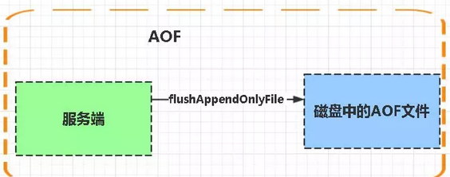
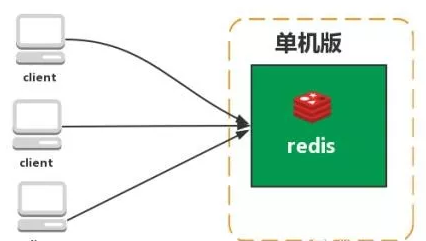
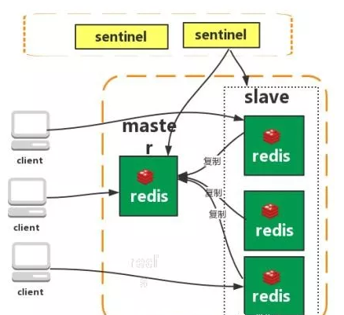
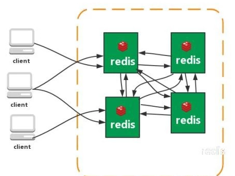

## Redies支持的数据类型

string类型

格式：set key value

redis的键类型是二进制安全的。意思是redis的key可以包含任何数据。比如jpg图片或者序列化的对象，一个null string 也是一个有效的key。

string类型是redis最基本的数据类型，一个键最大能存储512M,一个值最大也是512M。

Hash(哈希)

格式：hmset name  key1 value1  key2 value2

redis hash是一个键值(key=>value)对整合

redis hash是一个string类型的field和value的映射表，hash特别适合用于存储对象。

List(列表)

Redis列表是简单的字符串列表，按照插入顺序排序。你可以添加一个元素到列表的头部（左边）或者尾部（右边）

格式：lpush name value

在key对应的list的头部添加字符串元素

格式：rpush name value

在key对应的list的尾部添加字符串元素

格式：lrem name index

key对应的list中删除count个和value相同的元素

格式：llen name

返回key对应的list的长度

Set（集合）

格式：sadd name value

Redis的set是string类型的无序集合。

集合是通过哈希表实现的，所以添加，删除，查找的复杂度都是O(1)。

zset(sortes set：有序集合)

格式：zadd name value

Redis zset和set一样也是string类型元素的集合，且不允许重复的成员。

不同的是每个元素都会关联一个double类型的分数。redis正式通过分数来为集合中的成员进行从小到大的排序

zset的成员是唯一的，但分数（score)确实可以重复的。

什么是redis持久化？redis有哪几种持久化方式？优缺点是什么？

持久化就是把内存的数据写到磁盘中去，防止服务宕机了，内存数据丢失。

redis提供了两种持久化方式：RDB(默认)和AOF

RDB:

rdb是redis DataBase缩写

功能核心函数rdbSave(生成RDB文件)和rdbLoad(从文件加载内存)两个函数

AOF：

Aof是Append-only file缩写

每当执行服务器（定时）任务或者函数时fulshAppendOnlyFile函数都会被调用，这个函数执行以下两个工作

aop写入保存

1、write:根据条件，将aof_buf中的缓存写入到AOF文件

2、save:根据条件，调用fsync或fdatasync函数，将AOF文件保存到磁盘中。

**存储结构**

内容是redis通讯协议(RESP)格式的命令文本存储

**比较**

1、aof文件比rdb更新频率高，优先使用AOP还原数据

2、aop比rdb更安全也更大

3、rdb性能比aof好

4、如果两个都配了，优先加载AOF

**刚刚上面你有提到redis通讯协议(RESP )，能解释下什么是RESP？有什么特点？（可以看到很多面试其实都是连环炮，面试官其实在等着你回答到这个点，如果你答上了对你的评价就又加了一分）**

RESP是redis客户端和服务端之间使用的一种通讯协议：

RESP的特点：实现简单、快速解析、可读性好

For Simple Strings the first byte of the reply is "+" 回复

For Errors the first byte of the reply is "-" 错误

For Integers the first byte of the reply is ":" 整数

For Bulk Strings the first byte of the reply is "$" 字符串

For Arrays the first byte of the reply is "*" 数组

## Reids 有哪些架构模式？讲讲各自的特点

**单机版**

特点：简单

问题

1、内存容量有限  2、处理能力有限   3、无法高可用

**主从复制**

redis的复制（replication)功能允许用户根据一个Redis服务器来创建器来创建任意多个该服务器的复制品，其中被复制的服务器为主服务器(master)，而通过复制创建出来的服务器复制品则为服务器(slave)。只要主从服务器之间的网络链接正常，主从服务器两者会具有相同的数据，主服务器就会一直将发生在自己身上的数据更新同步给从服务器，从而一直保证主从服务器的数据相同。

特点：

1、master/slave角色

2、master/slave数据相同

3、降低master读压力，分摊给从节点。

问题：

无法保证高可用

没有解决master写的压力

### **哨兵**

Redis sentinel是一个分布式系统中监控redis主从服务器，并在主服务器下线时自动进行故障转移。其中三个特性：

监控（Monitoring)：sentinel会不断地检查你的主服务器和从服务器是否运作正常。

提醒（notification)：当被监控的某个Redis服务器出现问题时，sentinel可以通过api向管理员或者应用程序发送通知。

自动故障迁移（Automatic failover)：当一个主服务器不能正常工作时，sentinel会开始一次自动故障迁移操作。

特点：

1、保证高可用

2、监控各个节点

3、自动故障迁移

缺点：主从模式，切换需要时间丢数据

没有解决master写的压力

**集群(proxy)型**

Twemproxy是一个Twitter开源的一个redis和memcache轻快/轻量级代理服务器；Twemproxy是一个快速的单线程代理程序，支持Memcached ASCII协议和redis协议。

特点：1、多种hash算法：MD5、CRC16、CRC32、CRC32a、hsieh、murmur、Jenkins

2、支持失败节点自动删除

3、后端Sharding分片逻辑对业务透明，业务的读写方式和操作单个Redis一致

缺点：增加了新的proxy，需要维护其高可用

failover逻辑需要自己实现，其本身不能支持故障的自动转移可扩展性差，进行扩缩容都需要手动干预

**集群（直连型）**：

从redis3.0之后版本支持redis-cluster集群，Redis-Cluster采用无中心结构，每个节点保存数据和整个集群状态，每个节点都和其他所有节点链接。

特点：

1、无中心架构（不存在哪个节点影响性能瓶颈），手里proxy层

2、数据按照slot存储分布在多个节点，节点间数据共享，可动态调整数据分布

3、可扩展性，可线性扩展到1000个节点，节点可动态添加或删除

4、高可用，部分节点不可用时，集群仍可用。通过增加Slave做备份数据副本

5、实现故障自动failover，节点之间通过gossip协议交换状态信息，用投票机制完成Slave到Master的角色提升。

缺点：

1、资源隔离性较差，容易出现相互影响的情况。

2、数据通过异步复制，不保证数据的强一致性

**09**

**使用过Redis做异步队列么，你是怎么用的？有什么缺点？**

一般使用list结构作为队列，rpush生产消息，lpop消费消息。当lpop没有消息的时候，要适当sleep一会再重试。

缺点：

在消费者下线的情况下，生产的消息会丢失，得使用专业的消息队列如rabbitmq等。

**能不能生产一次消费多次呢？**

使用pub/sub主题订阅者模式，可以实现1:N的消息队列。

**10**

**什么是缓存穿透？如何避免？什么是缓存雪崩？何如避免？**

缓存穿透

一般的缓存系统，都是按照key去缓存查询，如果不存在对应的value，就应该去后端系统查找（比如DB）。一些恶意的请求会故意查询不存在的key,请求量很大，就会对后端系统造成很大的压力。这就叫做缓存穿透。

如何避免？

1：对查询结果为空的情况也进行缓存，缓存时间设置短一点，或者该key对应的数据insert了之后清理缓存。

2：对一定不存在的key进行过滤。可以把所有的可能存在的key放到一个大的Bitmap中，查询时通过该bitmap过滤。

缓存雪崩

当缓存服务器重启或者大量缓存集中在某一个时间段失效，这样在失效的时候，会给后端系统带来很大压力。导致系统崩溃。

如何避免？

1：在缓存失效后，通过加锁或者队列来控制读数据库写缓存的线程数量。比如对某个key只允许一个线程查询数据和写缓存，其他线程等待。

2：做二级缓存，A1为原始缓存，A2为拷贝缓存，A1失效时，可以访问A2，A1缓存失效时间设置为短期，A2设置为长期

3：不同的key，设置不同的过期时间，让缓存失效的时间点尽量均匀。