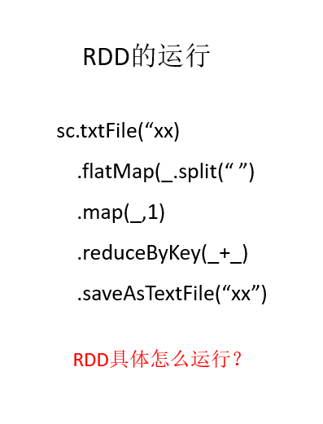
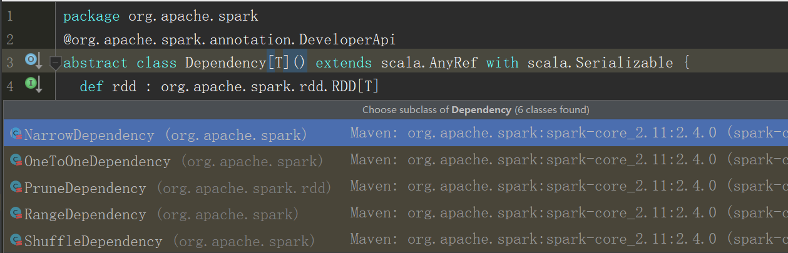
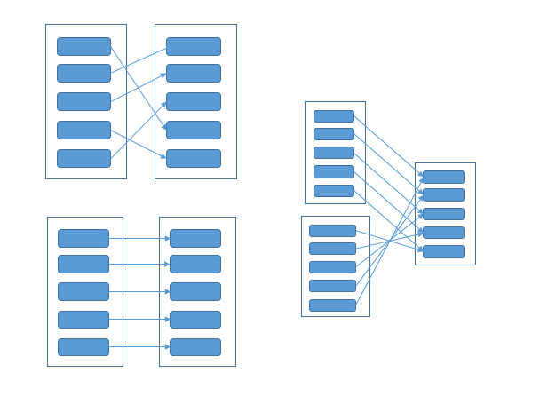
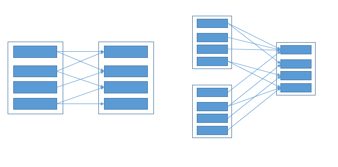
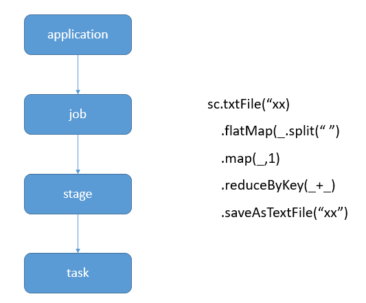

# spark任务划分

## spark依赖
 
## 窄依赖(Narrow Dependency)
窄依赖是指**每一个**父RDD的Partition最多被子RDD的一个Partition使用
  
一种很简单的判断方式就是看父RDD的Partition的输出箭尾是否只有一个
## 宽依赖(wide Dependency/shuffle Dependency)
宽依赖指的是多个子RDD的Partition会依赖同一个父Rddd的Partition,就会引起Shuffle。
宽依赖指的是多个子RDD的Partition会依赖同一个父Rddd的Partition,就会引起Shuffle。
  
一种很简单的判断方式就是看是**否存在一个**父RDD的Partition的输出箭尾为多个。

## 为什么要进行依赖划分
如果父rdd与子rdd是依赖，则可以进行异步处理。 子RDD的Partition可以不用等待父Rdd的所有Partition运行为完，可以直接向后运行。
其它理由我还没想好。

# RDD任务切分
spark的rdd划分分为application-->job-->stage-->task
  

## application
一个spark应用就是一个application
## job
遇到一个行动算子就会形成一个jar包，这里就有两个jar,txtFile(),SaveAsTextFile()

## stage
stage是相对于job而言的，一个job由多个转换操作组成，当转换时发生宽依赖的情况，就要从宽依赖的父rdd与子rdd间划分。

## task
一个Stage内，最终的RDD有多少个partition，就会产生多少个task。一般情况下，我们一个task运行的时候，使用一个cores。task的数量就是我们任务的最大的并行度。

task的执行速度是跟每个Executor进程的CPU core数量有直接关系的。一个CPU core同一时间只能执行一个线程。而每个Executor进程上分配到的多个task，都是以每个task一条线程的方式，多线程并发运行的。如果CPU core数量比较充足，而且分配到的task数量比较合理，那么通常来说，可以比较快速和高效地执行完这些task线程。

如果我们的task数量超过cores总数，则先执行cores个数量的task，然后等待cpu资源空闲后，继续执行剩下的task。