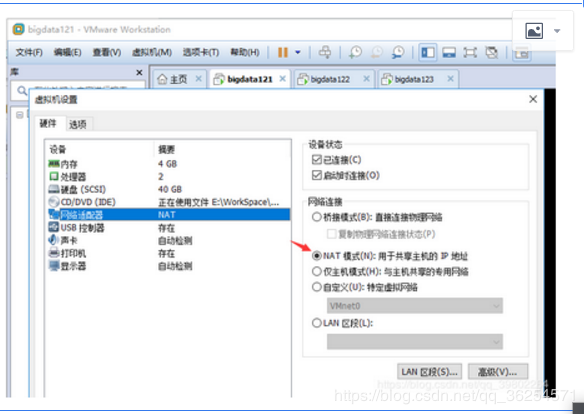
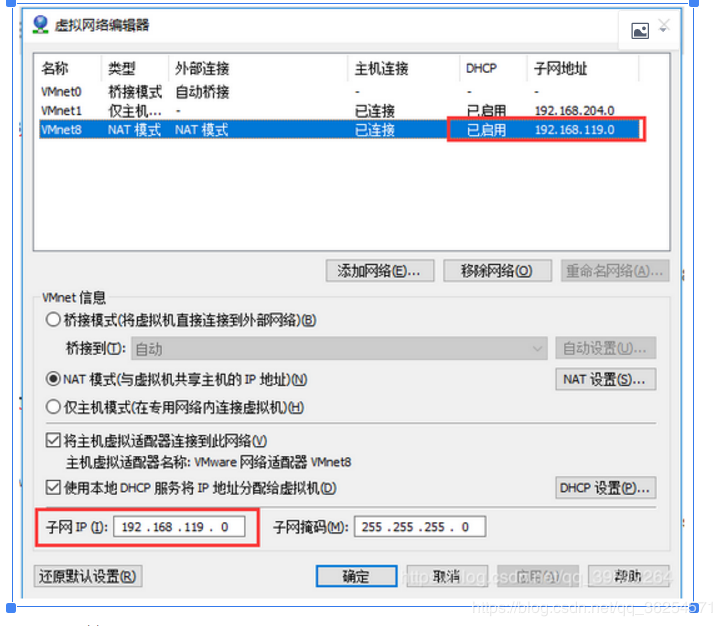
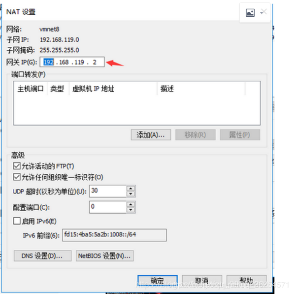
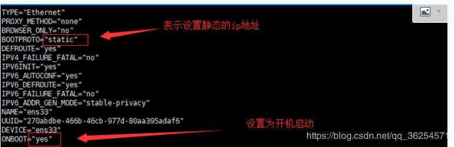
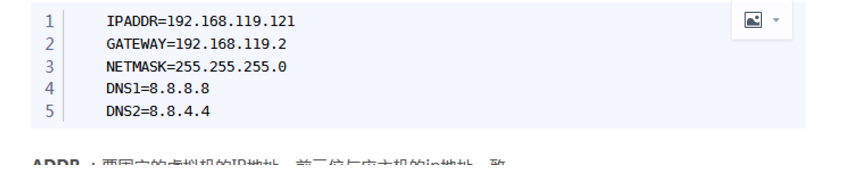
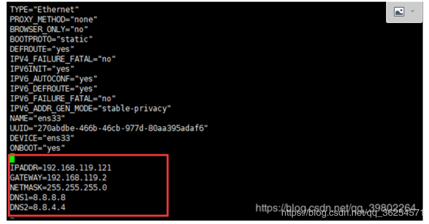
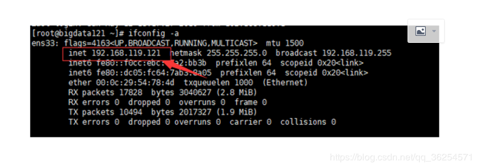

> 引用自：https://blog.csdn.net/qq_36254571/article/details/97146842

#### 一、VM平台的配置

1. 设置虚拟机的网络连接设置

2. 配置虚拟机的NAT模式具体地址参数

编辑(E)–>虚拟网络编辑器(N)–>更改设置–>选中VMnet8

设置子网IP

由于要设置的地址为192.168.119.121，故在设置子网的时候取前三段，为192.168.119.0

在这里插入图片描述

设置网关

点击NAT设置(S)

在这里插入图片描述

#### 二 、CentOS配置文件配置

首先用 vim /etc/sysconfig/network-scripts/ifcfg-ens33 打开配置文件ifcfg-ens33

修改配置文件中的以下2个属性

再改配置文件中加入如下代码

IPADDR=192.168.119.121

GATEWAY=192.168.119.2

NETMASK=255.255.255.0

DNS1=8.8.8.8

DNS2=8.8.4.4

IPADDR ：要固定的虚拟机的IP地址，前三位与应主机的ip地址一致

GATEWAY ：之前再VM中设置的网关地址

NETMASK ：广播地址

再向vim /etc/resolv.conf中加入

nameserver 8.8.8.8

nameserver 8.8.4.4

nameserver ：定义DNS服务器的IP地址，在此可指定多个DNS服务器，则用户端将会依序提出查询要求。

最后重启网卡

service network restart

检查配置情况

静态IP设置完毕

